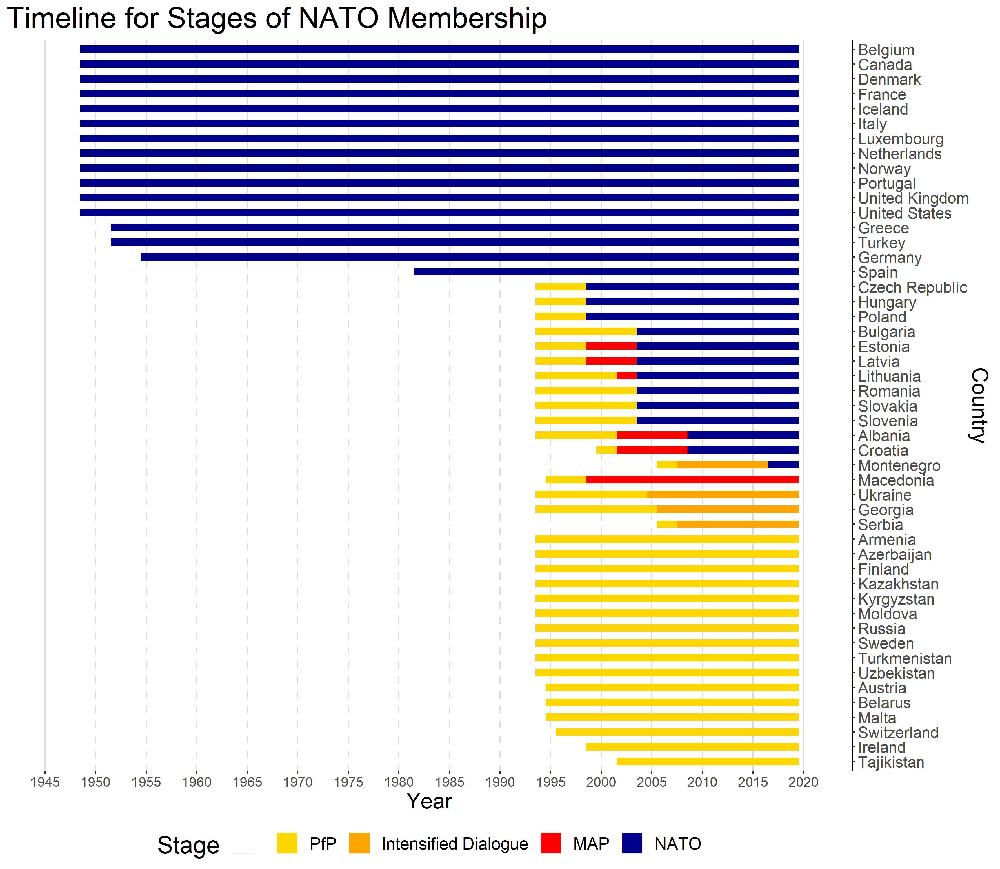

```{r setup, include = FALSE}
library(magrittr)
library(ggplot2)
options(scipen = 999)
knitr::opts_chunk$set(warning = FALSE, message = FALSE, echo = FALSE)
```

\beginsupplement

\newpage

This appendix accompanies the paper "The Shadow of Deterrence: Why capable actors engage in contests short of war". It provides supplemental information concerning proofs for the formal model, the data set of Russian gray zone campaigns introduced in the paper, and robustness checks and alternate specifications for the statistical model.

# Main Model (in the Paper) Discussion
## Parameters Used in Figures

### Figure 1

All three panels share the following parameters: $\rho=0.1$, $\kappa_{C}=0.1$, $\kappa=0.3$, $\psi=0.12$, $\beta_{D}=5$, $\theta=3$, and $\omega=0.1$. In the top panel $\beta_{C}=3$, in the middle panel $\beta_{C}=5$, and in the bottom panel $\beta_{C}=8$. 

### Figure 2

Both panels share the following parameters: $\rho=0.1$, $\kappa_{C}=0.1$, $\kappa=0.2$, $\psi=0.45$, $\beta_{D}=4$, $\theta=3.5$, and $\omega=0.1$. In the top panel $\beta_{C}=1.8$ and in the bottom panel $\beta_{C}=2.5$. 

### Figure 3

$\rho=0.1$, $\kappa_{C}=0.1$, $\psi=0.1$, $\beta_{D}=1.5$, $\beta_{C}=0.9$, $\theta=1.25$, and $\omega=0.2$. The parameter $\kappa$ varies from $0.5$ to $0.245$.

### Figure 4

$\rho=0.1$, $\kappa_{C}=0.15$, $\kappa=0.4$, $\psi=0.3$, $\beta_{D}=1.8$, $\beta_{C}=1$, and $\omega=0.02$. The parameter $\theta$ varies from $1$ to $2.06$.

### Figure 5

$\rho=0.05$, $\kappa_{C}=0.3$, $\kappa=0.4$, $\psi=0.2$, $\beta_{D}=3.7$, $\theta=2$, and $\omega=0.05$. The parameter $\beta_{C}$ varies from $0.8$ to $2.51$.

### Figure 8

Both panels share the following parameters: $\rho=0.1$, $\kappa_{C}=0.04$, $\kappa=0.2$, $\psi=0.075$, $\omega=0.3$, $\beta_{C}=0.5$, $\theta=1.6$. In the top panel $\beta_{D}=5$ and in the bottom panel $\beta_{D}=1.5$. 

## On Only Considering Pure Strategy Equilibria

This paper only considers pure strategy Perfect Bayesian Nash Equilibria. Naturally including mixed strategy equilbria does not rule out the equilibrium in the text, but it does introduce the possibility of knife-edge cases where one player may mix over their actions in such a manner that does not \textquotedbl break\textquotedbl{} the equilibrium. For example, it could be that for a given set of parameters, C is indifferent between playing a $g_{C}$ that sometimes risks war  and playing a $g_{C}$ that induces all types of D to conduct a limited response. In these edge-cases, C could mix over these two $g_{C}$ values, resulting in a lower utility for some types of D (how much lower depends on how much mixing occurs). Alternatively, in the game, for some $g_{C}$, D is indifferent between declaring war in the third stage or conducting a limited response and engaging in gray zone conflict. With some small probability, these D's could sometimes go to war without breaking the equilibrium.^[This will function so long that C is also not indifferent between playing the $g_{C}$ that always results in gray zone conflict and playing the status quo.] Ultimately, these cases are not particularly interesting to the analysis; because these mixed strategies are knife-edge cases and add complications with little added theoretical insight, they are excluded. 

## Equilibrium

### Defining C's Selected Equilibrium Actions (for example $g_{C}^{W,EDT}$) and Utilities

We abuse notation in a specific way here. For example, we let $U_{C}(g_{C}=g_{C}^{GZ,IE}|g_{C}^{GZ,DTB}\geq g_{C}^{GZ,IE})$ denote C setting $g_{C}=g_{C}^{GZ,IE}$ conditional on the game parameters being such that $g_{C}^{GZ,DTB}\geq g_{C}^{GZ,IE}$. Recall that $g_{C}^{W,EDT}=\frac{1}{4\beta_{D}}+\bar{\kappa}_{D}+\frac{\kappa_{C}}{\theta}$, $g_{C}^{W,IE}=\frac{(1-\omega)\theta}{2\beta_{C}}$, 
$g_{C}^{GZ,EDT}=\frac{1}{4\beta_{D}}+\underline{\kappa}_{D}+\frac{\kappa_{C}}{\theta}$,
and $g_{C}^{GZ,IE}=\frac{\theta}{2\beta_{C}}$. C's utilities are as follows:

 $U_{C}(g_{C}=0)=\theta\rho-\kappa_{C}$, 
 
$U_{C}(g_{C}=g_{C}^{GZ,IE}|g_{C}^{GZ,DTB}\geq g_{C}^{GZ,IE})=\theta\rho+\frac{\theta^{2}}{4\beta_{C}}-\frac{\theta}{2\beta_{D}}-\kappa_{C}$,

$U_{C}(g_{C}=g_{C}^{GZ,DTB}|g_{C}^{GZ,DTB}<g_{C}^{GZ,IE})=\theta\left(\rho-\frac{1}{4\beta_{D}}+\underline{\kappa}_{D}\right)-\beta_{C}\left(g_{C}^{GZ,EDT}\right)^{2}$,

$U_{C}(g_{C}=g_{C}^{W,IE}|g_{C}^{W,DTB}\geq g_{C}^{W,IE})=\omega\left(\theta\rho-\kappa_{C}\right)+(1-\omega)\left(\theta\rho+\frac{(1-\omega)\theta^{2}}{2\beta_{C}}-\frac{\theta}{2\beta_{D}}-\kappa_{C}\right)-\beta_{C}\left(g_{C}^{W,IE}\right)^{2}$, and 

$U_{C}(g_{C}=g_{C}^{W,DTB}|g_{C}^{W,DTB}<g_{C}^{W,IE})=\omega\left(\theta\rho-\kappa_{C}\right)+(1-\omega)\theta\left(\rho-\frac{1}{4\beta_{D}}+\bar{\kappa}_{D}\right)-\beta_{C}\left(g_{C}^{W,EDT}\right)^{2}.$

### Mathematical Background for Equilibrium

\subsubsection{Stages 4 \& 5}

D will optimally avoid war in Stage 5. To do so, D will offer C some $x^{*}$ that makes C indifferent between setting $w_{C}=0$ and setting $w_{C}=1$. This is 
\begin{align*}
\theta x^{*}-\beta_{C}g_{C}^{2}= & \theta P(g_{C},g_{D})-\kappa_{C}-\beta_{C}g_{C}^{2}
\end{align*}
or 
\begin{align*}
x^{*}= & P(g_{C},g_{D})-\frac{\kappa_{C}}{\theta}.
\end{align*}
If the game reaches this stage, then C's payoff will be $U_{C}=\theta P(g_{C},g_{D})-\kappa_{C}-\beta_{C}g_{C}^{2}$, and D's payoff will be $U_{D}=1-P(g_{C},g_{D})+\frac{k_{C}}{\theta}-\beta_{D}g_{D}^{2}$. 

\subsubsection{Stage 3}

Suppose it is optimal for D to not go to war. We can solve for D's optimal gray zone response $g_{D}^{*}$. For a fixed $g_{C}$ this will be 
\begin{align*}
g_{D}^{*}\in & argmax\left\{ 1-P(g_{C},g_{D})+\frac{k_{C}}{\theta}-\beta_{D}g_{D}^{2}\right\} .
\end{align*}
Of course, we cannot simply take first order conditions due to the bounds on $P$. So, to define $g_{D}^{*}$, we first characterize value $\hat{g}_{D}$, which is 
\begin{align*}
\hat{g}_{D}\in & argmax\left\{ 1-\left(\rho+g_{C}-g_{D}\right)+\frac{k_{C}}{\theta}-\beta_{D}g_{D}^{2}\right\} ,
\end{align*}
or 
\begin{align*}
\hat{g}_{D}= & \frac{1}{2\beta_{D}}.
\end{align*}
Clearly D will not select a level of gray zone $g_{D}>g_{C}$ because this would be counterproductive (as it runs into the lower bound at $\rho$). There will also need to be some considerations with respect to the upper bound that we will ignore for now.^[Specifically, it must be that $\rho+g_{C}-g_{D}^{*}\leq1$.] Supposing the upper bound does not bind, we can define D's optimal level of gray zone conflict as 
\begin{align*}
g_{D}^{*}(g_{C})= & \begin{cases}
\frac{1}{2\beta_{D}} & if\,\text{\ensuremath{\frac{1}{2\beta_{D}}}\ensuremath{\ensuremath{\leq g_{C}}}}\\
g_{C} & otherwise
\end{cases}
\end{align*}


\subsubsection{Stage 2: C's Optimal Choice and the Constraints that Drive It}

Given all this, we can characterize how C optimally plays the game. Essentially, C can do one of five things. (1) C can accept the status quo. (2) C can engage in gray zone conflict defined by C's own internal cost-benefit balancing. (3) C can engage in gray zone conflict defined by the external deterrent threat. (4) C can select a level of gray zone conflict that results in war sometimes, where the selected limited response is analogous to C's internal efficiency constraint binding knowing that type $\underline{\kappa}_{D}$'s will go to war. Or (5) C can select a level of gray zone conflict that results in war sometimes, where the selected limited response is analogous to the external deterrent threat binding. We define these cases formally below.

\paragraph{Status Quo}

C could select $g_{C}=0$, which will result in D selecting $g_{D}^{*}=0$. This gives C utility
\begin{align*}
U_{C}(g_{C}=0)= & \theta\rho-\kappa_{C},
\end{align*}
and both types of D 
\begin{align*}
U_{D}(g_{C}=0)= & 1-\rho+\frac{\kappa_{C}}{\theta}.
\end{align*}


\paragraph{Gray Zone Conflict }

First, consider the set of $g_{C}$ that will result in neither type of D going to war (setting $w_{D}=0$) and that could be productive for C. On the latter point, whenever $g_{C}\leq\frac{1}{2\beta_{D}}$, D will select a limited response that fully undercuts C's challenge. Thus, we know that C would never want to select any $g_{C}\in(0,\frac{1}{2\beta_{D}}$), because C would  prefer to set $g_{C}=0$ and not pay the costs from challenging. Next, we consider what values of $g_{C}$ will keep D from going to war. This will be values of $g_{C}$ that maintain the following constraint: 
\begin{align*}
1-\left(max\left\{ min\left\{ 1,\rho+g_{C}-g_{D}^{*}\right\} ,\rho\right\} \right)+\frac{\kappa_{C}}{\theta}-\beta_{D}\left(g_{D}^{*}\right)^{2}\geq & 1-\rho-\underline{\kappa}_{D}.
\end{align*}
So long that $g_{C}\geq\frac{1}{2\beta_{D}}$ and the upper bound does not bind, we can simplify this expression to the following:
\begin{align*}
1-\left(\rho+\underline{g}_{C}-\frac{1}{2\beta_{D}}\right)+\frac{\kappa_{C}}{\theta}-\beta_{D}\left(\frac{1}{2\beta_{D}}\right)^{2}\geq & 1-\rho-\underline{\kappa}_{D},
\end{align*}
or 
\begin{align*}
\underline{g}_{C}\geq & \frac{1}{4\beta_{D}}+\underline{\kappa}_{D}+\frac{\kappa_{C}}{\theta}.
\end{align*}
With this, we can set up an optimization. 

Suppose C does best selecting a limited challenge that always results in gray zone conflict. Taking into account C's utility function and how the game plays out in equilibrium, C will select a $g_{C}^{*}$ that optimizes the following 
\begin{align*}
g_{C}^{*} & \in argmax\left\{ \theta\left(\rho+g_{C}-\frac{1}{2\beta_{D}}\right)-\kappa_{C}-\beta_{C}g_{C}^{2}\right\} ,
\end{align*}
such that 
\begin{align}
g_{C}\leq & \frac{1}{4\beta_{D}}+\underline{\kappa}_{D}+\frac{\kappa_{C}}{\theta},\,\&\\
g_{C}\geq & \frac{1}{2\beta_{D}}.
\end{align}
Note that we do not need to worry about the upper bound on $P$ binding for C's selected $g_C$ because of Assumption 1 in the text.
The objective function $\theta\left(\rho+g_{C}-\frac{1}{2\beta_{D}}\right)-\kappa_{C}-\beta_{C}g_{C}^{2}$ can be thought of as C's internal cost-benefit calculations. As C selects greater levels of $g_{C}$, then C benefits because it's a more aggressive limited challenge that helps in bargaining later in the game. However, C does experience increased costs from the more aggressive limited challenge, as captured in the $-\beta_{C}g_{C}^{2}$ term. If the constraints do not bind, then C would select $g_{C}^{*}=\frac{\theta}{2\beta_{C}}$. In this regard, even though optimizing the objective function and disregarding (1) and (2) is an unconstrained optimization problem, C is constrained by the costs of conducting limited challenges ($g_{C}^{*}$ decreases as C's costs of limited challenges, $\beta_{C}$, increases). While this is not a constraint in a strictest mathematical sense ((1) and (2) are the optimization constraints), C's selected limited challenge is constrained the costs of conducting  challenges. We will refer to this as C's internal efficiency constraint binding. 

As discussed previously, constraint (1) represents how far C can go before D is unwilling to conduct a gray zone response. This means that if C wants to always avoid war with D, C cannot select a $g_{C}$ that exceeds $\frac{1}{4\beta_{D}}+\underline{\kappa}_{D}+\frac{\kappa_{C}}{\theta}$. This is a constraint (in the standard mathematical sense of the word): if C has very low costs to conducting limited challenges but still wants to always avoid war (i.e. $\beta_{C}$ is very low), then C will select the greatest limited challenge that C can without trigger D to go to war, which is $g_{C}^{*}=\frac{1}{4\beta_{D}}+\underline{\kappa}_{D}+\frac{\kappa_{C}}{\theta}$. 

This generates some of our mathematical expressions. Still suppose it is optimal for C to always select into gray zone conflict. When $\frac{\theta}{2\beta_{C}}<\frac{1}{4\beta_{D}}+\underline{\kappa}_{D}+\frac{\kappa_{C}}{\theta}$, then C's optimal limited challenge is $g_{C}^{*}=\frac{\theta}{2\beta_{C}}$. Here C will select their $g_{C}$ based on their internal cost-benefit analysis without needing to take into account D's threat of war. Whenever $\frac{\theta}{2\beta_{C}}<\frac{1}{4\beta_{D}}+\underline{\kappa}_{D}+\frac{\kappa_{C}}{\theta}$, we will say that C's internal efficiency constraint binds. Alternatively, when $\frac{\theta}{2\beta_{C}}\geq\frac{1}{4\beta_{D}}+\underline{\kappa}_{D}+\frac{\kappa_{C}}{\theta}$, C's optimal limited challenge is $g_{C}^{*}=\frac{1}{4\beta_{D}}+\underline{\kappa}_{D}+\frac{\kappa_{C}}{\theta}$. Here C would like to select a greater limited challenge, but is constrained by the threat of D escalating to war. Whenever $\frac{\theta}{2\beta_{C}}\geq\frac{1}{4\beta_{D}}+\underline{\kappa}_{D}+\frac{\kappa_{C}}{\theta}$, we will say that D's external deterrent threat binds. These values are quite important to the game, and are repeated often. We let $g_{C}^{GZ,EDT}=\frac{1}{4\beta_{D}}+\underline{\kappa}_{D}+\frac{\kappa_{C}}{\theta}$ and $g_{C}^{GZ,IE}=\frac{\theta}{2\beta_{C}}$.

Whenever the internal efficiency constraint binds and C sets $g_{C}^{*}=g_{C}^{GZ,IE}$, C's utility is 
\begin{align*}
U_{C}(g_{C}=g_{C}^{GZ,IE})= & \theta\rho+\frac{\theta^{2}}{4\beta_{C}}-\frac{\theta}{2\beta_{D}}-\kappa_{C}.
\end{align*}
And D's utility is (for both types) is 
\begin{align*}
U_{D}(g_{C}=g_{C}^{GZ,IE})= & 1-\left(\rho+\frac{\theta}{2\beta_{C}}-\frac{1}{2\beta_{D}}\right)+\frac{\kappa_{C}}{\theta}-\frac{1}{4\beta_{D}}
\end{align*}
or 
\begin{align*}
U_{D}(g_{C}=g_{C}^{GZ,IE})= & 1-\rho-\frac{\theta}{2\beta_{C}}+\frac{1}{4\beta_{D}}+\frac{\kappa_{C}}{\theta}.
\end{align*}
And, whenever the external threat constraint binds and C sets $g_{C}^{*}=g_{C}^{GZ,EDT}$, C's utility is 
\begin{align*}
U_{C}(g_{C}=g_{C}^{GZ,EDT})= & \theta\left(\rho-\frac{1}{4\beta_{D}}+\underline{\kappa}_{D}\right)-\beta_{C}\left(\frac{1}{4\beta_{D}}+\underline{\kappa}_{D}+\frac{\kappa_{C}}{\theta}\right)^{2}.
\end{align*}
And both types of D will receive 
\begin{align*}
U_{D}(g_{C}=g_{C}^{GZ,EDT})= & 1-\rho-\underline{\kappa}_{D}.
\end{align*}
\textbf{Type $\underline{\kappa}_{D}$ fights and type $\bar{\kappa}_{D}$ conducts gray zone conflict.}

Sometimes it is optimal for C to risk war with type $\underline{\kappa}_{D}$ but not type $\bar{\kappa}_{D}$. Fighting occurs on the equilibrium path because, while C does not like fighting a war, C may be willing to sometimes fight in order to undertake a more aggressive limited challenges. C will select a limited challenge that C (a) knows will end with war if D is type $\underline{\kappa}_{D}$ (the types that have low costs to fighting a war) and (b) knows will not end in war if D is type $\bar{\kappa}_{D}$ (the types that have high costs to fighting a war). This is analagous to the standard risk-return tradeoff within crisis bargaining: instead of one actor being uncertain over how aggressive a bargaining position they can take, here C is uncertain over how aggressive a limited challenge they can take before D declares war. 

Now we consider the set of $g_{C}$ that will result in type $\underline{\kappa}_{D}$ going to war, type $\bar{\kappa}_{D}$ not going to war, and that is productive for C. Following the discussion above, type $\underline{\kappa}_{D}$ will go to war for any $g_{C}>\frac{1}{4\beta_{D}}+\underline{\kappa}_{D}+\frac{\kappa_{C}}{\theta}$. And similarly, type $\bar{\kappa}$ will not go to war whenever $g_{C}\leq\frac{1}{4\beta_{D}}+\bar{\kappa}_{D}+\frac{\kappa_{C}}{\theta}$. When C is selecting a $g_{C}$ that risks war with type $\underline{\kappa}_{D}$ but not type $\bar{\kappa}_{D}$, C faces the following optimization problem:
\begin{align*}
g_{C}^{*} & \in argmax\left\{ \omega\left(\theta\rho-\kappa_{C}\right)+(1-\omega)\theta\left(\rho+g_{C}-\frac{1}{2\beta_{D}}-\frac{\kappa_{C}}{\theta}\right)-\beta_{C}g_{C}^{2}\right\} ,
\end{align*}
such that 
\begin{align}
g_{C}\leq & \frac{1}{4\beta_{D}}+\bar{\kappa}_{D}+\frac{\kappa_{C}}{\theta},\,\&\\
g_{C}> & \frac{1}{4\beta_{D}}+\underline{\kappa}_{D}+\frac{\kappa_{C}}{\theta},\,\&\\
g_{C}\geq & \frac{1}{2\beta_{D}}
\end{align}
Note that if this optimization problem runs into open set issues, then C always prefers avoiding war.^[Suppose the objective function optimized over $g_{C}\in[\frac{1}{4\beta_{D}}+\underline{\kappa}_{D}+\frac{\kappa_{C}}{\theta},\frac{1}{4\beta_{D}}+\bar{\kappa}_{D}+\frac{\kappa_{C}}{\theta}]$ would have the solution at $g_{C}=\frac{1}{4\beta_{D}}+\underline{\kappa}_{D}+\frac{\kappa_{C}}{\theta}$. If this is the case, then C prefers values of $g_{C}$ that avoid war to sometimes risking war. Note this may not be C's optimal choice, because C could also select $g_{C}=0$.]

As it was above, here C faces analogous internal efficiency and external deterrent threat constraints. The optimum of the objective function (without constraints) is at $g_{C}=\frac{(1-\omega)\theta}{2\beta_{C}}$, which is the value where C's costs become greater than the additional benefit C gets from the more aggressive challenge. And, if constraint (3) binds, then the optimization solution is $g_{C}=\frac{1}{4\beta_{D}}+\bar{\kappa}_{D}+\frac{\kappa_{C}}{\theta}$, which is the greatest $g_{C}$ C can select without pushing type $\bar{\kappa}_{D}$ to go to war (i.e. without pushing both types of D to go to war). Because these values are repeated often, we let $g_{C}^{W,EDT}=\frac{1}{4\beta_{D}}+\bar{\kappa}_{D}+\frac{\kappa_{C}}{\theta}$ and $g_{C}^{W,IE}=\frac{(1-\omega)\theta}{2\beta_{C}}$. 

Whenever the internal efficiency constraint binds and C sets $g_{C}^{*}=g_{C}^{W,IE}$, C's utility is 
\begin{align*}
U_{C}(g_{C}=g_{C}^{W,IE})= & \omega\left(\theta\rho-\kappa_{C}\right)+(1-\omega)\left(\theta\rho+\frac{(1-\omega)\theta^{2}}{2\beta_{C}}-\frac{\theta}{2\beta_{D}}-\kappa_{C}\right)-\beta_{C}\left(\frac{(1-\omega)\theta}{2\beta_{C}}\right)^{2}.
\end{align*}
good-at-war types would attain utility 
\begin{align*}
U_{D}(g_{C}=g_{C}^{W,IE},\underline{\kappa}_{D})= & 1-\rho-\underline{\kappa}_{D},
\end{align*}
and bad-at-war types would attain utility 
\begin{align*}
U_{D}(g_{C}=g_{C}^{W,IE},\bar{\kappa}_{D})= & 1-\rho-\frac{(1-\omega)\theta}{2\beta_{C}}+\frac{1}{4\beta_{D}}+\frac{\kappa_{C}}{\theta}.
\end{align*}
And, whenever the external threat constraint binds and C sets $g_{C}^{*}=g_{C}^{GZ,EDT}$, C's utility is 
\begin{align*}
U_{C}(g_{C}=g_{C}^{W,EDT})= & \omega\left(\theta\rho-\kappa_{C}\right)+(1-\omega)\theta\left(\rho-\frac{1}{4\beta_{D}}+\bar{\kappa}_{D}\right)-\beta_{C}\left(\frac{1}{4\beta_{D}}+\bar{\kappa}_{D}+\frac{\kappa_{C}}{\theta}\right)^{2}.
\end{align*}
And both types of D will receive their respective wartime payoffs, or 
\begin{align*}
U_{D}(g_{C}=g_{C}^{W,EDT},\underline{\kappa}_{D})= & 1-\rho-\underline{\kappa}_{D}
\end{align*}
and 
\begin{align*}
U_{D}(g_{C}=g_{C}^{W,EDT},\bar{\kappa}_{D})= & 1-\rho-\bar{\kappa}_{D}.
\end{align*}


### Intuition on the Constraints in C's Decision-Making in Stage 2

Here we offer some intuition behind how C behaves in Stage 2. Note that this is not necessary to understanding the equilibrium, but it may be helpful if aspects of C's behavior are unclear. Case in point: in the text, we present a series of inequalities that characterize when C selects one level of challenge over another; we elaborate on each of these inequalities here. Note that we will not go into details on when some $g_{C}$ values are greater than others (for example, when $g_{C}^{W,IE}>g_{C}^{W,GZ}$)---this follows from the discussion above.

When $\theta\rho-\kappa_{C}<\omega\left(\theta\rho-\kappa_{C}\right)+(1-\omega)\theta\left(\rho-\frac{1}{4\beta_{D}}+\bar{\kappa}_{D}\right)-\beta_{C}\left(g_{C}^{W,EDT}\right)^{2}$(first referenced in Sometimes War, Deterrent Threat Binds), then C's payoff from staying in the status quo ($\theta\rho-\kappa_{C}$) is less than C's payoff from risking war with probability $\omega$ and selecting the limited challenge that is characterized by type $\bar{\kappa}_{D}$'s deterrent threat ($\omega\left(\theta\rho-\kappa_{C}\right)+(1-\omega)\theta\left(\rho-\frac{1}{4\beta_{D}}+\bar{\kappa}_{D}\right)-\beta_{C}\left(g_{C}^{W,EDT}\right)^{2}$). This is a utility comparison. When the constraint is flipped, then C prefers accepting the status quo to ever risking war when the external deterrent threat binds..

When $\omega\left(\theta\rho-\kappa_{C}\right)+(1-\omega)\theta\left(\rho-\frac{1}{4\beta_{D}}+\bar{\kappa}_{D}\right)-\beta_{C}\left(g_{C}^{W,EDT}\right)^{2}>\theta\left(\rho-\frac{1}{4\beta_{D}}+\underline{\kappa}_{D}\right)-\beta_{C}\left(g_{C}^{GZ,EDT}\right)^{2}$ (first referenced in Sometimes War, Deterrent Threat Binds), then C's payoff from selecting into gray zone conflict and never risking war is less than C's payoff from risking war with probability $\omega$ and selecting the limited challenge that is characterized by type $\bar{\kappa}_{D}$'s deterrent threat. This is a utility comparison. When the constraint is flipped, then C prefers conducting gray zone conflict without resorting to war to sometimes risking war. 

When $\theta\rho-\kappa_{C}<\omega\left(\theta\rho-\kappa_{C}\right)+(1-\omega)\left(\theta\rho+\frac{(1-\omega)\theta^{2}}{2\beta_{C}}-\frac{\theta}{2\beta_{D}}-\kappa_{C}\right)-\beta_{C}\left(g_{C}^{W,IE}\right)^{2}$ (first referenced in Sometimes War, Internal Efficiency Binds), then C's payoff from staying in the status quo is less than C's payoff from risking war with probability $\omega$ and selecting the limited challenge that is characterized by C's internal efficiency ($g_{C}=\frac{(1-\omega)\theta}{2\beta_{C}}$). This is a utility comparison. When the constraint is flipped, then C prefers accepting the status quo to risking war.

When $\theta\left(\rho-\frac{1}{4\beta_{D}}+\underline{\kappa}_{D}\right)-\beta_{C}\left(g_{C}^{GZ,EDT}\right)^{2}<\omega\left(\theta\rho-\kappa_{C}\right)+(1-\omega)\left(\theta\rho+\frac{(1-\omega)\theta^{2}}{2\beta_{C}}-\frac{\theta}{2\beta_{D}}-\kappa_{C}\right)-\beta_{C}\left(g_{C}^{W,IE}\right)^{2}$ (first referenced in Sometimes War, Internal Efficiency Binds), then C's payoff from conducting gray zone conflict and never risking war is less than C's payoff from risking war with probability $\omega$ and selecting the limited challenge that is characterized by C's internal efficiency ($g_{C}=\frac{(1-\omega)\theta}{2\beta_{C}}$). This is a utility comparison. When the constraint is flipped, then C prefers conducting gray zone conflict without ever risking war to sometimes risking war.

When $\theta\rho-\kappa_{C}<\theta\left(\rho-\frac{1}{4\beta_{D}}+\underline{\kappa}_{D}\right)-\beta_{C}\left(g_{C}^{GZ,EDT}\right)^{2}$ (first referenced in Always Gray Zone, Deterrent Threat Binds), then C's limited challenge as characterized by the deterrent threat binding ($g_{C}=\frac{1}{4\beta_{D}}+\underline{\kappa}_{D}+\frac{\kappa_{C}}{\theta}$) produces a payoff for C $(\theta\left(\rho-\frac{1}{4\beta_{D}}+\underline{\kappa}_{D}\right)-\beta_{C}\left(g_{C}^{GZ,EDT}\right)^{2})$ that is greater than C's payoff from accepting the status quo $\theta\rho-\kappa_{C}$. This is a utility comparison; when it does not hold, C does better accepting the status quo to selecting into gray zone conflict.

When $\theta\rho-\kappa_{C}<\theta\rho+\frac{\theta^{2}}{4\beta_{C}}-\frac{\theta}{2\beta_{D}}-\kappa_{C}$ (first referenced in Always Gray Zone, Internal Efficiency Binds), then C's payoff from not conducting a limited challenge and ending the game with offer $x^{*}=\theta\rho-\kappa_{C}$ is less than C's payoff from conducting a limited challenge based on their internal efficiency constraint ($g_{C}=g_{C}^{GZ,IE}$) and ending the game with gray zone conflict and payoff $\theta\rho+\frac{\theta^{2}}{4\beta_{C}}-\frac{\theta}{2\beta_{D}}-\kappa_{C}$. Essentially, this is a utility comparison, and when it does not hold, C does better engaging in gray zone conflict (where the internal efficiency constraint holds) relative to accepting the status quo.

Lastly, below (but not in the main paper!) we will consider the possibility that $\frac{\theta}{2\beta_{C}}\leq\frac{1}{2\beta_{D}}$. When this holds, it is the case that C's optimal limited challenge (i.e. when the internal efficiency constraint binds) of $g_{C}=\frac{\theta}{2\beta_{C}}$ is less than $g_{D}=\frac{1}{2\beta_{D}}$, which is how far D is willing to go with their gray zone response . C will be unwilling to ever challenge here, because D's gray zone response will essentially negate C's (costly) limited challenge, thus generating costs without gains for C; C an do better setting $g_{C}=0$. When this constraint does not hold, then it is possible for C's limited challenge to overcome D's gray zone response, but this is not to say that gray zone conflict becomes cost effective (this will depend on utility constraints as well).


### Statement of Full Equilibrium 

Below we have the full statement of the equilibirum where we impose no restrictions on the relationship between $\frac{\theta}{2\beta_{C}}$ and $\frac{1}{2\beta_{D}}$. Additionally, we elaborate on the cases that are discussed in the equilibrium cases in the appendix---we fully spell out all the conditions rather than include the ``or'' statements. In proving Observations 1-6, breaking these terms apart makes for a much easier series of proofs.

Also below, we  discuss a series of ways C can behave in stage 2. While there are many cases below, it is useful to think about clusters of cases where preliminaries (i.e. conditions like $\frac{(1-\omega)\theta}{2\beta_{C}}\leq\frac{1}{4\beta_{D}}+\underline{\kappa}_{D}+\frac{\kappa_{C}}{\theta}$) hold across the cases, and all that differs are the utility conditions. Using this typology, Status Quo 2 is most similar to Gray Zone, Internal Efficiency Binds because all that differs is the $\theta\rho-\kappa_{C}\geq\theta\rho+\frac{\theta^{2}}{4\beta_{C}}-\frac{\theta}{2\beta_{D}}-\kappa_{C}$ utility condition. Status Quo 3 is most similar to Gray Zone, Deterrent Threat Binds 1. Status Quo 4 is most similar to Gray Zone, Deterrent Threat Binds 2 and War 1. Status Quo 5 is most similar to Gray Zone, Deterrent Threat Binds 3 and War 2. Status Quo 1 does not share any preliminary conditions. 


\subsection*{In Stage 5:}

If $x\geq P(g_{C},g_{D})-\frac{\kappa_{C}}{\theta}$ , then C will set $w_{C}=0$. Otherwise C will set $w_{C}=1$.  If C previously set $g_{C}=min\left\{ \frac{1}{4\beta_{D}}+\bar{\kappa}_{D}+\frac{\kappa_{C}}{\theta},\frac{(1-\omega)\theta}{2\beta_{C}}\right\}$, then C believes D is type $\bar{\kappa}_{D}$ with probability $1$. Otherwise, C believes D is type $\bar{\kappa}_{D}$ ($\underline{\kappa}_{D}$) with probability $1-\omega$ ($\omega$).

\subsection*{In Stage 4:}

D will always set $x=P(g_{C},g_{D})-\frac{\kappa_{C}}{\theta}.$

\subsection*{In Stage 3:}

For all $\kappa_{D}\in\{\underline{\kappa}_{D},\bar{\kappa}_{D}\}$, if $1-P(0,0)-\kappa_{D}>1-P(g_{C},min\left\{ \frac{1}{2\beta_{D}},g_{C}\right\} )+\frac{\kappa_{C}}{\theta}-\beta_{D}*\left(min\left\{ \frac{1}{2\beta_{D}},g_{C}\right\} \right)^{2}$, then D will set $w_{D}=1$. Otherwise, D will set $w_{D}=0$ and $g_{D}=min\left\{ \frac{1}{2\beta_{D}},g_{C}\right\} .$

\subsection*{In Stage 2:}
C believes D is type $\bar{\kappa}_{D}$ with probability $1-\omega$ and type $\underline{\kappa}_{D}$ with probability $\omega$.

What C does in Stage 2 is conditional on what parameters holds. These are the following.

\textbf{Status Quo 1:} If $\frac{\theta}{2\beta_{C}}\leq\frac{1}{2\beta_{D}}$, then $g_{C}=0$.

\textbf{Status Quo 2:} If $\frac{\theta}{2\beta_{C}}>\frac{1}{2\beta_{D}}$, $\frac{\theta}{2\beta_{C}}\leq\frac{1}{4\beta_{D}}+\underline{\kappa}_{D}+\frac{\kappa_{C}}{\theta}$, $\theta\rho-\kappa_{C}\geq\theta\rho+\frac{\theta^{2}}{4\beta_{C}}-\frac{\theta}{2\beta_{D}}-\kappa_{C}$, then $g_{C}=0$.

\textbf{Status Quo 3:} If $\frac{\theta}{2\beta_{C}}>\frac{1}{2\beta_{D}}$, $\frac{\theta}{2\beta_{C}}>\frac{1}{4\beta_{D}}+\underline{\kappa}_{D}+\frac{\kappa_{C}}{\theta}$, $\frac{(1-\omega)\theta}{2\beta_{C}}\leq\frac{1}{4\beta_{D}}+\underline{\kappa}_{D}+\frac{\kappa_{C}}{\theta}$, and $\theta\rho-\kappa_{C}\geq\theta\left(\rho-\frac{1}{4\beta_{D}}+\underline{\kappa}_{D}\right)-\beta_{C}\left(\frac{1}{4\beta_{D}}+\underline{\kappa}_{D}+\frac{\kappa_{C}}{\theta}\right)^{2}$, then $g_{C}=0$.

\textbf{Status Quo 4:} If $\frac{\theta}{2\beta_{C}}>\frac{1}{2\beta_{D}}$, $\frac{\theta}{2\beta_{C}}>\frac{1}{4\beta_{D}}+\underline{\kappa}_{D}+\frac{\kappa_{C}}{\theta}$, $\frac{(1-\omega)\theta}{2\beta_{C}}>\frac{1}{4\beta_{D}}+\underline{\kappa}_{D}+\frac{\kappa_{C}}{\theta}$, $\frac{(1-\omega)\theta}{2\beta_{C}}\le\frac{1}{4\beta_{D}}+\bar{\kappa}_{D}+\frac{\kappa_{C}}{\theta},$$\theta\rho-\kappa_{C}\geq\theta\left(\rho-\frac{1}{4\beta_{D}}+\underline{\kappa}_{D}\right)-\beta_{C}\left(\frac{1}{4\beta_{D}}+\underline{\kappa}_{D}+\frac{\kappa_{C}}{\theta}\right)^{2}$, and $\theta\rho-\kappa_{C}\geq\omega\left(\theta\rho-\kappa_{C}\right)+(1-\omega)\left(\theta\rho+\frac{(1-\omega)\theta^{2}}{2\beta_{C}}-\frac{\theta}{2\beta_{D}}-\kappa_{C}\right)-\beta_{C}\left(\frac{(1-\omega)\theta}{2\beta_{C}}\right)^{2}$, then $g_{C}=0$.

\textbf{Status Quo 5:} If $\frac{\theta}{2\beta_{C}}>\frac{1}{2\beta_{D}}$, $\frac{\theta}{2\beta_{C}}>\frac{1}{4\beta_{D}}+\underline{\kappa}_{D}+\frac{\kappa_{C}}{\theta}$, $\frac{(1-\omega)\theta}{2\beta_{C}}>\frac{1}{4\beta_{D}}+\bar{\kappa}_{D}+\frac{\kappa_{C}}{\theta},$$\theta\rho-\kappa_{C}\geq\theta\left(\rho-\frac{1}{4\beta_{D}}+\underline{\kappa}_{D}\right)-\beta_{C}\left(\frac{1}{4\beta_{D}}+\underline{\kappa}_{D}+\frac{\kappa_{C}}{\theta}\right)^{2}$, and $\theta\rho-\kappa_{C}\geq\omega\left(\theta\rho-\kappa_{C}\right)+(1-\omega)\theta\left(\rho-\frac{1}{4\beta_{D}}+\bar{\kappa}_{D}\right)-\beta_{C}\left(\frac{1}{4\beta_{D}}+\bar{\kappa}_{D}+\frac{\kappa_{C}}{\theta}\right)^{2}$, then $g_{C}=0$.

\textbf{Gray Zone, Internal Efficiency Binds:} If $\frac{\theta}{2\beta_{C}}>\frac{1}{2\beta_{D}}$, $\frac{\theta}{2\beta_{C}}\leq\frac{1}{4\beta_{D}}+\underline{\kappa}_{D}+\frac{\kappa_{C}}{\theta}$, $\theta\rho-\kappa_{C}<\theta\rho+\frac{\theta^{2}}{4\beta_{C}}-\frac{\theta}{2\beta_{D}}-\kappa_{C}$, then $g_{C}=\frac{\theta}{2\beta_{C}}$.

\textbf{Gray Zone, Deterrent Threat Binds 1:} If $\frac{\theta}{2\beta_{C}}>\frac{1}{2\beta_{D}}$, $\frac{\theta}{2\beta_{C}}>\frac{1}{4\beta_{D}}+\underline{\kappa}_{D}+\frac{\kappa_{C}}{\theta}$, $\frac{(1-\omega)\theta}{2\beta_{C}}\le\frac{1}{4\beta_{D}}+\underline{\kappa}_{D}+\frac{\kappa_{C}}{\theta},$ and $\theta\rho-\kappa_{C}<\theta\left(\rho-\frac{1}{4\beta_{D}}+\underline{\kappa}_{D}\right)-\beta_{C}\left(\frac{1}{4\beta_{D}}+\underline{\kappa}_{D}+\frac{\kappa_{C}}{\theta}\right)^{2}$ , then $g_{C}=\frac{1}{4\beta_{D}}+\underline{\kappa}_{D}+\frac{\kappa_{C}}{\theta}$

\textbf{Gray Zone, Deterrent Threat Binds 2:} If $\frac{\theta}{2\beta_{C}}>\frac{1}{2\beta_{D}}$, $\frac{\theta}{2\beta_{C}}>\frac{1}{4\beta_{D}}+\underline{\kappa}_{D}+\frac{\kappa_{C}}{\theta}$ $\frac{(1-\omega)\theta}{2\beta_{C}}>\frac{1}{4\beta_{D}}+\underline{\kappa}_{D}+\frac{\kappa_{C}}{\theta}$, $\frac{(1-\omega)\theta}{2\beta_{C}}\le\frac{1}{4\beta_{D}}+\bar{\kappa}_{D}+\frac{\kappa_{C}}{\theta},$ $\theta\rho-\kappa_{C}<\theta\left(\rho-\frac{1}{4\beta_{D}}+\underline{\kappa}_{D}\right)-\beta_{C}\left(\frac{1}{4\beta_{D}}+\underline{\kappa}_{D}+\frac{\kappa_{C}}{\theta}\right)^{2}$, and $\theta\left(\rho-\frac{1}{4\beta_{D}}+\underline{\kappa}_{D}\right)-\beta_{C}\left(\frac{1}{4\beta_{D}}+\underline{\kappa}_{D}+\frac{\kappa_{C}}{\theta}\right)^{2}\geq\omega\left(\theta\rho-\kappa_{C}\right)+(1-\omega)\left(\theta\rho+\frac{(1-\omega)\theta^{2}}{2\beta_{C}}-\frac{\theta}{2\beta_{D}}-\kappa_{C}\right)-\beta_{C}\left(\frac{(1-\omega)\theta}{2\beta_{C}}\right)^{2}$, then $g_{C}=\frac{1}{4\beta_{D}}+\underline{\kappa}_{D}+\frac{\kappa_{C}}{\theta}$

\textbf{Gray Zone, Deterrent Threat Binds 3:} If $\frac{\theta}{2\beta_{C}}>\frac{1}{2\beta_{D}}$, $\frac{\theta}{2\beta_{C}}>\frac{1}{4\beta_{D}}+\underline{\kappa}_{D}+\frac{\kappa_{C}}{\theta}$, $\frac{(1-\omega)\theta}{2\beta_{C}}>\frac{1}{4\beta_{D}}+\underline{\kappa}_{D}+\frac{\kappa_{C}}{\theta}$, $\frac{(1-\omega)\theta}{2\beta_{C}}>\frac{1}{4\beta_{D}}+\bar{\kappa}_{D}+\frac{\kappa_{C}}{\theta},$ $\theta\rho-\kappa_{C}<\theta\left(\rho-\frac{1}{4\beta_{D}}+\underline{\kappa}_{D}\right)-\beta_{C}\left(\frac{1}{4\beta_{D}}+\underline{\kappa}_{D}+\frac{\kappa_{C}}{\theta}\right)^{2}$, and $\theta\left(\rho-\frac{1}{4\beta_{D}}+\underline{\kappa}_{D}\right)-\beta_{C}\left(\frac{1}{4\beta_{D}}+\underline{\kappa}_{D}+\frac{\kappa_{C}}{\theta}\right)^{2}\geq\omega\left(\theta\rho-\kappa_{C}\right)+(1-\omega)\theta\left(\rho-\frac{1}{4\beta_{D}}+\bar{\kappa}_{D}\right)-\beta_{C}\left(\frac{1}{4\beta_{D}}+\bar{\kappa}_{D}+\frac{\kappa_{C}}{\theta}\right)^{2}$, then $g_{C}=\frac{1}{4\beta_{D}}+\underline{\kappa}_{D}+\frac{\kappa_{C}}{\theta}$.

\textbf{War, Internal Efficiency Binds (War 1):} if $\frac{\theta}{2\beta_{C}}>\frac{1}{2\beta_{D}}$, $\frac{\theta}{2\beta_{C}}>\frac{1}{4\beta_{D}}+\underline{\kappa}_{D}+\frac{\kappa_{C}}{\theta}$, $\frac{(1-\omega)\theta}{2\beta_{C}}>\frac{1}{4\beta_{D}}+\underline{\kappa}_{D}+\frac{\kappa_{C}}{\theta}$, $\frac{(1-\omega)\theta}{2\beta_{C}}\le\frac{1}{4\beta_{D}}+\bar{\kappa}_{D}+\frac{\kappa_{C}}{\theta},$$\omega\left(\theta\rho-\kappa_{C}\right)+(1-\omega)\left(\theta\rho+\frac{(1-\omega)\theta^{2}}{2\beta_{C}}-\frac{\theta}{2\beta_{D}}-\kappa_{C}\right)-\beta_{C}\left(\frac{(1-\omega)\theta}{2\beta_{C}}\right)^{2}>\theta\rho-\kappa_{C}$, and $\omega\left(\theta\rho-\kappa_{C}\right)+(1-\omega)\left(\theta\rho+\frac{(1-\omega)\theta^{2}}{2\beta_{C}}-\frac{\theta}{2\beta_{D}}-\kappa_{C}\right)-\beta_{C}\left(\frac{(1-\omega)\theta}{2\beta_{C}}\right)^{2}>\theta\left(\rho-\frac{1}{4\beta_{D}}+\underline{\kappa}_{D}\right)-\beta_{C}\left(\frac{1}{4\beta_{D}}+\underline{\kappa}_{D}+\frac{\kappa_{C}}{\theta}\right)^{2}$, then $g_{C}=\frac{(1-\omega)\theta}{2\beta_{C}}$

\textbf{War Deterrent Threat Binds (War 2):} if $\frac{\theta}{2\beta_{C}}>\frac{1}{2\beta_{D}}$, $\frac{\theta}{2\beta_{C}}>\frac{1}{4\beta_{D}}+\underline{\kappa}_{D}+\frac{\kappa_{C}}{\theta}$, $\frac{(1-\omega)\theta}{2\beta_{C}}>\frac{1}{4\beta_{D}}+\underline{\kappa}_{D}+\frac{\kappa_{C}}{\theta}$, $\frac{(1-\omega)\theta}{2\beta_{C}}>\frac{1}{4\beta_{D}}+\bar{\kappa}_{D}+\frac{\kappa_{C}}{\theta},$$\omega\left(\theta\rho-\kappa_{C}\right)+(1-\omega)\theta\left(\rho-\frac{1}{4\beta_{D}}+\bar{\kappa}_{D}\right)-\beta_{C}\left(\frac{1}{4\beta_{D}}+\bar{\kappa}_{D}+\frac{\kappa_{C}}{\theta}\right)^{2}>\theta\rho-\kappa_{C}$, and $\omega\left(\theta\rho-\kappa_{C}\right)+(1-\omega)\theta\left(\rho-\frac{1}{4\beta_{D}}+\bar{\kappa}_{D}\right)-\beta_{C}\left(\frac{1}{4\beta_{D}}+\bar{\kappa}_{D}+\frac{\kappa_{C}}{\theta}\right)^{2}>\theta\left(\rho-\frac{1}{4\beta_{D}}+\underline{\kappa}_{D}\right)-\beta_{C}\left(\frac{1}{4\beta_{D}}+\underline{\kappa}_{D}+\frac{\kappa_{C}}{\theta}\right)^{2}$, then $g_{C}=\frac{1}{4\beta_{D}}+\bar{\kappa}_{D}+\frac{\kappa_{C}}{\theta}$.


## More Details on Why C Sometimes Risks War

In this game, we have a defender who has a private type. The defender either has relatively lower costs to fighting (type $\underline{\kappa}_{D}$), or has relatively higher costs to fighting (type $\bar{\kappa}_{D}$). D knows their own type, but C does not. War occurs on the equilibrium path because, while C does not like fighting a war, C may be willing to sometimes risk a war in order to undertake a more aggressive challenges. Under some parameters, C will select a challenge that C (a) knows will end with war if D is type $\underline{\kappa}_{D}$ and (b) knows will not end in war if D is type $\bar{\kappa}_{D}$. C chooses this more aggressive challenge that sometimes results in war over choosing a more limited challenge that never produces war. This is analogous to the standard risk-return tradeoff within crisis bargaining: instead of one actor being uncertain whether or not an aggressive bargaining position will lead to war (as is standard in crisis bargaining), here C is uncertain over how aggressive a limited challenge they can take before D declares war. 

To be clear, under no parameters will C ever select a $g_{C}$ that would result in both types of D declaring war. C can always do weakly better setting $g_{C}=0$ to setting any $g_{C}$ that always results in war (i.e. any $g_{C}>g_{C}^{W,EDT}$). In equilibrium, by setting $g_{C}=0$, C attains utility $U_{C}(g_{C}=0)=\theta\rho-\kappa_{C}.$ And, in equilibrium, by setting some $g_{C}=g_{C}^{\prime}$ where $g_{C}^{\prime}>g_{C}^{W,EDT}$, C attains utility $U_{C}(g_{C}=g_{C}^{\prime})=\theta\rho-\kappa_{C}-\beta_{C}(g_{C}^{\prime})^{2}$. The latter is strictly worse for any $\beta_{C}>0$, and weakly worse when $\beta_{C}=0$. This means that war only occurs in the model when C is selecting into this risk-return tradeoff rather than selecting a less aggressive challenge that would never lead to war. For this reason, below, we do not describe the payoffs from C selecting a $g_{C}$ that always results in war. And, while we do plot $g_C$ values that would result in these regions (i.e. we do display the ``Always War'' region), the payoffs are regularly off-the-chart bad; we opt not to graph them rather than scale down the parameter spaces where the interesting choices are being made.

\begin{figure} 

\begin{tikzpicture} 
\small
\begin{axis}[%
width=5.5in,
height=1.5in,
at={(1.011in,0.642in)},
scale only axis,
xmin=-0.004,
xmax=0.85,
xtick={0,0.125, 0.2911,0.7411,0.83},
xticklabels={{$g_C=0$},{$\frac{1}{2\beta_D}$},{$g_{C}^{GZ,EDT}$},{$g_{C}^{W,EDT}\,\,\,\,\,\,\,\,\,$},{$\,\,\,g_C=0.85$}},
xlabel style={font=\color{white!15!black}},
xlabel={Selected $g_C$ Values Increasing $\rightarrow$},
ymin=-0.05,,
ymax=1.3,
ytick={0.01,0.25,1.27},
yticklabels={{$U_C=0$},{$ \theta\rho-\kappa_C$},{$U_C=1.3$}},
ylabel style={font=\color{white!15!black}},
ylabel={$\text{U}_\text{C}$ Values Increasing $\rightarrow$},
axis background/.style={fill=white},
title style={font=\bfseries},
title={$\beta_C=1.8$: C Optimally Selects War, Deterrent Threat Binds},
]

\node[draw, align=center] at (0.15,1.05) {\footnotesize{\textit{Always GZC}}}; 

\node[draw, align=center] at (0.52,0.4) {\footnotesize{\textit{$\underline{\kappa}_D$: War}} \\\footnotesize{\textit{$\bar{\kappa}_D$: GZC}}}; 

\node[draw, align=center] at (0.8,.4) {\footnotesize{\textit{Always}} \\\footnotesize{\textit{War}}}; 


\addplot [color=black, line width=1.0pt]
  table[row sep=crcr]{%
0	0.25	\\
0.01	0.24982	\\
0.02	0.24928	\\
0.03	0.24838	\\
0.04	0.24712	\\
0.05	0.2455	\\
0.06	0.24352	\\
0.07	0.24118	\\
0.08	0.23848	\\
0.09	0.23542	\\
0.1	0.232	\\
0.11	0.22822	\\
0.1125	0.22721875	\\
0.115	0.226195	\\
0.1175	0.22514875	\\
0.12	0.22408	\\
0.1225	0.22298875	\\
0.125	0.221875	\\
0.1275	0.22948875	\\
0.13	0.23708	\\
0.1325	0.24464875	\\
0.135	0.252195	\\
0.1375	0.25971875	\\
0.14	0.26722	\\
0.1425	0.27469875	\\
0.145	0.282155	\\
0.1475	0.28958875	\\
0.15	0.297	\\
0.16	0.32642	\\
0.17	0.35548	\\
0.18	0.38418	\\
0.19	0.41252	\\
0.2	0.4405	\\
0.21	0.46812	\\
0.22	0.49538	\\
0.23	0.52228	\\
0.24	0.54882	\\
0.25	0.575	\\
0.26	0.60082	\\
0.27	0.62628	\\
0.28	0.65138	\\
0.29	0.67612	\\
};


\addplot [color=black, line width=1.0pt]
  table[row sep=crcr]{%
0.2911 0.62 \\
0.3	0.63925	\\
0.31	0.65977	\\
0.32	0.67993	\\
0.33	0.69973	\\
0.34	0.71917	\\
0.35	0.73825	\\
0.36	0.75697	\\
0.37	0.77533	\\
0.38	0.79333	\\
0.39	0.81097	\\
0.4	0.82825	\\
0.41	0.84517	\\
0.42	0.86173	\\
0.43	0.87793	\\
0.44	0.89377	\\
0.45	0.90925	\\
0.46	0.92437	\\
0.47	0.93913	\\
0.48	0.95353	\\
0.49	0.96757	\\
0.5	0.98125	\\
0.51	0.99457	\\
0.52	1.00753	\\
0.53	1.02013	\\
0.54	1.03237	\\
0.55	1.04425	\\
0.56	1.05577	\\
0.57	1.06693	\\
0.58	1.07773	\\
0.59	1.08817	\\
0.6	1.09825	\\
0.61	1.10797	\\
0.62	1.11733	\\
0.63	1.12633	\\
0.64	1.13497	\\
0.65	1.14325	\\
0.66	1.15117	\\
0.67	1.15873	\\
0.68	1.16593	\\
0.69	1.17277	\\
0.7	1.17925	\\
0.71	1.18537	\\
0.72	1.19113	\\
0.73	1.19653	\\
0.74	1.20157	\\
};


%\addplot [color=white!55!black, dotted, line width=1.0pt, forget plot]
%  table[row sep=crcr]{%
%0.1	-1\\
%0.1	1\\
%};


\addplot [color=white!55!black, dotted, line width=1.0pt, forget plot]
  table[row sep=crcr]{%
0.2911	0\\
0.2911	1.5\\
};

\addplot [color=white!55!black, dotted, line width=1.0pt, forget plot]
  table[row sep=crcr]{%
0.741	0\\
0.741	1.5\\
};


\node at (0.741,1.17) {\LARGE \textbf{*}};
\node at (0.291,0.6) [circle,scale=0.6,draw,fill=black!0] {};
\node at (0.2911,0.68) [circle,scale=0.6,minimum size=0.5pt,draw,fill=black!100] {};
%\node at (0.503,0.53) [circle,scale=0.6,minimum size=0.5pt,draw,fill=black!100] {};
            


\end{axis}
\end{tikzpicture} \vspace{.6cm}

\begin{tikzpicture} 
\small
\begin{axis}[%
width=5.5in,
height=1.5in,
at={(1.011in,0.642in)},
scale only axis,
xmin=-0.004,
xmax=0.85,
xtick={0,0.125, 0.2911,0.7411,0.83},
xticklabels={{$g_C=0$},{$\frac{1}{2\beta_D}$},{$g_{C}^{GZ,EDT}$},{$g_{C}^{W,EDT}\,\,\,\,\,\,\,\,\,$},{$\,\,\,g_C=0.85$}},
xlabel style={font=\color{white!15!black}},
xlabel={Selected $g_C$ Values Increasing $\rightarrow$},
ymin=-0.05,
ymax=1.3,
ytick={0.01,0.25,1.27},
yticklabels={{$U_C=0$},{$ \theta\rho-\kappa_C$},{$U_C=1.3$}},
ylabel style={font=\color{white!15!black}},
ylabel={$\text{U}_\text{C}$ Values Increasing $\rightarrow$},
axis background/.style={fill=white},
title style={font=\bfseries},
title={$\beta_C=4$: C Optimally Selects GZC, Deterrent Threat Binds},
]

\node[draw, align=center] at (0.15,1.05) {\footnotesize{\textit{Always GZC}}}; 

\node[draw, align=center] at (0.52,1) {\footnotesize{\textit{$\underline{\kappa}_D$: War}} \\\footnotesize{\textit{$\bar{\kappa}_D$: GZC}}}; 

\node[draw, align=center] at (0.8,1) {\footnotesize{\textit{Always}} \\\footnotesize{\textit{War}}}; 


\addplot [color=black, line width=1.0pt]
  table[row sep=crcr]{%
0	0.25	\\
0.005	0.2499	\\
0.01	0.2496	\\
0.015	0.2491	\\
0.02	0.2484	\\
0.025	0.2475	\\
0.03	0.2464	\\
0.035	0.2451	\\
0.04	0.2436	\\
0.045	0.2419	\\
0.05	0.24	\\
0.055	0.2379	\\
0.06	0.2356	\\
0.065	0.2331	\\
0.07	0.2304	\\
0.075	0.2275	\\
0.08	0.2244	\\
0.085	0.2211	\\
0.09	0.2176	\\
0.095	0.2139	\\
0.1	0.21	\\
0.105	0.2059	\\
0.11	0.2016	\\
0.115	0.1971	\\
0.12	0.1924	\\
0.125	0.1875	\\
0.13	0.1999	\\
0.135	0.2121	\\
0.14	0.2241	\\
0.145	0.2359	\\
0.15	0.2475	\\
0.155	0.2589	\\
0.16	0.2701	\\
0.165	0.2811	\\
0.17	0.2919	\\
0.175	0.3025	\\
0.18	0.3129	\\
0.185	0.3231	\\
0.19	0.3331	\\
0.195	0.3429	\\
0.2	0.3525	\\
0.205	0.3619	\\
0.21	0.3711	\\
0.215	0.3801	\\
0.22	0.3889	\\
0.225	0.3975	\\
0.23	0.4059	\\
0.235	0.4141	\\
0.24	0.4221	\\
0.245	0.4299	\\
0.25	0.4375	\\
0.255	0.4449	\\
0.26	0.4521	\\
0.265	0.4591	\\
0.27	0.4659	\\
0.275	0.4725	\\
0.28	0.4789	\\
0.285	0.4851	\\
0.29	0.4911	\\
0.2911	0.4924	\\
};


\addplot [color=black, line width=1.0pt]
  table[row sep=crcr]{%
0.2911	0.4342	\\
0.295	0.4374	\\
0.3	0.44125	\\
0.305	0.4449	\\
0.31	0.44835	\\
0.315	0.4516	\\
0.32	0.45465	\\
0.325	0.4575	\\
0.33	0.46015	\\
0.335	0.4626	\\
0.34	0.46485	\\
0.345	0.4669	\\
0.35	0.46875	\\
0.355	0.4704	\\
0.36	0.47185	\\
0.365	0.4731	\\
0.37	0.47415	\\
0.375	0.475	\\
0.38	0.47565	\\
0.385	0.4761	\\
0.39	0.47635	\\
0.395	0.4764	\\
0.4	0.47625	\\
0.405	0.4759	\\
0.41	0.47535	\\
0.415	0.4746	\\
0.42	0.47365	\\
0.425	0.4725	\\
0.43	0.47115	\\
0.435	0.4696	\\
0.44	0.46785	\\
0.445	0.4659	\\
0.45	0.46375	\\
0.455	0.4614	\\
0.46	0.45885	\\
0.465	0.4561	\\
0.47	0.45315	\\
0.475	0.45	\\
0.48	0.44665	\\
0.485	0.4431	\\
0.49	0.43935	\\
0.495	0.4354	\\
0.5	0.43125	\\
0.505	0.4269	\\
0.51	0.42235	\\
0.515	0.4176	\\
0.52	0.41265	\\
0.525	0.4075	\\
0.53	0.40215	\\
0.535	0.3966	\\
0.54	0.39085	\\
0.545	0.3849	\\
0.55	0.37875	\\
0.555	0.3724	\\
0.56	0.36585	\\
0.565	0.3591	\\
0.57	0.35215	\\
0.575	0.345	\\
0.58	0.33765	\\
0.585	0.3301	\\
0.59	0.32235	\\
0.595	0.3144	\\
0.6	0.30625	\\
0.605	0.2979	\\
0.61	0.28935	\\
0.615	0.2806	\\
0.62	0.27165	\\
0.625	0.2625	\\
0.63	0.25315	\\
0.635	0.2436	\\
0.64	0.23385	\\
0.645	0.2239	\\
0.65	0.21375	\\
0.655	0.2034	\\
0.66	0.19285	\\
0.665	0.1821	\\
0.67	0.17115	\\
0.675	0.16	\\
0.68	0.14865	\\
0.685	0.1371	\\
0.69	0.12535	\\
0.695	0.1134	\\
0.7	0.10125	\\
0.705	0.0889	\\
0.71	0.07635	\\
0.715	0.0636	\\
0.72	0.05065	\\
0.725	0.0375	\\
0.73	0.02415	\\
0.735	0.0106	\\
0.74	-0.00315	\\
};


%\addplot [color=white!55!black, dotted, line width=1.0pt, forget plot]
%  table[row sep=crcr]{%
%0.1	-1\\
%0.1	1\\
%};


\addplot [color=white!55!black, dotted, line width=1.0pt, forget plot]
  table[row sep=crcr]{%
0.2911	0\\
0.2911	1.5\\
};

\addplot [color=white!55!black, dotted, line width=1.0pt, forget plot]
  table[row sep=crcr]{%
0.741	0\\
0.741	1.5\\
};


\node at (0.2911, 0.46) {\LARGE \textbf{*}};
\node at (0.2911, 0.41) [circle,scale=0.6,draw,fill=black!0] {};
%\node at (0.383,0.6068) [circle,scale=0.6,minimum size=0.5pt,draw,fill=black!100] {};
\node at (0.74,0.00) [circle,scale=0.6,minimum size=0.5pt,draw,fill=black!100] {};
            


\end{axis}
\end{tikzpicture}

\caption{C's Utility Across selected $g_C$'s (War Outcomes).} 
\caption*{ C's optimal $g_C$ is marked by the asterisks. The regions denote how D responds to a selected $g_C$---whether D will always engage with a gray zone response, whether D will always go to war, or whether  different types of D respond differently. In the top panel, the parameters are $\beta_C=1.8$,  $\rho=0.1$, $\kappa_{C}=0.1$, $\kappa=0.2$, $\psi=0.45$, $\beta_{D}=4$, $\theta=3.5$, and $\omega=0.1$. In the bottom panel, we only manipulate $\beta_C$; all the other parameters are the same, but $\beta_C=4$.}
\label{fig:moreonwar_fig}
\end{figure}

This intuition can be visualized. Consider Figure \ref{fig:moreonwar_fig}, where the top panel (titled ''$\beta_{C}=1.8$: C Optimally Selects War, Deterrent Threat Binds'') matches the top panel in Figure 2 in the main text. For these parameters, $g_{C}^{W,EDT}<g_{C}^{W,IE}$ and $g_{C}^{GZ,EDT}<g_{C}^{GZ,IE}$, meaning the external deterrent threat binds in C's selection into gray zone conflict and into sometimes risking war. As a quick summary of why the top panel looks the way it does, first consider the relationship between $g_{C}$ and $U_{C}$ when $g_{C}\in[0,\frac{1}{2\beta_{D}}]$; in this region, C's utility is decreasing as D's optimal $g_{D}^{*}=g_{C}$, meaning in equilibrium C's challenge is effectively being cancelled out while C is also paying (increasing) costs for conducting the challenge.^[For these $g_{C}$, D will set $w_{D}=0$. In the final stages of the game, D offers C $x^{*}=P(g_{C},g_{D})-\frac{\kappa_{C}}{\theta},$ where here $P(g_{C},g_{D})=\rho+g_{C}-g_{D}$.] In the $g_{C}[\frac{1}{2\beta_{D}},g_{C}^{W,EDT}]$ region, C's utility is increasing as $g_{C}>g_{D}^{*}=\frac{1}{2\beta_{D}}$, meaning that C's challenges are productive; while C is paying a cost to these challenges, these costs are fairly low, and only result in a slight concavity in this region. The discontinuity at $g_{C}=g_{C}^{GZ,EDT}$ arises because at $g_{C}=g_{C}^{GZ,EDT}$, type $\underline{\kappa}_{D}$is indifferent between ending the game with gray zone conflict or war. Any $g_{C}$ slightly to the right of $g_{C}^{GZ,EDT}$ will result in a $\omega$ likelihood of war without offering much added benefit should the game end in gray zone conflict. However, in the $(g_{C}^{GZ,EDT},g_{C}^{W,EDT}]$, C's utility increases as C conducts more aggressive challenges. These more aggressive challenges still result in an $\omega$ likelihood of war, but are productive with probability $1-\omega$. This plot is also concave due to the costs of challenges, but only slightly. There is another discontinuity at $g_{C}^{W,EDT}$ because here both types of D will go to war for any $g_{C}$ to the right of this value. C's payoffs in the ``Always War'' space are off-the-chart bad and decreasing (starting at $U_{C}=-0.739$ and decreasing).

In this top panel, the parameters are such that C optimally sets $g_{C}^{*}=g_{C}^{W,EDT}$, meaning C will go to war with probability $\omega$ and will end the game in gray zone conflict with probability $1-\omega$. This visualization offers some insight into the risk-return tradeoff mentioned above. C could select $g_{C}=g_{C}^{GZ,EDT}$, thus never risking war. However, by not selecting $g_{C}=g_{C}^{W,EDT}$, C is forgoing a very aggressive challenge that would only result in war with probability $\omega=0.1$, which is represented by the gap between $g_{C}=g_{C}^{GZ,EDT}$ and $g_{C}=g_{C}^{W,EDT}$. Ultimately here, C does best risking war sometimes rather than playing it safe and avoiding war altogether. 

Table \ref{table:why_war_table1} goes into even more detail, and compliments the discussion above of the top panel in Figure \@ref(fig:moreonwar_fig). Moving left-to-right, the first two columns (labeled ''Status Quo'' and ''Always GZC'') describe what happens when C selects $g_{C}=0$ and when C selects C's best $g_{C}\in(0,g_{C}^{GZ,EDT}]$ (i.e. C selects their optimal $g_{C}$ conditional on the game always ending in gray zone conflict). As the second row reports, for these parameters, the best $g_{C}$ that always results in gray zone conflict is $g_{C}^{GZ,EDT}$.^[For these parameters, $\frac{\theta}{2\beta_{C}}>\frac{1}{4\beta_{D}}+\underline{\kappa}_{D}+\frac{\kappa_{C}}{\theta}$, meaning if C selects into gray zone conflict, the external deterrent threat binds.] These two columns describe D's equilibrium response $g_{D}^{*}$ to the selected $g_{C}$, then describes the difference between $g_{C}$ and $g_{D}^{*}$ ($g_{C}-g_{D}^{*}$), which is essentially how much surplus C can get when the game ends in gray zone conflict. Finally, it describes C's expected payoff from the given $g_{C}$. Moving to the right---to the column labeled ''C Risks War''---we do something similar, but we do not list $g_{D}^{*}$ and $g_{C}-g_{D}^{*}$; we do not do so because when C risks war, type $\underline{\kappa}_{D}$ does not select a $g_{D}^{*}$; rather, this type of D will go to war when $g_{C}=g_{C}^{W,EDT}$. However, we decompose what happens when C risks war in the last two columns. These columns, labeled ''C Risks War, C Gets War'' and ''C Risks War, C Gets GZC'' describe what happens when C selects (here) $g_{C}=g_{C}^{W,EDT}$ and C faces a type $\underline{\kappa}_{D}$ that declares war and type $\bar{\kappa}_{D}$ that conducts gray zone conflict (respectively). It also describes the payoffs for these cases. When D is type $\underline{\kappa}_{D}$ and C selects $g_{C}=g_{C}^{W,EDT}$, C's final (expected) payoff is $-0.739$. And, when D is type $\bar{\kappa}_{D}$ and C selects $g_{C}=g_{C}^{W,EDT}$, C's final payoff is $1.497$. Together, when C sets $g_{C}=g_{C}^{W,EDT}$, in expectation, C attains payoff $1.202$, as reported in the ''C Risks War'' column.^[When $\omega=0.1$ (as it is here), $1.202=\omega*(-0.739)+(1-\omega)*1.497$.] As can be seen, within this set of parameters, C does best risking war and setting $g_{C}^{*}=g_{C}^{W,EDT}$.

\begin{table}[]
\centering
\begin{tabular}{|c|c|c|c|>{\centering}p{1.2in}|>{\centering}p{1.2in}|}
\hline 
\multicolumn{6}{|c|}{\textbf{$\beta_{C}=1.8$: C's Utility Outcomes}}\tabularnewline
\hline 
\hline 
Outcome & Status Quo & Always GZC & C Risks War & C Risks War, \\
C Gets War & C Risks War, \\
C Gets GZC\tabularnewline
\hline 
C sets $g_{C}=$ & $0$ & $g_{C}^{GZ,EDT}=0.291$ & $g_{C}^{W,EDT}=0.741$ & $g_{C}^{W,EDT}|\kappa_{D}=\underline{\kappa}_{D}$ & $g_{C}^{W,EDT}|\kappa_{D}=\bar{\kappa}_{D}$\tabularnewline
\hline 
$g_{D}^{*}=$ & $0$ & $0.125$ & - & - & $0.125$\tabularnewline
\hline 
$g_{C}-g_{D}^{*}$ & $0$ & $0.166$ & - & - & $0.6161$\tabularnewline
\hline 
C's Payoffs & $0.25$ & $0.6787$ & $1.202$ & $-0.739$ & $1.497$\tabularnewline
\hline 
\end{tabular}
\caption{C's choice in stage 2 and how the game plays out. The parameters here match the parameters in the top panel of \ref{fig:moreonwar_fig}. These parameter are $\beta_C=1.8$, $\rho=0.1$, $\kappa_{C}=0.1$, $\kappa=0.2$, $\psi=0.45$, $\beta_{D}=4$, $\theta=3.5$, and $\omega=0.1$. Note here it is optimal for C to sometimes risk war.}
\label{table:why_war_table1}
\end{table}

In the bottom panel in Figure \ref{fig:moreonwar_fig}---labeled ``$\beta_{C}=4$: C Optimally Selects GZC, Deterrent Threat Binds''---we leave all parameters the same but increase $\beta_C$, C's costs of conducting challenges. When $\beta_C=4$, the parameters are such that C optimally sets $g_{C}^{*}=g_{C}^{GZ,EDT}$, meaning C does best by never go to war. This panel offers a useful counterpoint to the top panel, where war occurs.  Comparing the top to bottom panel, we can see three clear changes. First, for all $g_{C}>0$, C's utility is lower, which is due to the increased costs from challenging. Second, C's utility curves are now more concave, and, in the case of $g_{C}\in(g_{C}^{GZ,EDT},g_{C}^{W,EDT}]$, sometimes decreasing in $g_{C}$. In the bottom panel, $g_{C}^{W,IE}\leq g_{C}^{W,EDT}$, meaning the internal efficiency constraint binds when C sometimes risks war; this implies for all $g_{C}\in[g_{C}^{W,IE},g_{C}^{W,EDT}]$, C's utility is decreasing in $g_{C}$. This feature accounts for C's utility decreasing in $g_C$ in this region. Third, the greater $\beta_{C}$ now means that C is unwilling to sometimes risk war. 

\begin{table}[]
    \centering
    \begin{tabular}{|c|c|c|c|>{\centering}p{1.2in}|>{\centering}p{1.2in}|}
\hline 
\multicolumn{6}{|c|}{\textbf{$\beta_{C}=4$: C's Utility Outcomes}}\tabularnewline
\hline 
\hline 
Outcome & Status Quo & Always GZC & C Risks War & C Risks War, \\
C Gets War & C Risks War, \\
C Gets GZC\tabularnewline
\hline 
C sets $g_{C}=$ & $0$ & $g_{C}^{GZ,EDT}=0.291$ & $g_{C}^{W,IE}=0.3938$ & $g_{C}^{W,IE}|\kappa_{D}=\underline{\kappa}_{D}$ & $g_{C}^{W,IE}|\kappa_{D}=\bar{\kappa}_{D}$\tabularnewline
\hline 
$g_{D}^{*}=$ & $0$ & $0.125$ & - & - & $0.125$\tabularnewline
\hline 
$g_{C}-g_{D}^{*}$ & 0 & $0.166$ & - & - & $0.2688$\tabularnewline
\hline 
C's Payoffs & $0.25$ & $0.4924$ & $0.4764$ & $-0.37$ & $0.5705$\tabularnewline
\hline 
\end{tabular}
\caption{C's choice in stage 2 and how the game plays out. The parameters here match the parameters in the top panel of \ref{fig:moreonwar_fig}, only here $\beta_C$ is greater. These parameter are $\beta_C=4$,  $\rho=0.1$, $\kappa_{C}=0.1$, $\kappa=0.2$, $\psi=0.45$, $\beta_{D}=4$, $\theta=3.5$, and $\omega=0.1$. Note here it is optimal for C to never risk war.}
\label{table:table_4}
\end{table}

With parameter $\beta_{C}=4$, C does much worse risking war. Why? Table \ref{table:table_4} offers more details on C's choice here.  C's best $g_{C}$ that will sometimes result in war is $g_{C}^{W,IE}=0.3938$. This is a less aggressive challenge than C setting $g_{C}=g_{C}^{W,EDT}$, which means that C's challenge isn't yielding the robust returns in the bargaining in Stages 4 and 5.^[Recall D offers C $x^{*}=P(g_{C},g_{D})-\frac{\kappa_{C}}{\theta},$ where, for the values considered here, $P(g_{C},g_{D})=\rho+g_{C}-g_{D}$.] Previously, when $\beta_{C}=1.8$, by risking war the $g_{C}-g_{D}^{*}$ value (which represents C's bargaining surplus down the line) jumps from $0.1667$ when $g_{C}=g_{C}^{GZ,EDT}$ to $0.6161$ when $g_{C}=g_{C}^{W,EDT}$. In contrast, when $\beta_{C}=4$, by risking war the $g_{C}-g_{D}^{*}$ value jumps from $0.1667$ when $g_{C}=g_{C}^{GZ,EDT}$ to $0.2688$ when $g_{C}=g_{C}^{W,IE}$, which is a much smaller difference. C isn't risking more when $\beta_C=4$ because then C's costs for challenging overwhelm the benefit from challenging. Together, this means that when $\beta_{C}=4$, even if C risks war and then (luckily) doesn't have to go to war (i.e. faces a $\bar{\kappa}_{D}$), C does not do particularly well. When C risks war then gets gray zone conflict under $\beta_{C}=1.8$ C attains utility $1.497$;  when C risks war then gets gray zone conflict  under $\beta_{C}=4$ C attains $0.5705.$ For this reason, ultimately, C will not risk war when $\beta_{C}=4$.

Of course, there are other ways to incentivise C to risk war outside of lowering $\beta_{C}$. This can be seen much later in the memo (in Figure \ref{fig:bd_nocosts_war}), where, despite $\beta_{C}=0$, C sometimes wants to risk war and other times C does not. This in particular is an interesting case because when $\beta_{C}=0$ the internal efficiency constraint never actually binds yet. 

Finally, we can also conduct a more mathematically oriented analysis to illustrate when war occurs. Suppose $g_{C}^{GZ,EDT}<g_{C}^{GZ,IE}$ and $g_{C}^{W,EDT}<g_{C}^{W,IE}$. When these hold, C prefers risking war sometimes when 
\begin{align*}
\omega\left(\theta\rho-\kappa_{C}\right)+(1-\omega)\theta\left(\rho-\frac{1}{4\beta_{D}}+\bar{\kappa}_{D}\right)-\beta_{C}\left(g_{C}^{W,EDT}\right)^{2}> & \theta\left(\rho-\frac{1}{4\beta_{D}}+\underline{\kappa}_{D}\right)-\beta_{C}\left(g_{C}^{GZ,EDT}\right)^{2}
\end{align*}
A complete analysis of comparative statics is beyond the scope of this paper, but here is a brief discussion. Recall that $-\frac{1}{4\beta_{D}}+\underline{\kappa}_{D}+\frac{\kappa_{C}}{\theta}\geq0$, which implies that $\left(\theta\rho-\kappa_{C}\right)\leq\theta\left(\rho-\frac{1}{4\beta_{D}}+\underline{\kappa}_{D}\right)\leq\theta\left(\rho-\frac{1}{4\beta_{D}}+\bar{\kappa}_{D}\right)$. Forgetting about costs (for now), this means by risking war, C is forgoing a middle-ground certain payoff of $\theta\left(\rho-\frac{1}{4\beta_{D}}+\underline{\kappa}_{D}\right)$ for a gamble between a worse outcome $\left(\theta\rho-\kappa_{C}\right)$ and a better outcome $\theta\left(\rho-\frac{1}{4\beta_{D}}+\bar{\kappa}_{D}\right)$. One factor that makes the gamble more appealing is if $\omega$ is low, which means there is a lower likelihood of C getting the worst payoff of $\left(\theta\rho-\kappa_{C}\right)$. Additionally, C is more willing to risk war if $\theta\left(\rho-\frac{1}{4\beta_{D}}+\bar{\kappa}_{D}\right)$ is much larger than $\theta\left(\rho-\frac{1}{4\beta_{D}}+\underline{\kappa}_{D}\right)$, which occurs when there is a big difference between $\bar{\kappa}_{D}$ and $\underline{\kappa}_{D}$. This results in a big difference between $g_{C}^{GZ,EDT}$ (which recall is defined as $g_{C}^{GZ,EDT}=\frac{1}{4\beta_{D}}+\underline{\kappa}_{D}+\frac{\kappa_{C}}{\theta}$) and $g_{C}^{W,EDT}$ (which recall is defined as $g_{C}^{W,EDT}=\frac{1}{4\beta_{D}}+\bar{\kappa}_{D}+\frac{\kappa_{C}}{\theta}$), which represents C undertaking much more aggressive challenges by risking war. 

One factor that can challenge this logic is when the costs of challenging are high. When $\beta_{C}$ is large, then C incurs more disutility from selecting greater challenges. This can disincentivise C from selecting the larger challenge that sometimes results in war (here $g_{C}^{W,EDT}$), instead encouraging C into select a more restrained challenge. 

Now suppose $g_{C}^{GZ,EDT}<g_{C}^{GZ,IE}$ and $g_{C}^{W,IE}\leq g_{C}^{W,EDT}$. This produces a different mathematical constraint, but, once more, C is willing to risk war when the following holds:
\begin{align*}
\omega\left(\theta\rho-\kappa_{C}\right)+(1-\omega)\left(\theta\rho+\frac{(1-\omega)\theta^{2}}{2\beta_{C}}-\frac{\theta}{2\beta_{D}}-\kappa_{C}\right)-\beta_{C}\left(g_{C}^{GZ,IE}\right)^{2}> & \theta\left(\rho-\frac{1}{4\beta_{D}}+\underline{\kappa}_{D}\right)-\beta_{C}\left(g_{C}^{W,EDT}\right)^{2}.
\end{align*}
While it is a bit harder to see when C will want to risk war, a similar logic still holds. When C risks war, C selects $g_{C}^{W,IE}=\frac{(1-\omega)\theta}{2\beta_{C}}$. And, when C never risks war, C selects $g_{C}^{GZ,EDT}=\frac{1}{4\beta_{D}}+\underline{\kappa}_{D}+\frac{\kappa_{C}}{\theta}$. When there is a greater difference between these values, so long that $\beta_{C}$ remains low, C has a greater incentive to risk war.

## Proving Observations 1 and 2

Recall that $\underline{\kappa}_{D}=\kappa$ and $\bar{\kappa}=\kappa+\psi$ where $\psi>0$. Observation 1 is the following. 

\textbf{\textit{Observation 1:}}\textit{ If increasing the defender's willingness to go to war (decreasing $\kappa$) results in the challenger decreasing their selected challenge ($g_{C}$), then the external deterrent threat shapes the challenger's selected challenge. }

\textbf{\textit{Observation 2:}}\textit{ If increasing the defender's willingness to go to war results in the challenger not changing their selected challenge, increasing their selected challenge, or risking war more, then the challenger's internal efficiency shapes the challenger's selected challenge. }

Note: every equilibrium case referenced here matches the discussion of Equilibrium in the appendix, and not the equilibrium in the text. We prove all matters here allowing for the possibility that $\frac{\theta}{2\beta_{C}}>\frac{1}{2\beta_{D}}$ does not hold.

To prove these Observations, we show that as $\kappa$ decreases, we might observe positive, negative, or no changes on $g_C^*$. However there is a structure to this relationship; the decrease in $\kappa$ will always result in a decrease in $g_C^*$ when the deterrent threat constraint plays a role in C's selection (Observation 1), and the decrease in $\kappa$ will always either result in an increase or no change in $g_C^*$ when the internal efficiency constraint plays a role (Observation 2). Part of this proof is straightforward; it is possible to look within each parameter space (for example, referencing C's behavior in stage 2, the ``War, Deterrent Threat Binds'' parameter space) and identify the effects of $\kappa$ on $g_C^*$. However, because changes in $\kappa$ can also result in changes to the underlying conditions of what parameter space holds, these jumps must also be considered. 

Here is how we will proceed. We start by assuming the parameters are such that we are in one of the equilibrium cases. So below, we first consider that we are in the case where the parameters are such that C will risk war sometimes, but the deterrent threat will bind. We then consider what happens at $\kappa$ decreases---whether this can result in the game ending in a different equilibrium, and what the final effects on the selected challenge will be. In doing so, we can show that whenever decreasing $\kappa$ results in $g_C^*$ decreasing, this occurs because the external deterrent threat is influencing C's final choices.

By proceeding in this way, we can identify the drivers of the final effect of $\kappa$ on $g_C^*$. We will show, for example, whenever $\kappa$ decreases $g_C^*$ will only decrease when C's external deterrent threat plays a role. For example, below, within the ''War, Deterrent Threat Binds'' case, we can see that $g_C^*$ is decreasing in $\kappa$. This happens here C is responding to deterrence. What would disprove Observation 1 would be, for example, if C is choosing a $g_C^*$ within the ``Gray Zone, Deterrent Threat Binds'' case, and $g_C^*$ is increasing in $\kappa$. What happens below is a little more complicated than that---because we need to consider jumps across equilibrium cases---but this is the gist of what we are doing.

As a point of clarification, in the discussion surrounding Observations 1 and 2, we discussed the possibility that as $\kappa$ decreases, it could push C into moving from gray zone conflict into war. This means that it is possible to start in Gray Zone, Deterrent Threat Binds 3 and, as $\kappa$ decreases, C will switch into war (with an increased $g_C^*$). However, we characterize this as the ''internal efficiency constraint'' binding, because C is optimizing based on their benefits of limited challenges and their costs of sometimes going to war. We do not consider this as a case of the ``deterrent threat'' influencing C's b because C here is willing to risk war; rather, we conjecture this is better characterized as the 

\subsection*{War, Deterrent Threat Bind}

First, because $g_{C}=\frac{1}{4\beta_{D}}+\bar{\kappa}_{D}+\frac{\kappa_{C}}{\theta}$, $g_{C}$ is decreasing as $\kappa$ decreases. When C remains in this equilibrium case,  here the deterrent threat is entirely shaping C's selected $g_C^*$, and $g_C^*$ is decreasing in $\kappa$. 

Consider what happens when $\kappa$ decreases conditional on the initial parameters being in the \textbf{''War, Deterrent Threat Bind''} parameter space. Constraints $\frac{\theta}{2\beta_{C}}>\frac{1}{2\beta_{D}}$, $\frac{\theta}{2\beta_{C}}>\frac{1}{4\beta_{D}}+\underline{\kappa}_{D}+\frac{\kappa_{C}}{\theta}$, $\frac{(1-\omega)\theta}{2\beta_{C}}>\frac{1}{4\beta_{D}}+\underline{\kappa}_{D}+\frac{\kappa_{C}}{\theta}$, and $\frac{(1-\omega)\theta}{2\beta_{C}}>\frac{1}{4\beta_{D}}+\bar{\kappa}_{D}+\frac{\kappa_{C}}{\theta},$ are unchanged or continue to hold. We can show constraint $\omega\left(\theta\rho-\kappa_{C}\right)+(1-\omega)\theta\left(\rho-\frac{1}{4\beta_{D}}+\bar{\kappa}_{D}\right)-\beta_{C}\left(\frac{1}{4\beta_{D}}+\bar{\kappa}_{D}+\frac{\kappa_{C}}{\theta}\right)^{2}>\theta\left(\rho-\frac{1}{4\beta_{D}}+\underline{\kappa}_{D}\right)-\beta_{C}\left(\frac{1}{4\beta_{D}}+\underline{\kappa}_{D}+\frac{\kappa_{C}}{\theta}\right)^{2}$ will continue to hold. We define placeholder function $A=\omega\left(\theta\rho-\kappa_{C}\right)+(1-\omega)\theta\left(\rho-\frac{1}{4\beta_{D}}+\bar{\kappa}_{D}\right)-\beta_{C}\left(\frac{1}{4\beta_{D}}+\bar{\kappa}_{D}+\frac{\kappa_{C}}{\theta}\right)^{2}-\theta\left(\rho-\frac{1}{4\beta_{D}}+\underline{\kappa}_{D}\right)+\beta_{C}\left(\frac{1}{4\beta_{D}}+\underline{\kappa}_{D}+\frac{\kappa_{C}}{\theta}\right)^{2}$. We can then take first order conditions, showing 
\begin{align*}
\frac{dA}{d\kappa}= & (1-\omega)\theta-2\beta_{C}\left(\frac{1}{4\beta_{D}}+\bar{\kappa}_{D}+\frac{\kappa_{C}}{\theta}\right)-\theta+2\beta_{C}\left(\frac{1}{4\beta_{D}}+\underline{\kappa}_{D}+\frac{\kappa_{C}}{\theta}\right)\\
\\
= & -\omega\theta-2\beta_{C}\psi
\end{align*}
This is always negative. Therefore, as $\kappa$ decreases, the the inequality is strengthened. This means the equilibrium will remain in the War, Deterrent Threat Bind case, where $g_C^*$ is decreasing. Thus here, where C's choices are influenced by the external deterrent threat, $g_C^*$ is decreasing in $\kappa$.

Based on the above, we only need to consider the effect of $\kappa$ decreasing on constraint $\omega\left(\theta\rho-\kappa_{C}\right)+(1-\omega)\theta\left(\rho-\frac{1}{4\beta_{D}}+\bar{\kappa}_{D}\right)-\beta_{C}\left(\frac{1}{4\beta_{D}}+\bar{\kappa}_{D}+\frac{\kappa_{C}}{\theta}\right)^{2}>\theta\rho-\kappa_{C}$. We define placeholder $B=\omega\left(\theta\rho-\kappa_{C}\right)+(1-\omega)\theta\left(\rho-\frac{1}{4\beta_{D}}+\bar{\kappa}_{D}\right)-\beta_{C}\left(\frac{1}{4\beta_{D}}+\bar{\kappa}_{D}+\frac{\kappa_{C}}{\theta}\right)^{2}-\left(\theta\rho-\kappa_{C}\right)$. We can then take first order conditions, showing 

\begin{align*}
\frac{dB}{d\kappa}= & (1-\omega)\theta-2\beta_{C}\left(\frac{1}{4\beta_{D}}+\bar{\kappa}_{D}+\frac{\kappa_{C}}{\theta}\right)
\end{align*}

We can divide through by $2\beta_{C}$ giving 

\begin{align*}
sign\left\{ \frac{dB}{d\kappa}\right\} = & \frac{(1-\omega)\theta}{2\beta_{C}}-\left(\frac{1}{4\beta_{D}}+\bar{\kappa}_{D}+\frac{\kappa_{C}}{\theta}\right)
\end{align*}

By the conditions of the case (specifically $\frac{(1-\omega)\theta}{2\beta_{C}}>\frac{1}{4\beta_{D}}+\bar{\kappa}_{D}+\frac{\kappa_{C}}{\theta}$), the first order condition with respect to $\kappa$ is positive, meaning as $\kappa$ decreases, the inequality could grow weaker or break. If the inequality weakens and does not break, then $g_{C}=\frac{1}{4\beta_{D}}+\bar{\kappa}_{D}+\frac{\kappa_{C}}{\theta}$ is decreasing in $\kappa$---deterrence shapes $g_C^*$ here. If the inequality does break and $\omega\left(\theta\rho-\kappa_{C}\right)+(1-\omega)\theta\left(\rho-\frac{1}{4\beta_{D}}+\bar{\kappa}_{D}\right)-\beta_{C}\left(\frac{1}{4\beta_{D}}+\bar{\kappa}_{D}+\frac{\kappa_{C}}{\theta}\right)^{2}\leq\theta\rho-\kappa_{C}$, then the conditions match Status Quo 5, where $g_{C}^{*}=0$. By switching to the status quo, this would mean that C is completely deterred from selecting any challenge---thus, $g_C^*$ has decreased due to the deterrent threat.

Within this equilibrium space, because C is selecting the $g_{C}^{*}$ tailored to make a type $\bar{\kappa}_{D}$ indifferent between war and gray zone conflict (as to avoid war with type $\bar{\kappa}_{D}$ D's), here the deterrent threat constraint binds and the limited challenge is decreasing as $\kappa$ decreases. Alternatively, it could be the case that as $\kappa$ decreases, C is fully deterred and selects into the status quo (setting $g_{c}^{*}=0$). 

\subsection*{War, Internal Efficiency Binds }

First, because $g_{C}=\frac{(1-\omega)\theta}{2\beta_{C}}$, the limited challenge is unchanging in $\kappa$. When C remains in this equilibrium case, here C's internal efficiency is entirely shaping C's selected $g_C^*$, and $g_C^*$ is unchanging in $\kappa$.

Consider what happens when $\kappa$ decreases conditional on the initial parameters being in the ``War, Internal Efficiency Binds'' parameter space. Constraints $\frac{\theta}{2\beta_{C}}>\frac{1}{2\beta_{D}}$, $\frac{\theta}{2\beta_{C}}>\frac{1}{4\beta_{D}}+\underline{\kappa}_{D}+\frac{\kappa_{C}}{\theta}$, $\frac{(1-\omega)\theta}{2\beta_{C}}>\frac{1}{4\beta_{D}}+\underline{\kappa}_{D}+\frac{\kappa_{C}}{\theta}$ and $\omega\left(\theta\rho-\kappa_{C}\right)+(1-\omega)\left(\theta\rho+\frac{(1-\omega)\theta^{2}}{2\beta_{C}}-\frac{\theta}{2\beta_{D}}-\kappa_{C}\right)-\beta_{C}\left(\frac{(1-\omega)\theta}{2\beta_{C}}\right)^{2}>\theta\rho-\kappa_{C}$ are unchanged or continue to hold. We can show constraint $\omega\left(\theta\rho-\kappa_{C}\right)+(1-\omega)\left(\theta\rho+\frac{(1-\omega)\theta^{2}}{2\beta_{C}}-\frac{\theta}{2\beta_{D}}-\kappa_{C}\right)-\beta_{C}\left(\frac{(1-\omega)\theta}{2\beta_{C}}\right)^{2}>\theta\left(\rho-\frac{1}{4\beta_{D}}+\underline{\kappa}_{D}\right)-\beta_{C}\left(\frac{1}{4\beta_{D}}+\underline{\kappa}_{D}+\frac{\kappa_{C}}{\theta}\right)^{2}$ will continue to hold. We define placeholder $E=\omega\left(\theta\rho-\kappa_{C}\right)+(1-\omega)\left(\theta\rho+\frac{(1-\omega)\theta^{2}}{2\beta_{C}}-\frac{\theta}{2\beta_{D}}-\kappa_{C}\right)-\beta_{C}\left(\frac{(1-\omega)\theta}{2\beta_{C}}\right)^{2}-\theta\left(\rho-\frac{1}{4\beta_{D}}+\underline{\kappa}_{D}\right)+\beta_{C}\left(\frac{1}{4\beta_{D}}+\underline{\kappa}_{D}+\frac{\kappa_{C}}{\theta}\right)^{2}$. We can then take first order conditions, showing 
\begin{align*}
\frac{dE}{d\kappa}= & -\theta+2\beta_{C}\left(\frac{1}{4\beta_{D}}+\underline{\kappa}_{D}+\frac{\kappa_{C}}{\theta}\right)
\end{align*}

We can divide through by $2\beta_{C}$ giving 

\begin{align*}
sign\left\{ \frac{dE}{d\kappa}\right\} = & -\frac{\theta}{2\beta_{C}}+\left(\frac{1}{4\beta_{D}}+\underline{\kappa}_{D}+\frac{\kappa_{C}}{\theta}\right)
\end{align*}

By the conditions of the case (specifically $\frac{\theta}{2\beta_{C}}>\frac{1}{4\beta_{D}}+\underline{\kappa}_{D}+\frac{\kappa_{C}}{\theta}$), the first order condition with respect to $\kappa$ is negative. Therefore, as $\kappa$ decreases, the inequality is strengthened. This means the equilibrium will remain in the War, Internal Efficiency Binds case, where $g_C^*$ is unchanging. Thus here, where C's choices are influenced by C's internal efficiency, $g_C^*$ is unchanging in $\kappa$.

Based on the above, We only need to consider the effect of $\kappa$ decreasing on the constraint $\frac{(1-\omega)\theta}{2\beta_{C}}\le\frac{1}{4\beta_{D}}+\bar{\kappa}_{D}+\frac{\kappa_{C}}{\theta}$. As $\kappa$ decreases, this inequality will either be weakened or break. If the inequality is weakened, then the level of limited challenge is unchanging in $\kappa$. If decreasing $\kappa$ breaks the inequality, then $\frac{(1-\omega)\theta}{2\beta_{C}}>\frac{1}{4\beta_{D}}+\bar{\kappa}_{D}+\frac{\kappa_{C}}{\theta}$. Consider what occurs when $\kappa$ decreases to the point where $\frac{(1-\omega)\theta}{2\beta_{C}}=\frac{1}{4\beta_{D}}+\bar{\kappa}_{D}+\frac{\kappa_{C}}{\theta}$. Based on the calculus immediately above with placeholder $E$ (i.e. decreasing $\kappa$ preserves in inequality), we can substitute in  using the expression $\frac{(1-\omega)\theta}{2\beta_{C}}=\frac{1}{4\beta_{D}}+\bar{\kappa}_{D}+\frac{\kappa_{C}}{\theta}$ and say 

\small 
\begin{align*}
\omega\left(\theta\rho-\kappa_{C}\right)+(1-\omega)\theta\left(\rho-\frac{1}{4\beta_{D}}+\bar{\kappa}_{D}\right)-\beta_{C}\left(\frac{1}{4\beta_{D}}+\bar{\kappa}_{D}+\frac{\kappa_{C}}{\theta}\right)^{2} & >\theta\left(\rho-\frac{1}{4\beta_{D}}+\underline{\kappa}_{D}\right)-\beta_{C}\left(\frac{1}{4\beta_{D}}+\underline{\kappa}_{D}+\frac{\kappa_{C}}{\theta}\right)^{2}
\end{align*}
\normalsize

Based on work surrounding placeholder $A$, we know that decreasing $\kappa$ will strengthen this inequality. Therefore, if decreasing $\kappa$ results in $\frac{(1-\omega)\theta}{2\beta_{C}}>\frac{1}{4\beta_{D}}+\bar{\kappa}_{D}+\frac{\kappa_{C}}{\theta}$, then the conditions match War, Deterrent Threat binds. Because there $\frac{(1-\omega)\theta}{2\beta_{C}}>\frac{1}{4\beta_{D}}+\bar{\kappa}_{D}+\frac{\kappa_{C}}{\theta}$, C will be selecting a lower limited challenge following the change in $\kappa$. Additionally, as discussed above, once within the War, Deterrent Threat Binds space, the level of limited challenge is decreasing as $\kappa$ decreases, or could decrease to the point where $\omega\left(\theta\rho-\kappa_{C}\right)+(1-\omega)\theta\left(\rho-\frac{1}{4\beta_{D}}+\bar{\kappa}_{D}\right)-\beta_{C}\left(\frac{1}{4\beta_{D}}+\bar{\kappa}_{D}+\frac{\kappa_{C}}{\theta}\right)^{2}\leq\theta\rho-\kappa_{C}$, which will result in $g_{C}^{*}=0$. Together, this means that when $g_C^*$ is decreasing in $\kappa$, it is because deterrence shapes $g_C^*$ here. And, changes in $\kappa$ could result in dynamics illustrated above in the discussion of the War, Deterrent Threat Binds Case (i.e. $g_C^*$ could be further decreasing in $\kappa$). When this is the case, it is because deterrence has come to shape C's choices.

Within the equilibrium space, because C is selecting the $g_{C}^{*}$ based on their own internal cost benefit balance (while risking war), here the internal efficiency constraint binds and $g_{C}^{*}$ is unchanging in $\kappa$. It could also be that $\kappa$ decreases to the point where C still risks war and the external deterrent threat starts to bind; when this is the case, C's selected $g_{C}^{*}$ will decrease. Finally, as $\kappa$ decreases, it could be the case that C is fully deterrence and selects into the status quo (setting $g_{c}^{*}=0$). 

### Gray Zone, Deterrent Threat Binds 3

First, because $g_{C}=\frac{1}{4\beta_{D}}+\underline{\kappa}_{D}+\frac{\kappa_{C}}{\theta}$, $g_{C}$ is decreasing as $\kappa$ decreases. When C remains in this equilibrium case, here the deterrent threat is entirely shaping C's selected $g_C^*$, and $g_C^*$ is decreasing in $\kappa$.

Consider what happens when $\kappa$ decreases conditional on the initial parameters being in the ``Gray Zone, Deterrent Threat Binds 3'' parameter space. Constraints $\frac{\theta}{2\beta_{C}}>\frac{1}{2\beta_{D}}$, $\frac{\theta}{2\beta_{C}}>\frac{1}{4\beta_{D}}+\underline{\kappa}_{D}+\frac{\kappa_{C}}{\theta}$, $\frac{(1-\omega)\theta}{2\beta_{C}}>\frac{1}{4\beta_{D}}+\underline{\kappa}_{D}+\frac{\kappa_{C}}{\theta}$, and $\frac{(1-\omega)\theta}{2\beta_{C}}>\frac{1}{4\beta_{D}}+\bar{\kappa}_{D}+\frac{\kappa_{C}}{\theta},$ are unchanged or continue to hold. This means the equilibrium will remain in the Gray Zone, Deterrent Threat Binds 3 case, where $g_C^*$ is decreasing. Thus here, where C's choices are influenced by the external deterrent threat, $g_C^*$ is decreasing in $\kappa$.

We need to consider the effect of $\kappa$ decreasing on constraint $\theta\rho-\kappa_{C}<\theta\left(\rho-\frac{1}{4\beta_{D}}+\underline{\kappa}_{D}\right)-\beta_{C}\left(\frac{1}{4\beta_{D}}+\underline{\kappa}_{D}+\frac{\kappa_{C}}{\theta}\right)^{2}$. We define placeholder $F=\theta\left(\rho-\frac{1}{4\beta_{D}}+\underline{\kappa}_{D}\right)-\beta_{C}\left(\frac{1}{4\beta_{D}}+\underline{\kappa}_{D}+\frac{\kappa_{C}}{\theta}\right)^{2}-\left(\theta\rho-\kappa_{C}\right)$. We can take first order conditions, showing 

\begin{align*}
\frac{dF}{d\kappa}= & \theta-2\beta_{C}\left(\frac{1}{4\beta_{D}}+\underline{\kappa}_{D}+\frac{\kappa_{C}}{\theta}\right)
\end{align*}

We can divide through by $2\beta_{C}$ giving 

\begin{align*}
sign\left\{ \frac{dF}{d\kappa}\right\} = & \frac{\theta}{2\beta_{C}}-\left(\frac{1}{4\beta_{D}}+\underline{\kappa}_{D}+\frac{\kappa_{C}}{\theta}\right)
\end{align*}

By the conditions of the case ($\frac{\theta}{2\beta_{C}}>\frac{1}{4\beta_{D}}+\underline{\kappa}_{D}+\frac{\kappa_{C}}{\theta}$), the first order condition with respect to $\kappa$ is positive, meaning as $\kappa$ decreases, the inequality could grow weaker or break.

Additionally, in the analysis of placeholder function $A$, we know that $\theta\left(\rho-\frac{1}{4\beta_{D}}+\underline{\kappa}_{D}\right)-\beta_{C}\left(\frac{1}{4\beta_{D}}+\underline{\kappa}_{D}+\frac{\kappa_{C}}{\theta}\right)^{2}>\omega\left(\theta\rho-\kappa_{C}\right)+(1-\omega)\theta\left(\rho-\frac{1}{4\beta_{D}}+\bar{\kappa}_{D}\right)-\beta_{C}\left(\frac{1}{4\beta_{D}}+\bar{\kappa}_{D}+\frac{\kappa_{C}}{\theta}\right)^{2}$ will also grow weaker or break as $\kappa$ decreases. If $\kappa$ decreases and no inequality breaks, then $g_{C}^{*}=\frac{1}{4\beta_{D}}+\underline{\kappa}_{D}+\frac{\kappa_{C}}{\theta}$ will be decreasing. If $\theta\rho-\kappa_{C}\geq\theta\left(\rho-\frac{1}{4\beta_{D}}+\underline{\kappa}_{D}\right)-\beta_{C}\left(\frac{1}{4\beta_{D}}+\underline{\kappa}_{D}+\frac{\kappa_{C}}{\theta}\right)^{2}$ and the second inequality still holds, then by transitivity the case will be Status Quo 5 and C will select $g_{C}^{*}=0$. By switching to the status quo, this would mean that C is completely deterred from selecting any challenge---thus, $g_C^*$ has decreased due to the deterrent threat.

If $\theta\left(\rho-\frac{1}{4\beta_{D}}+\underline{\kappa}_{D}\right)-\beta_{C}\left(\frac{1}{4\beta_{D}}+\underline{\kappa}_{D}+\frac{\kappa_{C}}{\theta}\right)^{2}\leq\omega\left(\theta\rho-\kappa_{C}\right)+(1-\omega)\theta\left(\rho-\frac{1}{4\beta_{D}}+\bar{\kappa}_{D}\right)-\beta_{C}\left(\frac{1}{4\beta_{D}}+\bar{\kappa}_{D}+\frac{\kappa_{C}}{\theta}\right)^{2}$ and the first inequality still holds, then the case will be War 2 and C will select $g_{C}=\frac{1}{4\beta_{D}}+\bar{\kappa}_{D}+\frac{\kappa_{C}}{\theta}$. This is the special case described in the discussion before Observation 1 and above (where we describe verbally what we do here); in this case, D's deterrent threat isn't truly ''holding'' because C is willing to switch into war. If neither inequality holds, then depending upon what is larger ($\omega\left(\theta\rho-\kappa_{C}\right)+(1-\omega)\theta\left(\rho-\frac{1}{4\beta_{D}}+\bar{\kappa}_{D}\right)-\beta_{C}\left(\frac{1}{4\beta_{D}}+\bar{\kappa}_{D}+\frac{\kappa_{C}}{\theta}\right)^{2}$ or $\theta\rho-\kappa_{C}$), the case will be Status Quo 5 or War, Deterrent Threat Binds. In all cases, either $g_{C}^{*}$ is decreasing (when the external deterrent threat influences C's actions), or C switches from gray zone conflict to some outcome with war (when internal efficiency influences C's decision).

Within this equilibrium space, because C is selecting the $g_{C}^{*}$ tailored to make a type $\underline{\kappa}_{D}$ indifferent between war and gray zone conflict (as to avoid war all the time), here the deterrent threat constraint binds and the limited challenge is decreasing as $\kappa$ decreases. Also, it could be the case that as $\kappa$ decreases, C is fully deterred and selects into the status quo (setting $g_{c}^{*}=0$). It could be the case that as $\kappa$ decreases, C will switch to war and select a greater $g_{C}^{*}$; when this is happening, the deterrent threat constraint is not binding, and rather C's internal efficiency (that depends on C's willingness to risk war) binds.

Note that it is possible that C could switch to war and this could result in a lower selected $g_{C}^{*}$; under some parameters, if $\kappa$ decreased enough, it could be that the external deterrent from type $\bar{\kappa}_{D}$ D's will result in C selecting a $g_{C}^{*}$ below the initial selected limited challenge within the Gray Zone, Deterrent Threat Binds 3 space, but that still results in war. While this case is unusual, it is also clear here that type $\bar{\kappa}_{D}$'s external deterrent threat is binding here (thus resulting in the lower $g_{C}^{*}$).

### Gray Zone, Deterrent Threat Binds 2

First, because $g_{C}=\frac{1}{4\beta_{D}}+\underline{\kappa}_{D}+\frac{\kappa_{C}}{\theta}$, $g_{C}$ is decreasing as $\kappa$ decreases. When C remains in this equilibrium case, here the deterrent threat is entirely shaping C's selected $g_C^*$, and $g_C^*$ is decreasing in $\kappa$. 

Consider what happens when $\kappa$ decreases conditional on the initial parameters being in the ``Gray Zone, Deterrent Threat Binds 2'' parameter space. Constraints $\frac{\theta}{2\beta_{C}}>\frac{1}{2\beta_{D}}$, $\frac{\theta}{2\beta_{C}}>\frac{1}{4\beta_{D}}+\underline{\kappa}_{D}+\frac{\kappa_{C}}{\theta}$, and $\frac{(1-\omega)\theta}{2\beta_{C}}>\frac{1}{4\beta_{D}}+\underline{\kappa}_{D}+\frac{\kappa_{C}}{\theta}$ are unchanged or continue to hold. Constraint $\frac{(1-\omega)\theta}{2\beta_{C}}\le\frac{1}{4\beta_{D}}+\bar{\kappa}_{D}+\frac{\kappa_{C}}{\theta}$ will grow weaker or break as $\kappa$ decreases. Based on the analysis of placeholder function F, $\theta\rho-\kappa_{C}<\theta\left(\rho-\frac{1}{4\beta_{D}}+\underline{\kappa}_{D}\right)-\beta_{C}\left(\frac{1}{4\beta_{D}}+\underline{\kappa}_{D}+\frac{\kappa_{C}}{\theta}\right)^{2}$ will grow weaker or break as $\kappa$ increases. Also based on the analysis in placeholder function F, $\theta\left(\rho-\frac{1}{4\beta_{D}}+\underline{\kappa}_{D}\right)-\beta_{C}\left(\frac{1}{4\beta_{D}}+\underline{\kappa}_{D}+\frac{\kappa_{C}}{\theta}\right)^{2}\geq\omega\left(\theta\rho-\kappa_{C}\right)+(1-\omega)\left(\theta\rho+\frac{(1-\omega)\theta^{2}}{2\beta_{C}}-\frac{\theta}{2\beta_{D}}-\kappa_{C}\right)-\beta_{C}\left(\frac{(1-\omega)\theta}{2\beta_{C}}\right)^{2}$ will grow weaker or break as $\kappa$ decreases.^[The analysis of placeholder F shows that $\theta\left(\rho-\frac{1}{4\beta_{D}}+\underline{\kappa}_{D}\right)-\beta_{C}\left(\frac{1}{4\beta_{D}}+\underline{\kappa}_{D}+\frac{\kappa_{C}}{\theta}\right)^{2}$ is decreasing as $\kappa$ decreases; the right hand side of this inequality is unchanging in $\kappa$.]

If no constraint breaks, then $g_{C}^{*}=\frac{1}{4\beta_{D}}+\underline{\kappa}_{D}+\frac{\kappa_{C}}{\theta}$ is decreasing in $\kappa$---here the deterrent threat is entirely shaping C's selected $g_C^*$, and $g_C^*$ is decreasing in $\kappa$. If only the second constraint breaks---i.e. $\theta\rho-\kappa_{C}\geq\theta\left(\rho-\frac{1}{4\beta_{D}}+\underline{\kappa}_{D}\right)-\beta_{C}\left(\frac{1}{4\beta_{D}}+\underline{\kappa}_{D}+\frac{\kappa_{C}}{\theta}\right)^{2}$---then the case will be Status Quo 4, and the selected $g_{C}=0$. By switching to the status quo, this would mean that C is completely deterred from selecting any challenge---thus, $g_C^*$ has decreased due to the deterrent threat. If only the third constraint breaks---i.e. $\theta\left(\rho-\frac{1}{4\beta_{D}}+\underline{\kappa}_{D}\right)-\beta_{C}\left(\frac{1}{4\beta_{D}}+\underline{\kappa}_{D}+\frac{\kappa_{C}}{\theta}\right)^{2}<\omega\left(\theta\rho-\kappa_{C}\right)+(1-\omega)\left(\theta\rho+\frac{(1-\omega)\theta^{2}}{2\beta_{C}}-\frac{\theta}{2\beta_{D}}-\kappa_{C}\right)-\beta_{C}\left(\frac{(1-\omega)\theta}{2\beta_{C}}\right)^{2}$---then the case will be War, Internal Efficiency Binds. One of two things could happen here. Either $g_C^*$ has decreased---which is because (while war is happening more) the external deterrent threat has succeeded in shrinking C's selected $g_C^*$. Otherwise, $g_C^*$ could have increased, meaning this is a case where internal efficiency shapes C's choices. If both the second and third constraint break, then depending upon what is larger---$\theta\rho-\kappa_{C}$ or $\omega\left(\theta\rho-\kappa_{C}\right)+(1-\omega)\left(\theta\rho+\frac{(1-\omega)\theta^{2}}{2\beta_{C}}-\frac{\theta}{2\beta_{D}}-\kappa_{C}\right)-\beta_{C}\left(\frac{(1-\omega)\theta}{2\beta_{C}}\right)^{2}$---the case will be Status Quo 4 or War, Internal Efficiency Binds. These switches will result in changes to $g_C$ consistent with Observations 1 and 2.

Finally, consider the constraint $\frac{(1-\omega)\theta}{2\beta_{C}}\le\frac{1}{4\beta_{D}}+\bar{\kappa}_{D}+\frac{\kappa_{C}}{\theta}$. As $\kappa$ decreases, this inequality will either be weakened or break. If the inequality breaks, we cannot use the existing parameters to say much here, and how the game plays out is based on an alternate set of conditions.^[Specifically, how, with the new $\kappa$, $\omega\left(\theta\rho-\kappa_{C}\right)+(1-\omega)\theta\left(\rho-\frac{1}{4\beta_{D}}+\bar{\kappa}_{D}\right)-\beta_{C}\left(\frac{1}{4\beta_{D}}+\bar{\kappa}_{D}+\frac{\kappa_{C}}{\theta}\right)^{2}$, $\theta\left(\rho-\frac{1}{4\beta_{D}}+\underline{\kappa}_{D}\right)-\beta_{C}\left(\frac{1}{4\beta_{D}}+\underline{\kappa}_{D}+\frac{\kappa_{C}}{\theta}\right)^{2}$, and $\theta\rho-\kappa_{C}$ relate to one another.] Ultimately, the game will end in either War, External Deterrent Threat Binds, Status Quo 4, or Gray Zone, Deterrent Threat Binds 3. If the case switches to Gray Zone, Deterrent Threat Binds 3, the the level of limited challenge takes on the same form $g_{C}^{*}=\frac{1}{4\beta_{D}}+\underline{\kappa}_{D}+\frac{\kappa_{C}}{\theta}$ which is decreasing in $\kappa$. When C switches to a different gray zone equilibrium or the status quo, $g_C^*$ will be decreasing in $\kappa$---this is happening because C's choices are shaped by deterrence. When C switches to sometimes risking war, $g_C^*$ may be increasing in $\kappa$, and this is driven by C's internal cost-benefit analysis.

Within this equilibrium space, because C is selecting the $g_{C}^{*}$ tailored to make a type $\underline{\kappa}_{D}$ indifferent between war and gray zone conflict (as to avoid war all the time), here the deterrent threat constraint binds and the limited challenge is decreasing as $\kappa$ decreases. It could also be the that $\kappa$ decreases to the point where C the external deterrent threat binds then becomes too constraining, resulting in C being fully deterred and switching into the status quo. It could also be that C is constrained by the shift in $\kappa$ and switches to war; when $g_{C}^{*}$ is increasing following the shift, it is because C's internal efficiency constraint binds.^[This is discussed more in the Gray Zone, Deterrent Threat Binds 3 discussion.] When $g_{C}^{*}$ is decreasing following the shift, it is because the external deterrent threat from $\bar{\kappa}_{D}$ binds. 

### Gray Zone, Deterrent Threat Binds 1

First, because $g_{C}=\frac{1}{4\beta_{D}}+\underline{\kappa}_{D}+\frac{\kappa_{C}}{\theta}$, $g_{C}$ is decreasing as $\kappa$ decreases. When C remains in this equilibrium case, here the deterrent threat is entirely shaping C's selected $g_C^*$, and $g_C^*$ is decreasing in $\kappa$.

Consider what happens when $\kappa$ decreases conditional on the initial parameters being in the ``Gray Zone, Deterrent Threat Binds 1'' parameter space. Constraints $\frac{\theta}{2\beta_{C}}>\frac{1}{2\beta_{D}}$ and $\frac{\theta}{2\beta_{C}}>\frac{1}{4\beta_{D}}+\underline{\kappa}_{D}+\frac{\kappa_{C}}{\theta}$ are unchanged or continue to hold. Constraints $\frac{(1-\omega)\theta}{2\beta_{C}}\le\frac{1}{4\beta_{D}}+\underline{\kappa}_{D}+\frac{\kappa_{C}}{\theta}$ and $\theta\rho-\kappa_{C}<\theta\left(\rho-\frac{1}{4\beta_{D}}+\underline{\kappa}_{D}\right)-\beta_{C}\left(\frac{1}{4\beta_{D}}+\underline{\kappa}_{D}+\frac{\kappa_{C}}{\theta}\right)^{2}$ will grow weaker or break. If no constraint breaks, then $g_{C}^{*}=\frac{1}{4\beta_{D}}+\underline{\kappa}_{D}+\frac{\kappa_{C}}{\theta}$ is decreasing in $\kappa$. If only the second constraint breaks---i.e. $\theta\rho-\kappa_{C}<\theta\left(\rho-\frac{1}{4\beta_{D}}+\underline{\kappa}_{D}\right)-\beta_{C}\left(\frac{1}{4\beta_{D}}+\underline{\kappa}_{D}+\frac{\kappa_{C}}{\theta}\right)^{2}$---then the case will be Status Quo 3. By switching to the status quo, this would mean that C is completely deterred from selecting any challenge---thus, $g_C^*$ has decreased due to the deterrent threat.

Finally, we need to consider the effect of $\kappa$ decreasing on the constraint $\frac{(1-\omega)\theta}{2\beta_{C}}\le\frac{1}{4\beta_{D}}+\underline{\kappa}_{D}+\frac{\kappa_{C}}{\theta}$. As $\kappa$ decreases, this inequality will either be weakened or break. If the inequality breaks, we cannot use the existing parameters to say much here, and, based on a new set of conditions,^[Specifically, how, with the new $\kappa$, $\omega\left(\theta\rho-\kappa_{C}\right)+(1-\omega)\theta\left(\rho-\frac{1}{4\beta_{D}}+\bar{\kappa}_{D}\right)-\beta_{C}\left(\frac{1}{4\beta_{D}}+\bar{\kappa}_{D}+\frac{\kappa_{C}}{\theta}\right)^{2}$, $\theta\left(\rho-\frac{1}{4\beta_{D}}+\underline{\kappa}_{D}\right)-\beta_{C}\left(\frac{1}{4\beta_{D}}+\underline{\kappa}_{D}+\frac{\kappa_{C}}{\theta}\right)^{2}$, and $\theta\rho-\kappa_{C}$ relate to one another.] the game will end in either War 2 or 1, Status Quo 5 or 4, or Gray Zone, Deterrent Threat Binds 2 or 3. When C switches to a different gray zone equilibrium or the status quo, $g_C^*$ will be decreasing in $\kappa$---this is happening because C's choices are shaped by deterrence. When C switches to sometimes risking war, $g_C^*$ may be increasing in $\kappa$, and this is driven by C's internal cost-benefit analysis.

Within this equilibrium space, because C is selecting the $g_{C}^{*}$ tailored to make a type $\underline{\kappa}_{D}$ indifferent between war and gray zone conflict (as to avoid war all the time), here the deterrent threat constraint binds and the limited challenge is decreasing as $\kappa$ decreases. It could also be the that $\kappa$ decreases to the point where C the external deterrent threat binds then becomes too constraining, resulting in C being fully deterred and switching into the status quo. It could also be that C is constrained by the shift in $\kappa$ and switches to war; when $g_{C}^{*}$ is increasing following the shift, it is because C's internal efficiency constraint binds. When $g_{C}^{*}$ is decreasing following the shift, it is because the external deterrent threat from $\bar{\kappa}_{D}$ binds. 

### Gray Zone, Internal Efficiency Binds:

First, because $g_{C}=\frac{\theta}{2\beta_{C}}$, $g_{C}$ is unchanging as $\kappa$ decreases. When C remains in this equilibrium case, here C's internal efficiency is entirely shaping C's selected $g_C^*$, and $g_C^*$ is unchanging in $\kappa$.

Consider what happens when $\kappa$ decreases conditional on the initial parameters being in the ``Gray Zone, Internal Constraint Binds'' parameter space. Constraints $\frac{\theta}{2\beta_{C}}>\frac{1}{2\beta_{D}}$ and $\theta\rho-\kappa_{C}<\theta\rho+\frac{\theta^{2}}{4\beta_{C}}-\frac{\theta}{2\beta_{D}}-\kappa_{C}$ are unchanged. The constraint $\frac{\theta}{2\beta_{C}}\leq\frac{1}{4\beta_{D}}+\underline{\kappa}_{D}+\frac{\kappa_{C}}{\theta}$ will grow weaker or break. If it does not break, then $g_{C}^{*}=\frac{\theta}{2\beta_{C}}$ is unchanging in $\kappa$. If it breaks---i.e. $\frac{\theta}{2\beta_{C}}>\frac{1}{4\beta_{D}}+\underline{\kappa}_{D}+\frac{\kappa_{C}}{\theta}$---then we cannot use the existing parameters to say much here, and, based on a new set of conditions, the game will end in either War 2 or 1, Status Quo 5, 4, or 3 or Gray Zone, Deterrent Threat Binds 3, 2, or 1. Note that within the gray zone equilibria, the level of limited challenge is decreasing as $g_{C}^{*}=\frac{\theta}{2\beta_{C}}$ switches to $g_{C}^{*}=\frac{1}{4\beta_{D}}+\underline{\kappa}_{D}+\frac{\kappa_{C}}{\theta}$, which is shrinking based on the broken inequality. Ultimately, when C switches to a different gray zone equilibrium or the status quo, $g_C^*$ will be decreasing in $\kappa$---this is happening because C's choices are shaped by deterrence. When C switches to sometimes risking war, $g_C^*$ may be increasing in $\kappa$, and this is driven by C's internal cost-benefit analysis.

Within the equilibrium space, because C is selecting the $g_{C}^{*}$ based on their own internal cost benefit balance, here the internal efficiency constraint binds and $g_{C}^{*}$ is unchanging in $\kappa$. It could also be the case that as $\kappa$ decreases, the external deterrent threat could start to bind; if this is the case, C will decrease their selected $g_{C}^{*}$. It could also be the that $\kappa$ decreases to the point where C the external deterrent threat binds then becomes too constraining, resulting in C being fully deterred and switching into the status quo. It could also be that C is constrained by the shift in $\kappa$ and switches to war; when $g_{C}^{*}$ is increasing following the shift, it is because C's internal efficiency constraint binds. When $g_{C}^{*}$ is decreasing following the shift, it is because the external deterrent threat from $\bar{\kappa}_{D}$ binds. 

### Status Quo 5

First, because $g_{C}^*=0$, $g_{C}^*$ is unchanging as $\kappa$ decreases. Here C's costs from selecting a greater $g_C^*$ are too great, despite the deterrent threat not binding at $g_C=0$---when C remains in this equilibrium case, here C's internal efficiency is entirely shaping C's selected $g_C^*$, and $g_C^*$ is unchanging in $\kappa$.

Consider what happens when $\kappa$ decreases conditional on the initial parameters being in the ``Status Quo 5'' parameter space. Constraints $\frac{\theta}{2\beta_{C}}>\frac{1}{2\beta_{D}}$, $\frac{\theta}{2\beta_{C}}>\frac{1}{4\beta_{D}}+\underline{\kappa}_{D}+\frac{\kappa_{C}}{\theta}$, and $\frac{(1-\omega)\theta}{2\beta_{C}}>\frac{1}{4\beta_{D}}+\bar{\kappa}_{D}+\frac{\kappa_{C}}{\theta},$ are unchanged or continue to hold. Based on analysis of Function F and Function B the constraints $\theta\rho-\kappa_{C}\geq\theta\left(\rho-\frac{1}{4\beta_{D}}+\underline{\kappa}_{D}\right)-\beta_{C}\left(\frac{1}{4\beta_{D}}+\underline{\kappa}_{D}+\frac{\kappa_{C}}{\theta}\right)^{2}$ and $\theta\rho-\kappa_{C}\geq\omega\left(\theta\rho-\kappa_{C}\right)+(1-\omega)\theta\left(\rho-\frac{1}{4\beta_{D}}+\bar{\kappa}_{D}\right)-\beta_{C}\left(\frac{1}{4\beta_{D}}+\bar{\kappa}_{D}+\frac{\kappa_{C}}{\theta}\right)^{2}$ will continue to hold.

Altogether, this implies that as $\kappa$ decreases, C will not switch out of selecting $g_{C}^{*}=0$. Here C's internal efficiency is entirely shaping C's selected $g_C^*$, and $g_C^*$ is unchanging in $\kappa$.

### Status Quo 4

First, because $g_{C}^*=0$, $g_{C}^*$ is unchanging as $\kappa$ decreases. Here C's costs from selecting a greater $g_C^*$ are too great, despite the deterrent threat not binding at $g_C=0$---when C remains in this equilibrium case, here C's internal efficiency is entirely shaping C's selected $g_C^*$, and $g_C^*$ is unchanging in $\kappa$. 

Consider what happens when $\kappa$ decreases conditional on the initial parameters being in the ``Status Quo 4'' parameter space. Constraints $\frac{\theta}{2\beta_{C}}>\frac{1}{2\beta_{D}}$, $\frac{\theta}{2\beta_{C}}>\frac{1}{4\beta_{D}}+\underline{\kappa}_{D}+\frac{\kappa_{C}}{\theta}$, $\frac{(1-\omega)\theta}{2\beta_{C}}>\frac{1}{4\beta_{D}}+\underline{\kappa}_{D}+\frac{\kappa_{C}}{\theta}$ , and $\theta\rho-\kappa_{C}\geq\omega\left(\theta\rho-\kappa_{C}\right)+(1-\omega)\left(\theta\rho+\frac{(1-\omega)\theta^{2}}{2\beta_{C}}-\frac{\theta}{2\beta_{D}}-\kappa_{C}\right)-\beta_{C}\left(\frac{(1-\omega)\theta}{2\beta_{C}}\right)^{2}$ are are unchanged or continue to hold. Additionally, based on analysis of Function B, the constraints $\theta\rho-\kappa_{C}\geq\theta\left(\rho-\frac{1}{4\beta_{D}}+\underline{\kappa}_{D}\right)-\beta_{C}\left(\frac{1}{4\beta_{D}}+\underline{\kappa}_{D}+\frac{\kappa_{C}}{\theta}\right)^{2}$ will continue to hold. 

The constraint $\frac{(1-\omega)\theta}{2\beta_{C}}\le\frac{1}{4\beta_{D}}+\bar{\kappa}_{D}+\frac{\kappa_{C}}{\theta},$ will grow weaker or break. When the constraint breaks, if C wanted to go to war, C will switch over to playing $\frac{1}{4\beta_{D}}+\bar{\kappa}_{D}+\frac{\kappa_{C}}{\theta}$. Consider when $\kappa$ has decreased to the point where $\frac{(1-\omega)\theta}{2\beta_{C}}=\frac{1}{4\beta_{D}}+\bar{\kappa}_{D}+\frac{\kappa_{C}}{\theta}$. Because all the inequalities are strengthening or unchanging as $\kappa$ decreases, we can say 
\begin{align*}
\theta\rho-\kappa_{C}\geq & \omega\left(\theta\rho-\kappa_{C}\right)+(1-\omega)\theta\left(\rho-\frac{1}{4\beta_{D}}+\bar{\kappa}_{D}\right)-\beta_{C}\left(\frac{1}{4\beta_{D}}+\bar{\kappa}_{D}+\frac{\kappa_{C}}{\theta}\right)^{2}
\end{align*}
Based on analysis of the F function, this will continue to hold or will be strengthened as $\kappa$ decreases, meaning $\kappa$ decreasing could make the case Status Quo 5, where $g_{C}=0$ still.

Altogether, this implies that as $\kappa$ decreases, C will not switch out of selecting $g_{C}^{*}=0$. Here C's internal efficiency is entirely shaping C's selected $g_C^*$, and $g_C^*$ is unchanging in $\kappa$.

### Status Quo 3

First, because $g_{C}^*=0$, $g_{C}^*$ is unchanging as $\kappa$ decreases. Here C's costs from selecting a greater $g_C^*$ are too great, despite the deterrent threat not binding at $g_C=0$---when C remains in this equilibrium case, here C's internal efficiency is entirely shaping C's selected $g_C^*$, and $g_C^*$ is unchanging in $\kappa$.

Consider what happens when $\kappa$ decreases conditional on the initial parameters being in the ``Status Quo 3'' parameter space. Constraints $\frac{\theta}{2\beta_{C}}>\frac{1}{2\beta_{D}}$, $\frac{\theta}{2\beta_{C}}>\frac{1}{4\beta_{D}}+\underline{\kappa}_{D}+\frac{\kappa_{C}}{\theta}$ and $\theta\rho-\kappa_{C}\geq\theta\left(\rho-\frac{1}{4\beta_{D}}+\underline{\kappa}_{D}\right)-\beta_{C}\left(\frac{1}{4\beta_{D}}+\underline{\kappa}_{D}+\frac{\kappa_{C}}{\theta}\right)^{2}$ are unchanged or continue to hold. The constraint $\frac{(1-\omega)\theta}{2\beta_{C}}\le\frac{1}{4\beta_{D}}+\underline{\kappa}_{D}+\frac{\kappa_{C}}{\theta},$ will grow weaker or could break. However, before $\kappa$ decreases, we are able to say that because $\theta\rho-\kappa_{C}\geq\theta\left(\rho-\frac{1}{4\beta_{D}}+\underline{\kappa}_{D}\right)-\beta_{C}\left(\frac{1}{4\beta_{D}}+\underline{\kappa}_{D}+\frac{\kappa_{C}}{\theta}\right)^{2}$ and $\frac{\theta}{2\beta_{C}}>\frac{1}{4\beta_{D}}+\underline{\kappa}_{D}+\frac{\kappa_{C}}{\theta}$, then C selecting some $g_{C}<\frac{1}{4\beta_{D}}+\underline{\kappa}_{D}+\frac{\kappa_{C}}{\theta}$ will result in a lower utility, or 
\begin{align*}
\theta\rho-\kappa_{C}> & \theta\left(\rho+\left(\frac{(1-\omega)\theta}{2\beta_{C}}\right)-\frac{1}{2\beta_{D}}\right)-\kappa_{C}-\beta_{C}\left(\frac{(1-\omega)\theta}{2\beta_{C}}\right)^{2}
\end{align*}
Then, if decreasing $\kappa$ results in $\frac{(1-\omega)\theta}{2\beta_{C}}>\frac{1}{4\beta_{D}}+\underline{\kappa}_{D}+\frac{\kappa_{C}}{\theta}$, it will be the case that selecting $g_{C}=\frac{(1-\omega)\theta}{2\beta_{C}}$ results in war. However, due to the inequality immediately above, we can say that 
\begin{align*}
\theta\rho-\kappa_{C}\geq & \omega\left(\theta\rho-\kappa_{C}\right)+(1-\omega)\left(\theta\rho+\frac{(1-\omega)\theta^{2}}{2\beta_{C}}-\frac{\theta}{2\beta_{D}}-\kappa_{C}\right)-\beta_{C}\left(\frac{(1-\omega)\theta}{2\beta_{C}}\right)^{2},
\end{align*}
which implies that decreasing $\kappa$ will result in C still preferring to select into the status quo (i.e. C will select into Status Quo 4). Finally, the above assumed that $\frac{(1-\omega)\theta}{2\beta_{C}}<\frac{1}{4\beta_{D}}+\bar{\kappa}_{D}+\frac{\kappa_{C}}{\theta}$; if this inequality broke, then it follows C would also do worse selecting $g_{C}=\frac{1}{4\beta_{D}}+\bar{\kappa}_{D}+\frac{\kappa_{C}}{\theta}$ relative to $g_{C}=0$ (i.e. it will be the Status Quo 5 case).

Altogether, this implies that as $\kappa$ decreases, C will not switch out of selecting $g_{C}^{*}=0$. Here C's internal efficiency is entirely shaping C's selected $g_C^*$, and $g_C^*$ is unchanging in $\kappa$.

### Status Quo 2

First, because $g_{C}^*=0$, $g_{C}^*$ is unchanging as $\kappa$ decreases. Here C's costs from selecting a greater $g_C^*$ are too great, despite the deterrent threat not binding at $g_C=0$---when C remains in this equilibrium case, here C's internal efficiency is entirely shaping C's selected $g_C^*$, and $g_C^*$ is unchanging in $\kappa$.

Consider what happens when $\kappa$ decreases conditional on the initial parameters being in the ``Status Quo 2'' parameter space. Constraints $\frac{\theta}{2\beta_{C}}>\frac{1}{2\beta_{D}}$ and $\theta\rho-\kappa_{C}\geq\theta\rho+\frac{\theta^{2}}{4\beta_{C}}-\frac{\theta}{2\beta_{D}}-\kappa_{C}$ are strengthened or unchanged. Constraint $\frac{\theta}{2\beta_{C}}\leq\frac{1}{4\beta_{D}}+\underline{\kappa}_{D}+\frac{\kappa_{C}}{\theta}$ could break as $\kappa$ decreases. Consider what occurs when $\kappa$ decreases to the point where $\frac{(1-\omega)\theta}{2\beta_{C}}=\frac{1}{4\beta_{D}}+\bar{\kappa}_{D}+\frac{\kappa_{C}}{\theta}$. We can use inequality $\theta\rho-\kappa_{C}\geq\theta\rho+\frac{\theta^{2}}{4\beta_{C}}-\frac{\theta}{2\beta_{D}}-\kappa_{C}$ to say that 
\begin{align*}
\rho-\kappa_{C}\geq & \theta\left(\rho-\frac{1}{4\beta_{D}}+\underline{\kappa}_{D}\right)-\beta_{C}\left(\frac{1}{4\beta_{D}}+\underline{\kappa}_{D}+\frac{\kappa_{C}}{\theta}\right)^{2}.
\end{align*}
The right hand side is decreasing as $\kappa$ decrease, based on the analysis of placeholder function F. This implies that the case could shift to Status Quo 3, but not to any case where C increases they selected limited challenge.

Here C's internal efficiency is entirely shaping C's selected $g_C^*$, and $g_C^*$ is unchanging in $\kappa$.

### Status Quo 1

The constraints are unchanging in $\kappa$.

## Proving Observations 3 and 4

\textbf{\textit{Observation 3:}}\textit{ If increasing the challenger's resolve ($\theta$) results in the challenger increasing their selected challenge, then the challenger's internal efficiency shapes the challenger's selected challenge. }

\textbf{\textit{Observation 4:}}\textit{ If increasing the challenger's resolve results in the challenger decreasing their selected challenge, then the external deterrent threat shapes the challenger's selected challenge.}

To prove these, we will analyze the effects of changing $\theta$ on C's selected challenge. We will show that whenever there is a positive relationship between C's resolve and C's challenge, then internal efficiency is shaping C's choices. Alternative, whenever there is a negative relationship between C's resolve and C's challenge, then the external deterrent threat is shaping C's challenge. Part of this is analyzing how changes in $\theta$ affect play within a given equilibrium type. However, there can also be jumps, as changes in $\theta$ break constraints resulting in a new equilibrium type. 

It is worthwhile going into a little more detail on what Observations 3 and 4 are showing. Note that because the deterrent threat and internal efficiency generate opposite effects on C's selected $g_C^*$, it can be the case that the external deterrent threat binds at some point in the shift from $\theta$ to $\theta^\prime$, but that the challenge increases. However, importantly, what we can say is that whenever the challenge is increasing in $\theta$, this means that C's internal efficiency constraints played a role.

Note that similar to the proof of Observation 1, we use placeholder functions below; all placeholder function labels (function A, function B, etc) are describing functions within Observations 3 and 4, not referencing previous functions in the proof of Observations 1 and 2.

### War, Deterrent Threat Binds

First, because $g_{C}=\frac{1}{4\beta_{D}}+\bar{\kappa}_{D}+\frac{\kappa_{C}}{\theta}$, $g_{C}$ is decreasing as $\theta$ increases. When C remains in this equilibrium case, here the deterrent threat is entirely shaping C's selected $g_C^*$, and $g_C^*$ is decreasing in $\theta$.

Consider what happens when $\theta$ increases conditional on the initial parameters being in the ``War, Deterrent Threat Binds'' parameter space. Constraints $\frac{\theta}{2\beta_{C}}>\frac{1}{2\beta_{D}}$, $\frac{\theta}{2\beta_{C}}>\frac{1}{4\beta_{D}}+\underline{\kappa}_{D}+\frac{\kappa_{C}}{\theta}$, $\frac{(1-\omega)\theta}{2\beta_{C}}>\frac{1}{4\beta_{D}}+\underline{\kappa}_{D}+\frac{\kappa_{C}}{\theta}$, and $\frac{(1-\omega)\theta}{2\beta_{C}}>\frac{1}{4\beta_{D}}+\bar{\kappa}_{D}+\frac{\kappa_{C}}{\theta}$ are unchanged or continue to hold. We can show constraint $\omega\left(\theta\rho-\kappa_{C}\right)+(1-\omega)\theta\left(\rho-\frac{1}{4\beta_{D}}+\bar{\kappa}_{D}\right)-\beta_{C}\left(\frac{1}{4\beta_{D}}+\bar{\kappa}_{D}+\frac{\kappa_{C}}{\theta}\right)^{2}>\theta\rho-\kappa_{C}$ will continue to hold. We define placeholder function $A=\omega\left(\theta\rho-\kappa_{C}\right)+(1-\omega)\theta\left(\rho-\frac{1}{4\beta_{D}}+\bar{\kappa}_{D}\right)-\beta_{C}\left(\frac{1}{4\beta_{D}}+\bar{\kappa}_{D}+\frac{\kappa_{C}}{\theta}\right)^{2}-\left(\theta\rho-\kappa_{C}\right)$. We can then take first order conditions, showing 
\begin{align*}
\frac{dA}{d\theta}= & (1-\omega)\left(-\frac{1}{4\beta_{D}}+\bar{\kappa}_{D}\right)+2\beta_{C}\frac{\kappa_{C}\left(\left(\frac{1}{4\beta_{D}}+\bar{\kappa}_{D}\right)+\frac{\kappa_{C}}{\theta}\right)}{\theta^{2}}
\end{align*}
We can divide through by $2\beta_{C}$ giving 
\begin{align*}
sign\left\{ \frac{dA}{d\theta}\right\} = & \frac{(1-\omega)\theta}{2\beta_{C}}\left(-\frac{1}{4\beta_{D}}+\bar{\kappa}_{D}\right)+\frac{\kappa_{C}\left(\left(\frac{1}{4\beta_{D}}+\bar{\kappa}_{D}\right)+\frac{\kappa_{C}}{\theta}\right)}{\theta}
\end{align*}
If $-\frac{1}{4\beta_{D}}+\bar{\kappa}_{D}$ is positive, this always holds. Suppose that it is negative. Because $\frac{(1-\omega)\theta}{2\beta_{C}}>\frac{1}{4\beta_{D}}+\bar{\kappa}_{D}+\frac{\kappa_{C}}{\theta}$ (by the conditions of the case), we can say 
\begin{align*}
sign\left\{ \frac{dA}{d\theta}\right\} \geq & \left(\frac{1}{4\beta_{D}}+\bar{\kappa}_{D}+\frac{\kappa_{C}}{\theta}\right)\left(-\frac{1}{4\beta_{D}}+\bar{\kappa}_{D}\right)+\frac{\kappa_{C}}{\theta}\left(\left(\frac{1}{4\beta_{D}}+\bar{\kappa}_{D}\right)+\frac{\kappa_{C}}{\theta}\right)
\end{align*}
Or re-writing as 
\begin{align*}
sign\left\{ \frac{dA}{d\theta}\right\} \geq & \left(\frac{1}{4\beta_{D}}+\bar{\kappa}_{D}+\frac{\kappa_{C}}{\theta}\right)\left(-\frac{1}{4\beta_{D}}+\bar{\kappa}_{D}+\frac{\kappa_{C}}{\theta}\right).
\end{align*}
Note that $-\frac{1}{4\beta_{D}}+\underline{\kappa}_{D}+\frac{\kappa_{C}}{\theta}\geq0$ by the initial assumptions in the text, making the full expression positive. Thus, the constraint $\omega\left(\theta\rho-\kappa_{C}\right)+(1-\omega)\theta\left(\rho-\frac{1}{4\beta_{D}}+\bar{\kappa}_{D}\right)-\beta_{C}\left(\frac{1}{4\beta_{D}}+\bar{\kappa}_{D}+\frac{\kappa_{C}}{\theta}\right)^{2}>\theta\rho-\kappa_{C}$ is strengthening in $\theta$. This means the equilibrium will remain in the  case, where $g_C^*$ is decreasing. Thus here, where C's choices remain influenced by the external deterrent threat, $g_C^*$ is decreasing $\theta$.

Next, we can also show that constraint $\omega\left(\theta\rho-\kappa_{C}\right)+(1-\omega)\theta\left(\rho-\frac{1}{4\beta_{D}}+\bar{\kappa}_{D}\right)-\beta_{C}\left(\frac{1}{4\beta_{D}}+\bar{\kappa}_{D}+\frac{\kappa_{C}}{\theta}\right)^{2}>\theta\left(\rho-\frac{1}{4\beta_{D}}+\underline{\kappa}_{D}\right)-\beta_{C}\left(\frac{1}{4\beta_{D}}+\underline{\kappa}_{D}+\frac{\kappa_{C}}{\theta}\right)^{2}$ will continue to hold. Let $B=\omega\left(\theta\rho-\kappa_{C}\right)+(1-\omega)\theta\left(\rho-\frac{1}{4\beta_{D}}+\bar{\kappa}_{D}\right)-\beta_{C}\left(\frac{1}{4\beta_{D}}+\bar{\kappa}_{D}+\frac{\kappa_{C}}{\theta}\right)^{2}-\left(\theta\left(\rho-\frac{1}{4\beta_{D}}+\underline{\kappa}_{D}\right)-\beta_{C}\left(\frac{1}{4\beta_{D}}+\underline{\kappa}_{D}+\frac{\kappa_{C}}{\theta}\right)^{2}\right)$. We can then take first order conditions, showing 
\footnotesize
\begin{align*}
\frac{dB}{d\theta}= & \rho+(1-\omega)\left(-\frac{1}{4\beta_{D}}+\bar{\kappa}_{D}\right)+2\beta_{C}\frac{\kappa_{C}\left(\left(\frac{1}{4\beta_{D}}+\bar{\kappa}_{D}\right)\theta+\kappa_{C}\right)}{\theta^{3}}-\rho-\left(-\frac{1}{4\beta_{D}}+\underline{\kappa}_{D}\right)-2\beta_{C}\frac{\kappa_{C}\left(\left(\frac{1}{4\beta_{D}}+\underline{\kappa}_{D}\right)\theta+\kappa_{C}\right)}{\theta^{3}}
\end{align*}
\normalsize
or 
\footnotesize
\begin{align*}
\frac{dB}{d\theta}= & (1-\omega)\left(-\frac{1}{4\beta_{D}}+\bar{\kappa}_{D}\right)+2\beta_{C}\frac{\kappa_{C}\left(\left(\frac{1}{4\beta_{D}}+\bar{\kappa}_{D}\right)\theta+\kappa_{C}\right)}{\theta^{3}}-\left(-\frac{1}{4\beta_{D}}+\underline{\kappa}_{D}\right)-2\beta_{C}\frac{\kappa_{C}\left(\left(\frac{1}{4\beta_{D}}+\underline{\kappa}_{D}\right)\theta+\kappa_{C}\right)}{\theta^{3}}
\end{align*}
\normalsize
We can divide through by $2\beta_{C}$ giving 
\footnotesize

\begin{align*}
sign\left\{ \frac{dB}{d\theta}\right\} = & \frac{\theta}{2\beta_{C}}\left((1-\omega)\left(-\frac{1}{4\beta_{D}}+\bar{\kappa}_{D}\right)+\frac{1}{4\beta_{D}}-\underline{\kappa}_{D}\right)+\frac{\kappa_{C}\left(\left(\frac{1}{4\beta_{D}}+\bar{\kappa}_{D}\right)+\frac{\kappa_{C}}{\theta}\right)}{\theta}-\frac{\kappa_{C}\left(\left(\frac{1}{4\beta_{D}}+\underline{\kappa}_{D}\right)+\frac{\kappa_{C}}{\theta}\right)}{\theta}
\end{align*}
\normalsize
The right hand side will be positive whenever $(1-\omega)\left(-\frac{1}{4\beta_{D}}+\bar{\kappa}_{D}\right)+\frac{1}{4\beta_{D}}-\underline{\kappa}_{D}\geq0$, which is a starting assumption. Therefore, the constraint will be strengthened. This means the equilibrium will remain in the case where the deterrent threat binds, and where $g_C^*$ is decreasing. 

Within this equilibrium space, because C is selecting the $g_{C}^{*}$ tailored to make a type $\bar{\kappa}_{D}$ indifferent between war and gray zone conflict (as to avoid going to war all the time), here the deterrent threat constraint binds and the limited challenge is decreasing as $\theta$ increases. Also, as $\theta$ increases, C will remain in this equilibrium space.

### War, Internal Efficiency Binds

First, because $g_{C}=\frac{(1-\omega)\theta}{2\beta_{C}}$, $g_{C}$ is increasing as $\theta$ increases. When C remains in this equilibrium case, here C's internal efficiency is entirely shaping C's selected $g_C^*$, and $g_C^*$ is increasing in $\theta$.

Consider what happens when $\theta$ increases conditional on the initial parameters being in the ``War, Internal Efficiency Binds'' parameter space. Constraints $\frac{\theta}{2\beta_{C}}>\frac{1}{2\beta_{D}}$, $\frac{\theta}{2\beta_{C}}>\frac{1}{4\beta_{D}}+\underline{\kappa}_{D}+\frac{\kappa_{C}}{\theta}$, and $\frac{(1-\omega)\theta}{2\beta_{C}}>\frac{1}{4\beta_{D}}+\underline{\kappa}_{D}+\frac{\kappa_{C}}{\theta}$, are unchanged or continue to hold. We can show constraint $\omega\left(\theta\rho-\kappa_{C}\right)+(1-\omega)\left(\theta\rho+\frac{(1-\omega)\theta^{2}}{2\beta_{C}}-\frac{\theta}{2\beta_{D}}-\kappa_{C}\right)-\beta_{C}\left(\frac{(1-\omega)\theta}{2\beta_{C}}\right)^{2}>\theta\rho-\kappa_{C}$ will continue to hold. We define placeholder $E=\omega\left(\theta\rho-\kappa_{C}\right)+(1-\omega)\left(\theta\rho+\frac{(1-\omega)\theta^{2}}{2\beta_{C}}-\frac{\theta}{2\beta_{D}}-\kappa_{C}\right)-\beta_{C}\left(\frac{(1-\omega)\theta}{2\beta_{C}}\right)^{2}-\theta\rho+\kappa_{C}$. We can then take first order conditions, showing 
\begin{align*}
\frac{dE}{d\theta}= & (1-\omega)\left(\frac{(1-\omega)\theta}{\beta_{C}}-\frac{1}{2\beta_{D}}\right)-\theta\left(\frac{(1-\omega)^{2}}{2\beta_{C}}\right)
\end{align*}
or 
\begin{align*}
\frac{dE}{d\theta}= & (1-\omega)\left(\frac{(1-\omega)\theta}{2\beta_{C}}-\frac{1}{2\beta_{D}}\right)
\end{align*}
Because $\frac{(1-\omega)\theta}{2\beta_{C}}>\frac{1}{4\beta_{D}}+\underline{\kappa}_{D}+\frac{\kappa_{C}}{\theta}$, we can say 
\begin{align*}
\frac{dE}{d\theta}\geq & (1-\omega)\left(-\frac{1}{4\beta_{D}}+\underline{\kappa}_{D}+\frac{\kappa_{C}}{\theta}\right)
\end{align*}
By the initial assumptions in the text, the right hand side is positive. This implies that constraint $\omega\left(\theta\rho-\kappa_{C}\right)+(1-\omega)\left(\theta\rho+\frac{(1-\omega)\theta^{2}}{2\beta_{C}}-\frac{\theta}{2\beta_{D}}-\kappa_{C}\right)-\beta_{C}\left(\frac{(1-\omega)\theta}{2\beta_{C}}\right)^{2}>\theta\rho-\kappa_{C}$ will continue to hold as $\theta$ increases. This means the equilibrium will remain in the  case, where $g_C^*$ is increasing. Thus here, where C's choices remain influenced by C's internal efficiency, $g_C^*$ is increasing in $\theta$.

We can also show constraint $\omega\left(\theta\rho-\kappa_{C}\right)+(1-\omega)\left(\theta\rho+\frac{(1-\omega)\theta^{2}}{2\beta_{C}}-\frac{\theta}{2\beta_{D}}-\kappa_{C}\right)-\beta_{C}\left(\frac{(1-\omega)\theta}{2\beta_{C}}\right)^{2}>\theta\left(\rho-\frac{1}{4\beta_{D}}+\underline{\kappa}_{D}\right)-\beta_{C}\left(\frac{1}{4\beta_{D}}+\underline{\kappa}_{D}+\frac{\kappa_{C}}{\theta}\right)^{2}$ will continue to hold. We define function $F=\omega\left(\theta\rho-\kappa_{C}\right)+(1-\omega)\left(\theta\rho+\frac{(1-\omega)\theta^{2}}{2\beta_{C}}-\frac{\theta}{2\beta_{D}}-\kappa_{C}\right)-\beta_{C}\left(\frac{(1-\omega)\theta}{2\beta_{C}}\right)^{2}-\theta\left(\rho-\frac{1}{4\beta_{D}}+\underline{\kappa}_{D}\right)+\beta_{C}\left(\frac{1}{4\beta_{D}}+\underline{\kappa}_{D}+\frac{\kappa_{C}}{\theta}\right)^{2}$. We can then take first order conditions, showing

\begin{align*}
\frac{dF}{d\theta}= & \frac{(1-\omega)^{2}\theta}{\beta_{C}}-\frac{(1-\omega)}{2\beta_{D}}-\frac{(1-\omega)^{2}\theta}{2\beta_{C}}+\frac{1}{4\beta_{D}}-\underline{\kappa}_{D}-2\beta_{C}\frac{\kappa_{C}\left(\left(\frac{1}{4\beta_{D}}+\underline{\kappa}_{D}\right)\theta+\kappa_{C}\right)}{\theta^{3}}
\end{align*}
or 
\begin{align*}
\frac{dF}{d\theta}= & \frac{(1-\omega)^{2}\theta}{2\beta_{C}}-\frac{(1-\omega)}{2\beta_{D}}-\left(-\frac{1}{4\beta_{D}}+\underline{\kappa}_{D}\right)-2\beta_{C}\frac{\kappa_{C}\left(\left(\frac{1}{4\beta_{D}}+\underline{\kappa}_{D}\right)+\frac{\kappa_{C}}{\theta}\right)}{\theta^{2}}
\end{align*}
As the next, step, we use that $\frac{(1-\omega)\theta}{2\beta_{C}}>\frac{1}{4\beta_{D}}+\underline{\kappa}_{D}+\frac{\kappa_{C}}{\theta}$. 
\begin{align*}
\frac{dF}{d\theta}\geq & \frac{(1-\omega)^{2}\theta}{\beta_{C}}-\frac{(1-\omega)}{2\beta_{D}}-\left(-\frac{1}{4\beta_{D}}+\underline{\kappa}_{D}\right)-2\beta_{C}\frac{\kappa_{C}\left(\frac{(1-\omega)\theta}{2\beta_{C}}\right)}{\theta^{2}}
\end{align*}
which can be simplified to 
\begin{align*}
\frac{dF}{d\theta}\geq & (1-\omega)\left(\frac{(1-\omega)\theta}{\beta_{C}}-\frac{1}{2\beta_{D}}-\frac{\kappa_{C}}{\theta}\right)+\frac{1}{4\beta_{D}}-\underline{\kappa}_{D}
\end{align*}
From here, we can use the initial conditions of the case. The case assumes $\omega\left(\theta\rho-\kappa_{C}\right)+(1-\omega)\left(\theta\rho+\frac{(1-\omega)\theta^{2}}{2\beta_{C}}-\frac{\theta}{2\beta_{D}}-\kappa_{C}\right)-\beta_{C}\left(\frac{(1-\omega)\theta}{2\beta_{C}}\right)^{2}>\theta\left(\rho-\frac{1}{4\beta_{D}}+\underline{\kappa}_{D}\right)-\beta_{C}\left(\frac{1}{4\beta_{D}}+\underline{\kappa}_{D}+\frac{\kappa_{C}}{\theta}\right)^{2}$. Thus, it must be that $(1-\omega)\left(\theta\rho+\frac{(1-\omega)\theta^{2}}{2\beta_{C}}-\frac{\theta}{2\beta_{D}}-\kappa_{C}\right)>\theta\left(\rho-\frac{1}{4\beta_{D}}+\underline{\kappa}_{D}\right)$,^[This is based on $\theta\rho-\kappa_{C}<\theta\left(\rho-\frac{1}{4\beta_{D}}+\underline{\kappa}_{D}\right)-\beta_{C}\left(\frac{1}{4\beta_{D}}+\underline{\kappa}_{D}+\frac{\kappa_{C}}{\theta}\right)^{2}$, which is due to $\frac{\theta}{2\beta_{C}}>\frac{1}{4\beta_{D}}+\underline{\kappa}_{D}+\frac{\kappa_{C}}{\theta}$.] or (re-writing) that $(1-\omega)\left(\frac{(1-\omega)\theta}{2\beta_{C}}-\frac{1}{2\beta_{D}}-\frac{\kappa_{C}}{\theta}\right)>-\frac{1}{4\beta_{D}}+\underline{\kappa}_{D}$. Therefore, the above inequality holds, which means the constraint grows stronger as $\theta$ increases. This means the equilibrium will remain in the case, where $g_C^*$ is increasing. Thus here, where C's choices remain influenced by C's internal efficiency, $g_C^*$ is increasing in $\theta$.

The constraint $\frac{(1-\omega)\theta}{2\beta_{C}}\le\frac{1}{4\beta_{D}}+\bar{\kappa}_{D}+\frac{\kappa_{C}}{\theta}$ will grow weaker or could break as $\theta$ increases. If the constraint does not break, then because $g_{C}^{*}=\frac{(1-\omega)\theta}{2\beta_{C}}$, C is selecting a greater level of limited challenge as $\theta$ increases. If the constraint breaks, then we can still show that C would never revert to the status quo or to gray zone conflict, instead playing as defined in the War, Deterrent Threat Binds space. Based on the analysis of placeholder function E, because the inequality $\omega\left(\theta\rho-\kappa_{C}\right)+(1-\omega)\left(\theta\rho+\frac{(1-\omega)\theta^{2}}{2\beta_{C}}-\frac{\theta}{2\beta_{D}}-\kappa_{C}\right)-\beta_{C}\left(\frac{(1-\omega)\theta}{2\beta_{C}}\right)^{2}>\theta\rho-\kappa_{C}$ is strengthened as $\theta$ increases, at the point where $\frac{(1-\omega)\theta}{2\beta_{C}}=\frac{1}{4\beta_{D}}+\bar{\kappa}_{D}+\frac{\kappa_{C}}{\theta}$, we can say 
\begin{align*}
\omega\left(\theta\rho-\kappa_{C}\right)+(1-\omega)\theta\left(\rho-\frac{1}{4\beta_{D}}+\bar{\kappa}_{D}\right)-\beta_{C}\left(\frac{1}{4\beta_{D}}+\bar{\kappa}_{D}+\frac{\kappa_{C}}{\theta}\right)^{2}> & \theta\rho-\kappa_{C}
\end{align*}
As $\theta$ increases, the constraint flips and $\frac{(1-\omega)\theta}{2\beta_{C}}>\frac{1}{4\beta_{D}}+\bar{\kappa}_{D}+\frac{\kappa_{C}}{\theta}$. This becomes just like the analysis of function A, which suggests the war becomes more desirable as $\theta$ increases relative to peace. When C switches to the War, Deterrent Threat Binds case, the final challenge could be increasing or decreasing in $\theta$---but ultimately, the reason that this could go either way is because the internal efficiency and  external deterrent threat both influence the final selected $g_C^*$ in ways that Observations 3 and 4 predict.

We can run a similar analysis of inequality $\omega\left(\theta\rho-\kappa_{C}\right)+(1-\omega)\left(\theta\rho+\frac{(1-\omega)\theta^{2}}{2\beta_{C}}-\frac{\theta}{2\beta_{D}}-\kappa_{C}\right)-\beta_{C}\left(\frac{(1-\omega)\theta}{2\beta_{C}}\right)^{2}>\theta\left(\rho-\frac{1}{4\beta_{D}}+\underline{\kappa}_{D}\right)-\beta_{C}\left(\frac{1}{4\beta_{D}}+\underline{\kappa}_{D}+\frac{\kappa_{C}}{\theta}\right)^{2}$, again starting at the point where $\frac{(1-\omega)\theta}{2\beta_{C}}=\frac{1}{4\beta_{D}}+\bar{\kappa}_{D}+\frac{\kappa_{C}}{\theta}$. Based on the analysis of function B, war becomes more desirable to gray zone conflict as $\theta$ increases. 

Within the equilibrium space, because C is influenced by their own internal cost benefit balance, we can observe $g_{C}^{*}$  increasing in $\theta$. It could also be the case that as $\theta$ increases, C becomes more ambitious in their desired level of gray zone conflict, and the external deterrent threat could start to bind; if this is the case, C will start decreasing their selected $g_{C}^{*}$. Note that while these effects are in competition as $\theta$ increases, this is because both effects are influencing the final selected  $g_{C}^{*}$.

### Gray Zone, Deterrent Threat Binds 3

First, because $g_{C}=\frac{1}{4\beta_{D}}+\underline{\kappa}_{D}+\frac{\kappa_{C}}{\theta}$, $g_{C}$ is decreasing as $\theta$ increases.  When C remains in this equilibrium case, here the deterrent threat is entirely shaping C's selected $g_C^*$, and $g_C^*$ is decreasing in $\theta$.

Consider what happens when $\theta$ increases conditional on the initial parameters being in the ``Gray Zone, Deterrent Threat Binds 3'' parameter space. Constraints $\frac{\theta}{2\beta_{C}}>\frac{1}{2\beta_{D}}$, $\frac{\theta}{2\beta_{C}}>\frac{1}{4\beta_{D}}+\underline{\kappa}_{D}+\frac{\kappa_{C}}{\theta}$, $\frac{(1-\omega)\theta}{2\beta_{C}}>\frac{1}{4\beta_{D}}+\underline{\kappa}_{D}+\frac{\kappa_{C}}{\theta}$, $\frac{(1-\omega)\theta}{2\beta_{C}}>\frac{1}{4\beta_{D}}+\bar{\kappa}_{D}+\frac{\kappa_{C}}{\theta},$ will continue to hold. We can show constraint $\theta\rho-\kappa_{C}<\theta\left(\rho-\frac{1}{4\beta_{D}}+\underline{\kappa}_{D}\right)-\beta_{C}\left(\frac{1}{4\beta_{D}}+\underline{\kappa}_{D}+\frac{\kappa_{C}}{\theta}\right)^{2}$ will continue to hold. We define placeholder $G=\theta\left(\rho-\frac{1}{4\beta_{D}}+\underline{\kappa}_{D}\right)-\beta_{C}\left(\frac{1}{4\beta_{D}}+\underline{\kappa}_{D}+\frac{\kappa_{C}}{\theta}\right)^{2}-\theta\rho+\kappa_{C}$. We can then take first order conditions, showing 

\begin{align*}
\frac{dG}{d\theta}= & \left(-\frac{1}{4\beta_{D}}+\underline{\kappa}_{D}\right)+2\beta_{C}\frac{\kappa_{C}\left(\left(\frac{1}{4\beta_{D}}+\underline{\kappa}_{D}\right)+\frac{\kappa_{C}}{\theta}\right)}{\theta^{2}}
\end{align*}

We multiply through by $\frac{\theta}{2\beta_{C}}$

\begin{align*}
sign\left\{ \frac{dG}{d\theta}\right\} = & \frac{\theta}{2\beta_{C}}\left(-\frac{1}{4\beta_{D}}+\underline{\kappa}_{D}\right)+\frac{\kappa_{C}\left(\left(\frac{1}{4\beta_{D}}+\underline{\kappa}_{D}\right)+\frac{\kappa_{C}}{\theta}\right)}{\theta}
\end{align*}

Because $\frac{\theta}{2\beta_{C}}>\frac{1}{4\beta_{D}}+\underline{\kappa}_{D}+\frac{\kappa_{C}}{\theta}$, we can say

\footnotesize
\begin{align*}
sign\left\{ \frac{dG}{d\theta}\right\} \geq & \left(\frac{1}{4\beta_{D}}+\underline{\kappa}_{D}+\frac{\kappa_{C}}{\theta}\right)\left(-\frac{1}{4\beta_{D}}+\underline{\kappa}_{D}\right)+\frac{\kappa_{C}}{\theta}\left(\left(\frac{1}{4\beta_{D}}+\underline{\kappa}_{D}\right)+\frac{\kappa_{C}}{\theta}\right)
\geq & \left(\frac{1}{4\beta_{D}}+\underline{\kappa}_{D}+\frac{\kappa_{C}}{\theta}\right)\left(-\frac{1}{4\beta_{D}}+\underline{\kappa}_{D}+\frac{\kappa_{C}}{\theta}\right)
\end{align*}
\normalsize

Which is always positive by the initial assumptions. Thus, the inequality is strengthened. This means the equilibrium will remain in the case, where $g_C^*$ is decreasing. Thus here, where C's choices remain influenced by the external deterrent threat, $g_C^*$ is decreasing $\theta$.

The constraint $\theta\left(\rho-\frac{1}{4\beta_{D}}+\underline{\kappa}_{D}\right)-\beta_{C}\left(\frac{1}{4\beta_{D}}+\underline{\kappa}_{D}+\frac{\kappa_{C}}{\theta}\right)^{2}\geq\omega\left(\theta\rho-\kappa_{C}\right)+(1-\omega)\theta\left(\rho-\frac{1}{4\beta_{D}}+\bar{\kappa}_{D}\right)-\beta_{C}\left(\frac{1}{4\beta_{D}}+\bar{\kappa}_{D}+\frac{\kappa_{C}}{\theta}\right)^{2}$ could be strengthened or weakened. Consider the case when $(1-\omega)\left(\frac{(1-\omega)\theta}{2\beta_{C}}-\frac{1}{2\beta_{D}}-\frac{\kappa_{C}}{\theta}\right)\leq-\frac{1}{4\beta_{D}}+\underline{\kappa}_{D}$. When this holds, based on the analysis of function F, the initial constraint will continue to hold as $\theta$ increases. When this happens, $g_{C}^{*}=\frac{1}{4\beta_{D}}+\underline{\kappa}_{D}+\frac{\kappa_{C}}{\theta}$, which implies the level of gray zone conflict will be decreasing. When $(1-\omega)\left(\frac{(1-\omega)\theta}{2\beta_{C}}-\frac{1}{2\beta_{D}}-\frac{\kappa_{C}}{\theta}\right)>-\frac{1}{4\beta_{D}}+\underline{\kappa}_{D}$, then the constraint will be weakened via the logic on the discussion of Function B. This implies that with higher resolve, C could switch to sometimes going to war. Thus, the final challenge could be increasing or decreasing in $\theta$---the reason that this could go either way is because the internal efficiency and  external deterrent threat both influence the final selected $g_C^*$ in ways that Observations 3 and 4 predict.

Within this equilibrium space, because C is selecting the $g_{C}^{*}$ tailored to make a type $\underline{\kappa}_{D}$ indifferent between war and gray zone conflict (as to avoid war all the time), here the deterrent threat constraint binds and the limited challenge is decreasing in $\theta$. Also, it could be the case that as $\theta$ increases, C internal efficiency binds and C becomes willing to risk war. When this happens, it could be that C's selected $g_{C}^{*}$ is increasing in $\theta$ (when the internal efficiency constraint binds). It could also be the case that $\theta$ increases enough that the external deterrent threat (from type $\bar{\kappa}_{D}$) binds and $g_{C}^{*}$ begins decreasing. Ultimately, the reason that the effect on $g_C^*$ this could go either way is because the internal efficiency and  external deterrent threat both influence the final selected $g_C^*$ in ways that Observations 3 and 4 predict.

### Gray Zone, Deterrent Threat Binds 2

First, because $g_{C}=\frac{1}{4\beta_{D}}+\underline{\kappa}_{D}+\frac{\kappa_{C}}{\theta}$, $g_{C}$ is decreasing as $\theta$ increases.  When C remains in this equilibrium case, here the deterrent threat is entirely shaping C's selected $g_C^*$, and $g_C^*$ is decreasing in $\theta$.

Consider what happens when $\theta$ increases conditional on the initial parameters being in the ``Gray Zone, Deterrent Threat Binds 2'' parameter space. Constraints $\frac{\theta}{2\beta_{C}}>\frac{1}{2\beta_{D}}$, $\frac{\theta}{2\beta_{C}}>\frac{1}{4\beta_{D}}+\underline{\kappa}_{D}+\frac{\kappa_{C}}{\theta}$, and $\frac{(1-\omega)\theta}{2\beta_{C}}>\frac{1}{4\beta_{D}}+\underline{\kappa}_{D}+\frac{\kappa_{C}}{\theta}$, will continue to hold. The constraint $\theta\rho-\kappa_{C}<\theta\left(\rho-\frac{1}{4\beta_{D}}+\underline{\kappa}_{D}\right)-\beta_{C}\left(\frac{1}{4\beta_{D}}+\underline{\kappa}_{D}+\frac{\kappa_{C}}{\theta}\right)^{2}$ will continue to hold by the same logic as the discussion on function $G$.  This means the equilibrium will remain in the case, where $g_C^*$ is decreasing. Thus here, where C's choices remain influenced by the external deterrent threat, $g_C^*$ is decreasing $\theta$.

Either constraint $\frac{(1-\omega)\theta}{2\beta_{C}}\le\frac{1}{4\beta_{D}}+\bar{\kappa}_{D}+\frac{\kappa_{C}}{\theta},$ $\theta\left(\rho-\frac{1}{4\beta_{D}}+\underline{\kappa}_{D}\right)-\beta_{C}\left(\frac{1}{4\beta_{D}}+\underline{\kappa}_{D}+\frac{\kappa_{C}}{\theta}\right)^{2}\geq\omega\left(\theta\rho-\kappa_{C}\right)+(1-\omega)\left(\theta\rho+\frac{(1-\omega)\theta^{2}}{2\beta_{C}}-\frac{\theta}{2\beta_{D}}-\kappa_{C}\right)-\beta_{C}\left(\frac{(1-\omega)\theta}{2\beta_{C}}\right)^{2}$, or both could break as $\theta$ increases. First, if neither constraint breaks, $g_{C}^{*}=\frac{1}{4\beta_{D}}+\underline{\kappa}_{D}+\frac{\kappa_{C}}{\theta}$, implying that the level of limited challenge is decreasing. If only constraint $\frac{(1-\omega)\theta}{2\beta_{C}}\le\frac{1}{4\beta_{D}}+\bar{\kappa}_{D}+\frac{\kappa_{C}}{\theta}$ breaks, then C's utility from going to war will become $\omega\left(\theta\rho-\kappa_{C}\right)+(1-\omega)\theta\left(\rho-\frac{1}{4\beta_{D}}+\bar{\kappa}_{D}\right)-\beta_{C}\left(\frac{1}{4\beta_{D}}+\bar{\kappa}_{D}+\frac{\kappa_{C}}{\theta}\right)^{2}$, meaning the second constraint is no longer relevant. Thus, the new relationship that matters is between C's new utility from going to war and C's utility from gray zone conflict where $g_{C}=\frac{1}{4\beta_{D}}+\underline{\kappa}_{D}+\frac{\kappa_{C}}{\theta}$. Ultimately, this means C will either keep selecting into gray zone conflict (with $g_C^*$ decreasing) or risk going to war (with $g_C^*$ increasing). Similarly, if both constraints break, then once again C is choosing between gray zone conflict and war. Finally, if only $\theta\left(\rho-\frac{1}{4\beta_{D}}+\underline{\kappa}_{D}\right)-\beta_{C}\left(\frac{1}{4\beta_{D}}+\underline{\kappa}_{D}+\frac{\kappa_{C}}{\theta}\right)^{2}\geq\omega\left(\theta\rho-\kappa_{C}\right)+(1-\omega)\left(\theta\rho+\frac{(1-\omega)\theta^{2}}{2\beta_{C}}-\frac{\theta}{2\beta_{D}}-\kappa_{C}\right)-\beta_{C}\left(\frac{(1-\omega)\theta}{2\beta_{C}}\right)^{2}$ breaks, then C will risk war. Together, these effects are ambiguous, but ultimately, the reason that this could go either way is because the internal efficiency and  external deterrent threat both influence the final selected $g_C^*$ in ways that Observations 3 and 4 predict.


Within this equilibrium space, because C is selecting the $g_{C}^{*}$ tailored to make a type $\underline{\kappa}_{D}$ indifferent between war and gray zone conflict (as to avoid war all the time), here the deterrent threat constraint binds and the limited challenge is decreasing in $\theta$. Also, it could be the case that as $\theta$ increases, C internal efficiency binds and C becomes willing to risk war. When this happens, it could be that C's selected $g_{C}^{*}$ is increasing in $\theta$ (when the internal efficiency constraint binds). It could also be the case that $\theta$ increases enough that the external deterrent threat (from type $\bar{\kappa}_{D}$) binds and $g_{C}^{*}$ begins decreasing. 

### Gray Zone, Deterrent Threat Binds 1

First, because $g_{C}=\frac{1}{4\beta_{D}}+\underline{\kappa}_{D}+\frac{\kappa_{C}}{\theta}$, $g_{C}^*$ is decreasing as $\theta$ increases. hen C remains in this equilibrium case, here the deterrent threat is entirely shaping C's selected $g_C^*$, and $g_C^*$ is decreasing in $\theta$.

Consider what happens when $\theta$ increases conditional on the initial parameters being in the ``Gray Zone, Deterrent Threat Binds 1'' parameter space. Constraints $\frac{\theta}{2\beta_{C}}>\frac{1}{2\beta_{D}}$ and $\frac{\theta}{2\beta_{C}}>\frac{1}{4\beta_{D}}+\underline{\kappa}_{D}+\frac{\kappa_{C}}{\theta}$, will continue to hold. The constraint $\theta\rho-\kappa_{C}<\theta\left(\rho-\frac{1}{4\beta_{D}}+\underline{\kappa}_{D}\right)-\beta_{C}\left(\frac{1}{4\beta_{D}}+\underline{\kappa}_{D}+\frac{\kappa_{C}}{\theta}\right)^{2}$ will continue to hold by the same logic as the discussion on function $G$. 

The constraint $\frac{(1-\omega)\theta}{2\beta_{C}}\le\frac{1}{4\beta_{D}}+\underline{\kappa}_{D}+\frac{\kappa_{C}}{\theta}$ could break as $\theta$ increases. For the range where the constraint does not break, $g_{C}^{*}=\frac{1}{4\beta_{D}}+\underline{\kappa}_{D}+\frac{\kappa_{C}}{\theta}$ implies that the level of limited challenge is decreasing in $\theta$. When this constraint does break, C may start being willing to go to war; ultimately, through the logic discussed above, if $\theta$ grows to the point where $\frac{(1-\omega)\theta}{2\beta_{C}}>\frac{1}{4\beta_{D}}+\underline{\kappa}_{D}+\frac{\kappa_{C}}{\theta}$ and $(1-\omega)\left(\frac{(1-\omega)\theta}{2\beta_{C}}-\frac{1}{2\beta_{D}}-\frac{\kappa_{C}}{\theta}\right)>-\frac{1}{4\beta_{D}}+\underline{\kappa}_{D}$, then based on the discussion for function F, eventually war will be preferred. Thus, across all cases, as $\theta$ increases, either gray zone conflict will continue (with $g_C^*$ decreasing), or war will occur (with $g_C^*$ increasing). Ultimately, the reason that this could go either way is because the internal efficiency and  external deterrent threat both influence the final selected $g_C^*$ in ways that Observations 3 and 4 predict.

Within this equilibrium space, because C is selecting the $g_{C}^{*}$ tailored to make a type $\underline{\kappa}_{D}$ indifferent between war and gray zone conflict (as to avoid war all the time), here the deterrent threat constraint binds and the limited challenge is decreasing in $\theta$. Also, it could be the case that as $\theta$ increases, C internal efficiency binds and C becomes willing to risk war. When this happens, it could be that C's selected $g_{C}^{*}$ is increasing in $\theta$ (when the internal efficiency constraint binds). It could also be the case that $\theta$ increases enough that the external deterrent threat (from type $\bar{\kappa}_{D}$) binds and $g_{C}^{*}$ begins decreasing. 

### Gray Zone, Internal Constraint Binds

First, because $g_{C}=\frac{\theta}{2\beta_{C}}$, $g_{C}$ is increasing as $\theta$ increases. When C remains in the case, C's internal efficiency is entirely shaping C's selected $g_C^*$, and $g_C^*$ is increasing in $\theta$.

Consider what happens when $\theta$ increases conditional on the initial parameters being in the ``Gray Zone, Internal Constraint Binds'' parameter space. Constraint $\frac{\theta}{2\beta_{C}}>\frac{1}{2\beta_{D}}$ will continue to hold. We can show constraint $\theta\rho-\kappa_{C}<\theta\rho+\frac{\theta^{2}}{4\beta_{C}}-\frac{\theta}{2\beta_{D}}-\kappa_{C}$ will continue to hold. We define placeholder $H=\theta\rho+\frac{\theta^{2}}{4\beta_{C}}-\frac{\theta}{2\beta_{D}}-\kappa_{C}-\left(\theta\rho-\kappa_{C}\right)$. We can then take first order conditions, showing 
\begin{align*}
\frac{dH}{d\theta}= & \frac{\theta}{2\beta_{C}}-\frac{1}{2\beta_{D}}
\end{align*}
Because $\frac{\theta}{2\beta_{C}}>\frac{1}{2\beta_{D}},$this is always positive. This means the equilibrium will remain in the case, where $g_C^*$ is increasing. Thus here, where C's choices remain influenced by C's internal efficiency, $g_C^*$ is increasing in $\theta$.

The constraint $\frac{\theta}{2\beta_{C}}\leq\frac{1}{4\beta_{D}}+\underline{\kappa}_{D}+\frac{\kappa_{C}}{\theta}$ could break as $\theta$ increases. For the range where it does not break $g_{C}^{*}=\frac{\theta}{2\beta_{C}}$, meaning the level of limited challenge is increasing in $\theta$. When this constraint does break, then to avoid war, the external deterrent constraint will bind. Consider $\theta$ reducing to the point where $\frac{\theta}{2\beta_{C}}=\frac{1}{4\beta_{D}}+\underline{\kappa}_{D}+\frac{\kappa_{C}}{\theta}$. From here, we are able to use the initial conditions and say 
\begin{align*}
\theta\rho-\kappa_{C}< & \theta\left(\rho-\frac{1}{4\beta_{D}}+\underline{\kappa}_{D}\right)-\beta_{C}\left(\frac{1}{4\beta_{D}}+\underline{\kappa}_{D}+\frac{\kappa_{C}}{\theta}\right)^{2}
\end{align*}
Based on the discussion on function G, this constraint will be strengthened. Thus, as $\theta$ increases, either gray zone conflict will continue, or war will occur. This means $g_C^*$ could be increasing or decreasing in $\theta$---but ultimately, the reason that this could go either way is because the internal efficiency and  external deterrent threat both influence the final selected $g_C^*$ in ways that Observations 3 and 4 predict.


Within the equilibrium space, because C is selecting the $g_{C}^{*}$ based on their own internal cost benefit balance, here the internal efficiency constraint binds and $g_{C}^{*}$ is increasing in $\theta$. Also, it could be the case that as $\theta$ increases, this constraint reaches the external deterrent threat; when this happens, $g_{C}^{*}$ is decreasing in $\theta$. Alternatively, $\theta$ could increase to the point where C's internal efficiency binds and C becomes willing to risk war. When this happens, it could be that C's selected $g_{C}^{*}$ is increasing in $\theta$ (when the internal efficiency constraint binds). It could also be the case that $\theta$ increases enough that the external deterrent threat (from type $\bar{\kappa}_{D}$) binds and $g_{C}^{*}$ begins decreasing. 

### Status Quo 1-5

Based on the discussion above, as $\theta$ increases, it becomes possible that C will switch out of selecting into the status quo and into gray zone conflict or war (with some greater level of limited challenge). Across any set of parameters, C becoming willing to engage in gray zone conflict or war is consistent with C's internal efficiency constraint binding. Because C cannot select some limited challenge strictly less that zero, increasing $\theta$ will result in weakly greater limited challenges. 

## Observations 5-6

\textbf{\textit{Observation 5:}}\textit{ If decreasing the challenger's  challenge costs ($\beta_{C}$) results in the challenger increasing their selected challenge, then the challenger's internal efficiency shapes the challenger's selected challenge. }

\textbf{\textit{Observation 6:}}\textit{ If decreasing the challenger's  challenge costs results in the challenger not changing their selected challenge, then the external deterrent threat shapes the challenger's selected challenge. }


The proof of Observations 5 and 6 takes a nearly identical form to the proof of Observation 3-4, only here within the external deterrent threat constraint the selected $g_{C}^{*}$ is unchanging in $\beta_{C}$ rather than within the external deterrent threat constraint where $g_{C}^{*}$ is decreasing in $\theta$. 


## Discussion and Proof of Observation 7

\textbf{\textit{Observation 7:}}\textit{ Decreases in the defender's gray zone costs ($\beta_{D}$) can lead to war, especially when C's resolve ($\theta$) is high.}

To prove Observation 7, it suffices to give a numerical example, then offer a formal analysis of the role of $\theta$. Both are below.

### General intuition

As intuition for this result, we can offer a short answer as to why improvements in a defender's limited response capabilities (D possessing a lower $\beta_{D}$) will sometimes result in C taking actions that result in war. As $\beta_{D}$ decreases, D fights harder within gray zone conflict. This makes gray zone conflict worse for the challenger. Now consider C who, essentially, is choosing between not challenging (accepting the status quo), a challenge that ends in gray zone conflict, and a challenge that risks  war. Assume that for a high $\beta_D$, C selects a challenge that ends in gray zone conflict. If lowering  $\beta_{D}$ means C does worse in gray zone conflict, C may switch out of a challenge that always ends in gray zone conflict to either (a) a challenge that risks war or (b) not challenging. Essentially, D becoming better at gray zone conflict will incentivise C to avoid having the game always end in gray zone conflict and seek other options, where one of these options is risking war. And, when C is resolved enough, C will select into war.

We can offer a little more detail here. As $\beta_{D}$ decreases, D fights harder within gray zone conflict. This constrains how productive gray zone conflict is for the challenger. Additionally, as $\beta_{D}$ is lowered, C's wartime utility remains the same (we discuss how this result still goes through with relaxing this assumption in Model Extension 1). Together, this can incentivise C to gamble and risk war. Consider a setting where accepting the status quo is sufficiently bad for C.^[We can offer many parameter values where this is the case (and do so below).] In terms of the risk-return trade-off, C selects between two possible challenges, which generate three possible outcomes.^[For the sake of parsimony, we are not discussing C selecting into the status quo here. We consider this in all the numerical discussions below.] First, C can play it safe and choose a conservative challenge that always results in gray zone conflict and never in war (no risk). We refer to this as ''Outcome 1.'' Second, C can select a more aggressive challenge (the riskier choice) that will either result in gray zone conflict (''Outcome 2'') or result in war (``Outcome 3''). When C engages in a more aggressive challenge and D does not go to war (i.e. Outcome 2), C does better relative to C's payoff from the conservative challenge (high return). When C engages in a more aggressive challenge and D does go to war (Outcome 3), C does worse relative to C's payoff from the conservative challenge (the downside of the risk).  As $\beta_{D}$ decreases, all gray zone conflict outcomes become worse for C (i.e. Outcomes 1 and 2 become worse) while C's war payoffs remain the same (i.e. Outcome 3 remains the same). This means that the downside of a more aggressive challenge---the game ending in war---does not look as bad to C given C is doing worse playing it safe (i.e. Outcome 1 is worse). 

To offer a simple numeric analogy: a risk-neural actor would prefer a sure-thing payoff of \$6 to a 50\%-50\% gamble between \$0 and \$10. However, if all non-zero payoffs were reduced by \$4, then a risk-neural actor would prefer a 50\%-50\% gamble between \$0 and \$6 to a sure-thing payoff of \$2. Returning to our game, as $\beta_{D}$ decreases, C's gray zone payoffs are all decreasing (Outcomes 1 and 2 decrease, which is analogous to the non-zero payoffs decreasing by \$4), while the war payoff is not changing (Outcome 3 does not change, analogous to the zero payoff not changing). 

### The result for a set of parameters

We will now discuss how the game plays out for a fixed set of parameters. Then, we will lower $\beta_{D}$ (while keeping all other parameters the same) and discuss how this change results in a greater likelihood of war. We offer more mathematical intuition below, but as $\beta_{D}$ decreases, C is constrained and attains lower utilities from conducting gray zone conflict. And, as $\beta_{D}$ decreases, C's wartime payoff in stage 3 ($\theta\rho-\kappa_{C}$) does not decrease. This means that C becomes more willing to gamble on an outcome that risks war because the downside risk of war is relatively less bad.

Consider how the game plays out for parameters $\rho=0.1$, $\kappa_{C}=0.04$, $\underline{\kappa}_{D}=0.225$, $\bar{\kappa}_{D}=0.275$, $\beta_{D}=1.5$, $\beta_{C}=0$, $\theta=1$, and $\omega=0.4$. It is worthwhile highlighting one parameter in particular: $\beta_{C}=0$. When this holds, then C faces no costs for conducting challenges, which means that the internal efficiency constraint (i.e. where C balances the costs and benefits of challenging) never binds.^[Put another way, when $\beta_{C}=0$, the only thing that constrains C is the threat of further war---in other words, the external deterrent threat constraint.] Our choice to analyze a case where $\beta_{C}=0$ is done purely to help illustrate the the dynamics of how decreasing $\beta_{D}$ can lead to a greater likelihood of war, and we relax this later. Because $\beta_{C}=0$, under these parameters, C chooses between setting $g_{C}=0$, $g_{C}=g_{C}^{GZ,EDT}$, or $g_{C}^{W,EDT}$ in stage 2 in the game. Table \ref{table:bdwar_1} summarizes, for these selections, various outcomes to the game.

\begin{table}[]
\centering
\begin{tabular}{|c|c|c|c|>{\centering}p{1.2in}|>{\centering}p{1.2in}|}
\hline 
\multicolumn{6}{|c|}{\textbf{$\beta_{D}=1.5$: C's Utility Outcomes}}\tabularnewline
\hline 
\hline 
\textbf{Outcome} & Status Quo & Always GZC & C Risks War & C Risks War, \\
C Gets War & C Risks War, \\
C Gets GZC\tabularnewline
\hline 
\textbf{C sets $g_{C}=$} & $0$ & $g_{C}^{GZ,EDT}=0.4317$ & $g_{C}^{W,EDT}=0.4817$ & $g_{C}^{W,EDT}|\kappa_{D}=\underline{\kappa}_{D}$ & $g_{C}^{W,EDT}|\kappa_{D}=\bar{\kappa}_{D}$\tabularnewline
\hline 
\textbf{$g_{D}^{*}=$} & 0 & $0.3333$ & - & - & $0.3333$\tabularnewline
\hline 
\textbf{$g_{C}-g_{D}^{*}$} & 0 & $0.0983$ & - & - & $0.1483$\tabularnewline
\hline 
\textbf{C's Payoffs} & $0.06$ & $0.1583$ & $0.149$ & $0.06$ & $0.2083$\tabularnewline
\hline 
\end{tabular}
\caption{C's choice in stage 2 and how the game plays out.}
\label{table:bdwar_1}
\end{table}

Table \ref{table:bdwar_1} summarizes C's choice in stage 2 in the game. Moving left-to-right, the first two (non-bolded) columns (labeled ''Status Quo'' and ''Always GZC'') describe what happens when C selects $g_{C}=0$ and when C selects C's best $g_{C}\in(0,g_{C}^{GZ,EDT}]$ (in other words, in the latter case, C selects their optimal $g_{C}$ conditional on the game always ending in gray zone conflict). These two columns also describe D's equilibrium response $g_{D}^{*}$ to the selected $g_{C}$, then reports the difference between $g_{C}$ and $g_{D}^{*}$ ($g_{C}-g_{D}^{*}$), which is essentially how much additional (un-normalized) utility or surplus^[When C selects $g_{C}=g_{C}^{GZ,EDT}$, the game ends in gray zone conflict, C is made offer $x^{*}=\rho+g_{C}-g_{D}^{*}-\frac{\kappa_{C}}{\theta}$. The $g_{C}-g_{D}$ therefore represents C getting more than C would if C had selected $g_{C}=0$.] C can get when the game ends in gray zone conflict. Finally, it describes C's expected payoff from the given $g_{C}$. Moving to the right---to the column labeled ''C Risks War''---we do something similar, but we do not list $g_{D}^{*}$ and $g_{C}-g_{D}^{*}$; we do not do so because when C risks war, type $\underline{\kappa}_{D}$ does not select a $g_{D}^{*}$; rather, this type of D will go to war. However, we decompose what happens in the last two columns. These columns, labeled ''C Risks War, C Gets War'' and ``C Risks War, C Gets GZC'' describe what happens when C selects $g_{C}=g_{C}^{W,EDT}$ and faces a type $\underline{\kappa}_{D}$ that declares war, and when C selects $g_{C}=g_{C}^{W,EDT}$ and faces a type $\bar{\kappa}_{D}$ that conducts gray zone conflict (respectively). It also describes the end-of-game payoffs for these cases. When D is type $\underline{\kappa}_{D}$ and C selects $g_{C}=g_{C}^{W,EDT}$, C's final payoff is $0.06$. And, when D is type $\bar{\kappa}_{D}$ and C selects $g_{C}=g_{C}^{W,EDT}$, C's final payoff is $0.2083$. Together, when C sets $g_{C}=g_{C}^{W,EDT}$, in expectation, C attains payoff $0.149$.^[When $\omega=0.4$ (as it is here), $0.149=\omega*0.06+(1-\omega)*0.2083$.] Within this set of parameters, C does best setting $g_{C}^{*}=g_{C}^{GZ,EDT}$, meaning C never risks war here.

Next, we lower $\beta_D$ by shifting  $\beta_{D}=1.5$ to $\beta_{D}=1$, while keeping all other parameters identical. Once again, C chooses between $g_{C}=0$, $g_{C}=g_{C}^{GZ,EDT}$, or $g_{C}^{W,EDT}$. Table \ref{table:bdwar_2}, displays the new set of values for the new $\beta_{D}$.

\begin{table}[]
\centering
\begin{tabular}{|c|c|c|c|>{\centering}p{1.2in}|>{\centering}p{1.2in}|}
\hline 
\multicolumn{6}{|c|}{\textbf{$\beta_{D}=1$: C's Utility Outcomes}}\tabularnewline
\hline 
\hline 
\textbf{Outcome} & Status Quo & Always GZC & C Risks War & C Risks War, \\
C Gets War & C Risks War, \\
C Gets GZC\tabularnewline
\hline 
\textbf{C sets $g_{C}=$} & $g_{C}=0$ & $g_{C}^{GZ,EDT}=0.515$ & $g_{C}^{W,EDT}=0.565$ & $g_{C}^{W,EDT}|\kappa_{D}=\underline{\kappa}_{D}$ & $g_{C}^{W,EDT}|\kappa_{D}=\bar{\kappa}_{D}$\tabularnewline
\hline 
\textbf{$g_{D}^{*}=$} & 0 & $0.5$ & - & - & $0.5$\tabularnewline
\hline 
\textbf{$g_{C}-g_{D}^{*}$} & 0 & $0.015$ & - & - & $0.065$\tabularnewline
\hline 
\textbf{C's Payoffs} & $0.06$ & $0.075$ & $0.099$ & $0.06$ & $0.125$\tabularnewline
\hline 
\end{tabular}
\caption{C's choice in stage 2 and how the game plays out. Parameters are the same as Table \ref{table:bdwar_1} except here $\beta_D=1$.}
\label{table:bdwar_2}
\end{table}

Under the (lower) $\beta_{D}=1$, C's preferred outcome is setting $g_{C}=g_{C}^{W,EDT}$ and sometimes risking war. Why? In short, as D becomes better at conducting limited responses (i.e. as D has a lower $\beta_{D}$), C does worse when the game ends in gray zone conflict. Because as $\beta_{D}$ decreases D is willing to take on more costs to conducting gray zone conflict, this hinders C's ability to use limited challenges to gain an advantage.^[For the interested, we go into more detail on this point in the ``In the Weeds'' subsection below.] This makes the gray zone conflict outcomes worse for C, which in turn makes risking war a (relatively) less-bad payout, thus incentivising C to gamble and risk war. 

Consider the tables. When $\beta_{D}=1.5$, if C sets $g_{C}=g_{C}^{GZ,EDT}$ or $g_{C}=g_{C}^{W,EDT}$, then whenever D responds with a limited response, that limited response will be $0.3333$. And, C does well when the game ends in gray zone conflict: $U_{C}(g_{C}=g_{C}^{GZ,EDT})=0.1583$ and $U_{C}(g_{C}=g_{C}^{W,EDT}|\kappa_{D}=\bar{\kappa}_{D})=0.2083$. But, by setting $g_{C}=g_{C}^{W,EDT}$, C also risks war, which is (relatively) quite bad for C: when war occurs, $U_{C}(g_{C}=g_{C}^{W,EDT}|\kappa_{D}=\underline{\kappa}_{D})=0.06$. Thus here, when $\beta_D$ is high, C does not find it worthwhile to risk going to war, and prefers getting the sure-thing payoff of $U_{C}(g_{C}=g_{C}^{GZ,EDT})=0.1583$ to the expected payoff of $U_{C}(g_{C}=g_{C}^{W,EDT})=0.149$.

But, when $\beta_{D}=1$, things change. If C sets $g_{C}=g_{C}^{GZ,EDT}$ or $g_{C}=g_{C}^{W,EDT}$, then whenever D responds with a limited response, that limited response will be $0.5$. Thus, $g_{C}^{GZ,EDT}$ and $g_{C}^{W,EDT}$ now do not go far beyond $g_{D}^{*}$. This is reflected in C's gray zone conflict payoffs: : $U_{C}(g_{C}=g_{C}^{GZ,EDT})=0.075$ and $U_{C}(g_{C}=g_{C}^{W,EDT}|\kappa_{D}=\bar{\kappa}_{D})=0.125$. With these payoffs, risking war is not nearly as (relatively) bad for C: under this new $\beta_{D}$, it still gives C $U_{C}(g_{C}=g_{C}^{W,EDT}|\kappa_{D}=\underline{\kappa}_{D})=0.06$. Thus here, because the downside to risking a more aggressive challenge---the downside of war---has gotten much closer to gray zone conflict payoffs, meaning the downside is not nearly as much of a deterrent. This can incentivise risk-taking. 

This logic can also be expressed visually. For these parameters, Figure \ref{fig:bd_nocosts_war} displays C's expected utility on the y-axis and possible $g_{C}$'s on the x-axis. The top panel illustrates outcomes when $\beta_{D}=1.5$, and the bottom panel illustrates this for $\beta_{D}=1$. As a quick summary of why the top panel looks the way it does (we keep this brief because a similar figure was discussed above), first consider the relationship between $g_{C}$ and $U_{C}$ when $g_{C}\leq\frac{1}{2\beta_{D}}$. In this region, C's utility is flat because D's optimal $g_{D}^{*}=g_{C}$. This means that C's challenge is effectively being canceled out by D's limited response.^[While we do not display utilities for $g_{C}\in[0,0.3)$, C's utility is static across the entire $g_{C}\in[0,\frac{1}{2\beta_{D}}]$ region.] Note that C's utility is flat here because C faces no costs for conducting the challenge. In the $g_{C}\in[\frac{1}{2\beta_{D}},g_{C}^{GZ,EDT}]$ region, C's utility is increasing as $g_{C}>g_{D}^{*}=\frac{1}{2\beta_{D}}$. Here C's challenges are productive for future bargaining, and, because $\beta_{C}=0$, C faces no costs for conducting these challenges. Together, in this region, greater $g_{C}$'s only add utility for C---this line is increasing, and the slope is constant. The discontinuity at $g_{C}=g_{C}^{GZ,EDT}$ arises because at $g_{C}=g_{C}^{GZ,EDT}$, type $\underline{\kappa}_{D}$ is indifferent between ending the game with gray zone conflict or war. Any $g_{C}$ slightly to the right of $g_{C}^{GZ,EDT}$ will result in a $\omega$ likelihood of war without offering much added benefit should the game end in gray zone conflict, as it does with likelihood $1-\omega$. However, in the $(g_{C}^{GZ,EDT},g_{C}^{W,EDT}]$ region, C's utility increases as C conducts more aggressive challenges. These more aggressive challenges still result in an $\omega$ likelihood of war, but end in gray zone conflict with probability $1-\omega$. Because there are no costs to C's challenges, the slope of this line is constant. Finally, there is another discontinuity at $g_{C}^{W,EDT}$ because here both types of D will go to war for any $g_{C}$ to the right of this value. C's payoffs in the ``Always War'' space is equal to C's Stage 3 wartime payoff ($\theta\rho-\kappa_{C}$) minus C's costs for challenging, which here are zero; thus, C's utility in this region is flat. 

As we indicated in the numerical analysis above (discussed in Table \ref{table:bdwar_1}), for this set of parameters, C does best never risking war and setting $g_{C}=g_{C}^{GZ,EDT}$. The return from risking war is not high enough here.

\begin{figure}   
\begin{tikzpicture} 
\small
\begin{axis}[%
width=5.5in,
height=1.5in,
at={(1.011in,0.642in)},
scale only axis,
xmin=0.3,
xmax=0.6,
xtick={0.3,0.334, 0.43165,0.4817,0.598},
xticklabels={{$g_C=0.3$},{$\frac{1}{2\beta_D}$},{$g_{C}^{GZ,EDT}$},{$g_{C}^{W,EDT}\,\,\,\,\,\,\,\,\,$},{$\,\,\,g_C=0.6$}},
xlabel style={font=\color{white!15!black}},
xlabel={Selected $g_C$ Values Increasing $\rightarrow$},
ymin=.04,
ymax=.165,
ytick={0.0405,0.06,0.16},
yticklabels={{$U_C=0.04$},{$ \theta\rho-\kappa_C$},{$U_C=0.16$}},
ylabel style={font=\color{white!15!black}},
ylabel={$\text{U}_\text{C}$ Values Increasing $\rightarrow$},
axis background/.style={fill=white},
title style={font=\bfseries},
title={No costs $\beta_D=1.5$: C Optimally Selects GZC, Deterrent Threat Binds},
]

\node[draw, align=center] at (0.38,.145) {\footnotesize{\textit{Always GZC}}}; 

\node[draw, align=center] at (0.455,0.09) {\footnotesize{\textit{$\underline{\kappa}_D$: War}} \\\footnotesize{\textit{$\bar{\kappa}_D$: GZC}}}; 

\node[draw, align=center] at (0.55,.1) {\footnotesize{\textit{Always}} \\\footnotesize{\textit{War}}}; 


\addplot [color=black, line width=1.0pt]
  table[row sep=crcr]{%
0	0.06	\\
0.005	0.06	\\
0.01	0.06	\\
0.015	0.06	\\
0.02	0.06	\\
0.025	0.06	\\
0.03	0.06	\\
0.035	0.06	\\
0.04	0.06	\\
0.045	0.06	\\
0.05	0.06	\\
0.055	0.06	\\
0.06	0.06	\\
0.065	0.06	\\
0.07	0.06	\\
0.075	0.06	\\
0.08	0.06	\\
0.085	0.06	\\
0.09	0.06	\\
0.095	0.06	\\
0.1	0.06	\\
0.105	0.06	\\
0.11	0.06	\\
0.115	0.06	\\
0.12	0.06	\\
0.125	0.06	\\
0.13	0.06	\\
0.135	0.06	\\
0.14	0.06	\\
0.145	0.06	\\
0.15	0.06	\\
0.155	0.06	\\
0.16	0.06	\\
0.165	0.06	\\
0.17	0.06	\\
0.175	0.06	\\
0.18	0.06	\\
0.185	0.06	\\
0.19	0.06	\\
0.195	0.06	\\
0.2	0.06	\\
0.205	0.06	\\
0.21	0.06	\\
0.215	0.06	\\
0.22	0.06	\\
0.225	0.06	\\
0.23	0.06	\\
0.235	0.06	\\
0.24	0.06	\\
0.245	0.06	\\
0.25	0.06	\\
0.255	0.06	\\
0.26	0.06	\\
0.265	0.06	\\
0.27	0.06	\\
0.275	0.06	\\
0.28	0.06	\\
0.285	0.06	\\
0.29	0.06	\\
0.295	0.06	\\
0.3	0.06	\\
0.305	0.06	\\
0.31	0.06	\\
0.315	0.06	\\
0.32	0.06	\\
0.325	0.06	\\
0.33	0.06	\\
0.331	0.06	\\
0.332	0.06	\\
0.333	0.06	\\
0.334	0.060666667	\\
0.335	0.061666667	\\
0.336	0.062666667	\\
0.337	0.063666667	\\
0.338	0.064666667	\\
0.339	0.065666667	\\
0.34	0.066666667	\\
0.341	0.067666667	\\
0.342	0.068666667	\\
0.343	0.069666667	\\
0.344	0.070666667	\\
0.345	0.071666667	\\
0.35	0.076666667	\\
0.355	0.081666667	\\
0.36	0.086666667	\\
0.365	0.091666667	\\
0.37	0.096666667	\\
0.375	0.101666667	\\
0.38	0.106666667	\\
0.385	0.111666667	\\
0.39	0.116666667	\\
0.395	0.121666667	\\
0.4	0.126666667	\\
0.405	0.131666667	\\
0.41	0.136666667	\\
0.415	0.141666667	\\
0.42	0.146666667	\\
0.425	0.151666667	\\
0.43	0.156666667	\\
0.43165	0.158316667	\\
};


\addplot [color=black, line width=1.0pt]
  table[row sep=crcr]{%
0.43165 0.119   \\
0.435	0.121	\\
0.44	0.124	\\
0.445	0.127	\\
0.45	0.13	\\
0.455	0.133	\\
0.46	0.136	\\
0.465	0.139	\\
0.47	0.142	\\
0.475	0.145	\\
0.48	0.148	\\
};


\addplot [color=black, line width=1.0pt]
  table[row sep=crcr]{%
0.4817  0.06   \\
0.485	0.06	\\
0.49	0.06	\\
0.495	0.06	\\
0.5	0.06	\\
0.505	0.06	\\
0.51	0.06	\\
0.515	0.06	\\
0.52	0.06	\\
0.525	0.06	\\
0.53	0.06	\\
0.535	0.06	\\
0.54	0.06	\\
0.545	0.06	\\
0.55	0.06	\\
0.555	0.06	\\
0.56	0.06	\\
0.565	0.06	\\
0.57	0.06	\\
0.575	0.06	\\
0.58	0.06	\\
0.585	0.06	\\
0.59	0.06	\\
0.595	0.06	\\
0.6	0.06	\\
0.605	0.06	\\
0.61	0.06	\\
0.615	0.06	\\
0.62	0.06	\\
0.625	0.06	\\
0.63	0.06	\\
0.635	0.06	\\
0.64	0.06	\\
0.645	0.06	\\
0.65	0.06	\\
0.655	0.06	\\
0.66	0.06	\\
0.665	0.06	\\
0.67	0.06	\\
0.675	0.06	\\
0.68	0.06	\\
0.685	0.06	\\
0.69	0.06	\\
0.695	0.06	\\
0.7	0.06	\\
};


%\addplot [color=white!55!black, dotted, line width=1.0pt, forget plot]
%  table[row sep=crcr]{%
%0.1	-1\\
%0.1	1\\
%};


\addplot [color=white!55!black, dotted, line width=1.0pt, forget plot]
  table[row sep=crcr]{%
0.43165	0 \\
0.43165	1.5\\
};

\addplot [color=white!55!black, dotted, line width=1.0pt, forget plot]
  table[row sep=crcr]{%
0.4817	0 \\
0.4817	1.5\\
};


\node at (0.43165, 0.155) {\LARGE \textbf{*}};
\node at (0.43165,0.119) [circle,scale=0.6,draw,fill=black!0] {};
\node at (0.365,0.219) [circle,scale=0.6,minimum size=0.5pt,draw,fill=black!100] {};
\node at (0.4817, 0.148) [circle,scale=0.6,minimum size=0.5pt,draw,fill=black!100] {};
\node at (0.4817,0.06) [circle,scale=0.6,draw,fill=black!0] {};            


\end{axis}
\end{tikzpicture} \vspace{.6cm}


\begin{tikzpicture} 
\small
\begin{axis}[%
width=5.5in,
height=1.5in,
at={(1.011in,0.642in)},
scale only axis,
xmin=0.3,
xmax=0.6,
xtick={0.3,0.5, 0.515,0.5653,0.598},
xticklabels={{$g_C=0.3$},{$\frac{1}{2\beta_D}\,\,\,$},{$\,\,\,\,\,\,\,\,\,\,\,\,\,\,\,g_{C}^{GZ,EDT}$},{$g_{C}^{W,EDT}\,\,\,\,\,\,\,\,\,$},{$\,\,\,g_C=0.6$}},
xlabel style={font=\color{white!15!black}},
xlabel={Selected $g_C$ Values Increasing $\rightarrow$},
ymin=.04,
ymax=.165,
ytick={0.0405,0.06,0.16},
yticklabels={{$U_C=0.04$},{$ \theta\rho-\kappa_C$},{$U_C=0.16$}},
ylabel style={font=\color{white!15!black}},
ylabel={$\text{U}_\text{C}$ Values Increasing $\rightarrow$},
axis background/.style={fill=white},
title style={font=\bfseries},
title={$\beta_D=1$: C Optimally Risks War, Deterrent Threat Binds},
]

\node[draw, align=center] at (0.4,0.13) {\footnotesize{\textit{Always GZC}}}; 


\node[draw, align=center] at (0.542,0.13) {\footnotesize{\textit{$\underline{\kappa}_D$: War}} \\\footnotesize{\textit{$\bar{\kappa}_D$: GZC}}}; 

\node[draw, align=center] at (0.583,0.13) {\footnotesize{\textit{Always}} \\\footnotesize{\textit{War}}}; 


\addplot [color=black, line width=1.0pt]
  table[row sep=crcr]{%
0	0.06	\\
0.005	0.06	\\
0.01	0.06	\\
0.015	0.06	\\
0.02	0.06	\\
0.025	0.06	\\
0.03	0.06	\\
0.035	0.06	\\
0.04	0.06	\\
0.045	0.06	\\
0.05	0.06	\\
0.055	0.06	\\
0.06	0.06	\\
0.065	0.06	\\
0.07	0.06	\\
0.075	0.06	\\
0.08	0.06	\\
0.085	0.06	\\
0.09	0.06	\\
0.095	0.06	\\
0.1	0.06	\\
0.105	0.06	\\
0.11	0.06	\\
0.115	0.06	\\
0.12	0.06	\\
0.125	0.06	\\
0.13	0.06	\\
0.135	0.06	\\
0.14	0.06	\\
0.145	0.06	\\
0.15	0.06	\\
0.155	0.06	\\
0.16	0.06	\\
0.165	0.06	\\
0.17	0.06	\\
0.175	0.06	\\
0.18	0.06	\\
0.185	0.06	\\
0.19	0.06	\\
0.195	0.06	\\
0.2	0.06	\\
0.205	0.06	\\
0.21	0.06	\\
0.215	0.06	\\
0.22	0.06	\\
0.225	0.06	\\
0.23	0.06	\\
0.235	0.06	\\
0.24	0.06	\\
0.245	0.06	\\
0.25	0.06	\\
0.255	0.06	\\
0.26	0.06	\\
0.265	0.06	\\
0.27	0.06	\\
0.275	0.06	\\
0.28	0.06	\\
0.285	0.06	\\
0.29	0.06	\\
0.295	0.06	\\
0.3	0.06	\\
0.305	0.06	\\
0.31	0.06	\\
0.315	0.06	\\
0.32	0.06	\\
0.325	0.06	\\
0.33	0.06	\\
0.335	0.06	\\
0.34	0.06	\\
0.345	0.06	\\
0.35	0.06	\\
0.355	0.06	\\
0.36	0.06	\\
0.365	0.06	\\
0.37	0.06	\\
0.375	0.06	\\
0.38	0.06	\\
0.385	0.06	\\
0.39	0.06	\\
0.395	0.06	\\
0.4	0.06	\\
0.405	0.06	\\
0.41	0.06	\\
0.415	0.06	\\
0.42	0.06	\\
0.425	0.06	\\
0.43	0.06	\\
0.435	0.06	\\
0.44	0.06	\\
0.445	0.06	\\
0.45	0.06	\\
0.455	0.06	\\
0.46	0.06	\\
0.465	0.06	\\
0.47	0.06	\\
0.475	0.06	\\
0.48	0.06	\\
0.485	0.06	\\
0.49	0.06	\\
0.495	0.06	\\
0.5	0.06	\\
0.505	0.065	\\
0.51	0.07	\\
0.515	0.075	\\
};


\addplot [color=black, line width=1.0pt]
  table[row sep=crcr]{%
0.515	0.069	\\
0.52	0.072	\\
0.525	0.075	\\
0.53	0.078	\\
0.535	0.081	\\
0.54	0.084	\\
0.545	0.087	\\
0.55	0.09	\\
0.555	0.093	\\
0.56	0.096	\\
0.565	0.099	\\
};


\addplot [color=black, line width=1.0pt]
  table[row sep=crcr]{%
0.565   0.06    \\
0.57	0.06	\\
0.575	0.06	\\
0.58	0.06	\\
0.585	0.06	\\
0.59	0.06	\\
0.595	0.06	\\
0.6	0.06	\\
0.605	0.06	\\
0.61	0.06	\\
0.615	0.06	\\
0.62	0.06	\\
0.625	0.06	\\
0.63	0.06	\\
0.635	0.06	\\
0.64	0.06	\\
0.645	0.06	\\
0.65	0.06	\\
0.655	0.06	\\
0.66	0.06	\\
0.665	0.06	\\
0.67	0.06	\\
0.675	0.06	\\
0.68	0.06	\\
0.685	0.06	\\
0.69	0.06	\\
0.695	0.06	\\
0.7	0.06	\\
0.705	0.06	\\
0.71	0.06	\\
0.715	0.06	\\
0.72	0.06	\\
0.725	0.06	\\
};


%\addplot [color=white!55!black, dotted, line width=1.0pt, forget plot]
%  table[row sep=crcr]{%
%0.1	-1\\
%0.1	1\\
%};


\addplot [color=white!55!black, dotted, line width=1.0pt, forget plot]
  table[row sep=crcr]{%
0.515	-1\\
0.515	1\\
};

\addplot [color=white!55!black, dotted, line width=1.0pt, forget plot]
  table[row sep=crcr]{%
0.565	-1\\
0.565	1\\
};


\node at (0.565,0.0945) {\LARGE \textbf{*}};
\node at (0.565,0.06) [circle,scale=0.6,draw,fill=black!0] {};
\node at (0.515,0.068) [circle,scale=0.6,draw,fill=black!0] {};
\node at (0.383,0.6068) [circle,scale=0.6,minimum size=0.5pt,draw,fill=black!100] {};
\node at (0.515,0.076) [circle,scale=0.6,minimum size=0.5pt,draw,fill=black!100] {};

\end{axis}
\end{tikzpicture}

\caption{C's Utility Across selected $g_C$'s (War Outcomes).}
\label{fig:bd_nocosts_war}
\caption*{ C's optimal $g_C$ is marked by the asterisks. The regions denote how D responds to a selected $g_C$---whether D will always engage with a gray zone response, whether D will always go to war, or whether  different types of D respond differently. The parameters are as follows: $\rho=0.1$, $\kappa_C=0.04$, $\underline{\kappa}_D=0.225$, $\bar{\kappa}_D=0.275$, $\beta_C=0$, $\theta=1$, and $\omega=0.4$. $\beta_D$ varies across the top and bottom panels (as labeled).
}
\end{figure}

The bottom panel similarly displays C's expected utility for the selected $g_{C}$ values, only now $\beta_{D}=1$ (all other parameters remain the same, as it was in Table \ref{table:bdwar_2}). Under the new $\beta_{D}$, it's now optimal for C select $g_{C}^{W,EDT}$, meaning it's optimal for C to gamble on selecting a more aggressive challenge, knowing that it risks war when D is type $\underline{\kappa}_{D}$. What has changed? Essentially, gray zone conflict outcomes have gotten much worse for C. Under the new $\beta_D$, C is constrained in how far they can go beyond $\frac{1}{2\beta_D}$ before triggering D to declare war. This makes gray zone conflict so much worse, in fact, that that the ``downside'' of a more aggressive challenge---the game ending in war---does not look nearly as bad to the challenger given that the challenger is now doing much worse playing it safe and ending the game in gray zone conflict. This incentivises the challenger to undertake risks.

\subsubsection{In the weeds}

If questions still remain about the analysis above, we can go further still. This is not necessary to understanding the results, but it could be useful for readers very interested in the mechanics of the above. Why is gray zone conflict worse for C? As $\beta_{D}$ decreases, essentially, C becomes more constrained in how aggressive their challenges can be. As mathematical intuition, consider a scenario where, after C selects a given $g_{C}\geq\frac{1}{2\beta_{D}}$, D does not want to go to war but does want to implement a limited response. Assuming everything is interior (i.e. the final $P$ is not $\rho$ or $1$), D's optimization problem solves 
\begin{align*}
g_{D}^{*}\in & argmax_{g_{D}\geq0}\left\{ 1-(\rho-g_{D}+g_{C})+\kappa_{C}/\theta-\beta_{D}*g_{D}^{2}\right\} .
\end{align*}
The solution here is $g_{D}^{*}=\frac{1}{2\beta_{D}}.$ Thus, as $\beta_{D}$ decreases (moving from $\beta_{D}=1.5$ to $\beta_{D}=1$), the selected $g_{D}^{*}$ will increase (moving from $g_{D}^{*}(\beta_{D}=1.5)=0.3333$ to $g_{D}^{*}(\beta_{D}=1)=0.5$). And, as $\beta_{D}$ decreases, the increase in $g_{D}^{*}$ means that D will take on more costs to conducting limited responses. Through some quick calculations, when $\beta_{D}=1.5$ the expression $-\beta_{D}*(g_{D}^{*})^{2}=-0.1667$, and when $\beta_{D}=1$ the expression $-\beta_{D}*(g_{D}^{*})^{2}=-0.25$.

These added costs under the lower $\beta_{D}$ matter due to how $g_{C}^{GZ,EDT}$ was derived. Recall from above that $g_{C}^{GZ,EDT}$ was the $g_{C}$ that made type $\underline{\kappa}_{D}$ indifferent between going to war in stage 3 ($w_{D}=1$), and selecting into gray zone conflict (setting $w_{D}=0$ and $g_{D}=\frac{1}{2\beta_{D}}$) and letting the game proceed to stages 4 and 5. Formally, $g_{C}^{GZ,EDT}=g_{C}$ when 
\begin{align*}
1-\left(\rho+g_{C}-\frac{1}{2\beta_{D}}\right)+\frac{\kappa_{C}}{\theta}-\beta_{D}\left(\frac{1}{2\beta_{D}}\right)^{2}= & 1-\rho-\underline{\kappa}_{D}
\end{align*}
holds. The left-hand-side is type $\underline{\kappa}_{D}$'s payoff from a gray zone conflict outcome, and the right-hand side is type $\underline{\kappa}_{D}$'s payoff from a war outcome. The $g_{C}$ that makes the above hold with equality will be greater than or equal to $\frac{1}{2\beta_{D}}$.^[This is due to the $-\frac{1}{4\beta_{D}}+\underline{\kappa}_{D}+\frac{\kappa_{C}}{\theta}\geq0$ assumption. To see why, the equality can be simplified to $-g_{C}+\frac{1}{4\beta_{D}}+\underline{\kappa}_{D}+\frac{\kappa_{C}}{\theta}=0$.] This means that when C sets $g_{C}=g_{C}^{GZ,EDT}$, the selected $g_{C}$ surpasses D's limited responses $g_{D}^{*}=\frac{1}{2\beta_{D}}$ (effectively canceling out the benefit it gives D) and then further lowers the left-hand-side of the equality expression until it equals the right-hand side. How far C can go within gray zone conflict depends on the costs that D expects to  accrue, which is the $-\beta_{D}\left(\frac{1}{2\beta_{D}}\right)^{2}$ term. If $\beta_{D}$ decreases (from $1.5$ to $1$) and C still selects $g_{C}=g_{C}^{GZ,EDT}$ (now with the updated $\beta_{D}$ value), C is still going to negate D's limited response $g_{D}^{*}=\frac{1}{2\beta_{D}}$, but because D has more costs from the lower $\beta_{D}$ (because the $-\beta_{D}\left(\frac{1}{2\beta_{D}}\right)^{2}$ term is a larger cost), C cannot go as far before hitting the $1-\rho-\underline{\kappa}_{D}$ war payoff. This constraints how aggressive C's challenges can be in going beyond D's limited response ($g_{D}^{*}$), which results in C attaining a lower utility. And, this same logic holds for the $g_{C}=g_{C}^{W,EDT}$ expression.

That C is more constrained in their challenges as $\beta_{D}$ increases can be seen in two different ways. First, compare the $g_{C}^{*}-g_{D}^{*}=$ terms in Tables \ref{table:bdwar_1} and \ref{table:bdwar_2} where $\beta_{D}=1.5$ and $\beta_{D}=1$. As $\beta_{D}$ decreases, this difference shrinks in both the $g_{C}=g_{C}^{GZ,EDT}$ column (going from $0.0983$ to $0.015$) and the $g_{C}=g_{C}^{W,EDT}|\kappa_{D}=\bar{\kappa}_{D}$ column (going from $0.1483$ to $0.065$). Under $\beta_{D}=1$, D has selected a greater limited response, which means that D has already accrued high costs for conducting these actions, which curtails C from engaging in more aggressive challenges, hence the smaller difference terms (smaller $g_{C}^{*}-g_{D}^{*}=$). 
%D's accrued gray zone conflict costs in the $\beta_{D}=1$ case are higher than under $\beta_{D}=1.5$, which means that C can get away with more aggressive challenges under $\beta_{D}=1.5$, which makes risking war a relatively worse prospect for C when $\beta_{D}=1.5$.
Second, this can be seen in the expression $g_{C}=g_{C}^{GZ,EDT}=\frac{1}{4\beta_{D}}+\underline{\kappa}_{D}+\frac{\kappa_{C}}{\theta}$. As $\beta_{D}$ decreases, $g_{C}$ does increase (note the $\frac{1}{4\beta_{D}}$ term), but not as fast as D's response $g_{D}^{*}=\frac{1}{2\beta_{D}}$ does. When calculating the final $P(\cdot$), we have $P(g_{D},g_{C})=\rho+g_{C}-g_{D}$, meaning the rates of change matter. And, a similar logic holds for $g_{C}=g_{C}^{W,EDT}$. As $\beta_{D}$ decreases, gray zone conflict just isn't as productive for C, as $g_{C}^{GZ,EDT}$ and $g_{C}^{W,EDT}$ both get closer to $g_{D}^{*}$. This means the downside risk to moving from $g_{C}^{GZ,EDT}$ to $g_{C}^{W,EDT}$---where the downside risk is war---becomes relatively less painful for C.

How does this all tie into Figure \ref{fig:bd_nocosts_war}? Fix $\beta_{D}=1.5$. When taking the weighted average of C's war payoff and C's gray zone conflict payoff when C sets $g_{C}=g_{C}^{W,EDT}$, C takes a big hit by risking war. This can, in part, be seen in the discontinuity at $g_{C}=g_{C}^{GZ,EDT}$, where there is a considerable gap between utilities. While C can gain back a lot of surplus moving up to $g_{C}=g_{C}^{W,EDT}$, this ultimately isn't enough to offset the initial discontinuity. In contrast, fix $\beta_{D}=1$. When taking the weighted average of C's war payoff and C's gray zone conflict payoff when C sets $g_{C}=g_{C}^{W,EDT}$, C is taking a much smaller hit by risking war. The discontinuity at $g_{C}=g_{C}^{GZ,EDT}$ has shrunk considerably because there just isn't that much of a difference between the gray zone conflict payoff and war. And, C can still gain back a lot of surplus moving to $g_{C}=g_{C}^{W,EDT}$ (in fact, the same amount as under $\beta_{D}=1.5$ due to the third point above). As a result, C's utility from setting $g_{C}=g_{C}^{W,EDT}$ and risking war surpasses C's utility from setting $g_{C}=g_{C}^{GZ,EDT}$. Overall, C is more willing to risk war because the gray zone payoffs have all gotten worse. 

### General Mathematical Intuition

Above, we've provided a case where, as $\beta_{D}$ decreases, C may be more willing to risk war. Here, we can go into more depth on the mathematical logic here (including considering what happens when $\beta_{C}\neq0$). It is the most straightforward to see how this works by comparing C's expected payoffs from setting $g_{C}=g_{C}^{GZ,EDT}$ to $g_{C}=g_{C}^{W,EDT}$. Naturally other conditions must also hold---for example, it cannot be  that $U_{C}(g_{C}=0)>U_{C}(g_{C}=g_{C}^{GZ,EDT})$ and $U_{C}(g_{C}=0)>U_{C}(g_{C}=g_{C}^{W,EDT})$---but we focus on the logic behind the choice between never risking war ($g_{C}=g_{C}^{GZ,EDT}$) and sometimes risking war ($g_{C}=g_{C}^{W,EDT}$). Mathematically, consider the function $Q$, which is this difference.
\begin{align*}
Q & =\ensuremath{\theta\left(\rho-\frac{1}{4\beta_{D}}+\underline{\kappa}_{D}\right)-}\beta_{C}\left(\frac{1}{4\beta_{D}}+\underline{\kappa}_{D}+\frac{\kappa_{C}}{\theta}\right)^{2}-\\
 & \left((1-\omega)\theta\left(\rho-\frac{1}{4\beta_{D}}+\bar{\kappa}_{D}\right)+\omega\left(\theta\rho-\kappa_{C}\right)-\beta_{C}\left(\frac{1}{4\beta_{D}}+\bar{\kappa}_{D}+\frac{\kappa_{C}}{\theta}\right)^{2}\right)
\end{align*}
To see how parameter $\beta_{D}$ affects C choice between $g_{C}=g_{C}^{GZ,EDT}$ to $g_{C}=g_{C}^{W,EDT}$, we take first order conditions of $Q$ with respect to $\beta_{D}$. Note, in doing so, we assume that changes in $\beta_{D}$ do not result in a shift to C's internal efficiency binding. This gives

\begin{align*}
\frac{\partial Q}{\partial\beta_{D}}= & \frac{\theta}{4\beta_{D}^{2}}+\frac{\beta_{C}(4\kappa_{C}\beta_{D}+4\underline{\kappa}_{D}\theta\beta_{D}+\theta)}{8\theta\beta_{D}^{3}}-\\
 & \left(\frac{(1-\omega)\theta}{4\beta_{D}^{2}}+\frac{\beta_{C}(4\kappa_{C}\beta_{D}+4\bar{\kappa}_{D}\theta\beta_{D}+\theta)}{8\theta\beta_{D}^{3}}\right)
\end{align*}

which can be simplified to

\begin{align*}
\frac{\partial Q}{\partial\beta_{D}}= & \frac{\theta}{4\beta_{D}^{2}}(1-\omega)+\beta_{C}\left((\underline{\kappa}_{D}-\bar{\kappa}_{D})\frac{1}{2\theta\beta_{D}}\right)
\end{align*}

The first part of this expression ($\frac{\theta}{4\beta_{D}^{2}}(1-\omega)$) is always positive. The second part of this expression ($\frac{\beta_{C}(\underline{\kappa}_{D}-\bar{\kappa}_{D})}{2\theta\beta_{D}})$ is always negative. Together, the joint effects are ambiguous. When the expression is positive, decreasing $\beta_{D}$ could result in C switching from never risking war (setting $g_{C}=g_{C}^{GZ,EDT}$) to sometimes risking war (setting $g_{C}=g_{C}^{W,EDT}$ ), but never the reverse. And, when the expression is negative, decreasing $\beta_{D}$ could result in C switching from sometimes risking war to never risking war, but never the reverse. Additionally, notice what happens when $\theta$ is large; the first part of the expression is larger while the second part of the expression is smaller. This means the derivative is more positive (or closer to being positive), suggesting the effect of interest---that as $\beta_{D}$ decreases C switches over to fighting more---will come about for a greater set of values for the other parameters when $\theta$ is high.

It is also worthwhile noting: by no means does this result establish that decreasing $\beta_{D}$ will always result in a greater likelihood of war (or vice-versa). As is common in games with incomplete information, comparative statics can often be counterintuitive when not considering the risk-return gamble that the uninformed party is undertaking.

We must also consider comparative statics for when the internal efficiency constraint binds when C sometimes risks war. Note that if the internal efficiency constraint binds when C never risks war, then it is never optimal for C to risk war.

\begin{align*}
Z & =\ensuremath{\theta\left(\rho-\frac{1}{4\beta_{D}}+\underline{\kappa}_{D}\right)-}\beta_{C}\left(\frac{1}{4\beta_{D}}+\underline{\kappa}_{D}+\frac{\kappa_{C}}{\theta}\right)^{2}-\\
 & \left(\omega\left(\theta\rho-\kappa_{C}\right)+(1-\omega)\left(\theta\rho+\frac{(1-\omega)\theta^{2}}{2\beta_{C}}-\frac{\theta}{2\beta_{D}}-\kappa_{C}\right)-\beta_{C}\left(\frac{(1-\omega)\theta}{2\beta_{C}}\right)^{2}\right)
\end{align*}

Taking first order conditions gives 

\begin{align*}
\frac{\partial Z}{\partial\beta_{D}}= & \frac{\theta}{4\beta_{D}^{2}}+\frac{\beta_{C}(4\kappa_{C}\beta_{D}+4\underline{\kappa}_{D}\theta\beta_{D}+\theta)}{8\theta\beta_{D}^{3}}-\\
 & \left((1-\omega)\frac{\theta}{4\beta_{D}^{2}}\right)
\end{align*}

Or simplified 

\begin{align*}
\frac{\partial Z}{\partial\beta_{D}}= & \omega\frac{\theta}{4\beta_{D}^{2}}+\frac{\beta_{C}(4\kappa_{C})}{8\theta\beta_{D}^{2}}+\frac{\beta_{C}(4\underline{\kappa}_{D})}{8\beta_{D}^{2}}+\frac{\beta_{C}}{8\beta_{D}^{3}}
\end{align*}

This value is always positive. This means whenever the internal efficiency constraint binds when C sometimes risks war, then decreases in $\beta_{D}$ always results wanting to risk war.

We are unable to derive as clean as comparative statics on this condition as it relates to $\theta$ because $\frac{\partial Z}{\partial\beta_{D}}$ could be more or less positive as $\theta$ increases. However, when $\theta$ is high, then the internal efficiency constraint will not bind; rather, C will be deterred by the external deterrent threat. As a result, when $\theta$ is high, the relevant analysis is on the $Q$ expression rather than on the $Z$ expression.

### A Second Numerical Example

Readers might take objection to the above set of parameters where $\beta_{C}=0$. Here we consider a second pair of parameters where decreasing $\beta_{D}$ still results in C switching from never risking war to C sometimes risking war. Consider parameters $\rho=0.1$, $\kappa_{C}=0.04$, $\underline{\kappa}_{D}=0.2$, $\bar{\kappa}_{D}=0.275$, $\beta_{D}=5$, $\beta_{C}=0.5$, $\theta=1.6$, and $\omega=0.3$. This is Figure \ref{fig:bd_war_fig_2}.

\begin{figure} 
\begin{tikzpicture} 
\small
\begin{axis}[%
width=5.5in,
height=1.5in,
at={(1.011in,0.642in)},
scale only axis,
xmin=0.03,
xmax=0.55,
xtick={0.045,0.1, 0.275,0.35, 0.53},
xticklabels={{$g_C=0$},{$\frac{1}{2\beta_D}$},{$g_{C}^{GZ,EDT}$},{$g_{C}^{W,EDT}$},{$g_C=0.55$}},
xlabel style={font=\color{white!15!black}},
xlabel={Selected $g_C$ Values Increasing $\rightarrow$},
ymin=0.05,
ymax=0.42,
ytick={0.07,0.12,0.4},
yticklabels={{$U_C=0.05$},{$ \theta\rho-\kappa_C$},{$U_C=0.4$}},
ylabel style={font=\color{white!15!black}},
ylabel={$\text{U}_\text{C}$ Values Increasing $\rightarrow$},
axis background/.style={fill=white},
title style={font=\bfseries},
title={$\beta_D=5$: C Optimally Selects GZC, Deterrent Threat Binds},
]

\node[draw, align=center] at (0.15,0.36) {\footnotesize{\textit{Always GZC}}}; 

\node[draw, align=center] at (0.313,0.15) {\footnotesize{\textit{$\underline{\kappa}_D$: War}} \\\footnotesize{\textit{$\bar{\kappa}_D$: GZC}}}; 

\node[draw, align=center] at (0.46,0.35) {\footnotesize{\textit{Always}} \\\footnotesize{\textit{War}}}; 


\addplot [color=black, line width=1.0pt]
  table[row sep=crcr]{%
0	0.12	\\
0.005	0.1199875	\\
0.01	0.11995	\\
0.015	0.1198875	\\
0.02	0.1198	\\
0.025	0.1196875	\\
0.03	0.11955	\\
0.035	0.1193875	\\
0.04	0.1192	\\
0.045	0.1189875	\\
0.05	0.11875	\\
0.055	0.1184875	\\
0.06	0.1182	\\
0.065	0.1178875	\\
0.07	0.11755	\\
0.075	0.1171875	\\
0.08	0.1168	\\
0.085	0.1163875	\\
0.09	0.11595	\\
0.095	0.1154875	\\
0.1	0.115	\\
0.105	0.1224875	\\
0.11	0.12995	\\
0.115	0.1373875	\\
0.12	0.1448	\\
0.125	0.1521875	\\
0.13	0.15955	\\
0.135	0.1668875	\\
0.14	0.1742	\\
0.145	0.1814875	\\
0.15	0.18875	\\
0.155	0.1959875	\\
0.16	0.2032	\\
0.165	0.2103875	\\
0.17	0.21755	\\
0.175	0.2246875	\\
0.18	0.2318	\\
0.185	0.2388875	\\
0.19	0.24595	\\
0.195	0.2529875	\\
0.2	0.26	\\
0.205	0.2669875	\\
0.21	0.27395	\\
0.215	0.2808875	\\
0.22	0.2878	\\
0.225	0.2946875	\\
0.23	0.30155	\\
0.235	0.3083875	\\
0.24	0.3152	\\
0.245	0.3219875	\\
0.25	0.32875	\\
0.255	0.3354875	\\
0.26	0.3422	\\
0.265	0.3488875	\\
0.27	0.35555	\\
0.275	0.3621875	\\
};


\addplot [color=black, line width=1.0pt]
  table[row sep=crcr]{%
0.275	0.278	\\
0.28	0.2824	\\
0.285	0.2865875	\\
0.29	0.29075	\\
0.295	0.2948875	\\
0.3	0.299	\\
0.305	0.3030875	\\
0.31	0.30715	\\
0.315	0.3111875	\\
0.32	0.3152	\\
0.325	0.3191875	\\
0.33	0.32315	\\
0.335	0.3270875	\\
0.34	0.331	\\
0.345	0.3348875	\\
0.35	0.33875	\\
};


\addplot [color=white!55!black, dotted, line width=1.0pt, forget plot]
  table[row sep=crcr]{%
0.275	0\\
0.275	1.5\\
};

\addplot [color=white!55!black, dotted, line width=1.0pt, forget plot]
  table[row sep=crcr]{%
0.35	0\\
0.35	1.5\\
};

\node at (0.275,0.355) {\LARGE \textbf{*}};
\node at (0.275,0.27) [circle,scale=0.6,draw,fill=black!0] {};
\node at (0.35,0.339) [circle,scale=0.6,minimum size=0.5pt,draw,fill=black!100] {};

\end{axis}
\end{tikzpicture} \vspace{.6cm}


\begin{tikzpicture} 
\small
\begin{axis}[%
width=5.5in,
height=1.5in,
at={(1.011in,0.642in)},
scale only axis,
xmin=0.03,
xmax=0.55,
xtick={0.045,0.333, 0.39,0.467, 0.53},
xticklabels={{$g_C=0$},{$\frac{1}{2\beta_D}$},{$g_{C}^{GZ,EDT}$},{$g_{C}^{W,EDT}$},{$g_C=0.55$}},
xlabel style={font=\color{white!15!black}},
xlabel={Selected $g_C$ Values Increasing $\rightarrow$},
ymin=0.05,
ymax=0.42,
ytick={0.07,0.12,0.4},
yticklabels={{$U_C=0.05$},{$ \theta\rho-\kappa_C$},{$U_C=0.4$}},
ylabel style={font=\color{white!15!black}},
ylabel={$\text{U}_\text{C}$ Values Increasing $\rightarrow$},
axis background/.style={fill=white},
title style={font=\bfseries},
title={$\beta_D=1.5$: C Optimally Selects War, Deterrent Threat Binds},
]

\node[draw, align=center] at (0.23,0.36) {\footnotesize{\textit{Always GZC}}}; 

\node[draw, align=center] at (0.429,0.35) {\footnotesize{\textit{$\underline{\kappa}_D$: War}} \\\footnotesize{\textit{$\bar{\kappa}_D$: GZC}}}; 

\node[draw, align=center] at (0.51,0.35) {\footnotesize{\textit{Always}} \\\footnotesize{\textit{War}}}; 


\addplot [color=black, line width=1.0pt]
  table[row sep=crcr]{%
0	0.12	\\
0.005	0.1199875	\\
0.01	0.11995	\\
0.015	0.1198875	\\
0.02	0.1198	\\
0.025	0.1196875	\\
0.03	0.11955	\\
0.035	0.1193875	\\
0.04	0.1192	\\
0.045	0.1189875	\\
0.05	0.11875	\\
0.055	0.1184875	\\
0.06	0.1182	\\
0.065	0.1178875	\\
0.07	0.11755	\\
0.075	0.1171875	\\
0.08	0.1168	\\
0.085	0.1163875	\\
0.09	0.11595	\\
0.095	0.1154875	\\
0.1	0.115	\\
0.105	0.1144875	\\
0.11	0.11395	\\
0.115	0.1133875	\\
0.12	0.1128	\\
0.125	0.1121875	\\
0.13	0.11155	\\
0.135	0.1108875	\\
0.14	0.1102	\\
0.145	0.1094875	\\
0.15	0.10875	\\
0.155	0.1079875	\\
0.16	0.1072	\\
0.165	0.1063875	\\
0.17	0.10555	\\
0.175	0.1046875	\\
0.18	0.1038	\\
0.185	0.1028875	\\
0.19	0.10195	\\
0.195	0.1009875	\\
0.2	0.1	\\
0.205	0.0989875	\\
0.21	0.09795	\\
0.215	0.0968875	\\
0.22	0.0958	\\
0.225	0.0946875	\\
0.23	0.09355	\\
0.235	0.0923875	\\
0.24	0.0912	\\
0.245	0.0899875	\\
0.25	0.08875	\\
0.255	0.0874875	\\
0.26	0.0862	\\
0.265	0.0848875	\\
0.27	0.08355	\\
0.275	0.0821875	\\
0.28	0.0808	\\
0.285	0.0793875	\\
0.29	0.07795	\\
0.295	0.0764875	\\
0.3	0.075	\\
0.305	0.0734875	\\
0.31	0.07195	\\
0.315	0.0703875	\\
0.32	0.0688	\\
0.325	0.0671875	\\
0.33	0.06555	\\
0.335	0.066554167	\\
0.34	0.072866667	\\
0.345	0.079154167	\\
0.35	0.085416667	\\
0.355	0.091654167	\\
0.36	0.097866667	\\
0.365	0.104054167	\\
0.37	0.110216667	\\
0.375	0.116354167	\\
0.38	0.122466667	\\
0.385	0.128554167	\\
0.39	0.134616667	\\
};


\addplot [color=black, line width=1.0pt]
  table[row sep=crcr]{%
0.39	0.107	\\
0.395	0.111054167	\\
0.4	0.114666667	\\
0.405	0.118254167	\\
0.41	0.121816667	\\
0.415	0.125354167	\\
0.42	0.128866667	\\
0.425	0.132354167	\\
0.43	0.135816667	\\
0.435	0.139254167	\\
0.44	0.142666667	\\
0.445	0.146054167	\\
0.45	0.149416667	\\
0.455	0.152754167	\\
0.46	0.156066667	\\
0.465	0.159354167	\\
0.4667	0.1604	\\
};

\addplot [color=white!55!black, dotted, line width=1.0pt, forget plot]
  table[row sep=crcr]{%
0.39	0\\
0.39	1.5\\
};

\addplot [color=white!55!black, dotted, line width=1.0pt, forget plot]
  table[row sep=crcr]{%
0.4667	0\\
0.4667	1.5\\
};

\node at (0.4667,0.152) {\LARGE \textbf{*}};
\node at (0.39,	0.107) [circle,scale=0.6,draw,fill=black!0] {};
\node at (0.39,	0.134616667) [circle,scale=0.6,minimum size=0.5pt,draw,fill=black!100] {};
%\node at (0.503,0.53) [circle,scale=0.6,minimum size=0.5pt,draw,fill=black!100] {};
            
\end{axis}
\end{tikzpicture} 

\caption{C's Utility Across selected $g_C$'s (War Outcomes).}
\caption*{ C's optimal $g_C$ is marked by the asterisks. The regions denote how D responds to a selected $g_C$---whether D will always engage with a gray zone response, whether D will always go to war, or whether  different types of D respond differently. All sub-figures have the same underlying parameters (listed in the Appendix), except $\beta_D$ which varies across sub-figures.}
\label{fig:bd_war_fig_2}
\end{figure}

In the top panel $\beta_{D}=5$ and C attains the highest expected payoff setting $g_{C}=g_{C}^{GZ,EDT}$, and in the bottom panel $\beta_{D}=1.5$ and C attains the highest expected payoff setting $g_{C}=g_{C}^{W,EDT}$. Once more, note the difference in the discontinuity size at $g_{C}=g_{C}^{W,EDT}$ across the two $\beta_{D}$'s. The shrinking discontinuity implies that  C is not doing much by worse by gambling and risking war when $\beta_{D}=1.5$.

And, for the sake of completeness, Tables \ref{table:bd_war_2} and \ref{table:bd_war_3} describe the gameplay as C chooses between $g_{C}=0$, $g_{C}=g_{C}^{GZ,EDT}$, and $g_{C}=g_{C}^{W,EDT}$. 

\begin{table}[]
\centering
\begin{tabular}{|c|c|c|c|>{\centering}p{1.2in}|>{\centering}p{1.2in}|}
\hline 
\multicolumn{6}{|c|}{$\beta_{D}=5$: C's Utility Outcomes}\tabularnewline
\hline 
\hline 
\textbf{Outcome} & Status Quo & Always GZC & C Risks War & C Risks War, \\
C gets war & C Risks War, \\
C gets GZC\tabularnewline
\hline 
\textbf{C Sets $g_{C}=$} & $0$ & $g_{C}^{GZ,EDT}=0.275$ & $g_{C}^{W,EDT}=0.35$ & $g_{C}^{W,EDT}|\kappa_{D}=\underline{\kappa}_{D}$ & $g_{C}^{W,EDT}|\kappa_{D}=\bar{\kappa}_{D}$\tabularnewline
\hline 
\textbf{$g_{D}^{*}=$} & 0 & $0.1$ & - & - & $0.1$\tabularnewline
\hline 
\textbf{$g_{C}-g_{D}^{*}=$} & 0 & $0.175$ & - & - & $0.25$\tabularnewline
\hline 
\textbf{C's Payoffs} & $0.12$ & $0.3622$ & $0.3388$ & $0.0588$ & $0.4588$\tabularnewline
\hline 
\end{tabular}
\caption{C's choice in stage 2 and how the game plays out.}
\label{table:bd_war_2}
\end{table}

\begin{table}[]
    \centering
\begin{tabular}{|c|c|c|c|>{\centering}p{1.2in}|>{\centering}p{1.2in}|}
\hline 
\multicolumn{6}{|c|}{$\beta_{D}=1.5$: C's Utility Outcomes}\tabularnewline
\hline 
\hline 
\textbf{Outcome} & Status Quo & Always GZC & C Risks War & C Risks War, \\
C gets war & C Risks War, \\
C gets GZC\tabularnewline
\hline 
\textbf{C Sets $g_{C}=$} & $0$ & $g_{C}^{GZ,EDT}=0.3917$ & $g_{C}^{W,EDT}=0.4667$ & $g_{C}^{W,EDT}|\kappa_{D}=\underline{\kappa}_{D}$ & $g_{C}^{W,EDT}|\kappa_{D}=\bar{\kappa}_{D}$\tabularnewline
\hline 
\textbf{$g_{D}^{*}=$} & 0 & $0.333$ & - & - & $0.333$\tabularnewline
\hline 
\textbf{$g_{C}-g_{D}^{*}=$} & 0 & $0.0583$ & - & - & $0.1333$\tabularnewline
\hline 
\textbf{C's Payoffs} & $0.12$ & $0.1366$ & $0.1604$ & $0.0111$ & $0.2244$\tabularnewline
\hline 
\end{tabular}
\caption{C's choice in stage 2 and how the game plays out. Parameters are the same as they were in Table \ref{table:bd_war_3}, only $\beta_D$ is lower here.}
\label{table:bd_war_3}
\end{table}

# Model Extension 1: Correlated Gray Zone and War Costs

## Model Setup (Correlated Gray Zone/War Costs)

### Motivation

This is the model where D's gray zone conflict and war costs are correlated. As intuition, one might think that the technologies that can be used in war can also be used in gray zone conflict. This matters for when we analyze changes in D's gray zone conflict capabilities---after all, these might also influence D's ability to fight a war. For example, developing a relationship with a rebel group that operates in a rival's territory could be useful for both gray zone conflict or in war (more on this below).

We will allow for a flexibility in how D's gray zone and war payoffs are related---in other words, we will not assume a correlation of 1, as the technologies prioritized in war and gray zone conflict are often different. In the example of the rebel group, the time, effort, and costs put into that relationship may be more effective for gray zone conflict---where there is a premium on attacks that are not easily traced back to the backer state---than war. After all, deploying proxies lends itself to agency problems to an extent that deploying one's own army may not.

The aim of this section is to demonstrate that Observation 7 (or something like it---see Observation 8 below) can still hold when improvements in D's gray zone conflict capabilities also improves D's war capabilities. Because in our model we analyzed changes in D's gray zone conflict costs, here we will consider that D's gray zone conflict costs and D's costs of war are interrelated. Specifically, we will show that decreasing D's gray zone costs (decreasing $\beta_{D}$) can still result in a greater likelihood of war, even when D's costs from war ($\underline{\kappa}_{D}$ or $\bar{\kappa}_{D}$) also decreases and C's costs of war ($\kappa_{C}$) increases.

### Why are Gray Zone Capabilities and War Capabilities Related but Not the Same?
From early 2014 until February 23, 2022, Russia conducted a series of actions in Ukraine that fell below the threshold of outright war. Russian activities in Ukraine at the time were (and still are) commonly referred to as ``gray zone conflict,'' which is consistent with how we are using the term. Then, on February 24, 2022, Russia invaded Ukraine and started a war. 

Analyzing these two periods---the ''gray zone conflict'' period (pre-invasion) and ``war'' period (post-invasion)---gives us the chance to check the validity of one of the assumptions that we are making. Here we assume that the costs of gray zone conflict and the costs of war are related, but are not perfectly correlated.  As one justification for this, we can look and see how the tools and capabilities  used in gray zone conflict differ from the tools and capabilities used in war. If  the costs of war were perfectly correlated with the costs of gray zone conflict, we'd expect gray zone conflict to look just like war, but a smaller, less intense version of war. On the other hand, if countries faced related but not perfectly correlated costs, then gray zone conflict would look   different (in terms of capabilities and tools) than war. Put another way, if the costs of gray zone conflict and war were related (but not perfectly correlated), we would expect states to sometimes use different capabilities and face different challenges for conducting these two forms of conflict.

Below, we offer several data points on how Russia used different weapons systems, deployed different tactics, or faced distinct challenges across the two types of conflict (war and gray zone conflict). For example, we will first describe how Russian gray zone activities in the Donbas pre-invasion were essentially a proxy war that relied heavily on Ukrainian separatists. This is quite different from the war, which largely relied on Russian troops. Because predominantly using proxies is quite different than predominately using one's own military forces, this suggests that Russia faced different structural costs to conducting gray zone conflict  relative to conducting war. As another example, after invading Ukraine, Russia faced severe sanctions that were much worse than anything they faced during the period of gray zone conflict. Russia was able to withstand these sanctions, in part, because their central bank operated so quickly and so effectively. This means that having a competent central bank lowered Russia's costs to conducting the war. In contrast, best we can tell, having a competent central bank did not play as significant a role in lowering the costs of gray zone conflict. And, while we focus on Russia below, there were also difference in Ukraine; the weapons systems given to Ukraine during the war---for example Ukraine now has networked anti-aircraft missile systems and long-range (like the NASAMS batteries), high-precision rocket artillery systems (like the HIMARS), which are very different than what NATO sent Ukraine during the period of gray zone conflict.^[For example, Ukraine was only given Javelin warheads near the end of the gray zone period.]

The examples below should not be viewed as comprehensive---these are just several key examples that highlight that gray zone conflict and war have several distinctions, thus motivating the different cost structures.

#### Proxy fighters/Ukrainian Separatists

In summary, while Russian-backed Ukrainian proxy forces in the Donbas played a significant role during the period of gray zone conflict, in the war, the Russian military ran (best we can tell) the major operations. Running a proxy war is quite different than using Russian military forces. As examples of how these generate different costs, we would anticipate different forms of agency problems across the techniques, getting proxies to operate  properly is difficult, and soldier casualties  are viewed differently by the Russian public across the two forms of conflict.

\textbf{Gray Zone Conflict Period:} Following the annexation of Crimea in February 2014, one of the most active locations of gray zone conflict between Russia and Ukraine was in the eastern Donbas region encompassing Donetsk and Luhansk. Local Russian-backed Ukrainian separatists acted as the primary fighting force against Ukrainian military forces in the region [@conflictukrainedonbas_2021]. Although Russia intermittently denied doing so, there is evidence that Russia provided military weaponry, their own troops, and financial support to both separatist fighting forces and separatist governments, the Donetsk People's Republic (DPR) and the Luhansk People's Republic (LPR) [@vorobyov_whyrussiarecognised_2022]. For instance, investigators concluded that Ukrainian separatists were responsible for shooting down Malaysia Airlines Flight MH17 in July 2014 using a Buk mobile surface-to-air missile battery that Russian forces provided and that separatists fired Russian-supplied tanks, heavy weapons, and rocket launchers into Ukraine [@neuman_nearlyyearsmh17_2020; @wroughton_saysrussiasends_2014]. In July 2014, the estimated manpower of Ukrainian separatists was 10,000 [@foster_ukrainenextbattle_2014]. In July 2015, the Ukrainian government claimed that there were 42,500 separatist fighters deployed, including 9,000 Russian soldiers [@vorobyov_ukrainecrisiswho_2022]. These numbers remained relatively stable into 2017, when Ukraine claimed there were 46,000 separatist fighters deployed, including 6,000 Russian soldiers [@petrenko_kyivsaysthere_2017]. Accounts differ about the nature of Russian troops brought into separatist regions during gray zone conflict. Some stated that the troops consisted of Russian volunteers who chose to go aid and contribute manpower to Ukrainian separatist forces [@ukrainecrisisthousands_2014], while other stated that Russian officers commanded the separatist units [@russiaseparatistseastern_2016]. Additionally, there is some evidence of infighting among separatists, or even that Moscow was involved in the assassination of separatist leadership [@strzelecki_leaderdonetskseparatists_2018].

\textbf{War Period:} In the 2022 conflict, Ukrainian separatists became a secondary fighting force. In June 2022, Russia declared that taking all of Donbas was its main objective in the invasion [@leicester_russiaalmostfully_2022]. Ukrainian separatists have been involved in this offense on the eastern front and fought alongside a full battalion of Russian troops to capture the city of Sieverodonetsk [@dress_russiausingseparatist_2022]. However, the fighting force is now predominantly the Russian military, with 150,000 troops deployed at the beginning of the invasion and up to 300,000 additional reservists likely to as part of Russia's partial mobilization strategy [@ilyushina_whatdoesputin_2022]. The contribution of Ukrainian separatists seems to be largely limited to the borders of the Donbas region; they did not made up a significant fighting force in Russia's early push toward Kyiv nor in fighting on the southern front. 

#### Manpower Shortages

In summary, during the pre-invasion period, we do not have evidence of Russian operations suffering from manpower shortages. In contrast, today, evidence suggests that an inability to conscript soldiers is inhibiting Russia's war efforts and driving up costs. In terms of our model, Russia experienced costs by going to war that it did not experience in gray zone conflict; the political ramifications of raising and deploying a large fighting force.

\textbf{Gray Zone Conflict Period:} As discussed above on the use of proxy forces, during the gray zone conflict period, Russia primarily supported separatists in the Donbas region of Ukraine, which furthered their goals of broad disruption. Essentially, Russia deployed the manpower that was already willing to fight  by providing arms, training, and direct military support to Ukrainian separatists. Ultimately, we find  little evidence to suggest that Russia suffered from a lack of manpower during the 2014-2022 gray zone conflict period, given their heavy use of Ukrainian separatists. 

\textbf{War Period:} Conscription has historically been Russia's main source of manpower, but reporting suggests the 2022 spring conscription fell short by approximately 45,500 men. Russian defense minister Sergei Shoygu revealed in a statement that the spring conscription was a "de facto failure". [@luzin_russiamilitarymanpower_2022] To address the manpower shortage without formally declaring war on Ukraine or initiating a widespread draft, mobile enlistment offices have been popping up in several Russian cities and Russia is offering incentives to sign on to serve, especially reservists: those who have already completed their military service. According to an advertisement in Tula, a city 200 kilometers south of Moscow, those who opt-in for three-month contracts could earn over 170,000 rubles a month, which is four times the average local salary [@beardsworth_russiascramblessoldiers_2022]. However, even these incentives may not be enough -- U.S. intelligence suggests that the Russian military is, aside from seeking to recruit contract service members, "may even draw in convicted criminals" [@holland_russiamilitarysuffering_2022]. In addition to recruitment, Russia is calling in reservists via a draft to supplement their forces. The approximate number of reservists drafted ranges from 200,000 to 300,000. It has been reported that "tens of thousands" of men have fled the country to avoid the draft, which continues even despite (now banned) anti-war protests [@reuters_russiasays200_2022] These reservists and conscripts that make up the bulk of the Russian force are not well trained, nor are they motivated to fight. Studies claim that ``The rapid employment of relatively untrained reservists is unlikely to materially increase Russia's combat power in Ukraine" [@stepanenko_institutestudywar_2022]. Of course, importantly, all of this is happening in the face of Russian losses in Ukraine.

Government policies on conscription, increased recruitment, and calling of reservists all suggest that Russia is facing manpower shortages. These difficulties only get exasperated by a lack of training and morale. This is not to mention the massive losses the Russian military has sustained after seven months of the war in Ukraine, likely due to the low quality of their conscript-heavy troops. Estimates range from 70,000 to 80,000 casualties, which, when considering the struggles Russia has had with manpower, constitutes a major concern for the Russian military. 

A study from the Institute for the Study of War outlines that Russia, though making a big push to increase men on the ground, ''efforts to mobilize more manpower can bring more people into Russian combat units, but those people are unlikely to be well-enough trained or motivated to generate large amounts of new combat power" [@stepanenko_institutestudywar_2022]. The Department of Defense sustains that "adding 300,000 more troops to the mix is not going to make the situation better if you are already having significant challenges and haven't addressed some of those systemic strategic issues that make any large military force capable, there's nothing to indicate that it's going to get any easier by adding more variables to the equation" [@garamone_russianeffortsraise_2022].

#### Naval Forces

In summary, during the gray zone conflict period, Russia implemented new customs procedures for European and Ukrainian naval vessels traveling through the Kerch Strait, and, very infrequently, harassed vessels from these areas. After the invasion, Russia quickly implemented a blockade, which  required considerable effort by Russia's Black Sea Fleet. Once more, this is an area where costs to gray zone conflict and war are related, but not perfectly correlated. Some harassment of European vessels is possible with limited capabilities; implementing a blockade required significant effort on the part of Russia, and, in implementing the blockade, Russia has suffered losses of major naval vessels.

\textbf{Gray Zone Conflict Period:} With the annexation of Crimea in 2014, Russia began exerting influence in the Kerch Strait, which is the only access point for Ukrainian ships attempting to access the major cities of Berdiansk and Mariupol along the Sea of Azov. In 2014, after reports of harassment from Russia, the European Union banned any vessels from the European Union from paying fees to now Russian controlled ports in Crimea. Ukrainian ports followed this up by prosecuting ship masters who had records of doing this as well as impounding the vessels. In 2017, Russia began construction of a bridge over the Kerch Strait which Ukraine claimed would block certain larger vessels from reaching its ports. While this claim appears valid, we have been unable to find recorded instances of ships being unable to reach ports in the Sea of Azov. Later, in May 2018, Russia implemented customs proceedings in the Strait which have reportedly increased travel times to Ukraine by more than 24 hours. During that summer, Berdiansk reported a 33\% decrease in freight while Mauripol reported a 15\% decrease in freight. Following that summer, in November 2018, three Ukrainian ships passing through the Kerch strait were rammed, fired upon, and later seized by Russian ships. However, it is unclear if the Ukrainian ships had followed customs proceedings [@schatz_russiaannexationcrimea_2019]. As of 2018, over 100 ships had been detained at the strait and by 2019 this number had increased to more than 150 [@atland_russiaitswestern_2020].

\textbf{War Period:} At the breakout of the war, Russia  implemented a blockade on the Kerch Strait allowing no traffic to and from Ukrainian ports. This blockade has been enforced by the Russian Black Sea Fleet. However, Ukraine has been able to keep this fleet at bay and  sink the largest ship in the fleet, thus hurting the Russian navy's ability to support land troops [@miller_ukrainehashobbled_2022]. Additionally, Ukraine has not been able to freely export grain since the start of the war. Since the initiation of the blockade, the UN backed a deal called the ``Black Sea Grain Initiative'' to get grain out of Ukraine. The first ship was able to leave on the 1st of August and up until September 22nd 180 ships have been able to leave carrying 4.2 million metric tons of grain [@macias_lookblacksea_2022].

#### Sanctions

In summary, while Russia was exposed to some sanctions after the 2014 invasion of Crimea and subsequent 2016 U.S. election interference, after invading Ukraine, Russia faced sanctions that were much worse than anything they faced during the period of gray zone conflict. However, Russia was able to withstand these severe sanctions, partly due to their role as an oil exporter and partly due to their quite effective central bank. This means that having a competent central bank and an economy that leans heavily on exporting oil lowered Russia's costs to conducting the war. In contrast, best we can tell, having a competent central bank did not play as significant a role in lowering the costs of gray zone conflict.

\textbf{Gray Zone Conflict Period:} When Russia annexed Crimea, the United States and European Union members along with other western countries implemented economic sanctions on Russia. The sanctions include blocking state owned enterprises from accessing financial markets and exporting oil and military equipment to Russia. In 2014, Russia responded with banning all food imports from Western countries. After a year, NATO assessed that these sanctions had caused the devaluing of the Rouble as well as caused an exodus of capital. These sanctions at this time also caused increased food prices, led to inflation, and a decrease in GDP [@christie_natoreviewsanctions_2015]. Then, in 2016, the United States implemented new measures after alleged election interference. These new sanctions blocked the sale of dual-use products as well as restricted more financial transactions. The European Union followed this with more sanctions against individuals and legal entities in 2015. Interestingly, Russian Public opinion hold that the sanctioning countries are more affected than the Russian economy (78\%). Despite this, poverty has increased in Russia by 3\% resulting in 4 million more Russians entering poverty. Furthermore another poll found that in regard to sanctions, "34\% of the respondents noted a positive effect, 30\% noted a negative effect, and 20\% think that there are no consequences" [@klinova_economicsanctionswest_2019].

As of 2020, the European Union imported nearly 40\% of its natural gas from Russia. In 2019, a political analyst said that despite geopolitical situations there is an interdependent relationship that remains relatively stable. While during this period  discussions took place about decreasing dependence on Russian gas, no substantial actions were taken [@moravcsik_powerconnectionwhy_2019]. 

\textbf{War Period:} With the invasion of Ukraine in February 2022, the United States and the European Union imposed new sanctions on Russia. These new sanctions arrived much faster than those in 2014 which took multiple months to agree upon. The new sanctions include blocking Russia from the system of SWIFT payments, blocking Russian access to bank assets in other countries which compromise a majority of Russian Capital, blocking the foreign assets of Duma members, decreasing exports to Russia of items vital to the war effort. Furthermore, Russia was blocked from receiving financing from the IMF, World Bank, and WTO. In regards to airspace, the U.S. and the E.U. have banned Russian planes and the U.S. has taken this a step further to ban Russian ships from its waters. On the private side, companies like Visa and MasterCard have left Russia along with other international tech companies who provide critical services. The United States ended importing Russian energy, however, European countries have not followed suit. Putin responded to these sanctions calling all of them "akin to a declaration of war" [@eichensehr_unitedstatesallies_2022]. 

In response, Russia has focused their efforts differently and sold oil and gas to other countries and with rising prices actually earned 50\% more than in 2021. Additionally, Russia has threatened to seize property of western businesses and infringe on patents and trademarks. In response to sanctions on government officials Russia responded with sanctions on U.S. government officials [@eichensehr_unitedstatesallies_2022]. As of September 2022, E.U. officials said they are prepared for a winter with limited Russian gas. While they highlighted they hope Russia will abide by contracts they are prepared for a scenario where Putin cuts the supply. However, this comes with energy saving measures being implemented in many countries such as Germany only heating public buildings to 66$^\circ$ Fahrenheit [@schuetze_europesaysit_2022]. 

Additionally, faced with the unprecedented sanctions and the disruption to Russian financial markets caused by Western efforts,  the Russian Central Bank increased its interested rate from 9.5\% to 20\%. This move bolstered the ruble and, by April 2022, the Central Bank began to decrease interest rates. This trend continued and by July, the rate went down to 8\%. Inflation in Russia remains fairly controlled: in May the rate was 17\%, and in July the rate was  15.9\%. Russia was so successful in this period with managing economic fallout that the rouble hit a seven year high against the U.S. Dollar [@nelson_buckingglobaltrend_2022].^[This strength is likely due to a couple of reasons, increased energy prices and demand which brought an extra $6 billion to the Russian Government and decreased spending from Russian consumers in possible anticipation of needed savings and also gives time to Russian companies to set up new methods for importing goods [@troianovski_mcdonaldbackmoscow_2022].] However, Putin acknowledged that he was worried about the future of imports with specific regard to microchips and microelectronics. Despite some marks of strength and resiliency the economy has shrunk by 4\% compared to the same period in 2021 and the bank estimates this could increase to 6\%. However this is significantly less than originally predicted [@nelson_buckingglobaltrend_2022].

Looking forward, the Russian Central Bank has changed its outlook for inflation saying it now predicts prices will rise 11-13\% in the year compared to the preceding expectation of 12-15\%. In regards to interest rates, the Governor of the Central Bank noted that the most recent decrease in September 2022 would be followed by most likely a holding of the rate or an increase however she added a rate cut would not be impossible [@ostroukh_russiancentralbank_2022]. That said, overall, Russia seems to have weathered the sanctions quite well, at least in the short-term. Russian Central Bank officials also stated how the full effects of Sanctions may not be felt yet and effects could be long lasting. One specific example is the airline industry which is almost entirely dependent on parts from western nations and will likely feel the effects as planes are unable to be repaired and must be grounded [@westernsanctionswill_2022]. 

#### Rockets and cruise missiles

Before the March invasion, pro-Russian forces used  unguided BM-21 ``Grad'' rockets in conflict zones in Eastern Ukraine [@lokshina_gradrocketsreturn_2017]. These rockets, which are launched from the back of a combat vehicle, have a maximum range of 52km. In contrast, following the February 24 invasion, Russia has launched numerous cruise missiles, like the 9M727 Cruise Missile into cities in Western Ukraine like Kiev and Vinnytsia [@ostrovsky_russiarampslongrange_2022; @gauthier-villars_russianmissilesstruck_2022]. These cruise missiles have guidance systems, are very accurate, and have a range of 400-500km. In the first few months, Russia is estimated to have fired more than 3,650 missiles and guided rockets [@gauthier-villars_russianmissilesstruck_2022]. We have been unable to find evidence of Russian cruise missile strikes in Ukraine when Russia was engaged in gray zone conflict. Additionally, for example, Ukraine now has networked anti-aircraft missile systems and long-range (like the NASAMS batteries) and high-precision rocket artillery systems (like the HIMARS), which it did not possess during the period of gray zone conflict [@ostrovsky_russiarampslongrange_2022]. Overall, we observe a change from lower-technology systems used during gray zone conflict to long-range systems that are deployed well beyond battle-lines during the war. All this is to suggest that Russia (and Ukraine) are deploying different capabilities during gray zone conflict and war, suggesting these different forms of conflict generate different costs.

### Model Setup, Equilibrium, C's Payoffs

The model setup is largely the same, except now capabilities are correlated. We modify D's costs to low-level responses to now be $\beta_{D}=\beta+\zeta$, with $\beta\geq0$ and $\zeta\geq0$. Within the analysis below, we will vary $\zeta$. We also modify D's costs of war, and set $\underline{\kappa}_{D}=\kappa+\alpha\zeta$ and $\bar{\kappa}_{D}=\kappa+\alpha\zeta+\psi$, with $\kappa>0$, $\psi>0$ and $\alpha\geq0$. This means that as D becomes more effective at a limited response ($\zeta$ decreases), D's costs of war ($\underline{\kappa}_{D}$ and $\bar{\kappa}_{D}$) also decreases, but this change to D's costs of war is moderated by $\alpha$. Additionally, we might also expect some connection between D's limited response capabilities and C's costs to go to war. We also set $\kappa_{C}=\tau-\nu\zeta$, where $\tau>0$, and $\nu\geq0$. The term $\kappa_{C}$ (C's costs from going to war) is decreasing in $\zeta$ because we might anticipate that as D becomes better at conflict (lower $\zeta$), C's costs from conflict would increase (hence $\kappa_{C}$ decreasing in $\zeta$). These linkages across costs of war are a little atypical---in the analysis below, we show that we can still get the results of interest (decreases in $\zeta$ can incentivize C to start risking war) when $\nu=0$. We assume that the values are such that $\beta_{D}\geq0$, $\underline{\kappa}_{D}>0$, and $\kappa_{C}>0$. 

Our new setup allows for the costs of war and the costs of gray zone conflict to be related. Minus a few notation changes, this setup matches the model in the main paper whenever $\zeta=0$ or $\alpha=\tau=0$. We believe the version explored here better represents settings where gray zone conflict and war have some overlap in techniques and capabilities. 

With this new structure, all assumptions and the equilibrium as stated in the paper remain the same. Put another way, when, in equilibrium, C never risks war and C's external deterrent threat binds, C still sets $g_{C}^{*}=g_{C}^{GZ,EDT}=\frac{1}{4\beta_{D}}+\underline{\kappa}_{D}+\frac{\kappa_{C}}{\theta}$; if we were being more complete, we can expand the analysis out and say that $g_{C}^{GZ,EDT}=\frac{1}{4(\beta+\zeta)}+\kappa+\alpha\zeta+\frac{\tau-\nu\zeta}{\theta}$. We do not list the full equilibrium here because this is covered in the main paper. To summarize C's actions and utilities, we list below what actions C takes in Stage 2 and what C's final payoffs are. C will select a challenge that results in the following:

\textit{Sometimes War, Deterrent Threat Binds:} C sets $g_{C}=g_{C}^{W,EDT}=\frac{1}{4\left(\beta+\zeta\right)}+\left(\kappa+\alpha\zeta+\psi\right)+\frac{\tau-\nu\zeta}{\theta}$. C attains utility $U_{C}=\omega\left(\theta\rho-\left(\tau-\nu\zeta\right)\right)+(1-\omega)\theta\left(\rho-\frac{1}{4\left(\beta+\zeta\right)}+\left(\kappa+\alpha\zeta+\psi\right)\right)-\beta_{C}\left(\frac{1}{4\left(\beta+\zeta\right)}+\left(\kappa+\alpha\zeta+\psi\right)+\frac{\tau-\nu\zeta}{\theta}\right)^{2}$

\textit{Sometimes War, Internal Efficiency Binds:} C sets $g_{C}=g_{C}^{W,IE}=\frac{(1-\omega)\theta}{2\beta_{C}}$\textbf{. }C attains utility $U_{C}=U_{C}(g_{C}=g_{C}^{W,IE}|g_{C}^{W,DTB}\geq g_{C}^{W,IE})=\omega\left(\theta\rho-(\tau-\nu\zeta)\right)+(1-\omega)\left(\theta\rho+\frac{(1-\omega)\theta^{2}}{2\beta_{C}}-\frac{\theta}{2\left(\beta+\zeta\right)}-(\tau-\nu\zeta)\right)-\beta_{C}\left(\frac{(1-\omega)\theta}{2\beta_{C}}\right)^{2}$

\textit{Always Gray Zone, Deterrent Threat Binds:}\textbf{ }C sets $g_{C}=g_{C}^{GZ,EDT}=\frac{1}{4\left(\beta+\zeta\right)}+\left(\kappa+\alpha\zeta\right)+\frac{\tau-\nu\zeta}{\theta}$\textbf{ }. C attains utility $U_{C}=\theta\left(\rho-\frac{1}{4\left(\beta+\zeta\right)}+\left(\kappa+\alpha\zeta\right)\right)-\beta_{C}\left(\frac{1}{4\left(\beta+\zeta\right)}+\left(\kappa+\alpha\zeta\right)+\frac{\tau-\nu\zeta}{\theta}\right)^{2}$

\textit{Always Gray Zone, Internal Efficiency Binds:} C sets $g_{C}=g_{C}^{GZ,IE}=\frac{\theta}{2\beta_{C}}$. C attains utility $U_{C}=\theta\rho+\frac{\theta^{2}}{4\beta_{C}}-\frac{\theta}{2\left(\beta+\zeta\right)}-(\tau-\nu\zeta)$

\textit{Status Quo}: C sets $g_{C}=0$. C attains utility $U_{C}=\theta\rho-(\tau-\nu\zeta)$.

## Model Extension 1: When Improvements in Gray Zone Capabilities Lead to More War

For this new model, we create a new Observation:

\textbf{Observation 8:} \textit{Decreases in $\zeta$ can lead the challenger to switch from always conducting gray zone conflict to sometimes risking war.}

Whenever $\zeta$ decreases, $\beta_{D}$ also decreases. This is consistent with D becoming better at gray zone conflict, as D has lower costs to conducting it. And, whenever $\zeta$ decreases, both $\underline{\kappa}_{D}$ and $\bar{\kappa}_{D}$ also decreases. This is consistent with D becoming better at war because now D has lower costs to conducting war. And finally, whenever $\zeta$ decreases, $\kappa_{C}$ increases. This is consistent with D becoming worse at war. 

To prove Observation 8, it suffices to show a set of parameters where this holds. We offer several parameters. First, the effects are the cleanest to see when $\beta_{C}=0$. We then offer a parameter set where $\beta_{C}>0$. Finally, we include one set of parameters where D's costs of gray zone conflict only influences D's costs of war ( $\nu=0$).

### Demonstrating Observation 8 when $\beta_{C}=0$

We let $\kappa=0$, $\alpha=0.5$, $\beta=2$, $\psi=0.05$, $\rho=0.1$, $\tau=0.3$, $\nu=0.6$, $\rho=0.1$, $\beta_{C}=0$, $\theta=1.6$, and $\omega=0.3$. We first let $\zeta=0.4$. This implies that $\kappa_{C}=0.04$, $\underline{\kappa}_{D}=0.2$, $\bar{\kappa}_{D}=0.25$, and $\beta_{D}=2.4$. C's utility outcomes for selecting between the status quo, always selecting into gray zone conflict, and sometimes risking war are listed below. Recall that when $\beta_{C}=0$, C does best either setting $g_{C}=0$, $g_{C}=g_{C}^{GZ,EDT}$, or $g_{C}=g_{C}^{W,EDT}$. In other words, whenever $\beta_{C}=0$, C's internal efficiency never binds. 

\footnotesize{}
\begin{tabular}{|c|c|c|c|>{\centering}p{1.2in}|>{\centering}p{1.2in}|}
\hline 
\multicolumn{6}{|c|}{\textbf{\footnotesize{}$\zeta=0.4$: C's Utility Outcomes (Parameter Set 1)}}\tabularnewline
\hline 
\hline 
\textbf{\footnotesize{}Outcome} & {\footnotesize{}Status Quo} & {\footnotesize{}Always GZC} & {\footnotesize{}C Risks War} & {\footnotesize{}C Risks War,} & {\footnotesize{}C Risks War,}\tabularnewline
 & {\footnotesize{}C Risks War,} &  &  & {\footnotesize{}C Gets War} & {\footnotesize{}C Gets GZC}\tabularnewline
 &  &  &  &  & \tabularnewline
\hline 
\textbf{\footnotesize{}C sets $g_{C}=$} & {\footnotesize{}$g_{C}=0$} & {\footnotesize{}$g_{C}^{GZ,EDT}=0.3417$} & {\footnotesize{}$g_{C}^{W,EDT}=0.3917$} & {\footnotesize{}$g_{C}^{W,EDT}|\kappa_{D}=\underline{\kappa}_{D}$} & {\footnotesize{}$g_{C}^{W,EDT}|\kappa_{D}=\bar{\kappa}_{D}$}\tabularnewline
\hline 
\textbf{\footnotesize{}$g_{D}^{*}=$} & {\footnotesize{}0} & {\footnotesize{}$0.2083$} & {\footnotesize{}-} & {\footnotesize{}-} & {\footnotesize{}$0.2083$}\tabularnewline
\hline 
\textbf{\footnotesize{}$g_{C}-g_{D}^{*}$} & {\footnotesize{}0} & {\footnotesize{}$0.1333$} & {\footnotesize{}-} & {\footnotesize{}-} & {\footnotesize{}$0.1833$}\tabularnewline
\hline 
\textbf{\footnotesize{}C's Payoffs} & {\footnotesize{}$0.1$} & {\footnotesize{}$0.3133$} & {\footnotesize{}$0.3053$} & {\footnotesize{}$0.1$} & {\footnotesize{}$0.3933$}\tabularnewline
\hline 
\end{tabular}
\normalsize

For this set of parameters, C does best setting $g_{C}^{*}=g_{C}^{GZ,EDT}$ and always selecting into gray zone conflict. In other words, here C will never risk going to war.

We can now keep all other parameters constant, but lower $\zeta$. Now, consider how the game plays out when $\zeta=0.1$. This now means that $\kappa_{C}=0.24$, $\underline{\kappa}_{D}=0.05$, $\bar{\kappa}_{D}=0.1$, and $\beta_{D}=2.1$. So, under this new $\zeta$, C's costs from war have increased and D's costs from war and low level conflict have decreased. The game plays out in the following way.

\footnotesize{}
\begin{tabular}{|c|c|c|c|>{\centering}p{1.2in}|>{\centering}p{1.2in}|}
\hline 
\multicolumn{6}{|c|}{\textbf{\footnotesize{}$\zeta=0.1$: C's Utility Outcomes (Parameter Set 1)}}\tabularnewline
\hline 
\hline 
\textbf{\footnotesize{}Outcome} & {\footnotesize{}Status Quo} & {\footnotesize{}Always GZC} & {\footnotesize{}C Risks War} & {\footnotesize{}C Risks War,} & {\footnotesize{}C Risks War,}\tabularnewline
 & {\footnotesize{}C Risks War,} &  &  & {\footnotesize{}C Gets War} & {\footnotesize{}C Gets GZC}\tabularnewline
 &  &  &  &  & \tabularnewline
\hline 
\textbf{\footnotesize{}C sets $g_{C}=$} & {\footnotesize{}$g_{C}=0$} & {\footnotesize{}$g_{C}^{GZ,EDT}=0.319$} & {\footnotesize{}$g_{C}^{W,EDT}=0.369$} & {\footnotesize{}$g_{C}^{W,EDT}|\kappa_{D}=\underline{\kappa}_{D}$} & {\footnotesize{}$g_{C}^{W,EDT}|\kappa_{D}=\bar{\kappa}_{D}$}\tabularnewline
\hline 
\textbf{\footnotesize{}$g_{D}^{*}=$} & {\footnotesize{}0} & {\footnotesize{}$0.2381$} & {\footnotesize{}-} & {\footnotesize{}-} & {\footnotesize{}$0.2381$}\tabularnewline
\hline 
\textbf{\footnotesize{}$g_{C}-g_{D}^{*}$} & {\footnotesize{}0} & {\footnotesize{}$0.081$} & {\footnotesize{}-} & {\footnotesize{}-} & {\footnotesize{}$0.131$}\tabularnewline
\hline 
\textbf{\footnotesize{}C's Payoffs} & {\footnotesize{}$0$} & {\footnotesize{}$0.0495$} & {\footnotesize{}$0.0667$} & {\footnotesize{}$-0.08$} & {\footnotesize{}$0.1295$}\tabularnewline
\hline 
\end{tabular}
\normalsize

Now C does best setting $g_{C}^{*}=g_{C}^{W,EDT}$. Why? The logic is essentially the same as it was earlier, with a few new caveats. In short, as D becomes better at conducting limited responses (i.e. as D has a lower $\zeta$), C does worse when the game ends in gray zone conflict. Because as $\zeta$ decreases D is willing to take on more costs to conducting gray zone conflict, this hinders C's ability to use limited challenges to gain an advantage. Whereas under $\zeta=0.4$ C did well from the ''Always GZC'' challenge, C does much worse under ''Always GZC'' when $\zeta=0.1$. And, while C's wartime payoff is getting worse (moving from $U_{C}=0.1$ to $U_{C}=-0.08$), it's not getting worse fast enough to disincentivise C from not being willing to risk war under $\zeta=0.1$. Essentially, moving from $\zeta=0.4$ to $\zeta=0.1$ means that all of C's conflict payoffs get worse, but under $\zeta=0.1$ war is not bad enough to disincentivise C from risking the greater challenge and getting war sometimes.

When $\beta_{C}=0$, we can run some comparative statics on when C does better risking war. We define function $M$ as the difference between C's payoff from risking war and C's payoff from not risking war. 
\begin{align*}
M= & \omega\left(\theta\rho-\left(\tau-\nu\zeta\right)\right)+(1-\omega)\theta\left(\rho-\frac{1}{4\left(\beta+\zeta\right)}+\left(\kappa+\alpha\zeta+\psi\right)\right)-\theta\left(\rho-\frac{1}{4\left(\beta+\zeta\right)}+\left(\kappa+\alpha\zeta\right)\right)
\end{align*}
Or more simply
\begin{align*}
M= & \omega\left(\theta\rho-\left(\tau-\nu\zeta\right)\right)-\omega\theta\left(\rho-\frac{1}{4\left(\beta+\zeta\right)}+\left(\kappa+\alpha\zeta+\psi\right)\right)+\theta\psi
\end{align*}
We can take first order conditions with respect to $\zeta$
\begin{align*}
\frac{d}{d\zeta}M= & \omega\nu\zeta-\theta\omega\left(\alpha+\frac{1}{4\beta\zeta^{2}}\right)
\end{align*}
This expression could be positive or negative. The effect of interest is when, as D becomes better at low level conflict (decreasing $\zeta$, which also alters $\kappa_{C}$, $\underline{\kappa}_{D}$ and $\bar{\kappa}_{D}$), C becomes more willing to risk war---in other words, when the derivative is negative. When $\theta$ is high, $\alpha$ is high, and $\nu$ is low, the derivative is smaller or negative. This means that when $\beta_{C}=0$, the stronger the link between D's low-level conflict costs and D's costs of war---which is $\alpha$, because $\underline{\kappa}_{D}=\kappa+\alpha\zeta$ and $\bar{\kappa}_{D}=\kappa+\alpha\zeta+\psi$---under more conditions will we observe the relationship of note (decreasing $\zeta$ leads C to switch to risking war from never risking war). And, when $\beta_{C}=0$, the weaker the link between D's low-level conflict costs and C's costs of war---which is $\nu$ because $\kappa_{C}=\tau-\nu\zeta$---under more conditions will we observe the relationship of note (decreasing $\zeta$ leads C to switch to risking war from never risking war).

Of course, this analysis only holds when $\beta_{C}=0$ or, under the right conditions, when $\beta_{C}$ is small enough. We do not include an analysis when $\beta_{C}\neq0$ because the derivative expressions become very convoluted.

### Demonstration Observation 8

We naturally do not want to give the impression the result only holds when $\beta_{C}=0$. It does not---the analysis in the previous subsection is there so that the effects can be most clearly observed. Now we will present a new set of parameters which illustrates, again, that as $\zeta$ decreases---which leads to the aggregate effects of D becoming better at war and gray zone conflict and C becoming worse at war---we can still get the same effects. 

We let $\kappa=0$, $\alpha=0.5$, $\beta=2$, $\psi=0.05$, $\rho=0.1$, $\tau=0.3$, $\nu=0.6$, $\rho=0.1$, $\beta_{C}=0.2$, $\theta=1.6$, and $\omega=0.3$. We first let $\zeta=0.45$. This implies that $\kappa_{C}=0.03$, $\underline{\kappa}_{D}=0.225$, $\bar{\kappa}_{D}=0.275$, and $\beta_{D}=2.45$. C's utility outcomes for selecting between the status quo, always selecting into gray zone conflict, and sometimes risking war are listed below.

\footnotesize{}
\begin{tabular}{|c|c|c|c|>{\centering}p{1.2in}|>{\centering}p{1.2in}|}
\hline 
\multicolumn{6}{|c|}{\textbf{\footnotesize{}$\zeta=0.45$: C's Utility Outcomes (Parameter Set 2)}}\tabularnewline
\hline 
\hline 
\textbf{\footnotesize{}Outcome} & {\footnotesize{}Status Quo} & {\footnotesize{}Always GZC} & {\footnotesize{}C Risks War} & {\footnotesize{}C Risks War,} & {\footnotesize{}C Risks War,}\tabularnewline
 & {\footnotesize{}C Risks War,} &  &  & {\footnotesize{}C Gets War} & {\footnotesize{}C Gets GZC}\tabularnewline
 &  &  &  &  & \tabularnewline
\hline 
\textbf{\footnotesize{}C sets $g_{C}=$} & {\footnotesize{}$g_{C}=0$} & {\footnotesize{}$g_{C}^{GZ,EDT}=0.3458$} & {\footnotesize{}$g_{C}^{W,EDT}=0.3917$} & {\footnotesize{}$g_{C}^{W,EDT}|\kappa_{D}=\underline{\kappa}_{D}$} & {\footnotesize{}$g_{C}^{W,EDT}|\kappa_{D}=\bar{\kappa}_{D}$}\tabularnewline
\hline 
\textbf{\footnotesize{}$g_{D}^{*}=$} & {\footnotesize{}0} & {\footnotesize{}$0.2041$} & {\footnotesize{}-} & {\footnotesize{}-} & {\footnotesize{}$0.2041$}\tabularnewline
\hline 
\textbf{\footnotesize{}$g_{C}-g_{D}^{*}$} & {\footnotesize{}0} & {\footnotesize{}$0.1417$} & {\footnotesize{}-} & {\footnotesize{}-} & {\footnotesize{}$0.1917$}\tabularnewline
\hline 
\textbf{\footnotesize{}C's Payoffs} & {\footnotesize{}$0.13$} & {\footnotesize{}$0.3328$} & {\footnotesize{}$0.3134$} & {\footnotesize{}$0.0987$} & {\footnotesize{}$0.4054$}\tabularnewline
\hline 
\end{tabular}
\normalsize

For this set of parameters, C does best setting $g_{C}^{*}=g_{C}^{GZ,EDT}$ and always selecting into gray zone conflict. In other words, here C will never risk going to war.

We can now keep all other parameters constant, but lower $\zeta$. Now, consider how the game plays out when $\zeta=0.1$. This now means that $\kappa_{C}=0.24$, $\underline{\kappa}_{D}=0.05$, $\bar{\kappa}_{D}=0.1$, and $\beta_{D}=2.1$. So, under this new $\zeta$, C's costs from war have increased and D's costs from war and low level conflict have decreased. The game plays out in the following way.

\footnotesize{}
\begin{tabular}{|c|c|c|c|>{\centering}p{1.2in}|>{\centering}p{1.2in}|}
\hline 
\multicolumn{6}{|c|}{\textbf{\footnotesize{}$\zeta=0.1$: C's Utility Outcomes (Parameter Set 2)}}\tabularnewline
\hline 
\hline 
\textbf{\footnotesize{}Outcome} & {\footnotesize{}Status Quo} & {\footnotesize{}Always GZC} & {\footnotesize{}C Risks War} & {\footnotesize{}C Risks War,} & {\footnotesize{}C Risks War,}\tabularnewline
 & {\footnotesize{}C Risks War,} &  &  & {\footnotesize{}C Gets War} & {\footnotesize{}C Gets GZC}\tabularnewline
 &  &  &  &  & \tabularnewline
\hline 
\textbf{\footnotesize{}C sets $g_{C}=$} & {\footnotesize{}$g_{C}=0$} & {\footnotesize{}$g_{C}^{GZ,EDT}=0.319$} & {\footnotesize{}$g_{C}^{W,EDT}=0.369$} & {\footnotesize{}$g_{C}^{W,EDT}|\kappa_{D}=\underline{\kappa}_{D}$} & {\footnotesize{}$g_{C}^{W,EDT}|\kappa_{D}=\bar{\kappa}_{D}$}\tabularnewline
\hline 
\textbf{\footnotesize{}$g_{D}^{*}=$} & {\footnotesize{}0} & {\footnotesize{}$0.2381$} & {\footnotesize{}-} & {\footnotesize{}-} & {\footnotesize{}$0.2381$}\tabularnewline
\hline 
\textbf{\footnotesize{}$g_{C}-g_{D}^{*}$} & {\footnotesize{}0} & {\footnotesize{}$0.081$} & {\footnotesize{}-} & {\footnotesize{}-} & {\footnotesize{}$0.131$}\tabularnewline
\hline 
\textbf{\footnotesize{}C's Payoffs} & {\footnotesize{}$0$} & {\footnotesize{}$0.0292$} & {\footnotesize{}$0.0394$} & {\footnotesize{}$-0.107$} & {\footnotesize{}$0.1023$}\tabularnewline
\hline 
\end{tabular}
\normalsize

Now C does best setting $g_{C}^{*}=g_{C}^{W,EDT}$. Once more, as $\zeta$ decreases, C switches to sometimes risking war.

### Demonstrating Observation 8 when $\nu=0$

We let $\kappa=0$, $\alpha=0.5$, $\beta=2$, $\psi=0.05$, $\rho=0.1$, $\tau=0.3$, $\nu=0.6$, $\rho=0.1$, $\beta_{C}=0.2$, $\theta=1.6$, and $\omega=0.3$. We first let $\zeta=1$. This implies that $\kappa_{C}=0.04$, $\underline{\kappa}_{D}=0.5$, $\bar{\kappa}_{D}=0.55$, and $\beta_{D}=3$. C's utility outcomes for selecting between the status quo, always selecting into gray zone conflict, and sometimes risking war are listed below.

\footnotesize{}
\begin{tabular}{|c|c|c|c|>{\centering}p{1.2in}|>{\centering}p{1.2in}|}
\hline 
\multicolumn{6}{|c|}{\textbf{\footnotesize{}$\zeta=1$: C's Utility Outcomes (Parameter Set 3)}}\tabularnewline
\hline 
\hline 
\textbf{\footnotesize{}Outcome}{\footnotesize{} } & {\footnotesize{}Status Quo } & {\footnotesize{}Always GZC } & {\footnotesize{}C Risks War } & {\footnotesize{}C Risks War, } & {\footnotesize{}C Risks War,}\tabularnewline
 & {\footnotesize{}C Risks War, } &  &  & {\footnotesize{}C Gets War } & {\footnotesize{}C Gets GZC}\tabularnewline
 &  &  &  &  & \tabularnewline
\hline 
\textbf{\footnotesize{}C sets $g_{C}=$}{\footnotesize{} } & {\footnotesize{}$g_{C}=0$ } & {\footnotesize{}$g_{C}^{GZ,EDT}=0.6083$ } & {\footnotesize{}$g_{C}^{W,EDT}=0.6583$ } & {\footnotesize{}$g_{C}^{W,EDT}|\kappa_{D}=\underline{\kappa}_{D}$ } & {\footnotesize{}$g_{C}^{W,EDT}|\kappa_{D}=\bar{\kappa}_{D}$}\tabularnewline
\hline 
\textbf{\footnotesize{}$g_{D}^{*}=$}{\footnotesize{} } & {\footnotesize{}0 } & {\footnotesize{}$0.1667$ } & {\footnotesize{}- } & {\footnotesize{}- } & {\footnotesize{}$0.1667$}\tabularnewline
\hline 
\textbf{\footnotesize{}$g_{C}-g_{D}^{*}$}{\footnotesize{} } & {\footnotesize{}0 } & {\footnotesize{}$0.4417$ } & {\footnotesize{}- } & {\footnotesize{}- } & {\footnotesize{}$0.4917$}\tabularnewline
\hline 
\textbf{\footnotesize{}C's Payoffs}{\footnotesize{} } & {\footnotesize{}$0.12$ } & {\footnotesize{}$0.7527$ } & {\footnotesize{}$0.584$ } & {\footnotesize{}$0.0333$ } & {\footnotesize{}$0.82$}\tabularnewline
\hline 
\end{tabular}\footnotesize\par
\normalsize

For this set of parameters, C does best setting $g_{C}^{*}=g_{C}^{GZ,EDT}$ and always selecting into gray zone conflict. In other words, here C will never risk going to war.

We can now lower $\zeta$ to equal $\zeta=0.2$. This in turn results in $\kappa_{C}=0.04$, $\underline{\kappa}_{D}=0.1$, $\bar{\kappa}_{D}=0.15$, and $\beta_{D}=2.2$. C's utility outcomes for selecting between the status quo, always selecting into gray zone conflict, and sometimes risking war are listed below.

\footnotesize{}
\begin{tabular}{|c|c|c|c|>{\centering}p{1.2in}|>{\centering}p{1.2in}|}
\hline 
\multicolumn{6}{|c|}{\textbf{\footnotesize{}$\zeta=0.2$: C's Utility Outcomes (Parameter Set 3)}}\tabularnewline
\hline 
\hline 
\textbf{\footnotesize{}Outcome}{\footnotesize{} } & {\footnotesize{}Status Quo } & {\footnotesize{}Always GZC } & {\footnotesize{}C Risks War } & {\footnotesize{}C Risks War, } & {\footnotesize{}C Risks War,}\tabularnewline
 &  &  &  & {\footnotesize{}C Gets War } & {\footnotesize{}C Gets GZC}\tabularnewline
 &  &  &  &  & \tabularnewline
\hline 
\textbf{\footnotesize{}C sets $g_{C}=$}{\footnotesize{} } & {\footnotesize{}$g_{C}=0$ } & {\footnotesize{}$g_{C}^{GZ,EDT}=0.2386$ } & {\footnotesize{}$g_{C}^{W,EDT}=0.2886$ } & {\footnotesize{}$g_{C}^{W,EDT}|\kappa_{D}=\underline{\kappa}_{D}$ } & {\footnotesize{}$g_{C}^{W,EDT}|\kappa_{D}=\bar{\kappa}_{D}$}\tabularnewline
\hline 
\textbf{\footnotesize{}$g_{D}^{*}=$}{\footnotesize{} } & {\footnotesize{}0 } & {\footnotesize{}$0.2273$ } & {\footnotesize{}- } & {\footnotesize{}- } & {\footnotesize{}$0.2273$}\tabularnewline
\hline 
\textbf{\footnotesize{}$g_{C}-g_{D}^{*}$}{\footnotesize{} } & {\footnotesize{}0 } & {\footnotesize{}$0.0114$ } & {\footnotesize{}- } & {\footnotesize{}- } & {\footnotesize{}$0.0614$}\tabularnewline
\hline 
\textbf{\footnotesize{}C's Payoffs}{\footnotesize{} } & {\footnotesize{}$0.12$ } & {\footnotesize{}$0.1268$ } & {\footnotesize{}$0.1721$ } & {\footnotesize{}$0.1033$ } & {\footnotesize{}$0.2015$}\tabularnewline
\hline 
\end{tabular}\footnotesize\par
\normalsize

As can be seen, C now does better risking war. 

# Extension 2: Commitment Problems

In the main model in the text, we considered a deterrence setup with incomplete information. Through that model, we found that as the defender becomes better at conducting gray zone conflict, this can lead to a challenger switching from an equilibrium where the challenger never risks war to an equilibrium where the challenger will, with positive probability, go to war.

This finding---that the defender becoming better gray zone conflict can lead to war---can also exist in models without incomplete information. Consider a scenario where the defender, D, is a rising power. Through the standard logic of commitment problems, this scenario can rule out peaceful equilibria, and lead a challenger, C, to declare war on the defender. And, through the logic discussed in @schram_hasslinghowstates_2021, an alternative equilibrium can also exist where C degrades D's rise through low-level conflict, thereby ruling out the need to declare war. This can serve as an explanation for why low-level conflict exists in the international system despite it being inefficient: when peaceful equilibria do not exist due to a rising power, low-level conflict can exist as a ``solution'' to commitment problems that is cheaper than war. \textit{Importantly, this gray-zone-conflict-equilibrium will only be supported so long that D is not too effective at gray zone conflict. If D gets too effective at gray zone conflict, then this could render C ineffective at slowing D's rise through low-level conflict; this, in turn, could result in C switching over to fight a war. }\textbf{\textit{In other words, in this setup with commitment problems (where peaceful equilibria fail to exist), D becomming better at low-level conflict can eliminate equilibria where gray zone conflict occurs and result in the game ending in war.}}

We offer one version of how this works. A more extensive model with additional modeling technology (for example, that also considering C's resolve) is possible, but we choose to keep things more streamlined here to highlight the key idea: in an environment with commitment problems (and no incomplete information), D becoming better at gray zone conflict can motivate C to declare war. The logic is similar to that in Observation 3 in @schram_hasslinghowstates_2021; if C becomes less effective at slowing D's rise, then C may revert to going to war.

To offer some discussion of where things are going, we will analyze a model and establish conditions describing a scenario where a peace equilibrium does not exist and an equilibrium with gray zone conflict does exist. We consider these conditions as being those that most faithfully represent equilibria where states cannot simply bargain their way out of gray zone conflict. Then, we make D more effective at gray zone conflict. We can then show, sometimes that this results in the gray zone conflict equilibria failing to exist; in this case, to handle the rising power, C may prefer going to war. This result offers one possible explanation for Ukraine that is consistent with @schram_hasslinghowstates_2021. After Euromaidan, Ukraine's potential westward shift represented a power shift (in the eyes of Russia). Russia responded by conducting gray zone conflict. Then, as Ukraine got better at gray zone conflict, this change may have incentivised Russia to switch over to war. The logic for this switch remains the same as it was above; as C gets worse at gray zone conflict, C will consider alternate options, with one of those options being war.

## Extension 2 Model: Game form and utilities

Two states, C and D, are in a full-information, infinite-horizon crisis bargaining game where D is a rising power. State D begins the game in control of a fully divisible asset (or has proposal power for a policy) with per-period normalized value of $1$. So long that D has not lost in a war, D decides the share of the asset that C receives. This game structure resembles the infinite horizon games explored in @fearon_rationalistexplanationswar_1995 and @powell_shadowpowerstates_1999, with the crucial modification that both states can conduct low-level conflict against the other. In this regard, the model here is also similar to @schram_hasslinghowstates_2021, only here we will consider a shock to D's ability to conduct gray zone conflict.

We assign $t\in\{1,2,3...\}$ to denote periods. If period $t-1$ did not experience war, then period $t$ begins with C selecting a limited action (or not) that will degrade D's rise. This is denoted $g_{C,t}\in\{0,1\}$. D can then respond with their own limited action (or not) that will counter at least some of C's limited action, denoted $g_{D,t}\in\{0,1\}$. D also then makes C an offer from a continuum, $x_{t}\in[0,1]$. Finally in the period, both actors simultaneously choose to ''accept'' the offer and low-level conflict or to declare ``war.'' If both states accept in period $t$, the game moves forward to period $t+1$. If either state declares war, then the states fight and the outcome of war is determined probabilistically. After war, states continue receiving their war payoffs but they no longer make offers or engage in low-level conflict. The salient feature of war as modeled here is that states will fight and the political issue will be resolved. Under this game form, low-level conflict is not a crisis-ending move, but declaring war is. To summarize, the game form is as follows.

\begin{enumerate}
\item Period $t=1$ begins. 
\item C selects $g_{C,t}\in\{0,1\}$. 
\item D selects $g_{D,t}\in\{0,1\}$ and $x_{t}\in[0,1]$. 
\item C and D simultaneously select whether to ``accept'' or declare ``war.'' If either or both actors declare war, the game terminates and actors receive their war payoffs. If both actors accept, utilities for the period are realized, the period is updated to $t=t+1$, and the game returns to the second step (where C selects $g_{C,t}$). 
\end{enumerate}

The function $P(t,g_{C,t-1},g_{D,t-1},\alpha_{C},\alpha_{D})$ defines the probability that C wins in war in period $t$. We assume functional form $P(t,g_{C,t-1},g_{D,t-1},\alpha_{C},\alpha_{D})=\rho-1_{t=2}\underline{\mu}-1_{t\geq3}\bar{\mu}+max\left\{ \alpha_{C}g_{C,t-1}-\alpha_{D}g_{D,t-1},0\right\}$. Here D is a rising power that rises across two periods, with the $P$ function denoting C's likelihood of winning should a war occur. The first indicator function, $1_{t=2}$ implies that, in period 2, C's likelihood of winning in war decreases by $\underline{\mu}$. The second indicator function, $1_{t\geq3}$ implies that in period 3 (and all periods forward) C's likelihood of winning in war decreases by $\bar{\mu}$, where $\bar{\mu}>\underline{\mu}$. For technical convenience, we go slightly beyond this and assume $\delta\bar{\mu}>\underline{\mu}$.^[This assumption simplifies the dynamic analysis and where it is important will be noted below.] We assume that $\rho>\bar{\mu}$, which keeps final probability values greater than zero. We also treat C and D undertaking low-level conflict as affecting future payoffs. C conducting gray zone conflict in the previous period ($t-1$) increases C's likelihood of winning in war by $\alpha_{C}>0$, and D countering this in the previous period then decreases C's likelihood of winning in war by $\alpha_{D}>0$. We assume that D cannot ever make C more of a declining state through gray zone conflict (the ``max'' function implies that these actions bottom-out at $0$). We also assume that $\underline{\mu}\geq\alpha_{C}>\alpha_{D}$, which means that C is unable to completely stop D's rise over time, and that D is only partially effective at countering C's efforts to degrade the rise. Lastly, we assume that no low-level conflict occurs before the crisis begins, or that $g_{C,0}=g_{D,0}=0$.

Both hassling and war create costs. War generates a fixed cost for both states, with $\kappa_{C}>0$ and $\kappa_{D}>0$ denoting C's and D's costs of war. Following @fearon_rationalistexplanationswar_1995, we model the costs of war as a one-time cost.^[An alternate framework used in @powell_shadowpowerstates_1999 better captures the feature that war destroys some portion of the asset and that destruction costs persist over time, while the @fearon_rationalistexplanationswar_1995 framework (used here) better represents war generating large up-front costs. If instead we were to adopt the @powell_shadowpowerstates_1999, 86-90 approach to modeling the costs of war, the Propositions below would be slightly different but the results would not substantively change.] The cost of low-level conflict are represented by $\beta_{C}>0$ and $\beta_{D}>0$ and are modeled as per-period costs and appear in actor's utility functions in period $t$ as $\beta_{C}g_{C,t}$ and $\beta_{D}g_{D,t}$. We also assume the costs of low-level conflict cannot exceed the costs of war. This is consistent with treating low-level conflict as being limited relative to war. These assumptions are $\frac{\beta_{C}}{1-\delta}\leq\kappa_{C}$ and $\frac{\beta_{D}}{1-\delta}\leq\kappa_{D}$.

Finally, we assume C conducting limited conflict against D where D does not respond as generating additional costs for D. D faces additional per-period costs $\gamma_{D}G(g_{C,t},g_{D,t})$, where $\gamma_{D}>0$, $G(0,0)=0$, $G(1,1)=0$ and $G(1,0)=1$. Below we will assume that D not countering gray zone conflict (i.e. setting $g_{D,t}=0$ when $g_{C,t}=1$) is quite bad for D. Specifically, we will assume that D incurs more costs by just letting gray zone conflict happen to them relative to going to war. Specifically, this means that $\frac{\gamma_{D}}{1-\delta}>\kappa_{D}$; essentially, D would rather go to war than let C conduct limited challenges against them without any response.

If either state declares war, then states go to war. State C's expected present value of going to war in period $t$ is $-\kappa_{C}+P(t,g_{C,t-1},g_{D,t-1},\alpha_{C},\alpha_{D})/(1-\delta)$ and D's expected present value is $-\kappa_{D}+(1-P(t,g_{C,t-1},g_{D,t-1},\alpha_{C},\alpha_{D}))/(1-\delta)$. Following ``accept-accept,'' in period $t$, C receives payoff $x_{t}-\beta_{C}g_{C,t}$ and D receives payoffs $1-x_{t}-\beta_{D}g_{D,t}-G(g_{C,t},g_{D,t})$.

## Extension 2 Model: Equilibria Types and Existence

Below we reference several types of subgame perfect equilibria. In the first type of equilibria, war occurs.

\textbf{\textit{Definition:}}\textit{ In a }\textbf{\textit{War Equilibrium}}\textit{, in some period $t\in\{1,2,3,...\}$, C, D, or both declare war}.

A War Equilibrium always exists. When both C and D declare war, there are no unilateral deviations that generate better outcomes because both states would still be at war.

\textbf{\textit{Proposition 1}}\textit{: A War Equilibrium, with war occurring in some period $t\in\{1,2,3,...\}$, always exists.}

Proposition 1 facilitates the existence of Non-War Equilibria. The Non-War Equilibria below rely on a strategy where deviations from an action schedule (in other words, a pair low-level conflict actions and offers across every period) results in the \textquotedbl punishment\textquotedbl{} of both parties committing to war. Because both states declaring war in any period is a subgame perfect equilibrium, both states declaring war after a deviation from on-path play is a credible off-path punishment.

In the second type of equilibria, neither hassling nor war occurs.

\textbf{\textit{Definition:}}\textit{ In a }\textbf{\textit{Peace Equilibrium}}\textit{, for each $t\in\{1,2,3,...\}$, C selects $g_{C,t}=0$, D selects $g_{D,t}=0$, D offers $x_{t}\in[0,1]$, and both players accept for all $t$}.

Under select conditions, Peace Equilibria can be sustained through off-path punishments. Proposition 2 replicates the well-acknowledged finding that the threat of a rising power can lead to a preventive war.

\textbf{\textit{Proposition 2}}\textit{: If and only if 
\begin{align}
1 & \geq\rho+\frac{\delta\bar{\mu}-\underline{\mu}}{1-\delta}-\delta\kappa_{D}-\kappa_{C}\label{eq:peace_eq1}
\end{align}
and 
\begin{align}
1\geq & \rho+\frac{\underline{\mu}\delta}{1-\delta}-\delta\kappa_{D}-\kappa_{C},\label{eq:peace_eq2}
\end{align}
then a Peaceful Equilibrium exists.}

\textit{Proof: See below}.

In the third type of equilibria, gray zone conflict occurs. We assume this takes on a specific form, similar to the ``stable hassling equilibrium'' discussed in Schram (2021).

\textbf{\textit{Definition}}\textit{: In a }\textbf{\textit{Stable Gray Zone Equilibrium}}\textit{, $D$ offers $x_{1}^{\prime}\in[0,1]$ in period $t=1$ and $x_{2}^{\prime}\in[0,1]$ for period $t=2$, and $x_{3}^{\prime}\in[0,1]$ for all $t\in\{3,4,5,...\}$. C sets $g_{C,t}=1$ and D sets $g_{D,t}=1$ for all $t$. So long that both players remain on the defined offer-low-level-conflict schedule, both players accept; otherwise, if there is a deviation in period $t$, then both states declare war in that period.}

And we can define the existence conditions.

\textbf{\textit{Proposition }} \textit{3: If and only if}

\begin{align}
1\geq & \rho+\frac{\delta\bar{\mu}-\underline{\mu}+\delta\beta_{D}+\beta_{C}}{1-\delta}+\alpha_{C}-\alpha_{D}-\delta\kappa_{D}-\kappa_{C}\label{eq:gz_eq1}
\end{align}

\textit{and}

\begin{align}
1\geq & \rho-\kappa_{C}-\delta\kappa_{D}+\frac{\underline{\mu}\delta+\beta_{C}+\delta\left(\alpha_{D}-\alpha_{C}+\beta_{D}\right)}{1-\delta}\label{eq:gz_eq_2}
\end{align}

\textit{then a Stable Gray Zone Equilibrium exists.}
\textit{Proof: See below.}

It is worthwhile noting that many of these equilibria can exist simultaneously. However, we can see how the conditions for a Stable Gray Zone Equilibrium and a Peace Equilibrium are different. We would expect to find gray zone conflict for parameters where a Peace Equilibrium fails to exist but a Stable Gray Zone Equilibrium does exist. Essentially here, states cannot bargain their way to an equilibrium without conflict, but can find a more efficient outcome than resorting to a war (i.e. engaging in low-level conflict).

Note that from these conditions alone, we have the result that as D gets better at gray zone conflict ($\alpha_{D}$ increases), the Stable Gray Zone Equilibrium may fail to exist (because the right-hand-side of \ref{eq:gz_eq_2} is increasing in $\alpha_{D}$). Thus, in this model, we have established that D becoming better at gray zone conflict can eliminate the existence of equilibria with gray zone conflict; when a peaceful equilibrium also doesn't exist, this can result in war. The result here is similar to Observation 3 in @schram_hasslinghowstates_2021; as C becomes less effective at gray zone conflict (here due to D becoming better at gray zone conflict), an equilibrium with gray zone conflict will not longer exist, and D may go to war.

To offer one example, under parameters $\rho=0.9$, $\delta=0.63$, $\kappa_{C}=0.2$, $\kappa_{D}=0.3$, $\alpha_{C}=0.25$, $\alpha_{D}=0.2$, $\beta_{C}=0.001$, $\beta_{D}=0.001$, $\gamma=0.7$, $\underline{\mu}=0.3$, $\bar{\mu}=0.4$. Under these parameters, no peaceful equilibrium exists (Condition \ref{eq:peace_eq2} breaks) but a Stable Gray Zone Conflict Equilibrium exists. But, if $\alpha_{D}$ is raised to $\alpha_{D}=0.24$, then the Stable Gray Zone Conflict Equilibrium breaks down; however, a war equilibrium still exists, meaning the change might result in a switch from an equilibrium where actors always conduct gray zone conflict to an equilibrium where actors go to war.

## Proving Proposition 3: Stable Gray Zone Equilibrium

We begin by stating a useful lemma that will be used throughout the existence proofs.

Lemma 1: \textit{Let action triplets $(x_{1},g_{C,1},g_{D,1}),\,(x_{2},g_{C,2},g_{D,2}),\,(x_{3},g_{C,3},g_{D,3}),,...$ denote on-path equilibrium play. These actions can constitute a pure strategy Non-War Equilibrium if the following constraints hold:}\footnotesize{}{} 

\begin{align}
\sum_{i=1}^{\infty}\delta^{i-1}\left(x_{i}-\beta_{C}g_{C,i}\right) & \geq\frac{P(1,0,0,\alpha_{C},\alpha_{D})}{1-\delta}-\kappa_{C},
\end{align}

\begin{align}
\sum_{i=j}^{\infty}\delta^{i-2}\left(x_{i}-\beta_{C}g_{C,t}\right) & \geq-\delta^{j-2}\kappa_{C}+\sum_{i=j}^{\infty}\delta^{i-2}\left(P(i,g_{C,i-1},g_{D,i-1},\alpha_{C},\alpha_{D})\right)\,\ \text{\ensuremath{\forall}j\ensuremath{\in}\{2,3,4,...\},}
\end{align}

\begin{align}
\sum_{i=1}^{\infty}\delta^{i-1}\left(1-x_{i}-\beta_{D}g_{D,i}-\gamma_{D}G(g_{C,t},g_{D,t})\right) & \geq-\kappa_{D}+\frac{1-P(1,0,0,\alpha_{C},\alpha_{D})}{1-\delta},
\end{align}

\begin{align}
\sum_{i=j}^{\infty}\delta^{i-2}\left(1-x_{i}-\beta_{D}g_{D,i}\gamma_{D}G(g_{C,t},g_{D,t})\right) & \geq-\delta^{j-2}\kappa_{D}+\sum_{i=j}^{\infty}\delta^{i-2}\left(1-P(i,g_{C,i-1},g_{D,i-1},\alpha_{C},\alpha_{D})\right)\,\ \forall j\in\{2,3,4,...\}.
\end{align}
\footnotesize{}Note: Lemma 1 states the most general conditions for Non-War Equilibrium existence. Because the War-War equilibrium is the worst possible feasible subgame perfect ``punishment'' equilibrium, it is used to support the largest possible set of equilibria.\footnotesize\par
\normalsize

### Deriving the Conditions

In this subsection, we offer some intuition behind how the conditions are derived.

Based on Lemma 1,^[We do not consider $x_{3}\neq x_{4}\neq x_{5}\neq...$ because existence relies on the most generous possible offers to C, which are based on D's wartime payoffs. Because D's wartime payoffs in periods 3 and onward are the same in the Peace Equilibrium, we do not need to consider different offers made in periods $t=3$ onward.] the following must hold for C (starting in period 3 and working backwards):

\begin{align*}
\frac{x_{3}-\beta_{C}}{1-\delta}\geq & \frac{\rho-\bar{\mu}+\alpha_{C}-\alpha_{D}}{1-\delta}-\kappa_{C},\\
\\
x_{2}-\beta_{C}+\frac{\delta(x_{3}-\beta_{C})}{1-\delta}\geq & \frac{\rho-\underline{\mu}+\alpha_{C}-\alpha_{D}}{1-\delta}-\kappa_{C},\\
\\
x_{1}-\beta_{C}+\delta(x_{2}-\beta_{C})+\frac{\delta^{2}(x_{3}-\beta_{C})}{1-\delta}\geq & \frac{\rho}{1-\delta}-\kappa_{C}.
\end{align*}

And the following must hold for D (starting in period 3 and working backwards):

\begin{align*}
\frac{1-x_{3}-\beta_{D}}{1-\delta}\geq & \frac{1-\rho+\bar{\mu}+\alpha_{D}-\alpha_{C}}{1-\delta}-\kappa_{D},\\
\\
1-x_{2}-\beta_{D}+\frac{\delta(1-x_{3}-\beta_{D})}{1-\delta}\geq & \frac{1-\rho+\underline{\mu}+\alpha_{D}-\alpha_{C}}{1-\delta}-\kappa_{D},\\
\\
1-x_{1}-\beta_{D}+\delta(1-x_{2}-\beta_{D})+\frac{\delta^{2}(1-x_{3}-\beta_{D})}{1-\delta}\geq & \frac{1-\rho}{1-\delta}-\kappa_{D},
\end{align*}
Because C is the declining power here, we consider the smallest offers that can be made to D in the later periods (where C has declined)---this way C is getting the largest possible payoffs in the future, and has the greatest incentives to stick to peace. We calculate this for period 3 onward, using D's constraints from above: 
\begin{align*}
\frac{1-x_{3}-\beta_{D}}{1-\delta}\geq & \frac{1-\rho+\bar{\mu}+\alpha_{D}-\alpha_{C}}{1-\delta}-\kappa_{D}
\end{align*}
or 
\begin{align*}
\rho-\bar{\mu}-\alpha_{D}+\alpha_{C}+(1-\delta)\kappa_{D}-\beta_{D} & \geq x_{3}
\end{align*}
This statement implies that $x_{3}=\rho-\bar{\mu}-\alpha_{D}+\alpha_{C}+(1-\delta)\kappa_{D}-\beta_{D}$ is the largest $x_{3}$ value that will keep D from declaring war (i.e. the most generous offer to C that will keep D from declaring war). Note that because $\rho>\bar{\mu}$, $\alpha_{C}>\alpha_{D}$, and $(1-\delta)\kappa_{D}>\beta_{D}$, the left-hand side is never negative.
 
Next, we can move to solving for the smallest possible $x_{2}$ by substituting in the smallest $x_{3}$ that was solved for immediately above: 

\begin{align*}
1-x_{2}-\beta_{D}+\frac{\delta(1-\rho+\bar{\mu}+\alpha_{D}-\alpha_{C})}{1-\delta}-\delta\kappa_{D}\geq & \frac{1-\rho+\underline{\mu}+\alpha_{D}-\alpha_{C}}{1-\delta}-\kappa_{D}
\end{align*}

or 

\begin{align*}
\rho-\alpha_{D}+\alpha_{C}-\beta_{D}+\kappa_{D}(1-\delta)+\frac{\delta\bar{\mu}-\underline{\mu}}{1-\delta}\geq & x_{2}.
\end{align*}
Note that because $\delta\bar{\mu}>\underline{\mu}$, this expression is always non-negative.^[This is where the earlier assumption is relevant.]

These inequalities represent upper bounds on what can be given to C while still minimally satisfying D. We can then turn to C's second and first period payoffs. We only consider these periods because there C is stronger and possesses the incentive to go to war. This is in contrast to period 3, when the shift in power (out of C's favor) has already occurred). For C to not go to war in the second period, the following must hold:

\begin{align*}
x_{2}-\beta_{C}+\frac{\delta(x_{3}-\beta_{C})}{1-\delta}\geq & \frac{\rho-\underline{\mu}+\alpha_{C}-\alpha_{D}}{1-\delta}-\kappa_{C}
\end{align*}

or, with plugging in the most generous $x_{3}$ offer to C ($x_{3}=\rho-\bar{\mu}-\alpha_{D}+\alpha_{C}+(1-\delta)\kappa_{D}-\beta_{D}\geq x_{3}$): 

\begin{align*}
x_{2}-\beta_{C}+\frac{\delta(\rho-\bar{\mu}-\alpha_{D}+\alpha_{C}+(1-\delta)\kappa_{D}-\beta_{D}-\beta_{C})}{1-\delta}\geq & \frac{\rho-\underline{\mu}+\alpha_{C}-\alpha_{D}}{1-\delta}-\kappa_{C},
\end{align*}

or 

\begin{align*}
\rho+\frac{\delta\bar{\mu}-\underline{\mu}+\delta\beta_{D}+\beta_{C}}{1-\delta}+\alpha_{C}-\alpha_{D}-\delta\kappa_{D}-\kappa_{C}\leq & x_{2}.
\end{align*}

And for C not to go to war in the first period, it must be that 

\begin{align*}
x_{1}-\beta_{C}+\delta(x_{2}-\beta_{C})+\frac{\delta^{2}(x_{3}-\beta_{C})}{1-\delta}\geq & \frac{\rho}{1-\delta}-\kappa_{C}
\end{align*}

\*\* or, with plugging in the most generous $x_{2}$ and $x_{3}$ offers to C and simplifying: 

\begin{align*}
\rho-\kappa_{C}-\delta\kappa_{D}+\frac{\underline{\mu}\delta+\beta_{C}+\delta\left(\alpha_{D}-\alpha_{C}+\beta_{D}\right)}{1-\delta}\leq & x_{1}.
\end{align*}

So long that there exists an $x_{2}$ and an $x_{1}$ satisfying these inequalities, C can be disincentivised from going to war. This will be possible when $x_{1}\leq1$ and $x_{2}\leq1$; if either of these conditions fail, then a Stable Gray Zone Conflict equilibrium will not hold.

### Proving Proposition 3 $\leftarrow$

If some stable gray zone equilibrium exists, then \ref{eq:gz_eq1} and \ref{eq:gz_eq_2} hold.

We proceed with the proof as follows. We have the existence of some stable gray zone equilibrium characterized by $(x_{1}^{\prime},x_{2}^{\prime},x_{3}^{\prime})$ and where $g_{D,t}=g_{C,t}=1$ for all $t$. We then want to show that if this equilibrium exists, an alternate equilibrium $(x_{1}^{*},x_{2}^{*},x_{3}^{*})$ also exists. We then use the structure of this alternate equilibrium and the bounds in Lemma 1 to derive the equations \ref{eq:gz_eq1} and \ref{eq:gz_eq_2}.

Let $(x_{1}^{\prime},x_{2}^{\prime},x_{3}^{\prime})$ denote the offers in a stable gray zone equilibrium. Because this is a stable gray zone equilibrium, it satisfies Lemma 1. We re-write Lemma 1 in the terms of the equilibrium. For period 1, it must be that 
\begin{align}
x_{1}^{\prime}-\beta_{C}+\delta(x_{2}^{\prime}-\beta_{C})+\frac{\delta^{2}(x_{3}^{\prime}-\beta_{C})}{1-\delta}\geq & \frac{\rho}{1-\delta}-\kappa_{C}\label{eq:ap1}
\end{align}
and 
\begin{align}
1-x_{1}^{\prime}-\beta_{D}+\delta(1-x_{2}^{\prime}-\beta_{D})+\frac{\delta^{2}(1-x_{3}^{\prime}-\beta_{D})}{1-\delta}\geq & \frac{1-\rho}{1-\delta}-\kappa_{D}.\label{eq:ap3}
\end{align}
For period 2 it must be 
\begin{align}
x_{2}^{\prime}-\beta_{C}+\frac{\delta(x_{3}^{\prime}-\beta_{C})}{1-\delta}\geq & \frac{\rho-\underline{\mu}+\alpha_{C}-\alpha_{D}}{1-\delta}-\kappa_{C}\label{eq:ap10}
\end{align}
and 
\begin{align}
1-x_{2}^{\prime}-\beta_{D}+\frac{\delta(1-x_{3}^{\prime}-\beta_{D})}{1-\delta}\geq & \frac{1-\rho+\underline{\mu}+\alpha_{D}-\alpha_{C}}{1-\delta}-\kappa_{D}.\label{eq:ap11}
\end{align}
And for periods 3, 4, 5,... it must be that 
\begin{align}
\frac{x_{3}^{\prime}-\beta_{C}}{1-\delta}\geq & \frac{\rho-\bar{\mu}+\alpha_{C}-\alpha_{D}}{1-\delta}-\kappa_{C}\label{eq:ap2}
\end{align}
and 
\begin{align}
\frac{1-x_{3}^{\prime}-\beta_{D}}{1-\delta}\geq & \frac{1-\rho+\bar{\mu}+\alpha_{D}-\alpha_{C}}{1-\delta}-\kappa_{D}.\label{eq:ap4}
\end{align}
I re-write equations \ref{eq:ap2} and \ref{eq:ap4} to identify bounds on $x_{3}^{\prime}$. These are 
\begin{align}
x_{3}^{\prime} & \geq\rho-\bar{\mu}-\alpha_{D}+\alpha_{C}-(1-\delta)\kappa_{C}+\beta_{C}\label{eq:22}\\
\nonumber \\
x_{3}^{\prime} & \leq\rho-\bar{\mu}-\alpha_{D}+\alpha_{C}+(1-\delta)\kappa_{D}-\beta_{D}.\label{ap5}
\end{align}
It is also possible to re-write \ref{eq:ap10} and \ref{eq:ap11} to identify bounds on $x_{2}^{\prime}$. These are 
\begin{align}
x_{2}^{\prime}\geq & \frac{\rho-\underline{\mu}+\alpha_{C}-\alpha_{D}+\beta_{C}-\delta x_{3}^{\prime}}{1-\delta}-\kappa_{C}\label{eq:n9991}\\
\nonumber \\
x_{2}^{\prime}\leq & \frac{\rho-\underline{\mu}-\alpha_{D}+\alpha_{C}-\beta_{D}-\delta x_{3}^{\prime}}{1-\delta}+\kappa_{D}\label{eq:n9992}
\end{align}
It is also possible to re-write \ref{eq:ap1} and \ref{eq:ap3} to identify bounds on $x_{1}^{\prime}$. These are 
\begin{align}
x_{1}^{\prime}\geq & -\delta x_{2}^{\prime}+\frac{\rho+\beta_{C}-\delta^{2}x_{3}^{\prime}}{1-\delta}-\kappa_{C}\label{eq:ap55}\\
\nonumber \\
x_{1}^{\prime}\leq & -\delta x_{2}^{\prime}+\frac{\rho-\beta_{D}-\delta^{2}x_{3}^{\prime}}{1-\delta}+\kappa_{D}\label{eq:ap56}
\end{align}
Using the six equations above, it is more clear to see what conditions are needed on $(x_{1}^{\prime},x_{2}^{\prime},x_{3}^{\prime})$. We now claim that if $(x_{1}^{\prime},x_{2}^{\prime},x_{3}^{\prime})$ constitutes a stable hassling equilibrium, there also exists a (not necessarily unique) stable gray zone equilibrium $(x_{1}^{*},x_{2}^{*},x_{3}^{*})$ that takes the form $x_{3}^{*}=min\left\{ \rho-\bar{\mu}-\alpha_{D}+\alpha_{C}+(1-\delta)\kappa_{D}-\beta_{D},1\right\}$, $x_{2}^{*}=min\left\{ \frac{\rho-\underline{\mu}-\alpha_{D}+\alpha_{C}-\beta_{D}-\delta x_{3}^{*}}{1-\delta}+\kappa_{D},1\right\}$, $x_{1}^{*}=max\left\{ -\delta x_{2}^{\prime}+\frac{\rho+\beta_{C}-\delta^{2}x_{3}^{\prime}}{1-\delta}-\kappa_{C},0\right\}$. For $(x_{1}^{*},x_{2}^{*},x_{3}^{*})$ to constitute a stable gray zone equilibrium, we must show the $(x_{1}^{*},x_{2}^{*},x_{3}^{*})$ satisfies Lemma 1. We skip the step where we redefine each inequality in Lemma 1 in terms of the new triplet and instead directly express the reduced set of inequalities necessary for $(x_{1}^{*},x_{2}^{*},x_{3}^{*})$ to be a Stable Gray Zone Equilibrium. In addition to $x_{1}^{*}\in[0,1]$, $x_{2}^{*}\in[0,1]$, and $x_{3}^{*}\in[0,1]$, 
\begin{align}
x_{3}^{*} & \geq\rho-\bar{\mu}-\alpha_{D}+\alpha_{C}-(1-\delta)\kappa_{C}+\beta_{C},\label{eq:22-1}\\
\nonumber \\
x_{3}^{*} & \leq\rho-\bar{\mu}-\alpha_{D}+\alpha_{C}+(1-\delta)\kappa_{D}-\beta_{D},\label{ap5-1}
\end{align}
\begin{align}
x_{2}^{*}\geq & \frac{\rho-\underline{\mu}+\alpha_{C}-\alpha_{D}+\beta_{C}-\delta x_{3}^{*}}{1-\delta}-\kappa_{C},\label{eq:n9991-1}\\
\nonumber \\
x_{2}^{*}\leq & \frac{\rho-\underline{\mu}-\alpha_{D}+\alpha_{C}-\beta_{D}-\delta x_{3}^{*}}{1-\delta}+\kappa_{D},\label{eq:n9992-1}
\end{align}
\begin{align}
x_{1}^{*}\geq & -\delta x_{2}^{*}+\frac{\rho+\beta_{C}-\delta^{2}x_{3}^{*}}{1-\delta}-\kappa_{C}\label{eq:ap55-1}\\
\nonumber \\
x_{1}^{*}\leq & -\delta x_{2}^{*}+\frac{\rho-\beta_{D}-\delta^{2}x_{3}^{*}}{1-\delta}+\kappa_{D}\label{eq:ap56-1}
\end{align}
We now show that this is a Stable Gray Zone Conflict Equilibrium. By their definitions, $x_{3}^{*}\leq1$, $x_{2}^{*}\leq1$, $x_{1}^{*}\geq0$, and inequalities \ref{ap5-1}, \ref{eq:n9992-1} and \ref{eq:ap55-1} are satisfied. By the assumptions on cost terms and the extent of the shifts, inequalities $x_{2}^{*}\geq0$^[Let $x_{3}^{*}=\rho-\bar{\mu}-\alpha_{D}+\alpha_{C}+(1-\delta)\kappa_{D}-\beta_{D}$. Then

\begin{align*}
x_{2}^{*}= & \frac{\rho-\underline{\mu}-\alpha_{D}+\alpha_{C}-\beta_{D}-\delta\left(\rho-\bar{\mu}-\alpha_{D}+\alpha_{C}+(1-\delta)\kappa_{D}-\beta_{D}\right)}{1-\delta}+\kappa_{D}\\
\\
x_{2}^{*}= & \frac{(1-\delta)(\rho+\alpha_{C}-\alpha_{D})-\underline{\mu}+\delta\bar{\mu}}{1-\delta}-\beta_{D}+(1-\delta)\kappa_{D}
\end{align*}

which is always positive.] and $x_{3}^{*}\geq0$; similarly, inequalities \ref{eq:22-1} and \ref{eq:n9991-1} are satisfied. And, by how $x_{1}^{*}$ is defined and by \ref{eq:ap55}, $x_{1}^{*}\leq x_{1}^{\prime}$; because $x_{1}^{\prime}$ is (by assumption) part of a Stable Hassling Equilibrium, $x_{1}^{\prime}\leq1$, which makes $x_{1}^{*}\leq1$.

Next, we need to show that inequality \ref{eq:ap56-1} holds. We do this by cases. In the first case, when $x_{1}^{*}=-\delta x_{2}^{\prime}+\frac{\rho+\beta_{C}-\delta^{2}x_{3}^{\prime}}{1-\delta}-\kappa_{C}$, inequality \ref{eq:ap56-1} holds because $\kappa_{C}\geq\frac{\beta_{C}}{1-\delta}$ and $\kappa_{D}\geq\frac{\beta_{D}}{1-\delta}$. In the second case, when $x_{1}^{*}=0$, we can substitute $x_{2}^{*}=\frac{\rho-\underline{\mu}-\alpha_{D}+\alpha_{C}-\beta_{D}-\delta x_{3}^{*}}{1-\delta}+\kappa_{D}$ and $x_{3}^{*}=\rho-\bar{\mu}-\alpha_{D}+\alpha_{C}+(1-\delta)\kappa_{D}-\beta_{D}$, which re-states inequality \ref{eq:ap56-1} as $\rho-\beta_{D}+\frac{\delta(\underline{\mu}+\alpha_{D}-\alpha_{C})}{1-\delta}+(1-\delta)\kappa_{D}\geq0$. Because $\kappa_{D}\geq\frac{\beta_{D}}{1-\delta}$, and $\underline{\mu}>\alpha_{C}$, the inequality holds.

Because $(x_{1}^{*},x_{2}^{*},x_{3}^{*})$ is a Stable Gray Zone Equilibrium, we can use inequalities \ref{eq:ap55-1} and \ref{eq:n9991-1} to show inequalities \ref{eq:gz_eq1} and \ref{eq:gz_eq_2} hold. First, whenever $x_{3}^{*}=\rho-\bar{\mu}-\alpha_{D}+\alpha_{C}+(1-\delta)\kappa_{D}-\beta_{D}$ and $x_{2}^{*}=\frac{\rho-\underline{\mu}-\alpha_{D}+\alpha_{C}-\beta_{D}-\delta x_{3}^{*}}{1-\delta}+\kappa_{D}$, it is straightforward to see \ref{eq:gz_eq1} and \ref{eq:gz_eq_2} hold. When $x_{3}^{*}=1$, $x_{2}^{*}=1$, or both, then we can use inequalities \ref{eq:ap55-1} and \ref{eq:n9991-1} to derive \ref{eq:gz_eq1} and \ref{eq:gz_eq_2} . For example, using inequality \ref{eq:n9991-1} when when $x_{3}^{*}=1$ gives 
\begin{align*}
x_{2}^{*}\geq & \frac{\rho-\underline{\mu}+\alpha_{C}-\alpha_{D}+\beta_{C}-\delta}{1-\delta}-\kappa_{C},
\end{align*}
where, because $1\leq\rho-\bar{\mu}-\alpha_{D}+\alpha_{C}+(1-\delta)\kappa_{D}-\beta_{D}$, it must also be that 
\begin{align*}
x_{2}^{*}\geq & \rho+\frac{\delta\bar{\mu}-\underline{\mu}+\delta\beta_{D}+\beta_{C}}{1-\delta}+\alpha_{C}-\alpha_{D}-\delta\kappa_{D}-\kappa_{C},
\end{align*}
which, because $x_{2}^{*}\leq1$, implies \ref{eq:gz_eq_2} . A similar logic holds for \ref{eq:gz_eq1} holding when $x_{3}^{*}=1$, $x_{2}^{*}=1$, or both because $x_{3}^{*}$ and $x_{2}^{*}$ are subtracted from the right hand side of inequality \ref{eq:ap55-1}.

### Proving Proposition 3 $\rightarrow$

If $1\geq\rho+\frac{\delta\bar{\mu}-\underline{\mu}+\delta\beta_{D}+\beta_{C}}{1-\delta}+\alpha_{C}-\alpha_{D}-\delta\kappa_{D}-\kappa_{C}$ and $1\geq\rho-\kappa_{C}-\delta\kappa_{D}+\frac{\underline{\mu}\delta+\beta_{C}+\delta\left(\alpha_{D}-\alpha_{C}+\beta_{D}\right)}{1-\delta}$ hold, then a Stable Gray Zone Equilibrium can exist.

To prove this, we define triple $(x_{1}^{*},x_{2}^{*},x_{3}^{*})$ that takes the form $x_{3}^{*}=min\left\{ \rho-\bar{\mu}-\alpha_{D}+\alpha_{C}+(1-\delta)\kappa_{D}-\beta_{D},1\right\}$, $x_{2}^{*}=min\left\{ \frac{\rho-\underline{\mu}-\alpha_{D}+\alpha_{C}-\beta_{D}-\delta x_{3}^{*}}{1-\delta}+\kappa_{D},1\right\}$, $x_{1}^{*}=max\left\{ -\delta x_{2}^{*}+\frac{\rho+\beta_{C}-\delta^{2}x_{3}^{*}}{1-\delta}-\kappa_{C},0\right\}$. $(x_{1}^{*},x_{2}^{*},x_{3}^{*})$ is a Stable Gray Zone Equilibrium if $x_{1}^{*}\in[0,1]$, $x_{2}^{*}\in[0,1]$, $x_{3}^{*}\in[0,1]$, and the following hold: 
\begin{align}
x_{3}^{*} & \geq\rho-\bar{\mu}-\alpha_{D}+\alpha_{C}-(1-\delta)\kappa_{C}+\beta_{C},\label{eq:22-1-1}\\
\nonumber \\
x_{3}^{*} & \leq\rho-\bar{\mu}-\alpha_{D}+\alpha_{C}+(1-\delta)\kappa_{D}-\beta_{D},\label{ap5-1-1}
\end{align}
\begin{align}
x_{2}^{*}\geq & \frac{\rho-\underline{\mu}+\alpha_{C}-\alpha_{D}+\beta_{C}-\delta x_{3}^{*}}{1-\delta}-\kappa_{C},\label{eq:n9991-1-1}\\
\nonumber \\
x_{2}^{*}\leq & \frac{\rho-\underline{\mu}-\alpha_{D}+\alpha_{C}-\beta_{D}-\delta x_{3}^{*}}{1-\delta}+\kappa_{D},\label{eq:n9992-1-1}
\end{align}
\begin{align}
x_{1}^{*}\geq & -\delta x_{2}^{*}+\frac{\rho+\beta_{C}-\delta^{2}x_{3}^{*}}{1-\delta}-\kappa_{C}\label{eq:ap55-1-1}\\
\nonumber \\
x_{1}^{*}\leq & -\delta x_{2}^{*}+\frac{\rho-\beta_{D}-\delta^{2}x_{3}^{*}}{1-\delta}+\kappa_{D}\label{eq:ap56-1-1}
\end{align}
By definition, $x_{1}^{*}\geq0$, $x_{2}^{*}\leq1$, $x_{3}^{*}\leq1$, and inequalities \ref{ap5-1-1}, \ref{eq:n9992-1} and \ref{eq:ap55-1-1} hold. Additionally, by the assumptions on $\kappa_{C}$, $\beta_{C}$, $\kappa_{D}$, and $\beta_{D}$, and on the power shifts, $x_{3}^{*}\geq0$ and \ref{eq:22-1-1} holds.

To show \ref{eq:n9991-1-1} holds, we must consider cases. First, when $x_{2}^{*}=\frac{\rho-\underline{\mu}-\alpha_{D}+\alpha_{C}-\beta_{D}-\delta x_{3}^{*}}{1-\delta}+\kappa_{D}$, the condition holds based on the properties on $\kappa_{C}$, $\beta_{C}$, $\kappa_{D}$, and $\beta_{D}$. When $x_{2}^{*}=1$, we must consider two sub-cases. First, when $x_{3}^{*}=1$, we can say $\frac{\rho-\delta-\underline{\mu}+\alpha_{C}-\alpha_{D}+\beta_{C}}{1-\delta}-\kappa_{C}<1$. Second, when $x_{3}^{*}=\rho-\bar{\mu}-\alpha_{D}+\alpha_{C}+(1-\delta)\kappa_{D}-\beta_{D}$, we can substitute this value in and the inequality holds by assumption (specifically $1\geq\rho+\frac{\bar{\mu}-\delta\underline{\mu}+\delta\beta_{D}+\beta_{C}}{1-\delta}+\alpha_{C}-\alpha_{D}-\delta\kappa_{D}-\kappa_{C}$).

To show \ref{eq:ap56-1-1} holds, we must consider cases. First, let $x_{1}^{*}=-\delta x_{2}^{*}+\frac{\rho+\beta_{C}-\delta^{2}x_{3}^{*}}{1-\delta}-\kappa_{C}$. It is clear that inequality \ref{eq:ap56-1-1} holds for any $x_{2}^{*}$ or $x_{3}^{*}$. Suppose $x_{1}^{*}=0$. Let $x_{2}^{*}=\frac{\rho-\underline{\mu}-\alpha_{D}+\alpha_{C}-\beta_{D}-\delta x_{3}^{*}}{1-\delta}+\kappa_{D}$ and $x_{3}^{*}=\rho-\bar{\mu}-\alpha_{D}+\alpha_{C}+(1-\delta)\kappa_{D}-\beta_{D}$, we substitute these in to the RHS of the equation, giving 
\begin{align*}
0\leq & -\delta\left(\frac{\rho-\underline{\mu}-\alpha_{D}+\alpha_{C}-\beta_{D}-\delta x_{3}^{*}}{1-\delta}+\kappa_{D}\right)+\frac{\rho-\beta_{D}-\delta^{2}x_{3}^{*}}{1-\delta}+\kappa_{D}\\
\\
0\leq & \left(\frac{-\delta\rho+\delta\underline{\mu}+\delta\alpha_{D}-\delta\alpha_{C}+\delta\beta_{D}+\delta^{2}x_{3}^{*}+\rho-\beta_{D}-\delta^{2}x_{3}^{*}}{1-\delta}\right)+\kappa_{D}-\delta\kappa_{D}\\
\\
0\leq & \left(\frac{(1-\delta)\rho+\delta\underline{\mu}+\delta\alpha_{D}-\delta\alpha_{C}-\beta_{D}(1-\delta)}{1-\delta}\right)+(1-\delta)\kappa_{D}\\
\\
0\leq & \rho+(1-\delta)\kappa_{D}-\beta_{D}+\left(\frac{\delta\underline{\mu}+\delta\alpha_{D}-\delta\alpha_{C}}{1-\delta}\right)
\end{align*}

Based on the conditions on costs and power shifts, the RHS is positive, meaning the inequality holds. And, we do not need to consider cases where $x_{2}^{*}=1$ or $x_{3}^{*}=1$; whenever (for example) $x_{2}^{*}=1$, it implies that $\frac{\rho-\underline{\mu}-\alpha_{D}+\alpha_{C}-\beta_{D}-\delta x_{3}^{*}}{1-\delta}+\kappa_{D}>1$, which implies that if the inequality holds for the larger value $\frac{\rho-\underline{\mu}-\alpha_{D}+\alpha_{C}-\beta_{D}-\delta x_{3}^{*}}{1-\delta}+\kappa_{D}$ it will hold for the smaller value $1$.

We must also show that $x_{1}^{*}\leq1$. $x_{1}^{*}\leq1$ will hold whenever $-\delta x_{2}^{*}+\frac{\rho+\beta_{C}-\delta^{2}x_{3}^{*}}{1-\delta}-\kappa_{C}\leq1$. Letting $x_{2}^{*}=\frac{\rho-\underline{\mu}-\alpha_{D}+\alpha_{C}-\beta_{D}-\delta x_{3}^{*}}{1-\delta}+\kappa_{D}$ and $x_{3}^{*}=\rho-\bar{\mu}-\alpha_{D}+\alpha_{C}+(1-\delta)\kappa_{D}-\beta_{D}$, we substitute these values in to the original expression, we get $1\geq\rho-\kappa_{C}-\delta\kappa_{D}+\frac{\underline{\mu}\delta+\beta_{C}+\delta\left(\alpha_{D}-\alpha_{C}+\beta_{D}\right)}{1-\delta}$, which holds by assumption. Whenever $x_{2}^{*}=1$ or $x_{3}^{*}=1$, then $x_{1}^{*}$ remains less than $1$ (based on the logic of the previous paragraph).

### Proving Proposition 2

This follows the proof of Proposition 3---if $g_{C,t}=g_{D,t}=0$ for all $t$, then this is equivalent to if $\alpha_{D}=\alpha_{C}=\beta_{C}=\beta_{D}=0$. All calculations above would go through.

\newpage

# New data
The universe of cases was created by first identifying cases of Russian foreign interventions from 3 prior datasets; ICB [@brecher_studycrisis_1997], DCID [@valeriano_dynamicscyberconflict_2014], and REI [@casey_russianelectoralinterventions_2017]. Code replicating those findings is provided in the appropriate RMarkdown files. These cases were then supplemented with additional cases of Russian interference the authors were able to identify.

## Comparison of current datasets
A comparison of what cases were covered in each individual dataset is provided in Figure \@ref(fig:venn-diagram). Note that there are significant inconsistencies concerning the sample of post-1994 Russian interventions identified by the ICB, DCID, and REI datasets.

```{r venn-diagram, fig.cap = "Venn diagram of case overlap among prior datasets", results = 'asis'}
# Read dataset
coverage <- readRDS(paste0(here::here(), '/data/coverage.rds'))

# Create venn diagram
col_keys <- c("new", "icb", "dcid", "rei")
coverage_venn <- coverage[ , c('new', 'icb', 'dcid', 'rei')]
gplots::venn(coverage_venn)
```

Aside from the cases covered, the intensity codings for current datasets are difficult to compare given their different scales. A more thorough analysis is provided in the appropriate R Markdown files, but a comparison of intensity codings in DCID [@valeriano_dynamicscyberconflict_2014] and REI [@casey_russianelectoralinterventions_2017] is depicted in Figure \@ref(fig:prior-data). The DCID data identifies the United States, United Kingdom, Poland and Ukraine as targets of the most severe Russian cyber operations. In the cases documented by REI, the most severe Russian attacks occurred against France, Austria, and Ukraine. Part of this discrepancy is due to the respective foci of each dataset; DCID seeks out cases of cyber incidents and disputes while REI focuses on Russian electoral interference. While a majority of the REI cases include some form of Russian cyber activity, there are a few cases where only material support was provided (eg. Moldova 2014 and Belarus 1994).

```{r prior-data, fig.cap = "Comparison of coding for highest intensity Russian intervention in each target state", out.width = '100%'}
knitr::include_graphics("../paper/figures/map_prior-data.png")
```

This discrepancy exemplifies not only the challenges of relying on open source reporting for identifying cyber influence or disruption campaigns, but also differences in defining what counts as an attack. The only country-year that appears in both datasets is Ukraine 2014. We standardized codings across the two datasets using variable definitions from respective codebooks. A severity less than or equal to 2 in DCID's coding is synonymous in our recoding with REI's coding for disinformation, a severity between 3 and 7 equals REI's coding for cyberattack, and no cases in DCID have a severity greater than 7. We adopted Valeriano and Maness (2014)'s approach of sampling on intensity when there are multiple observations in a given time unit. 

## Variable codings
For each incident, we code whether Russia used conventional ground forces, conventional air or sea forces, paramilitary or covert forces, cyber disruption, and information operations. By distinguishing between these five types of aggression, we obtain a clearer picture of the intensity of each case of Russian intervention. The vast majority of cases include at least some type of cyber operations. In a few cases, data limitations preclude coding of non-kinetic activity by Russia or other actors. In Moldova 2005, for example, Russia provided material support for the Communist Party but there is no credible evidence of cyber activities.

The following binary coding criteria were used for each case:

- **resp_infoops** - Did Russia use information operations during this event? That includes propaganda, misinformation campaigns, theft of information, and other simple intrusions
- **resp_cyberdisrup** - Did Russia use cyber attacks during this operation? That includes hacking, phishing, cyber espionage, DDoS attacks, etc. that constitute a system shut down rather than simple intrusions
- **resp_paramil** - Did Russia use paramilitary troops during this event? Special forces, covert troops, speznatz, etc all count
- **resp_convmil_airsea** - Did Russia use conventional naval or air forces during this event?
- **resp_convmil_gro** - Did Russia use conventional ground troops like their army, artillery, tanks, etc during this event?

The complete dataset is provided in the appropriate .csv file. It includes sources used for the codings as well as justifications and explanations where needed.

## Summary statistics
Although data was compiled on Russian intervention against all states from 1994-2018, the statistical analysis is limited to a sample from European states. In alignment with that, Table \@ref(tab:summary-stats) present descriptive statistics of the sample used in the models provided in the main text.

```{r summary-stats, results = 'asis'}
df_full <- readRDS(paste0(here::here(), '/data/grayzone_model.rds'))

df_full %>%
  dplyr::filter(continent == "Europe") %>%
  dplyr::select(intensity, NATOmem_MEM, lnmindist_rus, demo1, nuclear1, gdppc1_2010const, lnpop1, milex_sipri, cinc_ratio) %>%
  dplyr::mutate(gdppc = gdppc1_2010const/1000) %>%
  dplyr::mutate(milex = milex_sipri/1000) %>%
  dplyr::select(-gdppc1_2010const, -milex_sipri) %>%
  dplyr::mutate(dplyr::across(where(is.numeric), round, 2)) %>%
  dplyr::mutate_if(is.factor, as.character) %>%
  dplyr::mutate_if(is.character, as.numeric) %>%
  stargazer::stargazer(title = "Covariate Summary Statistics",
                     covariate.labels = c("Intensity", "NATO member", "Dist. from Russia (minimum, log)", "Democracy", "Nuclear state", "Population (log)", "CINC ratio", "GDP per capita", "Military expenditure"),
                     digits = 1,
                     notes = "Sample includes all European states (1994-2018). Binary variables converted to numeric.",
                     header = FALSE,
                     label = "tab:summary-stats",
                     type = "latex")
```

The distribution of our dependent variable, intensity, is shown for the European sample in Figure \@ref(fig:dv). The figure only includes country-years with known attacks (omitting null cases) to allow an easier visual comparison of variation in attack intensity.

```{r dv, fig.cap = "Intensity of Russian interventions", results = 'asis', out.width = '90%'}
df_full %>%
  dplyr::filter(continent == "Europe") %>%
  dplyr::filter(!intensity == 0) %>%
  dplyr::select(intensity) %>%
  dplyr::group_by(intensity) %>%
  dplyr::summarise(count = dplyr::n()) %>%
  dplyr::mutate(intensity = dplyr::recode_factor(intensity,
                                                 "1" = "1 Info ops",
                                                 "2" = "2 Cyber Disrup.",
                                                 "3" = "3 Paramil.",
                                                 "4" = "4 Mil (Air/sea)",
                                                 "5" = "5 Mil (Gro)")) %>%
  ggplot(aes(x = intensity,
             y = count)
         ) +
  geom_bar(stat = "identity") +
  geom_text(aes(label = count),
            size = 3.5,
            vjust = -0.5) +
  lims(y = c(0, 32)) +
  labs(title = "Intensity of Russia Interventions (1994 - 2018)",
       x = "",
       y = "Number of Country-years"
       ) +
  theme_bw() +
  theme(panel.grid = element_blank(), 
        text = element_text(size = 14)
        )
```

The bivariate correlations between the DV and the two EVs are shown in Figure \@ref(fig:correlation). The intensity and NATO variables have been converted to numeric values to simplify visualizing the bivariate correlations.

```{r correlation, fig.cap = "Bivariate correlation of dependent and independent variables", results = 'asis', out.width = '90%'}
# DV and EV correlation
df_full %>%
  dplyr::select(intensity, 
                NATOmem_MEM, lnmindist_rus) %>%
  dplyr::mutate(NATOmem_MEM = as.numeric(NATOmem_MEM),
                intensity = as.numeric(intensity),
                intensity = intensity - 1) %>%
  dplyr::rename(Intensity = intensity,
                'NATO member' = NATOmem_MEM,
                'Russia distance' = lnmindist_rus) %>%
  GGally::ggpairs()
```

\newpage

# Alternate model specifications
```{r}
# Same new polr function from the model results rmd

polr <- function(formula, data, weights, start, ..., subset,
                 na.action, contrasts = NULL, Hess = FALSE,
                 model = TRUE,
                 method = c("logistic", "probit", "cloglog", "cauchit"))
{
    logit <- function(p) log(p/(1 - p))

    fmin <- function(beta) {
        theta <- beta[pc + 1L:q]
        gamm <- c(-Inf, cumsum(c(theta[1L], exp(theta[-1L]))), Inf)
        eta <- offset
        if (pc > 0)
            eta <- eta + drop(x %*% beta[1L:pc])
        pr <- pfun(gamm[y + 1] - eta) - pfun(gamm[y] - eta)
        if (all(pr > 0))
            -sum(wt * log(pr))
        else Inf
    }

    gmin <- function(beta)
    {
        jacobian <- function(theta) { ## dgamma by dtheta matrix
            k <- length(theta)
            etheta <- exp(theta)
            mat <- matrix(0 , k, k)
            mat[, 1] <- rep(1, k)
            for (i in 2:k) mat[i:k, i] <- etheta[i]
            mat
        }
        theta <- beta[pc + 1L:q]
        gamm <- c(-Inf, cumsum(c(theta[1L], exp(theta[-1L]))), Inf)
        eta <- offset
        if(pc > 0) eta <- eta + drop(x %*% beta[1L:pc])
        pr <- pfun(gamm[y+1] - eta) - pfun(gamm[y] - eta)
        p1 <- dfun(gamm[y+1] - eta)
        p2 <- dfun(gamm[y] - eta)
        g1 <- if(pc > 0) t(x) %*% (wt*(p1 - p2)/pr) else numeric(0)
        xx <- .polrY1*p1 - .polrY2*p2
        g2 <- - t(xx) %*% (wt/pr)
        g2 <- t(g2) %*% jacobian(theta)
        if(all(pr > 0)) c(g1, g2) else rep(NA, pc+q)
    }

    m <- match.call(expand.dots = FALSE)
    method <- match.arg(method)
    pfun <- switch(method, logistic = plogis, probit = pnorm,
                   cloglog = pgumbel, cauchit = pcauchy)
    dfun <- switch(method, logistic = dlogis, probit = dnorm,
                   cloglog = dgumbel, cauchit = dcauchy)
    if(is.matrix(eval.parent(m$data)))
        m$data <- as.data.frame(data)
    m$start <- m$Hess <- m$method <- m$model <- m$... <- NULL
    m[[1L]] <- as.name("model.frame")
    m <- eval.parent(m)
    Terms <- attr(m, "terms")
    x <- model.matrix(Terms, m, contrasts)
    xint <- match("(Intercept)", colnames(x), nomatch=0L)
    n <- nrow(x)
    pc <- ncol(x)
    cons <- attr(x, "contrasts") # will get dropped by subsetting
    if(xint > 0) {
        x <- x[, -xint, drop=FALSE]
        pc <- pc - 1
    } else warning("an intercept is needed and assumed")
    wt <- model.weights(m)
    if(!length(wt)) wt <- rep(1, n)
    offset <- model.offset(m)
    if(length(offset) <= 1) offset <- rep(0, n)
    y <- model.response(m)
    if(!is.factor(y)) stop("response must be a factor")
    lev <- levels(y)
    if(length(lev) <= 2) stop("response must have 3 or more levels")
    y <- unclass(y)
    q <- length(lev) - 1
    Y <- matrix(0, n, q)
    .polrY1 <- col(Y) == y
    .polrY2 <- col(Y) == y - 1
    if(missing(start)) {
      # try something that should always work -tjb
      u <- as.integer(table(y))
      u <- (cumsum(u)/sum(u))[1:q]
      zetas <-
         switch(method,
                "logistic"= qlogis(u),
                "probit"=   qnorm(u),
                "cauchit"=  qcauchy(u),
                "cloglog"=  -log(-log(u)) )
      s0 <- c(rep(0,pc),zetas[1],log(diff(zetas)))

##         # try logistic/probit regression on 'middle' cut
##         q1 <- length(lev) %/% 2
##         y1 <- (y > q1)
##         X <- cbind(Intercept = rep(1, n), x)
##         fit <-
##             switch(method,
##                    "logistic"= glm.fit(X, y1, wt, family = binomial(), offset = offset),
##                    "probit" = glm.fit(X, y1, wt, family = binomial("probit"), offset = offset),
##                    ## this is deliberate, a better starting point
##                    "cloglog" = glm.fit(X, y1, wt, family = binomial("probit"), offset = offset),
##                    "cauchit" = glm.fit(X, y1, wt, family = binomial("cauchit"), offset = offset))
##         if(!fit$converged)
##             stop("attempt to find suitable starting values failed")
##         coefs <- fit$coefficients
##         if(any(is.na(coefs))) {
##             warning("design appears to be rank-deficient, so dropping some coefs")
##             keep <- names(coefs)[!is.na(coefs)]
##             coefs <- coefs[keep]
##             x <- x[, keep[-1L], drop = FALSE]
##             pc <- ncol(x)
##           }
##         spacing <- logit((1L:q)/(q+1)) # just a guess
##         if(method != "logistic") spacing <- spacing/1.7
##         gammas <- -coefs[1L] + spacing - spacing[q1]
##         thetas <- c(gammas[1L], log(diff(gammas)))
##         s0 <- c(coefs[-1L], thetas)
    } else if(length(start) != pc + q)
	stop("'start' is not of the correct length")
    else {
        s0 <- if(pc > 0) c(start[seq_len(pc+1)], log(diff(start[-seq_len(pc)])))
        else c(start[1L], log(diff(start)))
      }
    res <- optim(s0, fmin, gmin, method="BFGS", hessian = Hess, ...)
    beta <- res$par[seq_len(pc)]
    theta <- res$par[pc + 1L:q]
    zeta <- cumsum(c(theta[1L],exp(theta[-1L])))
    deviance <- 2 * res$value
    niter <- c(f.evals=res$counts[1L], g.evals=res$counts[2L])
    names(zeta) <- paste(lev[-length(lev)], lev[-1L], sep="|")
    if(pc > 0) {
        names(beta) <- colnames(x)
        eta <- offset + drop(x %*% beta)
    } else eta <- offset + rep(0, n)

    cumpr <- matrix(pfun(matrix(zeta, n, q, byrow=TRUE) - eta), , q)
    fitted <- t(apply(cumpr, 1L, function(x) diff(c(0, x, 1))))
    dimnames(fitted) <- list(row.names(m), lev)
    fit <- list(coefficients = beta, zeta = zeta, deviance = deviance,
                fitted.values = fitted, lev = lev, terms = Terms,
                df.residual = sum(wt) - pc - q, edf = pc + q, n = sum(wt),
                nobs = sum(wt),
                call = match.call(), method = method,
		convergence = res$convergence, niter = niter, lp = eta)
    if(Hess) {
        dn <- c(names(beta), names(zeta))
        H <- res$hessian
        dimnames(H) <- list(dn, dn)
        fit$Hessian <- H
    }
    if(model) fit$model <- m
    fit$na.action <- attr(m, "na.action")
    fit$contrasts <- cons
    fit$xlevels <- .getXlevels(Terms, m)
    class(fit) <- "polr"
    fit
}
```

We run a set of alternate model specifications as robustness checks. Our results are consistent across alternate modeling specifications including different regression models, control variables, and imputation strategies. We choose the ordered probit results as the main results given the appropriateness of that model specification and to ensure our primary results are not simply an artifact of our imputation strategy. Those results are shown below.

## Alternate alliance measure
Because the dichotomous NATO/Non-NATO independent variable could be viewed as too coarse, we also re-run our six empirical models with an additional dummy variable for if a state was in a NATO Membership Action Plan (MAP), part of the NATO Partnership for Peace (PfP), or if the state was engaged in Intensified Dialogue (ID). Figure \@ref(fig:pre-nato) illustrates how states' NATO status and pre-status change over time. In line with our hypothesis that NATO membership could serve as a deterrent to Russian aggression, we would expect that entering into a partnership with NATO could also deter Russia actions. In order to be invited into NATO, states must be in good standing with existing members, suggesting that some NATO states might come to the aid of a state with (for example) a MAP.

```{r pre-nato, fig.cap = "NATO membership timeline, including pre-NATO membership stages", out.width = '100%'}

```

As can be seen in Table \@ref(table:prenato-results), introducing the pre-NATO dummy variable makes little substantive changes to our existing results. We find that NATO membership is still associated with a decrease in the intensity of Russian attacks. We also find, consistent with the discussion above, taking the steps to become a NATO member is also associated with a decrease in the intensity of Russian attacks. Once more, while we cannot claim our results are causal---just as NATO membership is not exogenous, NATO pre-membership is not exogenous---our results suggest that a state's warming relationship to NATO could decrease gray zone activity taken against it.

\input{../paper/figures/model_appendix_alliance.tex}

It is also worthwhile mentioning: in some cases, the coefficient on NATO pre-membership has a point estimate that is larger in magnitude than the coefficient on NATO membership. Taken as true, this would suggest that NATO pre-membership could be a more effective deterrent than NATO membership. While for the first three models this difference is not statistically significant at the 10% level, in the last three models this difference is statistically significant at the 1% level. Ultimately, it is difficult to know how to interpret this finding. While it is plausible that this relationship is actually borne out empirically---that NATO leadership may take gray zone attacks against its pre-member states more seriously than gray zone attacks against some of its existing states---this result could also be driven by biases in the data. It could be that, in order for a state to be included in our "relevant" sample and part of Intensified Dialogue, that state has been screened by NATO to be particularly unlikely to be attacked by Russian gray zone efforts; this would bias our results, and could create spurious results. While we cannot fully ascertain what is driving this quirk in our results, this robustness check has ultimately presented further positive (albeit suggestive) evidence that is in-line with our hypothesis: gray zone behavior is being shaped by NATO's deterrent threat. This does demonstrate that debates about both the causes and consequences of post-Cold War NATO expansion warrant important attention [@shifrinson_dealnodeal_2016; @lanoszka_thankgoodnessnato_2020].

## Alternate distance measures

The primary models in the main text use NATO members as our observable indicator of Western deterrence and minimum distance to Russia as our observable indicator of Russian resolve and gray zone efficacy. An alternate measure would instead consider distance to NATO as a proxy for NATO's external deterrence threat. We conduct additional models that use this distance variable instead. We take the natural log of each country-year's capital to capital distance to the nearest NATO member. For NATO members, the value is set to 0.01 km to allow the natural log to calculate. 

Table \@ref(table:alt-dist) shows the results of this alternate measure are consistent with the original model. In all model specifications with control variables, both distance measures are in the expected direction and statistically significant at at least the p < 0.05 level.

\input{../paper/figures/model_appendix_distance.tex}


## Odds ratios

Given the difficulty of interpreting ordered probit coefficients, Table A4 show the results as odds ratios with confidence intervals in parentheses when all other variables are held at their mean level. To use model 6 as an example for interpretation, for relevant NATO states, the odds of a non-cyber, non-information attack (categories 3, 4, or 5) versus a cyber attack, an information attack, or no attack is 49\% lower.

\input{../paper/figures/model_or.tex}

## OLS regression

Although an ordered probit model is most appropriate given the dependent variable (intensity) is ordinal, we ensure that the sign on our coefficients are consistent with an OLS model that treats intensity as a continuous variable. See Table \@ref(tab:ols-results).

```{r model prep}
df <- df_full %>% 
  dplyr::filter(continent == "Europe")

df <- fastDummies::dummy_cols(df, select_columns = 'year') %>%
  dplyr::mutate_each(dplyr::funs(factor(.)), dplyr::starts_with("year_"))
```

```{r ols model 1}
# Select model 1 variables
df_m1 <- df %>%
  dplyr::select(year, cname1, intensity, NATOmem_MEM, lnmindist_rus) %>%
  dplyr::mutate(intensity = as.numeric(intensity) - 1)

# Model
m1 <- plm::plm(intensity ~ 
                 NATOmem_MEM +
                 lnmindist_rus,
               model = "within",
               index = "year",
               data = df_m1)

# Country-clustered SE
m1 <- lmtest::coeftest(m1, vcov = sandwich::vcovHC(m1, type = "sss", cluster = "group"))
```

```{r ols model 2}
# Select model 2 variables
df_m2 <- df %>%
  dplyr::select(year, cname1, intensity, NATOmem_MEM, lnmindist_rus, demo1, nuclear1, gdppc1_2010const, lnpop1) %>%
  dplyr::mutate(gdppc = gdppc1_2010const/1000) %>%
  dplyr::select(-gdppc1_2010const) %>%
  dplyr::mutate(intensity = as.numeric(intensity) - 1)

# Model
m2 <- plm::plm(intensity ~ 
             NATOmem_MEM +
             lnmindist_rus +
             demo1 +
             nuclear1 +
             gdppc +
             lnpop1,
           model = "within",
           index = "year",
           data = df_m2)

# Country-clustered SE
m2 <- lmtest::coeftest(m2, vcov = sandwich::vcovHC(m2, type = "sss", cluster = "group"))
```

```{r ols model 3}
df_m3 <- df %>%
  dplyr::select(year, cname1, intensity, NATOmem_MEM, lnmindist_rus, demo1, nuclear1, gdppc1_2010const, lnpop1, milex_sipri, dplyr::starts_with("year_")) %>%
  dplyr::mutate(gdppc = gdppc1_2010const/1000) %>%
  dplyr::mutate(milex = milex_sipri/1000) %>%
  dplyr::select(-gdppc1_2010const, -milex_sipri) %>%
  dplyr::mutate(intensity = as.numeric(intensity) - 1)

# Model
m3 <- plm::plm(intensity ~ 
                 NATOmem_MEM +
                 lnmindist_rus +
                 demo1 +
                 nuclear1 +
                 gdppc +
                 lnpop1 +
                 milex,
           model = "within",
           index = "year",
           data = df_m3)

# Country-clustered SE
m3 <- lmtest::coeftest(m3, vcov = sandwich::vcovHC(m3, type = "sss", cluster = "group"))
```

```{r ols model 4}
df_sample2 <- df %>%
  dplyr::filter(relevant_conserv == 1)

df_m4 <- df_sample2 %>%
  dplyr::select(year, cname1, intensity, NATOmem_MEM, lnmindist_rus) %>%
  dplyr::mutate(intensity = as.numeric(intensity) - 1)

# Model
m4 <- plm::plm(intensity ~ 
                 NATOmem_MEM +
                 lnmindist_rus,
               model = "within",
               index = "year",
               data = df_m4)

# Country-clustered SE
m4 <- lmtest::coeftest(m4, vcov = sandwich::vcovHC(m4, type = "sss", cluster = "group"))
```

```{r ols model 5}
df_m5 <- df_sample2 %>%
  dplyr::select(year, cname1, intensity, NATOmem_MEM, lnmindist_rus, demo1, nuclear1, gdppc1_2010const, lnpop1) %>%
  dplyr::mutate(gdppc = gdppc1_2010const/1000) %>%
  dplyr::select(-gdppc1_2010const) %>%
  dplyr::mutate(intensity = as.numeric(intensity) - 1)

# Model
m5 <- plm::plm(intensity ~ 
             NATOmem_MEM +
             lnmindist_rus +
             demo1 +
             nuclear1 +
             gdppc +
             lnpop1,
           model = "within",
           index = "year",
           data = df_m5)

# Country-clustered SE
m5 <- lmtest::coeftest(m5, vcov = sandwich::vcovHC(m5, type = "sss", cluster = "group"))
```

```{r ols model 6}
df_m6 <- df_sample2 %>%
  dplyr::select(year, cname1, intensity, NATOmem_MEM, lnmindist_rus, demo1, nuclear1, gdppc1_2010const, lnpop1, milex_sipri, dplyr::starts_with("year_")) %>%
  dplyr::mutate(gdppc = gdppc1_2010const/1000) %>%
  dplyr::mutate(milex = milex_sipri/1000) %>%
  dplyr::select(-gdppc1_2010const, -milex_sipri) %>%
  dplyr::mutate(intensity = as.numeric(intensity) - 1)

# Model
m6 <- plm::plm(intensity ~ 
                 NATOmem_MEM +
                 lnmindist_rus +
                 demo1 +
                 nuclear1 +
                 gdppc +
                 lnpop1 +
                 milex,
           model = "within",
           index = "year",
           data = df_m6)

# Country-clustered SE
m6 <- lmtest::coeftest(m6, vcov = sandwich::vcovHC(m6, type = "sss", cluster = "group"))
```

```{r ols-results, results = 'asis'}
models <- list(m1, m2, m3, m4, m5, m6)

texreg::texreg(models,
               stars = c(0.01, 0.05, 0.1),
               omit.coef = "(y)",
               custom.coef.names = c("NATO member",
                                     "Russia distance",
                                     "Democracy",
                                     "Nuclear power",
                                     "Population",
                                     "GDP per cap",
                                     "Mil. spending"),
               groups = (list("Independent Variables" = 1:2, "Controls" = 3:7)),
               custom.gof.rows = list("Observations" = c("1,000", "921", "891", "376", "373", "346")), 
               custom.header = list("Full sample" = 1:3, "Relevant states sample" = 4:6),
               custom.note = "All models include year-fixed effects with country-clustered standard errors in parentheses. %stars",
               float.pos = "h!",
               label="tab:ols-results",
               caption = "OLS Results",
               use.packages = FALSE)
```

## Ordered logit

We also run all models as ordered logits instead of ordered probits. Both are generalized linear models appropriate for an ordinal dependent variable that differ only in whether they use a logit link function as opposed to inverse normal link function [@johnston_generalizedorderedprobit_2020]. The results of the ordered logit in Table \@ref(tab:ordered-logit-results) are almost identical to those of the ordered probit, as expected.

```{r ordered logit model 1}
# Select model 1 variables
df_m1 <- df %>%
  dplyr::select(intensity, NATOmem_MEM, lnmindist_rus, dplyr::starts_with("year_"))

# Model
m1 <- polr(intensity ~ .,
           data = df_m1,
           method = "logistic",
           Hess = TRUE)

# Country-clustered SE
m1 <- lmtest::coeftest(m1, vcov = sandwich::vcovCL(m1, factor(df$cname1)))
```

```{r ordered logit model 2}
# Select model 2 variables
df_m2 <- df %>%
  dplyr::select(intensity, NATOmem_MEM, lnmindist_rus, demo1, nuclear1, gdppc1_2010const, lnpop1, dplyr::starts_with("year_")) %>%
  dplyr::mutate(gdppc = gdppc1_2010const/1000) %>%
  dplyr::select(-gdppc1_2010const)

# Model
m2 <- polr(intensity ~ .,
                 data = df_m2,
                 method = "logistic",
                 Hess = TRUE)

# Country-clustered SE
m2 <- lmtest::coeftest(m2, vcov = sandwich::vcovCL(m2, factor(df$cname1)))
```

```{r ordered logit model 3}
# Select model 3 variables
df_m3 <- df %>%
  dplyr::select(intensity, NATOmem_MEM, lnmindist_rus, demo1, nuclear1, gdppc1_2010const, lnpop1, milex_sipri, dplyr::starts_with("year_")) %>%
  dplyr::mutate(gdppc = gdppc1_2010const/1000) %>%
  dplyr::mutate(milex = milex_sipri/1000) %>%
  dplyr::select(-gdppc1_2010const, -milex_sipri)

# Model
m3 <- polr(intensity ~ .,
           data = df_m3,
           method = "logistic",
           Hess = TRUE)

# Country-clustered SE
m3 <- lmtest::coeftest(m3, vcov = sandwich::vcovCL(m3, factor(df$cname1)))
```

```{r ordered logit model 4}
# Use same variables as model 1 but subset to 
df_m4 <- df %>%
  dplyr::filter(relevant_conserv == 1)

df_m4vars <- df_m4 %>%
  dplyr::select(intensity, NATOmem_MEM, lnmindist_rus, dplyr::starts_with("year_"))

# Model
m4 <- polr(intensity ~ .,
           data = df_m4vars,
           method = "logistic",
           Hess = TRUE)

# Country-clustered SE
m4 <- lmtest::coeftest(m4, vcov = sandwich::vcovCL(m4, factor(df_m4$cname1)))
```

```{r ordered logit model 5}
# Use same variables as model 2 but subset to 
df_m5 <- df %>%
  dplyr::filter(relevant_conserv == 1)

df_m5vars <- df_m5 %>%
  dplyr::select(intensity, NATOmem_MEM, lnmindist_rus, demo1, nuclear1, gdppc1_2010const, lnpop1, dplyr::starts_with("year_")) %>%
  dplyr::mutate(gdppc = gdppc1_2010const/1000) %>%
  dplyr::select(-gdppc1_2010const)

# Model
m5 <- polr(intensity ~ .,
                 data = df_m5vars,
                 method = "logistic",
                 Hess = TRUE)

# Country-clustered SE
m5 <- lmtest::coeftest(m5, vcov = sandwich::vcovCL(m5, factor(df_m5$cname1)))
```

```{r ordered logit model 6}
# Use same variables as model 3 but subset to 
df_m6 <- df %>%
  dplyr::filter(relevant_conserv == 1)

df_m6vars <- df_m6 %>%
  dplyr::select(intensity, NATOmem_MEM, lnmindist_rus, demo1, nuclear1, gdppc1_2010const, lnpop1, milex_sipri, dplyr::starts_with("year_")) %>%
  dplyr::mutate(gdppc = gdppc1_2010const/1000) %>%
  dplyr::mutate(milex = milex_sipri/1000) %>%
  dplyr::select(-gdppc1_2010const, -milex_sipri)

# Model
m6 <- polr(intensity ~ .,
           data = df_m6vars,
           method = "logistic",
           Hess = TRUE)

# Country-clustered SE
m6 <- lmtest::coeftest(m6, vcov = sandwich::vcovCL(m6, factor(df_m6$cname1)))
```

```{r ordered-logit-results, results = 'asis'}
# Make list of models
models <- list(m1, m2, m3, m4, m5, m6)

# Main coefficients
texreg::texreg(models,
               stars = c(0.01, 0.05, 0.1),
               omit.coef = "(y)",
               custom.coef.names = c("NATO member",
                                     "Russia distance",
                                     "Democracy",
                                     "Nuclear power",
                                     "Population",
                                     "GDP per cap",
                                     "Mil. spending"),
               groups = (list("Independent Variables" = 1:2, "Controls" = 3:7)),
               custom.gof.rows = list("Observations" = c("1,000", "921", "891", "376", "373", "346")), 
               custom.header = list("Full sample" = 1:3, "Relevant states sample" = 4:6),
               custom.note = "All models include year-fixed effects with country-clustered standard errors in parentheses. %stars",
               float.pos = "h!",
               label="tab:ordered-logit-results",
               caption = "Ordered Logit Results",
               use.packages = FALSE)
```

## Multiple imputation

Models 2, 3, 5, and 6 lose some observations due to missing values for control variables; primarily those not available after 2012. Variables with missing data are shown in Figure \@ref(fig:missingness), with all but CINC being used in the models in the main text. We do not use the CINC ratio variable because listwise delection would lose 25\% of our observations in a biased manner given the missingness is for all observations after 2012. Instead, the main model uses population and SIPRI military expenditure variables which adequately proxy for CINC given they are 2 of CINC's 6 components. When imputing missing values, we replace the population and military expenditure variables with CINC since it is more commonly used as an observable indicator for military power, the concept of interest.

```{r missingness, fig.cap = "Number of missing observations for each variable in the dataset", results = 'asis', out.width = '80%'}
df %>%
  dplyr::select(intensity, NATOmem_MEM, lnmindist_rus, demo1, nuclear1, gdppc1_2010const, lnpop1, milex_sipri, cinc_ratio) %>%
  naniar::gg_miss_var()
```

Missing values are calculated using bootstrap re-sampling across 10 different imputations using predictive mean matching [@buuren_fullyconditionalspecification_2006; @white_multipleimputationusing_2011]. The imputation predictions account for the temporal nature of the data. The same ordinal probit for each model is run across all 10 imputations and the coefficient estimates and standard errors are pooled across the 10 imputations to account for uncertainty produced by variation across the imputations. Variables not included in the main regression like ethno-linguistic fractionalization, and GDP per capita are included to increase the predictive performance of the imputation for variables that the literature suggests are correlated with the variables being imputed.

The results of the original models with imputed control variables are shown in Figure \@ref(fig:impute-results) and Table \@ref(tab:nonimpute-results). We show the results for models 1 and 4 separately to make clear that these models have no imputed values. The coefficients in \@ref(tab:nonimpute-results) are the same as those reported in models 1 and 4 in the main text and are only reported here to enable comparison with the imputed models in Figure \@ref(fig:impute-results).

```{r full impute}
# Prep imputation model
d <- rms::datadist(df)
options(datadist = "d")

# Create new variables to reduce scale problem 
df <- df %>%
  dplyr::mutate(gdppc = gdppc1_2010const/1000) %>%
  dplyr::mutate(milex = milex_sipri/1000)

# Run 10 imputations of the variables with missing data using 0 knots for nonlinear terms
df_imp <- Hmisc::aregImpute(~ cinc1 + 
                              cinc2 +
                              cinc_ratio +
                              milex +
                              milex_sipri +
                              milexpercap_sipri +
                              gdp1_2010const +
                              gdppc1_2010const +
                              gdppc +
                              pop1 +
                              elf +
                              polity1 +
                              NATOmem_MEM +
                              lnmindist_rus +
                              demo1 +
                              nuclear1,
                            nk = 0,
                            tlinear = TRUE, 
                            data = df,
                            n.impute = 10, 
                            pr = FALSE)
```

```{r model 1}
d <- rms::datadist(df)
options(datadist = "d")

# Model
m1 <- polr(intensity ~ .,
           data = df_m1,
           method = "probit",
           Hess = TRUE)

# Country-clustered SE
m1 <- lmtest::coeftest(m1, vcov = sandwich::vcovCL(m1, factor(df$cname1)))
```

```{r model 2}
d <- rms::datadist(df)
options(datadist = "d")

# Model 2
m2_imp <- Hmisc::fit.mult.impute(intensity ~ 
                                   NATOmem_MEM +
                                   lnmindist_rus +
                                   demo1 +
                                   nuclear1 +
                                   gdppc +
                                   lnpop1 +
                                   year,
                                 fitter = rms::lrm, 
                                 xtrans = df_imp,
                                 data = df,
                                 x = TRUE,
                                 y = TRUE,
                                 pr = FALSE)

# Country-clustered SE
m2_imp <- rms::robcov(m2_imp, df$cabbrev1)
```

```{r model 3}
# Model 3, with CINC replacing population and mil expenditure
m3_imp <- Hmisc::fit.mult.impute(intensity ~ 
                                   NATOmem_MEM +
                                   lnmindist_rus +
                                   demo1 +
                                   nuclear1 +
                                   gdppc +
                                   cinc_ratio +
                                   year,
                                 fitter = rms::lrm, 
                                 xtrans = df_imp,
                                 data = df,
                                 x = TRUE,
                                 y = TRUE,
                                 pr = FALSE)

# Country-clustered SE
m3_imp <- rms::robcov(m3_imp, df$cabbrev1)
```

```{r relevant impute}
# We use the subset for models 5 and 6. Imputing for the subsample has to be done separately due to the different n.

# Subset sample
df_conserv <- df %>%
  dplyr::filter(relevant_conserv == 1)

d <- rms::datadist(df_conserv)
options(datadist = "d")

# Impute
df_imp_conserv <- Hmisc::aregImpute(~ cinc1 + 
                                      cinc2 +
                                      cinc_ratio +
                                      milex +
                                      milex_sipri +
                                      milexpercap_sipri +
                                      gdp1_2010const +
                                      gdppc1_2010const +
                                      gdppc +
                                      pop1 +
                                      elf +
                                      polity1 +
                                      NATOmem_MEM +
                                      lnmindist_rus +
                                      cinc_ratio +
                                      demo1 +
                                      nuclear1,
                                    nk = 0,
                                    tlinear = TRUE, 
                                    data = df_conserv,
                                    n.impute = 10, 
                                    pr = FALSE)
```

```{r model 4}
# Use same variables as model 1 but subset to 
df_m4 <- df %>%
  dplyr::filter(relevant_conserv == 1)

df_m4vars <- df_m4 %>%
  dplyr::select(intensity, NATOmem_MEM, lnmindist_rus, dplyr::starts_with("year_"))

# Model
m4 <- polr(intensity ~ .,
           data = df_m4vars,
           method = "probit",
           Hess = TRUE)

# Country-clustered SE
m4 <- lmtest::coeftest(m4, vcov = sandwich::vcovCL(m4, factor(df_m4$cname1)))
```

```{r model 5}
# Model 5
m5_imp <- Hmisc::fit.mult.impute(intensity ~ 
                                   NATOmem_MEM +
                                   lnmindist_rus +
                                   demo1 +
                                   nuclear1 +
                                   gdppc +
                                   lnpop1 +
                                   year,
                                 fitter = rms::lrm, 
                                 xtrans = df_imp_conserv,
                                 data = df_conserv,
                                 x = TRUE,
                                 y = TRUE,
                                 pr = FALSE)

# Country-clusted SE
m5_imp <- rms::robcov(m5_imp, df_conserv$cabbrev1)
```

```{r model 6}
# Model 6
m6_imp <- Hmisc::fit.mult.impute(intensity ~ 
                                   NATOmem_MEM +
                                   lnmindist_rus +
                                   demo1 +
                                   nuclear1 +
                                   gdppc +
                                   cinc_ratio +
                                   year,
                                 fitter = rms::lrm, 
                                 xtrans = df_imp_conserv,
                                 data = df_conserv,
                                 x = TRUE,
                                 y = TRUE,
                                 pr = FALSE)

# Country-clustered SE
m6_imp <- rms::robcov(m6_imp, df_conserv$cabbrev1)
```

```{r impute-results, fig.cap = "Intensity of Russian Intervention: Odds Ratios (Imputed models)", results = 'asis'}
models_imp <- list(m2_imp, m3_imp, m5_imp, m6_imp)

imp_tab <- sjPlot::tab_model(models_imp,
                  terms = c("NATOmem_MEM=1",
                            "lnmindist_rus",
                            "demo1=1",
                            "nuclear1=1",
                            "gdppc",
                            "lnpop1",
                            "cinc_ratio"),
                  pred.labels = c("NATO member",
                                  "Russia distance",
                                  "Democracy",
                                  "Nuclear power",
                                  "GDP per cap",
                                  "Population",
                                  "CINC ratio"),
                  dv.labels = c("Model 2", "Model 3", "Model 5", "Model 6"),
                  title = "Models with Imputed Control Variables",
                  collapse.ci = TRUE,
                  p.style = "stars",
                  p.threshold = c(0.1, 0.05, 0.01),
                  no.output = TRUE,
                  file = paste0(here::here(), "/paper/figures/", "model_appendix.html"))

# webshot::webshot("../paper/figures/model_appendix.html", "../paper/figures/model_appendix.png")
```


```{r nonimpute-results, results = 'asis'}
# Prep odds ratio
m1_tr <- texreg::extract(m1)
m1_tr@coef <- exp(m1_tr@coef)

m4_tr <- texreg::extract(m4)
m4_tr@coef <- exp(m4_tr@coef)

models_tr <- list(m1_tr, m4_tr)

texreg::texreg(models_tr,
               omit.coef = "(y)",
               override.coef = list(exp(coef(m1)),
                                    exp(coef(m4))),
               ci.force = TRUE,
               ci.force.level = 0.9,
               ci.test = 1,
               digits = 2,
               custom.coef.names = c("NATO member",
                                     "Russia distance"),
               custom.gof.rows = list("Observations" = c("1,000", "376")), 
               custom.header = list("Full sample" = 1, "Relevant states sample" = 2),
               custom.model.names = c("Model 1", "Model 4"),
               custom.note = "All models are ordered probits and include year-fixed effects with country-clustered standard errors in parentheses.",
               float.pos = "h!",
               label="tab:nonimpute-results",
               use.packages = FALSE,
               caption = "Odds Ratios (non-imputed models)")
```

## Targeted states sample
We run the same models on a third sample of just targeted states as empirical support for the endogeneous bargaining and information asymmetry model extension offered in section 1.6 in the appendix. This includes only country-years that were targets of Russian aggression, meaning the intensity variable is greater than 0. Those results are shown in Table \@ref(tab:targets-results) and are consistent with the results produced by the other models.

```{r targeted-states, results = 'asis'}
df_target <- df %>%
  dplyr::filter(!intensity == 0) %>%
  dplyr::select(-dplyr::starts_with("year_"))

df_target$year <- factor(df_target$year)
df_target$intensity <- factor(df_target$intensity)

df_target <- fastDummies::dummy_cols(df_target, select_columns = 'year') %>%
  dplyr::mutate_each(dplyr::funs(factor(.)), dplyr::starts_with("year_"))

# Select model 1 variables
df_m1target <- df_target %>%
  dplyr::select(intensity, NATOmem_MEM, lnmindist_rus, dplyr::starts_with("year_"))

# Model
m1_target <- polr(intensity ~ .,
           data = df_m1target,
           method = "probit",
           Hess = TRUE)

# Country-clustered SE
m1_target <- lmtest::coeftest(m1_target, vcov = sandwich::vcovCL(m1_target, factor(df_target$cname1)))

# Select model 2 variables
df_m2target <- df_target %>%
  dplyr::select(intensity, NATOmem_MEM, lnmindist_rus, demo1, nuclear1, gdppc1_2010const, lnpop1, dplyr::starts_with("year_")) %>%
  dplyr::mutate(gdppc = gdppc1_2010const/1000) %>%
  dplyr::select(-gdppc1_2010const)

# Model
m2_target <- polr(intensity ~ .,
                 data = df_m2target,
                 method = "probit",
                 Hess = TRUE)

# Country-clustered SE
m2_target <- lmtest::coeftest(m2_target, vcov = sandwich::vcovCL(m2_target, factor(df_target$cname1)))

# Select model 3 variables
df_m3target <- df_target %>%
  dplyr::select(intensity, NATOmem_MEM, lnmindist_rus, demo1, nuclear1, gdppc1_2010const, lnpop1, milex_sipri, dplyr::starts_with("year_")) %>%
  dplyr::mutate(gdppc = gdppc1_2010const/1000) %>%
  dplyr::mutate(milex = milex_sipri/1000) %>%
  dplyr::select(-gdppc1_2010const, -milex_sipri)

# Model
m3_target <- polr(intensity ~ .,
           data = df_m3target,
           method = "probit",
           Hess = TRUE)

# Country-clustered SE
m3_target <- lmtest::coeftest(m3_target, vcov = sandwich::vcovCL(m3_target, factor(df_target$cname1)))

# Table of results
models <- list(m1_target, m2_target, m3_target)

texreg::texreg(models,
               stars = c(0.01, 0.05, 0.1),
               omit.coef = "(y)",
               custom.coef.names = c("NATO member",
                                     "Russia distance",
                                     "Democracy",
                                     "Nuclear power",
                                     "Population",
                                     "GDP per cap",
                                     "Mil. spending"),
               groups = (list("Independent Variables" = 1:2, "Controls" = 3:7)),
               custom.note = "All models include year-fixed effects. %stars",
               float.pos = "h!",
               label="tab:targets-results",
               caption = "Targeted States Sample",
               use.packages = FALSE)
```

Descriptive analysis of the same targeted states sample provides consistent results. It appears that higher intensity Russian interventions are associated with non-NATO targets, as shown in Figure \@ref(fig:targeted-states-descriptive).

```{r targeted-states-descriptive, fig.cap = "Intensity of Russian Interventions, by Target Type", results = 'asis'}
df_target %>%
  dplyr::select(intensity, NATOmem_MEM) %>%
  dplyr::mutate(intensity = dplyr::recode_factor(intensity,
                                                 "1" = "1 Info ops",
                                                 "2" = "2 Cyber Disrup.",
                                                 "3" = "3 Paramil.",
                                                 "4" = "4 Mil (Air/sea)",
                                                 "5" = "5 Mil (Gro)")) %>%
  dplyr::mutate(NATOmem_MEM = dplyr::recode_factor(NATOmem_MEM,
                                                   "0" = "non-NATO member",
                                                   "1" = "NATO member")) %>%
  dplyr::group_by(intensity, NATOmem_MEM, .drop = FALSE) %>%
  dplyr::count(name = "count") %>%
  dplyr::ungroup() %>%
  dplyr::group_by(NATOmem_MEM) %>%
  dplyr::transmute(intensity, percent = round(count/sum(count), 2)) %>%
  ggplot(aes(x = intensity,
             y = percent,
             fill = NATOmem_MEM)) + 
  geom_bar(position = "dodge",
           stat = "identity",
           size = 1) +
  geom_text(aes(label = scales::percent(percent,
                                        accuracy = 1L)),
            position = position_dodge(width = 0.9),
            size = 3.5,
            vjust = -0.5) +
  scale_y_continuous(labels = scales::label_percent(), limits = c(0, 1)) +
  labs(title = "Intensity of Russian Interventions (1994-2018)",
       subtitle = "",
       x = "Highest Intensity",
       y = "Incidents per Target Type") +
  theme_minimal() +
  theme(text = element_text(size = 14),
        legend.position = "bottom",
        legend.title = element_blank()) +
  scale_fill_manual(values = c("darkgoldenrod1", "blue"))
```

\newpage

# Case Study: US 2016
The main text presents case studies of Russian interventions in Estonia, Ukraine, and Georgia, which are all contiguous to Russia and former Soviet republics, and thus more comparable. Yet we expect the logic of the argument to apply more generally. Thus Russian intervention should be even more restrained against targets that are further away and more capable. Intervention in the 2016 U.S. election is consistent with this expectation.

A U.S. intelligence assessment released soon after the 2016 election concluded with ''high confidence'' that ''Russian President Vladimir Putin ordered an influence campaign in 2016 aimed at the US presidential election. Russia's goals were to undermine public faith in the US democratic process, denigrate Secretary Clinton, and harm her electability and potential presidency. We further assess Putin and the Russian Government developed a clear preference for President-elect Trump'' [@officeofthedirectorofnationalintelligence_assessingrussianactivities_2017]. Moscow's influence operations might thus be described as unrestrained, even brazen, and thus motivated entirely by efficiency calculations. Yet the choice to pursue this course of action in the first place was very much constrained by the implicit deterrence posture of the United States. Russia could safely assume that the most powerful military in the world would retaliate for armed attacks against U.S. vital interests. While the United States had not designated its electoral process as ''critical infrastructure'' to explicitly signal that cyber interference was proscribed, Russia still had to consider the potential for American retaliation. Russia thus sought opportunities to impose costs and seek benefits while minimizing the risk of escalation. It found them through covert manipulation of democratic discourse. Indeed, Russia's electoral interference has gone essentially unpunished by the United States to date, aside from the expulsion of some Russian intelligence officers and the application of some additional sanctions to an already heavy regime put in place after Ukraine. Of course, if Trump's victory in 2016 or any of his administration's subsequent policies can ever be credited to active measures by the Russian Federation, even in part, it would amount to one of the most consequential intelligence coups in history. It is just as likely, however, that the Russian campaign simply added noise to one of the most chaotic campaigns in U.S. presidential history [@gelman_19thingswe_2017]. Russian information operations appear to be a low-cost gamble to influence an over-determined outcome.

# References
