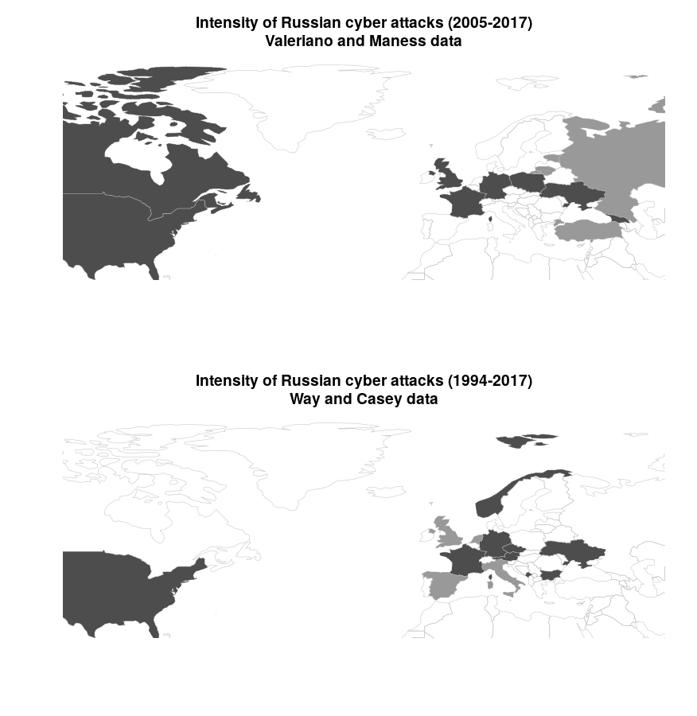

```{r setup, include = FALSE}
knitr::opts_chunk$set(echo = FALSE, warning = FALSE, error = FALSE, message = FALSE, fig.pos = "h!", out.extra = "", fig.align = "center")
library(magrittr)
library(ggplot2)
```

\beginsupplement

This appendix accompanies the paper "The Shadow of Deterrence: Why capable actors engage in contests short of war". It provides supplemental information concerning proofs for the formal model, the data set of Russian gray zone campaigns introduced in the paper, and robustness checks and alternate specifications for the statistical model.

# Formal Model
## Formal statement of assumptions
We formally express the assumption that the kinks in the P function are never activated in equilibrium. Letting $\tilde{g_{C}}$ and $\tilde{g_{D}}$ denote the optimal levels selected by C and D conditional on the actors selecting into gray zone conflict (these are defined below), when Assumption 1 holds, the ``min-max'' statements in the $P$ function will never be relevant to analysis.

\textbf{\textit{Assumption 1}}\textit{: In equilibrium, $\rho_{0}<P(\tilde{g_{C}},\tilde{g_{D}})<\rho_{W}$.}

Based on the optimal $\tilde{g_{C}}$ and $\tilde{g_{D}}$ (solved below), this condition amounts to $\frac{\theta}{2\beta_{C}}-\frac{1}{2\beta_{D}}>0$ and $0<\rho_{W}-\rho_{0}-\frac{\theta}{2\beta_{C}}+\frac{1}{2\beta_{D}}$ if $\frac{\theta}{2\beta_{C}}<\rho_{W}-\rho_{0}+\kappa_{D}+\frac{1}{4\beta_{D}}$, and $\rho_{W}-\rho_{0}+\kappa_{D}-\frac{1}{4\beta_{D}}>0$ and $\kappa_{D}-\frac{1}{4\beta_{D}}<0$ if $\rho_{W}-\rho_{0}+\kappa_{D}+\frac{1}{4\beta_{D}}\leq\frac{\theta}{2\beta_{C}}$.

## Proving Proposition 1

### Equilibrium Intuition
Outside of gray zone conflict, C will prefer the status quo to initially going to war when
  \begin{align*}
  \theta\rho_{0}\geq & \theta\rho_{W}-\kappa_{C}
  \end{align*}
or
  \begin{align*}
  \theta\leq & \frac{\kappa_{C}}{\rho_{W}-\rho_{0}}.
  \end{align*}

Now we discuss the intuition of the equilibrium in the paper. Assume that C is optimally selecting a $g_{C}^{*}$ such that the game ends in gray zone conflict (in other words assume that $w_{C}^{*}=0$ and $g_{C}^{*}\geq0$). Also assume that D selects an optimal $g_{D}^{*}$ such that $g_{D}^{*}\leq g_{C}^{*}$ (this will be borne out by Assumption 1). D selects $g_{D}^{*}$ characterized by
  \begin{align*}
  g_{D}^{*}\in & argmax_{g_{D}\geq0}\left\{ 1-\rho_{0}-g_{C}+g_{D}-\beta_{D}g_{D}^{2}\right\} .
  \end{align*}

We take first-order conditions with respect to $g_{D}$ and solve the expression above to identify the optimal level of D's gray zone response $g_{D}^{*}$. This unique value is
  \begin{align*}
  g_{D}^{*}= & \frac{1}{2\beta_{D}}.
  \end{align*}

Using the expression for $g_{D}^{*}$, D's utility in terms of the selected $g_{C}^{*}$ is $U_{D}=1-\rho_{0}-g_{C}^{*}+\frac{1}{4\beta_{D}}$.

We can then begin considering C's utility. There are two matters to consider. First, it could be that C will select an optimal $g_{C}^{*}$ that is constrained by D's willingness to go to war. Essentially, if $g_{C}>\rho_{W}-\rho_{0}+\kappa_{D}+\frac{1}{4\beta_{D}}$, then D's utility from war is greater than D's utility from gray zone conflict; thus, if C wants to remain in gray zone conflict and will be constrained by D's deterrent threat, C will select $\hat{g_{C}}$, where $\hat{g_{C}}$ is the greatest $g_{C}$ that would make D indifferent between gray zone conflict and war, or
  \begin{align*}
  \hat{g_{C}} & =\rho_{W}-\rho_{0}+\kappa_{D}+\frac{1}{4\beta_{D}}.
  \end{align*}

Second, C may select an optimal $g_{C}^{*}$ that is constrained by their own internal costs. When this is the case, C will select $\check{g_{C}}$, defined by the optimization
  \begin{align*}
  \check{g_{C}}\in & argmax_{g_{C}\geq0}\left\{ \theta\left(\rho_{0}+g_{C}-\frac{1}{2\beta_{D}}\right)-\beta_{C}g_{C}^{2}\right\} ,
  \end{align*}
  which yields
  \begin{align*}
  \check{g_{C}} & =\frac{\theta}{2\beta_{C}}.
  \end{align*}
  
Before discussing the true behavior, we highlight two things that do not happen. First, note that C will never select an $g_{C}$ that provokes D to go to war in the final stage, because this is strictly worse than initially going to war. Second, note that C will never select into gray zone conflict (i.e. set $w_{R}=0$ and $g_{C}^{*}>0$) if $g_{D}^{*}$ as defined above is greater than $g_{C}^{*}$ because C could do strictly better not paying the costs of war and selecting into the status quo ($g_{C}^{*}=0$).

With this is place, if C optimally selects into gray zone conflict, C will select $g_{C}^{*}=\tilde{g_{C}}$, where
  \begin{align*}
  \tilde{g_{C}}= & min\left\{ \hat{g_{C}},\check{g_{C}}\right\} .
  \end{align*}

We have now characterized what happens within gray zone conflict. We now need to describe how the game optimally plays out across the possibility of selecting into the status quo, war (at the onset; $w_{A}=1$), or gray zone conflict. Because C moves first, this is ultimately C's choice. We can calculate C's decision within the two cases of gray zone conflict.

First, we consider the case when $\frac{\theta}{2\beta_{C}}\geq\rho_{W}-\rho_{0}+\kappa_{D}+\frac{1}{4\beta_{D}}$. This condition implies that the selected gray zone conflict will be constrained by D's deterrent threat and not C's internal costs. So, if C selects into gray zone conflict, C will select $g_{C}^{*}=\hat{g_{C}}=\rho_{W}-\rho_{0}+\kappa_{D}+\frac{1}{4\beta_{D}}$. We can then express C's behavior in terms of $\theta$. C prefers the status quo to gray zone conflict when
  \begin{align*}
  \theta\rho_{0}\geq & \theta\left(\rho_{W}+\kappa_{D}-\frac{1}{4\beta_{D}}\right)-\beta_{C}\left(\rho_{W}-\rho_{0}+\kappa_{D}+\frac{1}{4\beta_{D}}\right)^{2}
  \end{align*}
or
  \begin{align*}
  \theta\leq & \frac{\beta_{C}\left(\rho_{W}-\rho_{0}+\kappa_{D}+\frac{1}{4\beta_{D}}\right)^{2}}{\left(\rho_{W}-\rho_{0}+\kappa_{D}-\frac{1}{4\beta_{D}}\right)}.
  \end{align*}
Note that the above derivation relies on $\rho_{W}-\rho_{0}+\kappa_{D}-\frac{1}{4\beta_{D}}>0$, lest the inequality sign would flip. This holds by Assumption 1.

Next, C prefers war to gray zone conflict when
  \begin{align*}
  \theta\rho_{W}-\kappa_{C}> & \theta\left(\rho_{W}+\kappa_{D}-\frac{1}{4\beta_{D}}\right)-\beta_{C}\left(\rho_{W}-\rho_{0}+\kappa_{D}+\frac{1}{4\beta_{D}}\right)^{2}
  \end{align*}
or
  \begin{align*}
  \theta> & \frac{\kappa_{C}-\beta_{C}\left(\rho_{W}-\rho_{0}+\kappa_{D}+\frac{1}{4\beta_{D}}\right)^{2}}{\frac{1}{4\beta_{D}}-\kappa_{D}}.
  \end{align*}
Note that the above derivation relies on $\frac{1}{4\beta_{D}}-\kappa_{D}>0$, lest the inequality sign would flip. This holds by Assumption 1.

Next, we assume $\frac{\theta}{2\beta_{C}}<\rho_{W}-\rho_{0}+\kappa_{D}+\frac{1}{4\beta_{D}}$. This condition implies that the selected gray zone conflict will be constrained by C's internal costs and not D's deterrent threat. So, if C selects into gray zone conflict, C will select $g_{C}^{*}=\check{g_{C}}=\frac{\theta}{2\beta_{C}}$. We can then express C's behavior in terms of $\theta$. C prefers the status quo to gray zone conflict when
  \begin{align*}
  \theta\rho_{0}\geq & \theta\rho_{0}+\frac{\theta^{2}}{4\beta_{C}}-\frac{\theta}{2\beta_{D}}
  \end{align*}
or
  \begin{align*}
  0\geq & \theta\left(\frac{\theta}{4\beta_{C}}-\frac{1}{2\beta_{D}}\right).
  \end{align*}

Next, C prefers war to gray zone conflict when
  \begin{align*}
  \theta\rho_{W}-\kappa_{C}> & \theta\rho_{0}+\frac{\theta^{2}}{4\beta_{C}}-\frac{\theta}{2\beta_{D}}
  \end{align*}
or
  \begin{align*}
  \theta> & \frac{\kappa_{C}}{\rho_{W}-\rho_{0}-\frac{\theta}{4\beta_{C}}+\frac{1}{2\beta_{D}}}.
  \end{align*}
Note that the above derivation relies on $\rho_{W}-\rho_{0}-\frac{\theta}{4\beta_{C}}+\frac{1}{2\beta_{D}}>0$, lest the inequality sign would flip. This holds by Assumption 1.

When $\frac{\theta}{2\beta_{C}}\geq\rho_{W}-\rho_{0}+\kappa_{D}+\frac{1}{4\beta_{D}}$, it is straightforward to see that, for a great enough $\theta$, C's will declare war. We now demonstrate this for $\frac{\theta}{2\beta_{C}}<\rho_{W}-\rho_{0}+\kappa_{D}+\frac{1}{4\beta_{D}}$. We calculate
  \begin{align*}
  \frac{d}{d\theta}\left(U_{C}(war)-U_{C}(grayzone)\right) = & \frac{d}{d\theta}\left(\theta\rho_{W}-\kappa_{C}-\left(\theta\rho_{0}+\frac{\theta^{2}}{4\beta_{C}}-\frac{\theta}{2\beta_{D}}\right)\right) = & \rho_{W}-\rho_{0}-\frac{\theta}{2\beta_{C}}+\frac{1}{2\beta_{D}}
  \end{align*}
 
By Assumption 1, the right hand side is positive. Therefore, as $\theta$ increases, the war payoffs are rising faster than the gray zone payoffs, and for a great enough $\theta$ C will prefer war to gray zone conflict.

With all of this defined, we can characterize C's strategy in terms of $\theta$; as $\theta$ increases, C prefers more degrees of conflict (i.e. larger $g_{C}^{*}$'s or war) to get what they want.

### Equilibrium Behavior
Proposition 1A and the text below contains a more complete discussion of the equilibrium behavior characterized in Proposition 1.

\textbf{\textit{Proposition 1A:}}\textit{ In equilibrium, the game will play out in the following manner.}

\textit{Case 1, $\frac{\theta}{2\beta_{C}}\geq\rho_{W}-\rho_{0}+\kappa_{D}+\frac{1}{4\beta_{D}}$:}
  \begin{itemize}
  \item \textit{1.A. If $\theta\leq\frac{\beta_{C}\left(\rho_{W}-\rho_{0}+\kappa_{D}+\frac{1}{4\beta_{D}}\right)^{2}}{\left(\rho_{W}-\rho_{0}+\kappa_{D}-\frac{1}{4\beta_{D}}\right)}$ and $\theta\leq\frac{\kappa_{C}}{\rho_{W}-\rho_{0}}$, then C accepts the status quo. C selects $w_{C}^{*}=0$ and $g_{C}^{*}=0$, and D selects $w_{D}^{*}=0$ and $g_{D}^{*}=0$. Payoffs are $U_{D}=1-\rho_{0}$ and $U_{C}=\theta\rho_{0}.$}
  \item \textit{1.B. If $\theta>\frac{\kappa_{C}-\beta_{C}\left(\rho_{W}-\rho_{0}+\kappa_{D}+\frac{1}{4\beta_{D}}\right)^{2}}{\frac{1}{4\beta_{D}}-\kappa_{D}}$ and $\theta>\frac{\kappa_{C}}{\rho_{W}-\rho_{0}}$, then C declares war. C selects $w_{C}^{*}=1$, and payoffs are $U_{D}=1-\rho_{W}-\kappa_{D}$ and $U_{C}=\theta\rho_{W}-\kappa_{A}$.}
  \item \textit{1.C. Otherwise, the game end in gray zone conflict where }C's\textit{ limited challenge is constrained by D's deterrent threat. C selects $w_{C}^{*}=0$ and $g_{C}^{*}=\rho_{W}-\rho_{0}+\kappa_{D}+\frac{1}{4\beta_{D}}$, and D selects $w_{D}^{*}=0$ and $g_{D}^{*}=\frac{1}{2\beta_{D}}$. Payoffs are $U_{D}=1-\rho_{W}-\kappa_{D}$ and $U_{C}=\theta\left(\rho_{W}+\kappa_{D}-\frac{1}{4\beta_{D}}\right)-\beta_{C}\left(\rho_{W}-\rho_{0}+\kappa_{D}+\frac{1}{4\beta_{D}}\right)^{2}.$}
  \end{itemize}

\textit{Case 2, $\frac{\theta}{2\beta_{C}}<\rho_{W}-\rho_{0}+\kappa_{D}+\frac{1}{4\beta_{D}}$:}
  \begin{itemize}
  \item \textit{2.A. If $\theta\leq\frac{2\beta_{C}}{\beta_{D}}$ and $\theta\leq\frac{\kappa_{C}}{\rho_{W}-\rho_{0}}$, then C accepts the status quo. C selects $w_{C}^{*}=0$ and $g_{C}^{*}=0$, and D selects $w_{D}^{*}=0$ and $g_{D}^{*}=0$. Payoffs are $U_{D}=1-\rho_{0}$ and $U_{C}=\theta\rho_{0}.$}
  \item \textit{2.B. If $\theta>\frac{\kappa_{C}}{\rho_{W}-\rho_{0}-\frac{\theta}{4\beta_{C}}+\frac{1}{2\beta_{D}}}$ and $\theta>\frac{\kappa_{C}}{\rho_{W}-\rho_{0}}$, then C declares war. C sets $w_{C}^{*}=1$. Payoffs are $U_{D}=1-\rho_{W}-\kappa_{D}$ and $U_{C}=\theta\rho_{W}-\kappa_{A}$.}
  \item \textit{2.C. Otherwise, the game will end in gray zone conflict where }C's\textit{ limited challenge is constrained by }C's\textit{ internal efficiency. C selects $w_{C}^{*}=0$ and $g_{C}^{*}=\frac{\theta}{2\beta_{C}}$, and D selects $w_{D}^{*}=0$ and $g_{D}^{*}=\frac{1}{2\beta_{D}}$. Payoffs are $U_{D}=1-\rho_{0}-\frac{\theta}{2\beta_{C}}+\frac{1}{4\beta_{D}},$ and $U_{C}=\theta\rho_{0}+\frac{\theta^{2}}{4\beta_{C}}-\frac{\theta}{2\beta_{D}}.$}
  \end{itemize}

Working backwards, D will declare war for all $g_{C}>\rho_{W}-\rho_{0}+\kappa_{D}+\frac{1}{4\beta_{D}}$. If $g_{C}\leq\rho_{W}-\rho_{0}+\kappa_{D}+\frac{1}{4\beta_{D}}$, D will select $g_{D}=min\left\{ \frac{1}{2\beta_{D}},g_{C}\right\}$. When $g_{D}=\frac{1}{2\beta_{D}}$, D is selecting their optimal level of gray zone response based on their internal optimization. When $g_{D}=g_{C}$, it implies that D would be willing to select a greater gray zone response, but does not need to, essentially driving the political impact of C's limited challenges back to zero (at cost).

## Observation 1 Discussion
Assume for now the parameters are such that the Case 1.C. conditions hold, and consider what happens when $\kappa_{D}$ decreases. Because here C selects the greatest level of limited challenges that will not provoke D to war, C's selected $g_{C}^{*}$ is a decreasing function of $\kappa_{D}$; therefore, because $g_{D}^{*}$ is fixed, the final extent of gray zone conflict will be less. Of course, the analysis does not stop there. Improvements in D's willingness to go to war constrain how useful gray zone conflict is to R, and, within Case 1.C., C's utility is decreasing in $-\kappa_{D}$.\footnote{This follows from $\frac{d}{d\kappa_{D}}U_{D}=\theta-2\beta_{C}\left[\rho_{W}-\rho_{0}+\kappa_{D}+\frac{1}{4\beta_{D}}\right]>0$, as determined by the conditions for Case 1 to hold.} Thus, if $\kappa_{D}$ becomes small enough, C will leave gray zone conflict and instead select into either accepting the status quo (entering into Case 1A) or going to war (entering into Case 1B). Additionally, it is worthwhile noting that as $\kappa_{D}$ decreases, the condition that selects into Case 1 (over Case 2) has more slack, implying that improvements in D's willingness to go to war will keep D within Case 1.

Now assume the parameters are such that the Case 2.C. conditions hold, and consider what happens when $\kappa_{D}$ decreases. Note that this will not change the selected $g_{C}^{*}$ here, but it could break the inequality $\frac{\theta}{2\beta_{C}}<\rho_{W}-\rho_{0}+\kappa_{D}+\frac{1}{4\beta_{D}}$ that determines whether the equilibrium is defined in Case 1 or Case 2. Thus, for a small enough $\kappa_{D}$, the conditions for Case 2 will break and the conditions for Case 1 will hold. When this happens, either the selected $g_{C}^{*}$ is increasing in $\kappa_{D}$ (Case 1.C.) or gray zone conflict is not selected (Case 1.A. or 1.B.).

## Extension 1: Endogenous $\beta_{D}$
In the model in the paper, we treated D's gray zone efficiency $\beta_{D}$ as exogenous. In some special cases or under some conditions, this may be too strong an assumption. In this section, we characterize an equilibrium for the game when D can have complete flexibility in selecting some $\beta_{D}\geq\underline{\beta_{D}}>0$, where $\beta_{D}$ cannot equal zero because D's costs from their gray zone response will then be undefined.\footnote{For ease, we will assume that all parameters imply that the selected equilibrium is such that the selected $\beta_{D}^{*}$ is strictly greater than $\underline{\beta_{D}}$.} The key take away from this extension is that if $\beta_{D}$ is endogenous (and its selection cost-less), then D's selection of $\beta_{D}^{*}$ will be arbitrated by two properties. As the first property, it matters whether C prefers war to the status quo (formally, if C is type $\theta>\frac{\kappa_{D}}{\rho_{W}-\rho_{0}}$), or C prefers the status quo to war ($\theta\leq\frac{\kappa_{D}}{\rho_{W}-\rho_{0}}$). When C prefers the status quo to war, then D is in a position where D can, by selecting a low enough $\beta_{D}$, influence C to stop undertaking limited challenges and select into the status quo. Intuitively, when D is very good at gray zone conflict, D would select a high $g_{D}^{*}$, which makes gray zone conflict less productive for C. But, when C prefers war to the status quo, then D could pressure C to stop undertaking limited challenges, but this will result in C going to war with D.

As the second property, D's decision will also be arbitrated by whether D can select a gray zone efficiency $\beta_{D}^{*}$ that pushes C into a level of gray zone conflict where the deterrent threat does not bind. Recall that if C optimally conducts gray zone conflict, C selects $g_{C}^{*}=min\{\hat{g_{C}},\check{g_{C}}\}$, implying that C will either select an optimal $g_{C}^{*}=\check{g_{C}}=\frac{\theta}{2\beta_{C}}$ based on their own internal cost-benefit analysis, or select an optimal $g_{C}^{*}=\hat{g_{C}}=\rho_{W}-\rho_{0}+\kappa_{D}+\frac{1}{4\beta_{D}}$ tailored to make D indifferent between war and gray zone conflict (where the deterrent threat binds), with C ultimately choosing the smaller of the two. This means that if D can select a small enough $\beta_{D}$ so that $\check{g_{C}}<\hat{g_{C}}$, then C will selecting a level of limited challenge that is below the point that would make D indifferent between war and gray zone conflict, thus granting D some surplus.

The above two properties interact. D will always prefer the status quo to gray zone conflict where the deterrent threat doesn't bind, and gray zone conflict where the deterrent threat doesn't bind to gray zone conflict where the deterrent threat does bind or war. Proposition A identifies how D selects $\beta_{D}^{*}$ in one possible equilibrium. Note that this is not the only possible equilibrium.\footnote{Consider the equilibrium space for the range of $\theta$ where the selected $\beta_{D}$ will either push C into war or gray zone conflict where the deterrent threat binds. In the figure below, this is the far right region of the graph. Here D can select any $\beta_{D}$ and it will grant D the same final expected utility of their wartime utility.}

\textbf{\textit{Proposition A.}}\textit{ As one equilibrium, in the game with endogenous $\beta_{D}$, D will select the following levels of $\beta_{D}^{*}$:}

\textit{Case 1: $\theta\leq\frac{\kappa_{D}}{\rho_{W}-\rho_{0}}$:}
  \begin{itemize}
  \item \textit{1.A. We define $\tilde{\beta_{D}}$ as $\theta=\frac{2\beta_{C}}{\tilde{\beta_{D}}}$ . So long that $\frac{\theta}{2\beta_{C}}<\rho_{W}-\rho_{0}+\kappa_{D}+\frac{1}{4\tilde{\beta_{D}}}$, then D selects $\beta_{D}^{*}=\tilde{\beta_{D}}$. The game will proceed as defined in Proposition 1, Case 2.A., where the final outcome is the status quo.}
  \item \textit{1.B. Otherwise, D selects $\beta_{D}^{*}=\hat{\beta_{D}}$, here $\hat{\beta_{D}}$ is defined implicitly as $\theta=\frac{\beta_{C}\left(\rho_{W}-\rho_{0}+\kappa_{D}+\frac{1}{4\hat{\beta_{D}}}\right)^{2}}{\left(\rho_{W}-\rho_{0}+\kappa_{D}-\frac{1}{4\hat{\beta_{D}}}\right)}$ (also note from earlier assumptions $\hat{\beta}_{D}>0$). The game will proceed as defined in Proposition 1, Case 1.A., where the final out come is the status quo.}
  \end{itemize}

\textit{Case 2: $\theta>\frac{\kappa_{D}}{\rho_{W}-\rho_{0}}$}
  \begin{itemize}
  \item \textit{2.A. We define $\check{\beta_{D}}$ implicitly as $\theta=\frac{\kappa_{C}}{\left(\rho_{W}-\rho_{0}-\frac{\theta}{4\beta_{C}}+\frac{1}{2\check{\beta_{D}}}\right)}$. As long as $\frac{\theta}{2\beta_{C}}<\rho_{W}-\rho_{0}+\kappa_{D}+\frac{1}{4\check{\beta_{D}}}$, then D selects $\beta_{D}^{*}=\check{\beta_{D}}$. The game will proceed as defined in Proposition 1, Case 2.C., where the final outcome is gray zone conflict where C is not bound by D's deterrent threat.}
  \item \textit{2.B. Otherwise, D selects $\beta_{D}^{*}=\dot{\beta_{D}}$, here $\dot{\beta_{D}}$ is defined implicitly as $\theta=\frac{\kappa_{C}-\beta_{C}\left(\rho_{W}-\rho_{0}+\kappa_{D}+\frac{1}{4\dot{\beta_{D}}}\right)^{2}}{-\kappa_{D}+\frac{1}{4\dot{\beta_{D}}}}$. The game will proceed as defined in Proposition 1, Case 1.C., where the final outcome is gray zone conflict where C is not bound by D's deterrent threat.}
  \end{itemize}
 
As one example of how this one equilibrium plays out, we adapt Figure 4 in the text. Now the solid black lines denote the selected levels of $\beta_{D}^{*}$ (with $1/\beta_{D}$ plotted so that greater y-axis values represent greater gray zone efficiencies for D), and the dotted lines separate equilibrium spaces.

\begin{figure}
\begin{tikzpicture}
\small
\begin{axis}[%
width=5.5in,
height=3.5in,
at={(1.011in,0.642in)},
scale only axis,
xmin=1.285,
xmax=1.4,
xtick={1.285, 1.315, 1.366,1.4},
xticklabels={{1.285},{$\theta=\frac{\kappa_R}{\rho_W-\rho_0}$},{$\theta=2\beta_R(\rho_{W}$-$\rho_{0}$+$\kappa_{D}$+$\frac{1}{4\check{\beta_D}})$},{1.4}},
%{\shortstack{$\frac{\theta}{2\beta}=(\rho_{W}-$\\$\rho_{0}+\kappa_{D}+\frac{d}{4})$}}
xlabel style={font=\color{white!15!black},align=center},
xlabel={\textbf{C's Resolve Increasing $\rightarrow$} \\ $\theta$ (plotted) Increasing $\rightarrow$ },
ymin=0.635,
ymax=0.67,
ytick={0.635, 0.67},
yticklabels={{0.635},{0.66}},
ylabel style={font=\color{white!15!black}, align=center},
ylabel={\textbf{D's Optimal Gray Zone Efficiency Increasing $\rightarrow$} \\ $\frac{1}{\beta_D^*}$ (plotted) Increasing $\rightarrow$},
axis background/.style={fill=white},
title style={font=\bfseries},
title={Equilibrium Behavior: C's Resolve and D's Gray Zone Efficiency},
]

%

\node[draw, align=center] at (1.3,0.66) {\footnotesize{\textit{R Accepts}} \\ \footnotesize{\textit{Status Quo}}};
\node[draw, align=center] at (1.32,0.645) {\footnotesize{\textit{R Selects Gray Zone,}} \\ \footnotesize{\textit{Internal Efficiency Binds}}};
\node[draw, align=center] at (1.383,0.642) {\footnotesize{\textit{R Selects Gray Zone,}} \\ \footnotesize{\textit{Deterrent Threat Binds}}};
\node[draw, align=center] at (1.36,0.662) {\footnotesize{\textit{R Selects War}}};  

%\node[draw, align=center] at (.1925,1.2) {\footnotesize{\textit{Gray Zone,}} \\ \footnotesize{\textit{Unconstrained}}};

%BEGIN DOTTED LINES

\addplot [color=white!55!black, dotted, line width=1.3pt, forget plot]
table[row sep=crcr]{%
1.315 0.6575\\
1.315 0.67\\
};


%\addplot [color=white!55!black, dotted, line width=1.3pt, forget plot]
% table[row sep=crcr]{%
%1.315 0.6575\\
%1.315 0.635\\
%};

%END DOTTED LINES

%WAR
%\addplot [color=black, line width=1.2pt]
%  table[row sep=crcr]{%
%1.315 0.6575\\
%1.315 0.69\\
%};

%GZ CONSTRAINTS
\addplot[color=white!55!black, dotted, line width=1.3pt, forget plot]
table[row sep=crcr]{%
1.3575 0.635 \\
1.358 0.636 \\
1.3585 0.637 \\
1.359 0.638 \\
1.3595 0.639 \\
1.36 0.64 \\
1.3605 0.641 \\
1.361 0.642 \\
1.3615 0.643 \\
1.362 0.644 \\
1.3625 0.645 \\
1.363 0.646 \\
1.3635 0.647 \\
1.364 0.648 \\
1.3645 0.649 \\
1.365 0.65 \\
1.3655 0.651 \\
1.366 0.652 \\
};

%GZ INTERIOR PEACE
\addplot [color=black, line width=1.2pt, forget plot]
table[row sep=crcr]{%
1.285 0.6425 \\
1.286 0.643 \\
1.287 0.6435 \\
1.288 0.644 \\
1.289 0.6445 \\
1.29 0.645 \\
1.291 0.6455 \\
1.292 0.646 \\
1.293 0.6465 \\
1.294 0.647 \\
1.295 0.6475 \\
1.296 0.648 \\
1.297 0.6485 \\
1.298 0.649 \\
1.299 0.6495 \\
1.3 0.65 \\
1.301 0.6505 \\
1.302 0.651 \\
1.303 0.6515 \\
1.304 0.652 \\
1.305 0.6525 \\
1.306 0.653 \\
1.307 0.6535 \\
1.308 0.654 \\
1.309 0.6545 \\
1.31 0.655 \\
1.311 0.6555 \\
1.312 0.656 \\
1.313 0.6565 \\
1.314 0.657 \\
1.315 0.6575 \\
1.3155 0.65775 \\
};

%GZ INTERIOR WAR
\addplot [color=black, line width=1.2pt, forget plot]
table[row sep=crcr]{%
1.315 0.657804183 \\
1.316 0.657665653 \\
1.317 0.657528094 \\
1.318 0.657391502 \\
1.319 0.657255876 \\
1.32 0.657121212 \\
1.321 0.656987509 \\
1.322 0.656854766 \\
1.323 0.656722978 \\
1.324 0.656592145 \\
1.325 0.656462264 \\
1.326 0.656333333 \\
1.327 0.65620535 \\
1.328 0.656078313 \\
1.329 0.65595222 \\
1.33 0.655827068 \\
1.331 0.655702855 \\
1.332 0.65557958 \\
1.333 0.655457239 \\
1.334 0.655335832 \\
1.335 0.655215356 \\
1.336 0.655095808 \\
1.337 0.654977188 \\
1.338 0.654859492 \\
1.339 0.654742718 \\
1.34 0.654626866 \\
1.341 0.654511931 \\
1.342 0.654397914 \\
1.343 0.65428481 \\
1.344 0.654172619 \\
1.345 0.654061338 \\
1.346 0.653950966 \\
1.347 0.6538415 \\
1.348 0.653732938 \\
1.349 0.653625278 \\
1.35 0.653518519 \\
1.351 0.653412657 \\
1.352 0.653307692 \\
1.353 0.653203622 \\
1.354 0.653100443 \\
1.355 0.652998155 \\
1.356 0.652896755 \\
1.357 0.652796242 \\
1.358 0.652696613 \\
1.359 0.652597866 \\
1.36 0.6525 \\
1.361 0.652403012 \\
1.362 0.652306902 \\
1.363 0.652211665 \\
1.364 0.652117302 \\
1.365 0.65202381 \\
1.366 0.651931186 \\
};

%GZ External WAR
\addplot [color=black, line width=1.2pt, forget plot]
table[row sep=crcr]{%
1.409290323 0.648 \\
1.408172501 0.6481 \\
1.40705556 0.6482 \\
1.405939499 0.6483 \\
1.404824316 0.6484 \\
1.40371001 0.6485 \\
1.402596581 0.6486 \\
1.401484027 0.6487 \\
1.400372347 0.6488 \\
1.399261541 0.6489 \\
1.398151606 0.649 \\
1.397042543 0.6491 \\
1.39593435 0.6492 \\
1.394827026 0.6493 \\
1.393720569 0.6494 \\
1.39261498 0.6495 \\
1.391510256 0.6496 \\
1.390406398 0.6497 \\
1.389303403 0.6498 \\
1.388201271 0.6499 \\
1.3871 0.65 \\
1.38599959 0.6501 \\
1.38490004 0.6502 \\
1.383801348 0.6503 \\
1.382703514 0.6504 \\
1.381606537 0.6505 \\
1.380510415 0.6506 \\
1.379415148 0.6507 \\
1.378320734 0.6508 \\
1.377227172 0.6509 \\
1.376134462 0.651 \\
1.375042603 0.6511 \\
1.373951592 0.6512 \\
1.372861431 0.6513 \\
1.371772116 0.6514 \\
1.370683648 0.6515 \\
1.369596025 0.6516 \\
1.368509247 0.6517 \\
1.367423312 0.6518 \\
1.36633822 0.6519 \\
1.365253968 0.652 \\
};

%   \node at (1.3,0.502)  [circle,scale=0.7,minimum size=0.5pt,draw,fill=black!100] {};
%   \node at (1.3,0.65)  [circle,scale=0.7,draw,fill=black!0] {};

\end{axis}
\end{tikzpicture}
\caption{Extension 1: D's Optimal $d^{*}$. C's resolve $\theta$ and the inverse D's gray zone efficiency $\frac{1}{\beta_{D}}$ are plotted. The dotted lines separate different kinds of equilibrium play, and the dark black lines denote D's optimal selected $\beta_{D}$. The parameters are $\rho_{0}=0$, $\rho_{W}=0.5$, $\beta_{C}=1$, $\kappa_{C}=0.53$, and $\kappa_{D}=0.1$.}
\end{figure}

Moving left to right, for $\theta$ between $1.285$ and $\frac{\kappa_{C}}{\rho_{W}-\rho_{0}}$, D's optimal $\beta_{D}^{*}$ is described in Proposition A Case 1.A. As the outcome, C will optimally select into the status quo. For this selected $\beta_{D}^{*}$, C knows that C would face enough of a challenge in gray zone conflict to make competing there too costly. Thus within this region, D could select a low enough $\beta_{D}^{*}$ to compel C to forgo limited challenges and conflict, and stick to the status quo.

Moving right, for $\theta$ between $\frac{\kappa_{C}}{\rho_{W}-\rho_{0}}$ and $\ensuremath{2\beta_{C}(\rho_{W}-\ensuremath{\rho_{0}}+\kappa_{D}}+\frac{1}{4\check{\beta_{D}}})$, D's optimal $\beta_{D}^{*}$ is described in Proposition A Case 2.A. As the outcome, C will optimally select into gray zone conflict, but will be constrained by C's internal costs. For this selected $\beta_{D}^{*}$, D wants to challenge C in gray zone conflict (which a lower $\beta_{D}^{*}$ accomplishes), but does not want to push C into forgoing gray zone conflict, because within this region C prefers war to accepting the status quo. Thus here, D selects the $\beta_{D}^{*}$ where C selects into gray zone conflict and is not bound by the deterrent threat, because this gives D some surplus beyond what war or C selecting gray zone conflict and being bound by the deterrent threat produces.

Finally, for $\theta$ between $\ensuremath{2\beta_{C}(\rho_{W}-\ensuremath{\rho_{0}}+\kappa_{D}}+\frac{1}{4\check{\beta_{D}}})$ and $1.4$, D's optimal $\beta_{D}^{*}$ is described in Case 2.B. As the outcome, C will optimally select into gray zone conflict, and will be constrained by D's deterrent threat. This situation is problematic for D. If D modifies $\beta_{D}^{*}$, either C will adapt by selecting the new $g_{C}^{*}$ that makes D indifferent between war and gray zone conflict, or will go to war over the issue. Within this region, it does not matter what $\beta_{D}^{*}$ is selected, because C will always select an action that gives D their wartime utility.

## Extension 2: Probabilistic Escalation to War
A useful feature of the model above is that everything that occurs is deterministic. Only if a state wants to go to war or wants to enter gray zone conflict does it actually happen. However, this represents a simplification. Perhaps in some cases, one state behaving aggressively in lower-levels of conflict can create an incident that necessitates an escalation to higher levels of conflict. To speak to this issue, we introduce the possibility of probabilistic escalation out of gray zone conflict. Our results are substantively similar, but this change shifts some equilibrium properties. Intuitively, now gray zone conflict can probabilistically lead to C's worst outcome: where C invests in limited challenges, war happens, and C must pay the costs of limited challenges with the costs of war. Strategically, because here gray zone conflict is overall worse for C, C will be more willing to accept the status quo or go to war.

There are many possible ways to model this. For ease, we choose (in our opinion) the simplest way, which is that selecting $g_{C}>0$ introduces a $1-\zeta\in(0,1)$ likelihood of an escalation to war. Thus, when C selects $g_{C}>0$, C's new expected utility is
  \begin{align*}
  U_{C}= & \theta\left(\zeta P(g_{C},g_{D})+(1-\zeta)\rho_{W}\right)-(1-\zeta)\kappa_{C}-\beta_{C}g_{C}.
  \end{align*}

To offer some intuition, $g_{D}^{*}$, $\hat{g_{C}}$, $\check{g_{C}}$, and $\tilde{g_{C}}$ remain the same as it was in the model in the text (as defined in Proposition 1). However, the cut-points that distinguish C's decision to enter into the status quo, gray zone conflict, or war change slightly; overall, the key take-away is that considering probabilistic escalation makes gray zone conflict less appealing relative to the status quo and war.

We express equilibrium behavior in Proposition B. Then below, we derive the new cut-points, Additionally in the derivations, we discuss how the new cut-points imply that gray zone conflict is less appealing and fewer types $\theta$ will select into it relative to the game without a probabilistic likelihood of escalation to war from gray zone conflict.

\textbf{\textit{Proposition B:}}\textit{ In equilibrium, the game with a $1-\zeta$ chance of escalation out of gray zone conflict to war will play out in the following manner.}

\textit{Case 1, $\frac{\theta}{2\beta_{C}}\geq\rho_{W}-\rho_{0}+\kappa_{D}+\frac{1}{4\beta_{D}}$:}
  \begin{itemize}
  \item \textit{1.A. If $\theta\leq\frac{(1-\zeta)\kappa_{C}+\beta_{C}\left(\rho_{W}-\rho_{0}+\kappa_{D}+\frac{1}{4\beta_{D}}\right)^{2}}{(1-\zeta)(\rho_{W}-\rho_{0})+\zeta\left(\rho_{W}-\rho_{0}+\kappa_{D}-\frac{1}{4\beta_{D}}\right)}$ and $\theta\leq\frac{\kappa_{C}}{\rho_{W}-\rho_{0}}$, then C accepts the status quo. C selects $w_{C}^{*}=0$ and $g_{C}^{*}=0$, and D selects $w_{D}^{*}=0$ and $g_{D}^{*}=0$. }
  \item \textit{1.B. If $\theta>\frac{\zeta\kappa_{C}-\beta_{C}\left(\rho_{W}-\rho_{0}+\kappa_{D}+\frac{1}{4\beta_{D}}\right)^{2}}{\zeta\left(\frac{1}{4\beta_{D}}-\kappa_{D}\right)}$ and $\theta>\frac{\kappa_{C}}{\rho_{W}-\rho_{0}}$, then C declares war. C selects $w_{C}^{*}=1$.}
  \item \textit{1.C. Otherwise, the game end in gray zone conflict where }C's\textit{ limited challenge is constrained by D's deterrent threat. C selects $w_{C}^{*}=0$ and $g_{C}^{*}=\rho_{W}-\rho_{0}+\kappa_{D}+\frac{1}{4\beta_{D}}$, and (assuming the game does not probabilistically escalate to war) D selects $w_{D}^{*}=0$ and $g_{D}^{*}=\frac{1}{2\beta_{D}}$. }
  \end{itemize}

\textit{Case 2, $\frac{\theta}{2\beta_{C}}<\rho_{W}-\rho_{0}+\kappa_{D}+\frac{1}{4\beta_{D}}$:}
  \begin{itemize}
  \item \textit{2.A. If $(1-\zeta)\kappa_{C}\geq\theta\left((1-\zeta)(\rho_{W}-\rho_{0})+\zeta\left(\frac{\theta}{2\beta_{C}}-\frac{1}{2\beta_{D}}\right)-\frac{\theta}{4\beta_{C}}\right)$ and $\theta\leq\frac{\kappa_{C}}{\rho_{W}-\rho_{0}}$, then C accepts the status quo. C selects $w_{C}^{*}=0$ and $g_{C}^{*}=0$, and D selects $w_{D}^{*}=0$ and $g_{D}^{*}=0$. }
  \item \textit{2.B. If $\theta>\frac{\zeta\kappa_{C}}{\left(\zeta\left(\rho_{W}-\rho_{0}-\frac{\theta}{2\beta_{C}}+\frac{1}{2\beta_{D}}\right)+\frac{\theta}{4\beta_{C}}\right)}$ and $\theta>\frac{\kappa_{C}}{\rho_{W}-\rho_{0}}$, then C declares war. C sets $w_{C}^{*}=1$.}\footnote{\textit{While the right-hand-side of this condition is also increasing in $\theta$, the left-hand-side increases faster with increases in $\theta$.}}\textit{ }
  \item \textit{2.C. Otherwise, the game will end in gray zone conflict where }C's\textit{ limited challenge is constrained by }C's\textit{ internal efficiency. C selects $w_{C}^{*}=0$ and $g_{C}^{*}=\frac{\theta}{2\beta_{C}}$, and (assuming the game does not probabilistically escalate to war) D selects $w_{D}^{*}=0$ and $g_{D}^{*}=\frac{1}{2\beta_{D}}$. }
  \end{itemize}

### Equilibrium Intuition
First, we consider the case when $\frac{\theta}{2\beta_{C}}\geq\rho_{W}-\rho_{0}+\kappa_{D}+\frac{1}{4\beta_{D}}$. This implies that C will select $g_{C}^{*}=\hat{g_{C}}=\rho_{W}-\rho_{0}+\kappa_{D}+\frac{1}{4\beta_{D}}$. We can then express C's behavior in terms of $\theta$. C prefers the status quo to gray zone conflict when
  \begin{align*}
  \theta\rho_{0}\geq & \theta\left(\zeta\left(\rho_{W}+\kappa_{D}-\frac{1}{4\beta_{D}}\right)+(1-\zeta)\rho_{W}\right)-(1-\zeta)\kappa_{C}-\beta_{C}\left(\rho_{W}-\rho_{0}+\kappa_{D}+\frac{1}{4\beta_{D}}\right)^{2}
  \end{align*}
or
  \begin{align*}
  \frac{\beta_{C}\left(\rho_{W}-\rho_{0}+\kappa_{D}+\frac{1}{4\beta_{D}}\right)^{2}}{\zeta\left(\rho_{W}-\rho_{0}+\kappa_{D}-\frac{1}{4\beta_{D}}\right)}+\frac{(1-\zeta)(\theta\rho_{0}-\theta\rho_{W}+\kappa_{C})}{\zeta\left(\rho_{W}-\rho_{0}+\kappa_{D}-\frac{1}{4\beta_{D}}\right)}\geq & \theta.
  \end{align*}

Note that the inequality sign does not flip because, by Assumption 1, $\rho_{W}-\rho_{0}+\kappa_{D}-\frac{1}{4\beta_{D}}>0$. We are able to say that $\frac{\beta_{C}\left(\rho_{W}-\rho_{0}+\kappa_{D}+\frac{1}{4\beta_{D}}\right)^{2}}{\zeta\left(\rho_{W}-\rho_{0}+\kappa_{D}-\frac{1}{4\beta_{D}}\right)}>\frac{\beta_{C}\left(\rho_{W}-\rho_{0}+\kappa_{D}+\frac{1}{4\beta_{D}}\right)^{2}}{\left(\rho_{W}-\rho_{0}+\kappa_{D}-\frac{1}{4\beta_{D}}\right)}$ because $\zeta\in(0,1)$. Furthermore, this constraint (on when the status quo is preferred to gray zone conflict) matters only when C prefers the status quo to war, or when $\theta\rho_{0}-\theta\rho_{W}+\kappa_{C}\geq0$; this condition implies $\frac{(1-\zeta)(\theta\rho_{0}-\theta\rho_{W}+\kappa_{C})}{\zeta\left(\rho_{W}-\rho_{0}+\kappa_{D}-\frac{1}{4\beta_{D}}\right)}\geq0$, which means $\frac{\beta_{C}\left(\rho_{W}-\rho_{0}+\kappa_{D}+\frac{1}{4\beta_{D}}\right)^{2}}{\zeta\left(\rho_{W}-\rho_{0}+\kappa_{D}-\frac{1}{4\beta_{D}}\right)}+\frac{(1-\zeta)(\theta\rho_{0}-\theta\rho_{W}+\kappa_{C})}{\zeta\left(\rho_{W}-\rho_{0}+\kappa_{D}-\frac{1}{4\beta_{D}}\right)}>\frac{\beta_{C}\left(\rho_{W}-\rho_{0}+\kappa_{D}+\frac{1}{4\beta_{D}}\right)^{2}}{\left(\rho_{W}-\rho_{0}+\kappa_{D}-\frac{1}{4\beta_{D}}\right)}$, which in turn implies that there are more C's with some resolve $\theta$ that will select into the status quo in the game here relative to the game in the text without probabilistic escalation.

Next, C prefers war to gray zone conflict when
  \begin{align*}
  \theta\rho_{W}-\kappa_{C}> & \theta\left(\zeta\left(\rho_{W}+\kappa_{D}-\frac{1}{4\beta_{D}}\right)+(1-\zeta)\rho_{W}\right)-(1-\zeta)\kappa_{C}-\beta_{C}\left(\rho_{W}-\rho_{0}+\kappa_{D}+\frac{1}{4\beta_{D}}\right)^{2}
  \end{align*}
or
  \begin{align*}
  \theta> & \frac{\zeta\kappa_{C}-\beta_{C}\left(\rho_{W}-\rho_{0}+\kappa_{D}+\frac{1}{4\beta_{D}}\right)^{2}}{\zeta\left(\frac{1}{4\beta_{D}}-\kappa_{D}\right)}.
  \end{align*}

Note that based on Assumption 1, the above sign does not flip. We can say that $\zeta\kappa_{C}-\zeta\beta_{C}\left(\rho_{W}-\rho_{0}+\kappa_{D}+\frac{1}{4\beta_{D}}\right)^{2}>\zeta\kappa_{C}-\beta_{C}\left(\rho_{W}-\rho_{0}+\kappa_{D}+\frac{1}{4\beta_{D}}\right)^{2}$. This implies that
  \begin{align*}
  \frac{\kappa_{C}-\beta_{C}\left(\rho_{W}-\rho_{0}+\kappa_{D}+\frac{1}{4\beta_{D}}\right)^{2}}{\frac{1}{4\beta_{D}}-\kappa_{D}}=\frac{\zeta\kappa_{C}-\zeta\beta_{C}\left(\rho_{W}-\rho_{0}+\kappa_{D}+\frac{1}{4\beta_{D}}\right)^{2}}{\zeta\left(\frac{1}{4\beta_{D}}-\kappa_{D}\right)} & >\frac{\zeta\kappa_{C}-\beta_{C}\left(\rho_{W}-\rho_{0}+\kappa_{D}+\frac{1}{4\beta_{D}}\right)^{2}}{\zeta\left(\frac{1}{4\beta_{D}}-\kappa_{D}\right)}.
  \end{align*}

In other words, there are more C's with some resolve $\theta$ that will select into war in the game here relative to the game without probabilistic escalation.

Next, we assume $\frac{\theta}{2\beta_{C}}<\rho_{W}-\rho_{0}+\kappa_{D}+\frac{1}{4\beta_{D}}$. This condition implies that the selected gray zone conflict will be constrained by C's internal costs and not D's deterrent threat. So, if C selects into gray zone conflict, C will select $g_{C}^{*}=\check{g_{C}}=\frac{\theta}{2\beta_{C}}$. We can then express C's behavior in terms of $\theta$. C prefers the status quo to gray zone conflict when
  \begin{align*}
  \theta\rho_{0}\geq & \theta\left(\zeta\left(\rho_{0}+\frac{\theta}{2\beta_{C}}-\frac{1}{2\beta_{D}}\right)+(1-\zeta)\left(\rho_{W}\right)\right)-(1-\zeta)\kappa_{C}-\frac{\theta^{2}}{4\beta_{C}}
  \end{align*}
or
  \begin{align*}
  (1-\zeta)\kappa_{C}\geq & \theta\left((1-\zeta)(\rho_{W}-\rho_{0})+\zeta\left(\frac{\theta}{2\beta_{C}}-\frac{1}{2\beta_{D}}\right)-\frac{\theta}{4\beta_{C}}\right).
  \end{align*}

To speak to this inequality, we will need to consider a few different cases here.

First, it could be possible that $\left((1-\zeta)(\rho_{W}-\rho_{0})+\zeta\left(\frac{\theta}{2\beta_{C}}-\frac{1}{2\beta_{D}}\right)-\frac{\theta}{4\beta_{C}}\right)\leq0$. When this is the case, then C would never want to select into gray zone conflict as doing so would always be strictly worse for C.

Next, consider when $\left((1-\zeta)(\rho_{W}-\rho_{0})+\zeta\left(\frac{\theta}{2\beta_{C}}-\frac{1}{2\beta_{D}}\right)-\frac{\theta}{4\beta_{C}}\right)>0$ and $(1-\zeta)(\theta\rho_{W}-\theta\rho_{0}-\kappa_{C})>0$. In this case, C's wartime payoff $\theta\rho_{W}-\kappa_{C}$ is greater than C's status quo payoff, meaning that C would never select into the status quo over selecting into war, meaning this constraint would never be activated.

Finally, consider when $\left((1-\zeta)(\rho_{W}-\rho_{0})+\zeta\left(\frac{\theta}{2\beta_{C}}-\frac{1}{2\beta_{D}}\right)-\frac{\theta}{4\beta_{C}}\right)>0$ and $(1-\zeta)(\theta\rho_{W}-\theta\rho_{0}-\kappa_{C})<0$. We can re-write the above as
  \begin{align*}
  0\geq & \theta\left(\zeta\left(\frac{\theta}{2\beta_{C}}-\frac{1}{2\beta_{D}}\right)-\frac{\theta}{4\beta_{C}}\right)+(1-\zeta)(\theta\rho_{W}-\theta\rho_{0}-\kappa_{C})
  \end{align*}

Note that $\frac{\theta}{4\beta_{C}}-\frac{1}{2\beta_{D}}=\frac{\theta}{2\beta_{C}}-\frac{1}{2\beta_{D}}-\frac{\theta}{4\beta_{C}}>\zeta\left(\frac{\theta}{2\beta_{C}}-\frac{1}{2\beta_{D}}\right)-\frac{\theta}{4\beta_{C}}$, where the inequality holds by Assumption 1. Altogether, this means that $\text{\ensuremath{\theta\left(\frac{\theta}{4\beta_{C}}-\frac{1}{2\beta_{D}}\right)}}>\theta\left(\zeta\left(\frac{\theta}{2\beta_{C}}-\frac{1}{2\beta_{D}}\right)-\frac{\theta}{4\beta_{C}}\right)+(1-\zeta)(\theta\rho_{W}-\theta\rho_{0}-\kappa_{C})$. This implies that there are more C's with some resolve $\theta$ that will select into the status quo in the game here relative to the game without probabilistic escalation.

Finally, assuming $\frac{\theta}{2\beta_{C}}<\rho_{W}-\rho_{0}+\kappa_{D}+\frac{1}{4\beta_{D}}$, C prefers war to gray zone conflict when
  \begin{align*}
  \theta\rho_{W}-\kappa_{C}> & \theta\left(\zeta\left(\rho_{0}+\frac{\theta}{2\beta_{C}}-\frac{1}{2\beta_{D}}\right)+(1-\zeta)\left(\rho_{W}\right)\right)-(1-\zeta)\kappa_{C}-\frac{\theta^{2}}{4\beta_{C}}
  \end{align*}
or
  \begin{align*}
  \theta> & \frac{\zeta\kappa_{C}}{\left(\zeta\left(\rho_{W}-\rho_{0}-\frac{\theta}{2\beta_{C}}+\frac{1}{2\beta_{D}}\right)+\frac{\theta}{4\beta_{C}}\right)}.
  \end{align*}

Note the inequality sign does not flip because $\left(\rho_{W}-\rho_{0}-\frac{\theta}{2\beta_{C}}+\frac{1}{2\beta_{D}}\right)>0$. Furthermore, by that condition, $\zeta\left(\rho_{W}-\rho_{0}-\frac{\theta}{2\beta_{C}}+\frac{1}{2\beta_{D}}\right)+\frac{\theta}{4\beta_{C}}>\zeta\left(\rho_{W}-\rho_{0}-\frac{\theta}{2\beta_{C}}+\frac{1}{2\beta_{D}}\right)+\zeta\frac{\theta}{4\beta_{C}}$. Therefore $\frac{\kappa_{C}}{\left(\rho_{W}-\rho_{0}-\frac{\theta}{2\beta_{C}}+\frac{1}{2\beta_{D}}\right)+\frac{\theta}{4\beta_{C}}}>\frac{\zeta\kappa_{C}}{\zeta\left(\rho_{W}-\rho_{0}-\frac{\theta}{2\beta_{C}}+\frac{1}{2\beta_{D}}\right)+\frac{\theta}{4\beta_{C}}}$. This implies that there are more C's with some resolve $\theta$ that will select into war in the game here relative to the game without a random chance of escalation.

Finally, note that D's strategies in this game are unchanged from the game without probabilistic escalation.

## Extension 3: Endogenous Bargaining and Information Asymmetry

Here we offer one possible microfoundation for a key assumption in the game: that the game begins with C being potentially dissatisfied with the status quo. We do this by keeping the game structure we introduced in the main paper and by adding new initial moves to the game. We grant D the option to establish the ``status quo'' though an ultimatum offer, we assume D has private information, and we add some additional parameter assumptions. Importantly, reasonable readers may take issue with certain facets of the game form below; for that reason, we wish to highlight that what we present is not the only way for our conflict selection subgame (i.e. C selecting whether to accept, go to war, or engage in a low level challenge, and then D doing the same) to start with a potentially dissatisfied C. Past examinations of the causes for war---like private information [@fearon_rationalistexplanationswar_1995], commitment
problems [@powell_warcommitmentproblem_2006], costly peace [@coe_costlypeacenew_2011], political bias [@jackson_politicalbiaswar_2007], and the possibility of behavioral types [@acharya_warcrazytypes_2015]---have all demonstrated that natural circumstances can lead to settings where one state is willing to make an offer to another state, knowing that the offer could lead to some form of conflict.

The take-away from the following analysis is that with endogenous bargaining, C's gray zone actions are still driven by the external deterrent constraint and the internal efficiency constraint, though other factors can also play a role. While it is well established that including information asymmetry can make an empirical analysis of conflict onset less pinned-down [@gartzke_warerrorterm_1999], the model does predict that whenever gray zone conflict is observed, C will select a level of gray zone conflict benchmarked either to the external deterrent constraint of D, or based on their own internal efficiency constraint. Based on this prediction, we also include an empirical analysis in \@ref(tab:targets-results) below where we re-run our models on the sample of observations where some form of conflict occurred. We find that our key variables approximating the deterrent threat (NATO membership) and internal efficiency (distance from Russia) still predict the intensity of conflict. While these results should be taken with precautions---the sample is smaller and (due to the high number of recent attacks) a larger proportion of control variables are missing---this does still suggest our formal model is plausibly describing key drivers for gray zone conflict intensity.

For this new formal model, we assume the following game form.
  \begin{enumerate}
  \item Nature moves first and sets $\rho_{W}\in\{\underline{\rho}_{W},\bar{\rho}_{W}\}$, with $\underline{\rho}_{W}<\bar{\rho}_{W}$. Nature fixes $\bar{\rho}_{W}$ with probability $\epsilon\in(0,1)$ and $\underline{\rho}_{W}$ with probability $1-\epsilon$. D observes the selected $\rho_{W}$, but C does not. The selected $\rho_{W}$ can be thought of as D's ``type,'' where D is stronger if they are type $\underline{\rho}_{W}$.
  \item D makes C some offer $x\in\{\underline{x},\bar{x}\}$, with $\underline{x}<\bar{x}$. It is worthwhile mentioning that issue indivisibility is not a driver of conflict in this game, and if we assumed complete information, there will be no conflict.\footnote{This model can still function with a continuum of offers, though it becomes much more complicated.}
  \item C either goes to war by setting $w_{C}=1$ or sets $w_{C}=0$. If C goes to war, the game terminates and C and D receive payoffs $\theta\rho_{W}-\kappa_{C}$ and $1-\rho_{W}-\kappa_{D}$ (with $\rho_{W}\in\{\underline{\rho}_{W},\bar{\rho}_{W}\}$), respectively. If C sets $w_{C}=0$, C also selects $g_{C}\in\mathcal{G}_{C}=\mathbb{R}_{\geq0}$, where $g_{C}=0$ is walking away from the crisis and accepting the offer, and $g_{C}>0$ is conducting some limited, costly military action that shifts the offer in favor of the challenger.
  \item As long as C did not previously go to war, D can either escalate to war by setting $w_{D}=1$, or not by setting $w_{D}=0$ and selecting some gray zone response $g_{D}\in\mathcal{G}_{D}=\mathbb{R}_{\geq0}$, with $g_{D}=0$ implying that D does not respond to the limited challenge. When war occurs, C and D receive payoffs $\theta\rho_{W}-\kappa_{C}$ and $1-\rho_{W}-\kappa_{D}$. When D selects $g_{D}\geq0$, C and D receive payoffs $\theta P(x,g_{C},g_{D})-\beta_{C}g_{C}^{2}$ and $1-P(x,g_{C},g_{D})-\beta_{D}g_{D}^{2}$, with $P(x,g_{C},g_{D})=max\{min\left\{ \bar{\rho}_{W},x+g_{C}-g_{D}\right\} ,x\}$.
  \end{enumerate}
The payoffs to the game are summarized in the table below. There are two key changes to highlight here.

First, we modify C's utility should D escalate to war after C selects some level of gray zone conflict. Here C faces no costs from this gray zone challenge. This assumption is made primarily for analytic ease. In the mixing equilibrium examined below, under some parameters, C may select a limited challenge that provokes strong-type D's to go to war. When gray zone challenge costs do not ``carry-over'' (as is assumed in this model) C selects their optimal gray zone challenge purely based on the weak-type D's parameters. If C faces carry-over costs and the carry-over costs of gray zone challenges when D declares war are too high, C may reduce their optimal gray zone challenge in order to mitigate some carry-over costs when C is paired with a strong-type D.\footnote{If this assumption were not in place, this would change C's selected gray zone challenge cases 1D and 2D within Proposition C, and it would alter the decisions over which case to enter; this is what was observed in the second extension.} So long that the carry-over costs are sufficiently low, sufficiently dampened, or that D is a strong-type with a low-enough probability, this assumption makes little difference.\footnote{As the most reasonable way to accommodate the assumptions in the paper and here, assume that the carry-over costs are non-zero but very small.}

Second, the $P$ function now falls between the offer $x$ and the expected political war outcome for the weak-type D. This still embraces that gray zone conflict is a limited challenge.

  \begin{table}[h!]
  \resizebox{1.1\linewidth}{!}{%
  \begin{tabular}{|c|c|cc|}
  \hline
  \textbf{Scenario} & \textbf{C's utility facing $\underline{\rho}_{W}$} & \textbf{C's utility facing} $\bar{\rho}_{W}$ & \textbf{D's utility ($\rho_{W}\in\{\underline{\rho}_{W},\bar{\rho}_{W}\}$)}\tabularnewline
  \hline
  \hline
  \textit{C initially initiates war} &  &  & \tabularnewline
  {($w_{C}=0$)} & $\theta\underline{\rho}_{W}-\kappa_{C}$ & $\theta\bar{\rho}_{W}-\kappa_{C}$ & $1-\rho_{W}-\kappa_{D}$\tabularnewline
  \hline
  \hline
  \textit{C and D select gray zone/accept status} \textit{quo} &  &  & \tabularnewline
  ($w_{C}=0,\,g_{C}\geq0,\,w_{D}=0,\,g_{D}\geq0$) & $\theta P(x,g_{C},g_{D})-\beta_{C}g_{C}^{2}$ & $\theta P(x,g_{C},g_{D})-\beta_{C}g_{C}^{2}$ & $1-P(x,g_{C},g_{D})-\beta_{D}g_{D}^{2}$\tabularnewline
  \hline
  \hline
  \textit{D escalates to war after C acts} &  &  & \tabularnewline
  {($w_{C}=0,\,g_{C}\geq0,\,w_{D}=1$)} & $\theta\underline{\rho}_{W}-\kappa_{C}$ & $\theta\bar{\rho}_{W}-\kappa_{C}$ & $1-\rho_{W}-\kappa_{D}$\tabularnewline
  \hline
  \end{tabular}%
  }
  \caption{Summarized payoffs for actors}
  \label{table:payoffs-1}
  \end{table}

We now examine perfect Bayesian Nash equilibria. To accommodate additional types, we slightly adapt Assumptions 1 from above. This is now the following.

\textbf{\textit{Assumption 1C}}\textit{: In equilibrium, $x<P(\tilde{g_{C}},\tilde{g_{D}})<\bar{\rho}_{W}$, where $x\in\{\underline{x},\bar{x}\}$ is the selected offer.}

Based on the optimal $\tilde{g_{C}}$ and $\tilde{g_{D}}$ (solved below), for a given $x$, this condition amounts to $\frac{\theta}{2\beta_{C}}-\frac{1}{2\beta_{D}}>0$ and $0<\bar{\rho}_{W}-x-\frac{\theta}{2\beta_{C}}+\frac{1}{2\beta_{D}}$ if $\frac{\theta}{2\beta_{C}}<\bar{\rho}_{W}-x+\kappa_{D}+\frac{1}{4\beta_{D}}$, and $\bar{\rho}_{W}-x+\kappa_{D}-\frac{1}{4\beta_{D}}>0$ and $\kappa_{D}-\frac{1}{4\beta_{D}}<0$ if $\bar{\rho}_{W}-x+\kappa_{D}+\frac{1}{4\beta_{D}}\leq\frac{\theta}{2\beta_{C}}$.

We also make several assumptions on $\underline{x}$ and $\bar{x}$. First, we assume that if C selects any kind of gray zone challenge after receiving an offer of $\underline{x}$, a strong-type D ($\underline{\rho}_{W}$) will go to war. This is the following, but notably, there are other ways for this assumption to hold as well [@abreu_bargainingreputation_2000; @acharya_warcrazytypes_2015].\footnote{The simplest way to implement this would be to assume that the strong-type D is a behavioral type that will go to war if facing any challenge.}

\textbf{\textit{Assumption 2C}}\textit{: $\underline{x}=\underline{\rho}_{W}+\kappa_{D}$.}

We also assume that weak-type D's ($\bar{\rho}_{W}$) prefer attaining a final payoff of $1-\bar{x}$ (i.e. making a high-offer to C) rather than setting $x=\underline{x}$ and experiencing gray zone conflict or war. This produces:

\textbf{\textit{Assumption 3C}}\textit{: }$1-\bar{x}>1-\bar{\rho}_{W}-\kappa_{D}$, and if $\frac{\theta}{2\beta_{C}}<\bar{\rho}_{W}-\bar{x}+\kappa_{D}+\frac{1}{4\beta_{D}}$ then $1-\bar{x}>1-\underline{x}-\frac{\theta}{2\beta_{C}}+\frac{1}{4\beta_{D}}$.

We also assume that if C receives a high offer ($\bar{x}$) from a weak-type D, C will accept the offer rather than escalate to war or implement gray zone conflict. This produces:

\textbf{\textit{Assumption 4C}}\textit{:} $\theta\leq\frac{\kappa_{C}}{\bar{\rho}_{W}-\bar{x}}$ and if $\frac{\theta}{2\beta_{C}}\geq\bar{\rho}_{W}-\bar{x}+\kappa_{D}+\frac{1}{4\beta_{D}}$ then $\theta\leq\frac{\beta_{C}\left(\bar{\rho}_{W}-\bar{x}+\kappa_{D}+\frac{1}{4\beta_{D}}\right)^{2}}{\left(\bar{\rho}_{W}-\bar{x}+\kappa_{D}-\frac{1}{4\beta_{D}}\right)}$, or if $\frac{\theta}{2\beta_{C}}<\bar{\rho}_{W}-\bar{x}+\kappa_{D}+\frac{1}{4\beta_{D}}$ then $0\geq\theta\left(\frac{\theta}{4\beta_{C}}-\frac{1}{2\beta_{D}}\right).$

And finally, we assume that if C receives a low offer ($\underline{x}$) from a strong type D, then C prefers accepting the offer rather than going to war.

\textbf{\textit{Assumption 5C}}\textit{:} $\underline{x}>\underline{\rho}_{W}-\kappa_{C}$.

With these assumptions in place, the complete information game would play out as follows. Strong-type D's (when nature sets $\underline{\rho}_{W}$) would always make low offer $\underline{x}$ to C, and C would always accept (based on Assumptions 2C and 5C). Weak-type D's (when nature sets $\bar{\rho}_{W}$) choose one of two offers. First, suppose that in response to a low offer of $\underline{x}$ by a type $\bar{\rho}_{W}$, C's best response is to accept. Formally, this would imply that, when facing a weak-type D, C prefers accepting to war ($\underline{x}>\theta\bar{\rho}_{W}-\kappa_{C}$) and accepting to gray zone conflict (if $\frac{\theta}{2\beta_{C}}\geq\bar{\rho}_{W}-\underline{x}+\kappa_{D}+\frac{1}{4\beta_{D}}$ then $\theta\leq\frac{\beta_{C}\left(\bar{\rho}_{W}-\underline{x}+\kappa_{D}+\frac{1}{4\beta_{D}}\right)^{2}}{\left(\bar{\rho}_{W}-\underline{x}+\kappa_{D}-\frac{1}{4\beta_{D}}\right)}$, and if $\frac{\theta}{2\beta_{C}}\geq\bar{\rho}_{W}-\underline{x}+\kappa_{D}+\frac{1}{4\beta_{D}}$ then $0\geq\theta\left(\frac{\theta}{4\beta_{C}}-\frac{1}{2\beta_{D}}\right)$). If this is the case, then weak-type D's will pool with strong-type D's, also set $x=\underline{x}$, and C will always accept the low offer. Second, suppose that in in response to a low-offer of $\underline{x}$ by a type $\bar{\rho}_{W}$, C's best response is to engage in a limited challenge or war. If this is the case, then weak-type D will always make a high offer to C rather than face any kind of conflict (based on Assumptions 3C and 4C). Thus, in the complete information version of the game, under the above assumptions, there will be no war or gray zone conflict.

Next, consider what happens when information asymmetry is introduced. Strong-type D's ($\underline{\rho}_{W}$) will always make the low offer $\underline{x}$ (based on Assumptions 2C and 5C). A fully separating equilibrium is not possible,\footnote{Suppose a separating equilibrium exists where strong type D's select $x=\underline{x}$ and weak type D's select $x=\bar{x}$. C does not want to go to war with type $\underline{\rho}_{W}$ D's and would therefore never challenge or go to war when facing low offer $x=\underline{x}$. However, this would incentivize weak-type D's to deviate to $x=\underline{x}$ .} and type $\bar{\rho}_{W}$ D's will pool on $\underline{x}$ or semi-pool by mixing between the $\text{\ensuremath{\underline{x}}}$ and $\bar{x}$ offers. In response to a high offer of $\bar{x}$, C will accept ($g_{C}=0$) by virtue of Assumption 4C. In response to a low offer of $\underline{x}$, C may mix, sometimes accepting ($g_{C}=0$) and sometimes selecting some optimal response similar to what is outlined in Proposition 1 in the paper (with the new full equilibrium outlined below in Proposition C). Essentially, when a weak-type D makes the low offer ($\underline{x}$) to C, C's behavior is very close to the ``dissatisfied state'' discussed in the paper, who has been presented with a political status quo (the offer) that could tempt them to go to war.

We derive the equilibria here. For a semi-separating equilibrium to exist, weak-type D's must mix between making a high offer ($\bar{x}$) to C that will result in peace, and a low offer $\underline{x}$ to C, knowing that C will, with probability $\alpha\in(0,1)$, accept the low offer. What C does otherwise (with probability $1-\alpha$) is solved for below. For now, call what C does otherwise (with probability $1-\alpha$) C's ``conflict response.'' Assume for now that a type $\bar{\rho}_{W}$ facing the conflict response after making the low offer $\underline{x}$ does worse than the type $\bar{\rho}_{W}$ D would have done by making the high offer $\bar{x}$.\footnote{This is partly justified by Assumption 3C; however, sometimes C's optimal conflict response is accepting the status quo.} Formally, letting $U_{D}(\bar{\rho}_{W},CR)$ denote type $\bar{\rho}_{W}$ D's utility from C's conflict response (CR), this implies $U_{D}(\bar{\rho}_{W},CR)<1-\bar{x}$.

We solve for $\alpha$ below. For weak type $\bar{\rho}_{W}$ D's to be indifferent between making the high and low offer, the following condition must hold:
  \begin{align*}
  1-\bar{x}= & \alpha(1-\underline{x})+(1-\alpha)*U_{D}(\bar{\rho}_{W},CR),
  \end{align*}
  or, in terms of $\alpha$,
  \begin{align*}
  \alpha= & \frac{1-\bar{x}-U_{D}(\bar{\rho}_{W},CR)}{1-\underline{x}-U_{D}(\bar{\rho}_{W},CR)}.
  \end{align*}
We will reference this term again in the statement of the equilibria. Note that because $\bar{x}>\underline{x}$ and Assumption 3C, $\alpha$ always falls within $0$ and $1$ (non-inclusive).

Next, we assume that with probability $\gamma\in(0,1)$ that type $\bar{\rho}_{W}$ D's will make low offer $\underline{x}$. We use Bayes' rule to calculate probabilities of type conditional on offer. These are
  \begin{align*}
  Pr(\bar{\rho}_{W}|\underline{x})= & \frac{Pr(\underline{x}|\bar{\rho}_{W})*Pr(\bar{\rho}_{W})}{Pr(\underline{x})}
  \end{align*}
or
  \begin{align*}
  Pr(\bar{\rho}_{W}|\underline{x})= & \frac{(1-\epsilon)\gamma}{\epsilon+(1-\epsilon)\gamma},
  \end{align*}
and
  \begin{align*}
  Pr(\underline{\rho}_{W}|\underline{x})= & \frac{\epsilon}{\epsilon+(1-\epsilon)\gamma}.
  \end{align*}

This next derivation also depends on C's conflict response. We assume C attains utility $U_{C}(\bar{\rho}_{W},CR)$ when selecting their optimal conflict response and facing a type $\bar{\rho}_{W}$ D. C is indifferent between their conflict response and accepting low offer $\underline{x}$ when
  \begin{align*}
  \underline{x}= & \frac{(1-\epsilon)\gamma}{\epsilon+(1-\epsilon)\gamma}U_{C}(\bar{\rho}_{W},CR)+\frac{\epsilon}{\epsilon+(1-\epsilon)\gamma}\left(\underline{\rho}_{W}-\kappa_{C}\right)
  \end{align*}

or

  \begin{align*}
  \gamma= & \frac{\epsilon\left(\underline{x}-\left(\underline{\rho}_{W}-\kappa_{C}\right)\right)}{(1-\epsilon)\left(U_{C}(\bar{\rho}_{W},CR)-\underline{x}\right)}.
  \end{align*}

The set of derivations above are all for semi-separating equilibria. In Proposition C below, Cases 1B, 1D, 2B, and 2D are all semi-separating equilibria following the structure described above.

Pooling equilibria could also exist. For example, suppose that C's optimal conflict response to a type $\bar{\rho}_{W}$ D offering $\underline{x}$ is to accept the bargained offer ($w_{C}=0$ and $g_{C}=0$). If this is the case, then type $\bar{\rho}_{W}$ D's does best by always fixing $x=\underline{x}$ because C cannot credibly commit to any form of conflict. In Proposition C below, Cases 1A and 2A take this form. These equilibria can be thought of as some combination of D's external deterrent threat and C's internal efficiency constraints binding. Essentially C is so ineffective at fighting war and gray zone conflict that C does best walking away with a low-offer rather than fighting.

Another type of pooling equilibrium can also exist. Sometimes C's war outcome against strong-type D's that C would never risk challenging a low-offer ($\underline{x}$) even if all type $\bar{\rho}_{W}$ D's (with probability $\gamma=1$) are making the low-offer. Cases 1C, 1E, 2C, and 2E take this form. In these cases, C's optimal conflict response to a type $\bar{\rho}_{W}$ D offering $\underline{x}$ is some gray zone challenge or war, but C's expected utility from this optimal conflict response is too low for C to consider challenging due to the presence of strong-type D's. These equilibria are certainly shaped by D's external deterrent threat (as the deterrent threat from war with type $\underline{\rho}_{W}$ D's is central), and they may also be shaped by C's internal efficiency constraints; if C is ineffective at gray zone conflict, then challenging type $\bar{\rho}_{W}$ D's is less appealing.

The behavior that is described in Proposition 1 (in the text) is related to cases 1B, 1D, 2B, and 2D in Proposition C whenever a weak-type D makes a low-offer and C selects their optimal conflict response. Similarly, in cases 1A and 2A, the equilibria behavior matches what is in Proposition 1. In all of these cases, C is tailoring their gray zone challenge (or no challenge) based on weak-type D's deterrent threat or their own internal efficiency constraint.

Admittedly, there are several differences. For one, even within cases 1B, 1D, 2B, and 2D in Proposition C, the presences of the strong-type D's and the mixed strategies makes these equilibria play out differently. Additionally, the conditions for selection into the various equilibria have been refined further. What the proposition below suggests is that there is further nuance to D's deterrent threat and C's internal efficiency constraint when considering environments with information asymmetry. We can now write out the full equilibria conditions.

However, a key take-away from the equilibrium below is that, conditional on C selecting into gray zone conflict, C will make this selection based on its own internal efficiency constraint or on D's external deterrent constraint, as demonstrated in 1D and 2D.

\textbf{\textit{Proposition C:}}\textit{ In equilibrium, the game will play out in the following manner.}

\textit{Case 1, $\frac{\theta}{2\beta_{C}}\geq\bar{\rho}_{W}-\underline{x}+\kappa_{D}+\frac{1}{4\beta_{D}}$:}
  \begin{itemize}
  \item \textit{1.A. If $\theta\leq\frac{\beta_{C}\left(\bar{\rho}_{W}-\underline{x}+\kappa_{D}+\frac{1}{4\beta_{D}}\right)^{2}}{\left(\bar{\rho}_{W}-\underline{x}+\kappa_{D}-\frac{1}{4\beta_{D}}\right)}$ and $\theta\leq\frac{\kappa_{C}}{\bar{\rho}_{W}-\underline{x}}$, then both types of D always offer $x^{*}=\underline{x}$ and C always accepts the offer. C selects $w_{R}^{*}=0$ and $g_{C}^{*}=0$, and both types of D select $w_{D}^{*}=0$ and $g_{D}^{*}=0$. Payoffs are $U_{D}=1-\underline{x}$ and $U_{C}=\theta\underline{x}.$}
  \item \textit{1.B. If $\theta>\frac{\kappa_{C}-\beta_{C}\left(\bar{\rho}_{W}-\underline{x}+\kappa_{D}+\frac{1}{4\beta_{D}}\right)^{2}}{\frac{1}{4\beta_{D}}-\kappa_{D}}$, $\theta>\frac{\kappa_{C}}{\bar{\rho}_{W}-\underline{x}}$, and }$\theta\underline{x}<\epsilon\left(\theta\bar{\rho}_{W}-\kappa_{C}\right)+(1-\epsilon)\left(\theta\underline{\rho}_{W}-\kappa_{C}\right)$\textit{ then type $\underline{\rho}_{W}$ D always offers $x^{*}=\underline{x}$ and type $\bar{\rho}_{W}$ D offers $x^{*}=\underline{x}$ with probability $\gamma$ and offers $x^{*}=\bar{x}$ with probability $1-\gamma$. When the offer is $x^{*}=\bar{x}$, C always accepts the offer by setting $w_{R}^{*}=0$ and $g_{C}^{*}=0$, the type $\bar{\rho}_{W}$ D's set $w_{D}^{*}=0$ and $g_{D}^{*}=0$, and payoffs are $U_{D}=1-\bar{x}$ and $U_{C}=\theta\bar{x}.$ When the offer is $x^{*}=\underline{x}$, C accepts the offer with probability $\alpha$ by setting $w_{R}^{*}=0$ and $g_{C}^{*}=0$, in response the both type D's set $w_{D}^{*}=0$ and $g_{D}^{*}=0$, and payoffs are $U_{D}=1-\underline{x}$ and $U_{C}=\theta\underline{x}.$ When the offer is $x^{*}=\underline{x}$, with probability $1-\alpha$ C declares war; C selects $w_{R}^{*}=1$, and payoffs are $U_{D}=1-\bar{\rho}_{W}-\kappa_{D}$ and $U_{C}=\theta\bar{\rho}_{W}-\kappa_{C}$ when D is type $\bar{\rho}_{W}$, and $U_{D}=1-\underline{\rho}_{W}-\kappa_{D}$ and $U_{C}=\theta\underline{\rho}_{W}-\kappa_{C}$ when D is type $\underline{\rho}_{W}$. The values $\gamma$ and $\alpha$ are derived using values $U_{D}(\bar{\rho}_{W},CR)=1-\bar{\rho}_{W}-\kappa_{D}$ and $U_{C}(\bar{\rho}_{W},CR)=\theta\bar{\rho}_{W}-\kappa_{C}$.}
  \item 1.C. \textit{If $\theta>\frac{\kappa_{C}-\beta_{C}\left(\bar{\rho}_{W}-\underline{x}+\kappa_{D}+\frac{1}{4\beta_{D}}\right)^{2}}{\frac{1}{4\beta_{D}}-\kappa_{D}}$, $\theta>\frac{\kappa_{C}}{\bar{\rho}_{W}-\underline{x}}$, and }$\theta\underline{x}\geq\epsilon\left(\theta\bar{\rho}_{W}-\kappa_{C}\right)+(1-\epsilon)\left(\theta\underline{\rho}_{W}-\kappa_{C}\right)$,\textit{ then both types of D always offer $x^{*}=\underline{x}$ and C always accepts the offer. C selects $w_{R}^{*}=0$ and $g_{C}^{*}=0$, and both types of D select $w_{D}^{*}=0$ and $g_{D}^{*}=0$. Payoffs are $U_{D}=1-\underline{x}$ and $U_{C}=\theta\underline{x}.$ }
  \item \textit{1.D. If $\theta>\frac{\beta_{C}\left(\bar{\rho}_{W}-\underline{x}+\kappa_{D}+\frac{1}{4\beta_{D}}\right)^{2}}{\left(\bar{\rho}_{W}-\underline{x}+\kappa_{D}-\frac{1}{4\beta_{D}}\right)}$, $\theta\leq\frac{\kappa_{C}-\beta_{C}\left(\bar{\rho}_{W}-\underline{x}+\kappa_{D}+\frac{1}{4\beta_{D}}\right)^{2}}{\frac{1}{4\beta_{D}}-\kappa_{D}}$, and}

$\theta\underline{x} < \epsilon\left(\theta\left(\bar{\rho}_{W} + \kappa_{D} - \frac{1}{4\beta_{D}}\right) - \beta_{C}\left(\bar{\rho}_{W} - \underline{x}+\kappa_{D}+\frac{1}{4\beta_{D}}\right)^{2}\right) + (1-\epsilon)\left(\theta\underline{\rho}_{W}-\kappa_{C}\right)$ \textit{, then type $\underline{\rho}_{W}$ D always offers $x^{*}=\underline{x}$ and type $\bar{\rho}_{W}$ D offers $x^{*}=\underline{x}$ with probability $\gamma$ and offers $x^{*}=\bar{x}$ with probability $1-\gamma$. When the offer is $x^{*}=\bar{x}$, C always accepts the offer by setting $w_{R}^{*}=0$ and $g_{C}^{*}=0$, the type $\bar{\rho}_{W}$ D's set $w_{D}^{*}=0$ and $g_{D}^{*}=0$, and payoffs are $U_{D}=1-\bar{x}$ and $U_{C}=\theta\bar{x}.$ When the offer is $x^{*}=\underline{x}$, C accepts the offer with probability $\alpha$ by setting $w_{R}^{*}=0$ and $g_{C}^{*}=0$, in response the both type D's set $w_{D}^{*}=0$ and $g_{D}^{*}=0$, and payoffs are $U_{D}=1-\underline{x}$ and $U_{C}=\theta\underline{x}.$ When the offer is $x^{*}=\underline{x}$, with probability $1-\alpha$, C conducts a limited challenge that is constrained by type $\bar{\rho}_{W}$ D's deterrence threat. C selects $w_{R}^{*}=0$ and $g_{C}^{*}=\bar{\rho}_{W}-\underline{x}+\kappa_{D}+\frac{1}{4\beta_{D}}$, and in response type $\underline{\rho}_{W}$ D's declare war setting $w_{D}^{*}=1$and type $\bar{\rho}_{W}$ D's select $w_{D}^{*}=0$ and $g_{D}^{*}=\frac{1}{2\beta_{D}}$. The payoffs are $U_{C}=\theta\left(\bar{\rho}_{W}+\kappa_{D}-\frac{1}{4\beta_{D}}\right)-\beta_{C}\left(\bar{\rho}_{W}-\underline{x}+\kappa_{D}+\frac{1}{4\beta_{D}}\right)^{2}$ and $U_{D}=1-\bar{\rho}_{W}-\kappa_{D}$ when D is type $\bar{\rho}_{W}$, and $U_{C}=\theta\underline{\rho}_{W}-\kappa_{C}$ and $U_{D}=1-\underline{\rho}_{W}-\kappa_{D}$ when D is type $\underline{\rho}_{W}$. The values $\gamma$ and $\alpha$ are derived using values $U_{D}(\bar{\rho}_{W},CR)=1-\bar{\rho}_{W}-\kappa_{D}$ and $U_{C}(\bar{\rho}_{W},CR)=\theta\left(\bar{\rho}_{W}+\kappa_{D}-\frac{1}{4\beta_{D}}\right)-\beta_{C}\left(\bar{\rho}_{W}-\underline{x}+\kappa_{D}+\frac{1}{4\beta_{D}}\right)^{2}$.}
  \item \textit{1.E. If $\theta>\frac{\beta_{C}\left(\bar{\rho}_{W}-\underline{x}+\kappa_{D}+\frac{1}{4\beta_{D}}\right)^{2}}{\left(\bar{\rho}_{W}-\underline{x}+\kappa_{D}-\frac{1}{4\beta_{D}}\right)}$, $\theta\leq\frac{\kappa_{C}-\beta_{C}\left(\bar{\rho}_{W}-\underline{x}+\kappa_{D}+\frac{1}{4\beta_{D}}\right)^{2}}{\frac{1}{4\beta_{D}}-\kappa_{D}}$, and}
 
$\theta\underline{x}\geq\epsilon\left(\theta\left(\bar{\rho}_{W}+\kappa_{D}-\frac{1}{4\beta_{D}}\right)-\beta_{C}\left(\bar{\rho}_{W}-\underline{x}+\kappa_{D}+\frac{1}{4\beta_{D}}\right)^{2}\right)+(1-\epsilon)\left(\theta\underline{\rho}_{W}-\kappa_{C}\right)$\textit{, then both types of D always offer $x^{*}=\underline{x}$ and C always accepts the offer. C selects $w_{R}^{*}=0$ and $g_{C}^{*}=0$, and both types of D select $w_{D}^{*}=0$ and $g_{D}^{*}=0$. Payoffs are $U_{D}=1-\underline{x}$ and $U_{C}=\theta\underline{x}.$}
  \end{itemize}

\textit{Case 2, $\frac{\theta}{2\beta_{C}}<\bar{\rho}_{W}-\underline{x}+\kappa_{D}+\frac{1}{4\beta_{D}}$:}
  \begin{itemize}
  \item \textit{2.A. If $\theta\leq\frac{2\beta_{C}}{\beta_{D}}$ and $\theta\leq\frac{\kappa_{C}}{\bar{\rho}_{W}-\underline{x}}$, then both types of D always offer $x^{*}=\underline{x}$ and C always accepts the status quo. C selects $w_{R}^{*}=0$ and $g_{C}^{*}=0$, and both types of D select $w_{D}^{*}=0$ and $g_{D}^{*}=0$. Payoffs are $U_{D}=1-\underline{x}$ and $U_{C}=\theta\underline{x}.$}
  \item \textit{2.B. If $\theta>\frac{\kappa_{C}}{\bar{\rho}_{W}-\underline{x}-\frac{\theta}{4\beta_{C}}+\frac{1}{2\beta_{D}}}$, $\theta>\frac{\kappa_{C}}{\bar{\rho}_{W}-\underline{x}}$, and }$\theta\underline{x}<\epsilon\left(\theta\bar{\rho}_{W}-\kappa_{C}\right)+(1-\epsilon)\left(\theta\underline{\rho}_{W}-\kappa_{C}\right)$\textit{, then type $\underline{\rho}_{W}$ D always offers $x^{*}=\underline{x}$ and type $\bar{\rho}_{W}$ D offers $x^{*}=\underline{x}$ with probability $\gamma$ and offer $x^{*}=\bar{x}$ with probability $1-\gamma$. When the offer is $x^{*}=\bar{x}$, C always accepts the offer by setting $w_{R}^{*}=0$ and $g_{C}^{*}=0$, the type $\bar{\rho}_{W}$ D's set $w_{D}^{*}=0$ and $g_{D}^{*}=0$, and payoffs are $U_{D}=1-\bar{x}$ and $U_{C}=\theta\bar{x}.$ When the offer is $x^{*}=\underline{x}$, with probability $\alpha$ C accepts the offer by setting $w_{R}^{*}=0$ and $g_{C}^{*}=0$, in response the both type D's set $w_{D}^{*}=0$ and $g_{D}^{*}=0$, and payoffs are $U_{D}=1-\underline{x}$ and $U_{C}=\theta\underline{x}.$ When the offer is $x^{*}=\underline{x}$, with probability $1-\alpha$ C declares war setting $w_{R}^{*}=1$, and payoffs are $U_{D}=1-\bar{\rho}_{W}-\kappa_{D}$ and $U_{C}=\theta\bar{\rho}_{W}-\kappa_{C}$ when D is type $\bar{\rho}_{W}$, and $U_{D}=1-\underline{\rho}_{W}-\kappa_{D}$ and $U_{C}=\theta\underline{\rho}_{W}-\kappa_{C}$ when D is type $\underline{\rho}_{W}$. The values $\gamma$ and $\alpha$ are derived using values $U_{D}(\bar{\rho}_{W},CR)=1-\bar{\rho}_{W}-\kappa_{D}$ and $U_{C}(\bar{\rho}_{W},CR)=\theta\bar{\rho}_{W}-\kappa_{C}$.}
  \item \textit{2.C. If $\theta>\frac{\kappa_{C}}{\bar{\rho}_{W}-\underline{x}-\frac{\theta}{4\beta_{C}}+\frac{1}{2\beta_{D}}}$, $\theta>\frac{\kappa_{C}}{\bar{\rho}_{W}-\underline{x}}$, and }$\theta\underline{x}\geq\epsilon\left(\theta\bar{\rho}_{W}-\kappa_{C}\right)+(1-\epsilon)\left(\theta\underline{\rho}_{W}-\kappa_{C}\right)$\textit{, then both types of D always offer $x^{*}=\underline{x}$ and C always accepts the status quo. C selects $w_{R}^{*}=0$ and $g_{C}^{*}=0$, and both types of D select $w_{D}^{*}=0$ and $g_{D}^{*}=0$. Payoffs are $U_{D}=1-\underline{x}$ and $U_{C}=\theta\underline{x}.$}
  \item \textit{2.D. If $\theta>\frac{2\beta_{C}}{\beta_{D}}$, $\theta\leq\frac{\kappa_{C}}{\bar{\rho}_{W}-\underline{x}-\frac{\theta}{4\beta_{C}}+\frac{1}{2\beta_{D}}},$ $1-\underline{x}-\frac{\theta}{2\beta_{C}}+\frac{1}{4\beta_{D}}<1-\bar{x}$, and $\theta\underline{x}<\epsilon\left(\theta\underline{x}+\frac{\theta^{2}}{4\beta_{C}}-\frac{\theta}{2\beta_{D}}\right)+(1-\epsilon)\left(\theta\underline{\rho}_{W}-\kappa_{C}\right)$, then type $\underline{\rho}_{W}$ D always offers $x=\underline{x}$ and type $\bar{\rho}_{W}$ D offers $x=\underline{x}$ with probability $\gamma$ and offer $x=\bar{x}$ with probability $1-\gamma$. When the offer is $x=\bar{x}$, C always accepts the offer by setting $w_{R}^{*}=0$ and $g_{C}^{*}=0$, the type $\bar{\rho}_{W}$ D's set $w_{D}^{*}=0$ and $g_{D}^{*}=0$, and payoffs are $U_{D}=1-\bar{x}$ and $U_{C}=\theta\bar{x}.$ When the offer is $x=\underline{x}$, C accepts the offer with probability $\alpha$ by setting $w_{R}^{*}=0$ and $g_{C}^{*}=0$, in response the both type D's set $w_{D}^{*}=0$ and $g_{D}^{*}=0$, and payoffs are $U_{D}=1-\underline{x}$ and $U_{C}=\theta\underline{x}.$ When the offer is $x=\underline{x}$, with probability $1-\alpha$ C conducts a limited challenge that is constrained by C's own internal cost constraints. C selects $w_{R}^{*}=0$ and $g_{C}^{*}=\frac{\theta}{2\beta_{C}}$, and in response type $\underline{\rho}_{W}$ D's declare war ($w_{D}=1)$ and type $\bar{\rho}_{W}$ D's select $w_{D}^{*}=0$ and $g_{D}^{*}=\frac{1}{2\beta_{D}}$. The payoffs are $U_{C}=\theta\underline{x}+\frac{\theta^{2}}{4\beta_{C}}-\frac{\theta}{2\beta_{D}}$ and $U_{D}=1-\rho_{0}-\frac{\theta}{2\beta_{C}}+\frac{1}{4\beta_{D}}$ when D is type $\bar{\rho}_{W}$, and $U_{C}=\theta\underline{\rho}_{W}-\kappa_{C}$ and $U_{D}=1-\underline{\rho}_{W}-\kappa_{D}$ when D is type $\underline{\rho}_{W}$. The values $\gamma$ and $\alpha$ are derived using values $U_{D}(\bar{\rho}_{W},CR)=1-\underline{x}-\frac{\theta}{2\beta_{C}}+\frac{1}{4\beta_{D}},$ and $U_{C}(\bar{\rho}_{W},CR)=\theta\underline{x}+\frac{\theta^{2}}{4\beta_{C}}-\frac{\theta}{2\beta_{D}}$.}
  \item \textit{2.E. If $\theta>\frac{2\beta_{C}}{\beta_{D}}$, $\theta\leq\frac{\kappa_{C}}{\bar{\rho}_{W}-\underline{x}-\frac{\theta}{4\beta_{C}}+\frac{1}{2\beta_{D}}},$ $1-\underline{x}-\frac{\theta}{2\beta_{C}}+\frac{1}{4\beta_{D}}<1-\bar{x}$, and $\theta\underline{x}\geq\epsilon\left(\theta\underline{x}+\frac{\theta^{2}}{4\beta_{C}}-\frac{\theta}{2\beta_{D}}\right)+(1-\epsilon)\left(\theta\underline{\rho}_{W}-\kappa_{C}\right)$, then both types of D always offer $x=\underline{x}$ and C always accepts the status quo. C selects $w_{R}^{*}=0$ and $g_{C}^{*}=0$, and both types of D select $w_{D}^{*}=0$ and $g_{D}^{*}=0$. Payoffs are $U_{D}=1-\underline{x}$ and $U_{C}=\theta\underline{x}.$}
  \end{itemize}

# New data
The universe of cases was created by first identifying cases of Russian foreign interventions from 3 prior datasets; ICB [@brecher_studycrisis_1997], DCID [@valeriano_dynamicscyberconflict_2014], and REI [@casey_russianelectoralinterventions_2017]. Code replicating those findings is provided in the appropriate RMarkdown files. These cases were then supplemented with additional cases of Russian interference the authors were able to identify.

## Comparison of current datasets
A comparison of what cases were covered in each individual dataset is provided in Figure \@ref(fig:venn-diagram). Note that there are significant inconsistencies concerning the sample of post-1994 Russian interventions identified by the ICB, DCID, and REI datasets.

```{r venn-diagram, fig.cap = "Venn diagram of case overlap among prior datasets", results = 'asis'}
# Read dataset
coverage <- readRDS(paste0(here::here(), '/data/coverage.rds'))

# Create venn diagram
col_keys <- c("new", "icb", "dcid", "rei")
coverage_venn <- coverage[ , c('new', 'icb', 'dcid', 'rei')]
gplots::venn(coverage_venn)
```

Aside from the cases covered, the intensity codings for current datasets are difficult to compare given their different scales. A more thorough analysis is provided in the appropriate R Markdown files, but a comparison of intensity codings in DCID [@valeriano_dynamicscyberconflict_2014] and REI [@casey_russianelectoralinterventions_2017] is depicted in Figure \@ref(fig:prior-data). The DCID data identifies the United States, United Kingdom, Poland and Ukraine as targets of the most severe Russian cyber operations. In the cases documented by REI, the most severe Russian attacks occurred against France, Austria, and Ukraine. Part of this discrepancy is due to the respective foci of each dataset; DCID seeks out cases of cyber incidents and disputes while REI focuses on Russian electoral interference. While a majority of the REI cases include some form of Russian cyber activity, there are a few cases where only material support was provided (eg. Moldova 2014 and Belarus 1994).

```{r prior-data, fig.cap = "Comparison of coding for highest intensity Russian intervention in each target state", out.width = '100%'}

```

This discrepancy exemplifies not only the challenges of relying on open source reporting for identifying cyber influence or disruption campaigns, but also differences in defining what counts as an attack. The only country-year that appears in both datasets is Ukraine 2014. We standardized codings across the two datasets using variable definitions from respective codebooks. A severity less than or equal to 2 in DCIDs coding is synonymous in our recoding with REIs coding for disinformation, a severity between 3 and 7 equals REIs coding for cyberattack, and no cases in DCID have a severity greater than 7. We adopted Valeriano and Maness (2014)s approach of sampling on intensity when there are multiple observations in a given time unit. 

## Variable codings
For each incident, we code whether Russia used conventional ground forces, conventional air or sea forces, paramilitary or covert forces, cyber disruption, and information operations. By distinguishing between these five types of aggression, we obtain a clearer picture of the intensity of each case of Russian intervention. The vast majority of cases include at least some type of cyber operations. In a few cases, data limitations preclude coding of non-kinetic activity by Russia or other actors. In Moldova 2005, for example, Russia provided material support for the Communist Party but there is no credible evidence of cyber activities.

The following binary coding criteria were used for each case:

- **resp_infoops** - Did Russia use information operations during this event? That includes propaganda, misinformation campaigns, theft of information, and other simple intrusions
- **resp_cyberdisrup** - Did Russia use cyber attacks during this operation? That includes hacking, phishing, cyber espionage, DDoS attacks, etc. that constitute a system shut down rather than simple intrusions
- **resp_paramil** - Did Russia use paramilitary troops during this event? Special forces, covert troops, speznatz, etc all count
- **resp_convmil_airsea** - Did Russia use conventional naval or air forces during this event?
- **resp_convmil_gro** - Did Russia use conventional ground troops like their army, artillery, tanks, etc during this event?

The complete dataset is provided in the appropriate .csv file. It includes sources used for the codings as well as justifications and explanations where needed.

## Summary statistics
Although data was compiled on Russian intervention against all states from 1994-2018, the statistical analysis is limited to a sample from European states. In alignment with that, Table \@ref(tab:summary-stats) present descriptive statistics of the sample used in the models provided in the main text.

```{r summary-stats, results = 'asis'}
df_full <- readRDS(paste0(here::here(), '/data/grayzone_model.rds'))

df_full %>%
  dplyr::filter(continent == "Europe") %>%
  dplyr::select(intensity, NATOmem_MEM, lnmindistkm_rus, demo1, nuclear1, gdppc1_2010const, lnpop1, milex_sipri, cinc_ratio) %>%
  dplyr::mutate(gdppc = gdppc1_2010const/1000) %>%
  dplyr::mutate(milex = milex_sipri/1000) %>%
  dplyr::select(-gdppc1_2010const, -milex_sipri) %>%
  dplyr::mutate(dplyr::across(where(is.numeric), round, 2)) %>%
  dplyr::mutate_if(is.factor, as.character) %>%
  dplyr::mutate_if(is.character, as.numeric) %>%
  stargazer::stargazer(title = "Covariate Summary Statistics",
                     covariate.labels = c("Intensity", "NATO member", "Dist. from Russia (minimum, log)", "Democracy", "Nuclear state", "Population (log)", "CINC ratio", "GDP per capita", "Military expenditure"),
                     digits = 1,
                     notes = "Sample includes all European states (1994-2018). Binary variables converted to numeric.",
                     header = FALSE,
                     label = "tab:summary-stats",
                     type = "latex")
```

The distribution of our dependent variable, intensity, is shown for the European sample in Figure \@ref(fig:dv). The figure only includes country-years with known attacks (omitting null cases) to allow an easier visual comparison of variation in attack intensity.

```{r dv, fig.cap = "Intensity of Russian interventions", results = 'asis', out.width = '90%'}
df_full %>%
  dplyr::filter(continent == "Europe") %>%
  dplyr::filter(!intensity == 0) %>%
  dplyr::select(intensity) %>%
  dplyr::group_by(intensity) %>%
  dplyr::summarise(count = dplyr::n()) %>%
  dplyr::mutate(intensity = dplyr::recode_factor(intensity,
                                                 "1" = "1 Info ops",
                                                 "2" = "2 Cyber Disrup.",
                                                 "3" = "3 Paramil.",
                                                 "4" = "4 Mil (Air/sea)",
                                                 "5" = "5 Mil (Gro)")) %>%
  ggplot(aes(x = intensity,
             y = count)
         ) +
  geom_bar(stat = "identity") +
  geom_text(aes(label = count),
            size = 3.5,
            vjust = -0.5) +
  lims(y = c(0, 32)) +
  labs(title = "Intensity of Russia Interventions (1994 - 2018)",
       x = "",
       y = "Number of Country-years"
       ) +
  theme_bw() +
  theme(panel.grid = element_blank(), 
        text = element_text(size = 14)
        )
```

The bivariate correlations between the DV and the two EVs are shown in Figure \@ref(fig:correlation). The intensity and NATO variables have been converted to numeric values to simplify visualizing the bivariate correlations.

```{r correlation, fig.cap = "Bivariate correlation of dependent and independent variables", results = 'asis', out.width = '90%'}
# DV and EV correlation
df_full %>%
  dplyr::select(intensity, 
                NATOmem_MEM, lnmindistkm_rus) %>%
  dplyr::mutate(NATOmem_MEM = as.numeric(NATOmem_MEM),
                intensity = as.numeric(intensity),
                intensity = intensity - 1) %>%
  dplyr::rename(Intensity = intensity,
                'NATO member' = NATOmem_MEM,
                'Russia distance' = lnmindistkm_rus) %>%
  GGally::ggpairs()
```

# Alternate model specifications
```{r new polr function}
# Same new polr function from the model results rmd

polr <- function(formula, data, weights, start, ..., subset,
                 na.action, contrasts = NULL, Hess = FALSE,
                 model = TRUE,
                 method = c("logistic", "probit", "cloglog", "cauchit"))
{
    logit <- function(p) log(p/(1 - p))

    fmin <- function(beta) {
        theta <- beta[pc + 1L:q]
        gamm <- c(-Inf, cumsum(c(theta[1L], exp(theta[-1L]))), Inf)
        eta <- offset
        if (pc > 0)
            eta <- eta + drop(x %*% beta[1L:pc])
        pr <- pfun(gamm[y + 1] - eta) - pfun(gamm[y] - eta)
        if (all(pr > 0))
            -sum(wt * log(pr))
        else Inf
    }

    gmin <- function(beta)
    {
        jacobian <- function(theta) { ## dgamma by dtheta matrix
            k <- length(theta)
            etheta <- exp(theta)
            mat <- matrix(0 , k, k)
            mat[, 1] <- rep(1, k)
            for (i in 2:k) mat[i:k, i] <- etheta[i]
            mat
        }
        theta <- beta[pc + 1L:q]
        gamm <- c(-Inf, cumsum(c(theta[1L], exp(theta[-1L]))), Inf)
        eta <- offset
        if(pc > 0) eta <- eta + drop(x %*% beta[1L:pc])
        pr <- pfun(gamm[y+1] - eta) - pfun(gamm[y] - eta)
        p1 <- dfun(gamm[y+1] - eta)
        p2 <- dfun(gamm[y] - eta)
        g1 <- if(pc > 0) t(x) %*% (wt*(p1 - p2)/pr) else numeric(0)
        xx <- .polrY1*p1 - .polrY2*p2
        g2 <- - t(xx) %*% (wt/pr)
        g2 <- t(g2) %*% jacobian(theta)
        if(all(pr > 0)) c(g1, g2) else rep(NA, pc+q)
    }

    m <- match.call(expand.dots = FALSE)
    method <- match.arg(method)
    pfun <- switch(method, logistic = plogis, probit = pnorm,
                   cloglog = pgumbel, cauchit = pcauchy)
    dfun <- switch(method, logistic = dlogis, probit = dnorm,
                   cloglog = dgumbel, cauchit = dcauchy)
    if(is.matrix(eval.parent(m$data)))
        m$data <- as.data.frame(data)
    m$start <- m$Hess <- m$method <- m$model <- m$... <- NULL
    m[[1L]] <- as.name("model.frame")
    m <- eval.parent(m)
    Terms <- attr(m, "terms")
    x <- model.matrix(Terms, m, contrasts)
    xint <- match("(Intercept)", colnames(x), nomatch=0L)
    n <- nrow(x)
    pc <- ncol(x)
    cons <- attr(x, "contrasts") # will get dropped by subsetting
    if(xint > 0) {
        x <- x[, -xint, drop=FALSE]
        pc <- pc - 1
    } else warning("an intercept is needed and assumed")
    wt <- model.weights(m)
    if(!length(wt)) wt <- rep(1, n)
    offset <- model.offset(m)
    if(length(offset) <= 1) offset <- rep(0, n)
    y <- model.response(m)
    if(!is.factor(y)) stop("response must be a factor")
    lev <- levels(y)
    if(length(lev) <= 2) stop("response must have 3 or more levels")
    y <- unclass(y)
    q <- length(lev) - 1
    Y <- matrix(0, n, q)
    .polrY1 <- col(Y) == y
    .polrY2 <- col(Y) == y - 1
    if(missing(start)) {
      # try something that should always work -tjb
      u <- as.integer(table(y))
      u <- (cumsum(u)/sum(u))[1:q]
      zetas <-
         switch(method,
                "logistic"= qlogis(u),
                "probit"=   qnorm(u),
                "cauchit"=  qcauchy(u),
                "cloglog"=  -log(-log(u)) )
      s0 <- c(rep(0,pc),zetas[1],log(diff(zetas)))

##         # try logistic/probit regression on 'middle' cut
##         q1 <- length(lev) %/% 2
##         y1 <- (y > q1)
##         X <- cbind(Intercept = rep(1, n), x)
##         fit <-
##             switch(method,
##                    "logistic"= glm.fit(X, y1, wt, family = binomial(), offset = offset),
##                    "probit" = glm.fit(X, y1, wt, family = binomial("probit"), offset = offset),
##                    ## this is deliberate, a better starting point
##                    "cloglog" = glm.fit(X, y1, wt, family = binomial("probit"), offset = offset),
##                    "cauchit" = glm.fit(X, y1, wt, family = binomial("cauchit"), offset = offset))
##         if(!fit$converged)
##             stop("attempt to find suitable starting values failed")
##         coefs <- fit$coefficients
##         if(any(is.na(coefs))) {
##             warning("design appears to be rank-deficient, so dropping some coefs")
##             keep <- names(coefs)[!is.na(coefs)]
##             coefs <- coefs[keep]
##             x <- x[, keep[-1L], drop = FALSE]
##             pc <- ncol(x)
##           }
##         spacing <- logit((1L:q)/(q+1)) # just a guess
##         if(method != "logistic") spacing <- spacing/1.7
##         gammas <- -coefs[1L] + spacing - spacing[q1]
##         thetas <- c(gammas[1L], log(diff(gammas)))
##         s0 <- c(coefs[-1L], thetas)
    } else if(length(start) != pc + q)
	stop("'start' is not of the correct length")
    else {
        s0 <- if(pc > 0) c(start[seq_len(pc+1)], log(diff(start[-seq_len(pc)])))
        else c(start[1L], log(diff(start)))
      }
    res <- optim(s0, fmin, gmin, method="BFGS", hessian = Hess, ...)
    beta <- res$par[seq_len(pc)]
    theta <- res$par[pc + 1L:q]
    zeta <- cumsum(c(theta[1L],exp(theta[-1L])))
    deviance <- 2 * res$value
    niter <- c(f.evals=res$counts[1L], g.evals=res$counts[2L])
    names(zeta) <- paste(lev[-length(lev)], lev[-1L], sep="|")
    if(pc > 0) {
        names(beta) <- colnames(x)
        eta <- offset + drop(x %*% beta)
    } else eta <- offset + rep(0, n)

    cumpr <- matrix(pfun(matrix(zeta, n, q, byrow=TRUE) - eta), , q)
    fitted <- t(apply(cumpr, 1L, function(x) diff(c(0, x, 1))))
    dimnames(fitted) <- list(row.names(m), lev)
    fit <- list(coefficients = beta, zeta = zeta, deviance = deviance,
                fitted.values = fitted, lev = lev, terms = Terms,
                df.residual = sum(wt) - pc - q, edf = pc + q, n = sum(wt),
                nobs = sum(wt),
                call = match.call(), method = method,
		convergence = res$convergence, niter = niter, lp = eta)
    if(Hess) {
        dn <- c(names(beta), names(zeta))
        H <- res$hessian
        dimnames(H) <- list(dn, dn)
        fit$Hessian <- H
    }
    if(model) fit$model <- m
    fit$na.action <- attr(m, "na.action")
    fit$contrasts <- cons
    fit$xlevels <- .getXlevels(Terms, m)
    class(fit) <- "polr"
    fit
}
```

We run a set of alternate model specifications as robustness checks. Our results are consistent across alternate modeling specifications including different regression models, control variables, and imputation strategies. We choose the ordered probit results as the main results given the appropriateness of that model specification and to ensure our primary results are not simply an artifact of our imputation strategy. Those results are shown below.

## Alternate alliance measure
NATO membership is a crude observable measure of alliances that proxy for deterrence. In \@ref(tab:prenato-results) use an alternate measure that also includes pre-NATO membership, which accounts for country-years in the PfP, MAP, or Intensified Dialogue stage regardless of contemporary NATO status (meaning a state in MAP at the time of this writing is considered pre-NATO even if it has not yet joined NATO). We run the new models using all models from both samples in the main text.

```{r prenato model 1}
# Make year dummies
df <- df_full %>%
  fastDummies::dummy_cols(select_columns = 'year') %>%
  dplyr::mutate_each(dplyr::funs(factor(.)), dplyr::starts_with("year_")) %>%
  dplyr::filter(continent == "Europe")

# Select model 1 variables
df_m1 <- df %>%
  dplyr::select(intensity, NATOmem_MEM, nato_prememb, lnmindistkm_rus, dplyr::starts_with("year_"))

# Model
m1 <- polr(intensity ~ .,
           data = df_m1,
           method = "probit",
           Hess = TRUE)

# Country-clustered SE
m1 <- lmtest::coeftest(m1, vcov = sandwich::vcovCL(m1, factor(df$cname1)))
```

```{r prenato model 2}
# Select model 2 variables
df_m2 <- df %>%
  dplyr::select(intensity, NATOmem_MEM, nato_prememb, lnmindistkm_rus, demo1, nuclear1, gdppc1_2010const, lnpop1, dplyr::starts_with("year_")) %>%
  dplyr::mutate(gdppc = gdppc1_2010const/1000) %>%
  dplyr::select(-gdppc1_2010const)

# Model
m2 <- polr(intensity ~ .,
                 data = df_m2,
                 method = "probit",
                 Hess = TRUE)

# Country-clustered SE
m2 <- lmtest::coeftest(m2, vcov = sandwich::vcovCL(m2, factor(df$cname1)))
```

```{r prenato model 3}
# Select model 3 variables
df_m3 <- df %>%
  dplyr::select(intensity, NATOmem_MEM, nato_prememb, lnmindistkm_rus, demo1, nuclear1, gdppc1_2010const, lnpop1, milex_sipri, dplyr::starts_with("year_")) %>%
  dplyr::mutate(gdppc = gdppc1_2010const/1000) %>%
  dplyr::mutate(milex = milex_sipri/1000) %>%
  dplyr::select(-gdppc1_2010const, -milex_sipri)

# Model
m3 <- polr(intensity ~ .,
           data = df_m3,
           method = "probit",
           Hess = TRUE)

# Country-clustered SE
m3 <- lmtest::coeftest(m3, vcov = sandwich::vcovCL(m3, factor(df$cname1)))
```

```{r prenato model 4}
# Use same variables as model 1 but subset to relevant state sample
df_m4 <- df %>%
  dplyr::filter(relevant_conserv == 1)

df_m4vars <- df_m4 %>%
  dplyr::select(intensity, NATOmem_MEM, nato_prememb, lnmindistkm_rus, dplyr::starts_with("year_"))

# Model
m4 <- polr(intensity ~ .,
           data = df_m4vars,
           method = "probit",
           Hess = TRUE)

# Country-clustered SE
m4 <- lmtest::coeftest(m4, vcov = sandwich::vcovCL(m4, factor(df_m4$cname1)))
```

```{r prenato model 5}
# Use same variables as model 2 but subset to relevant state sample
df_m5 <- df %>%
  dplyr::filter(relevant_conserv == 1)

df_m5vars <- df_m5 %>%
  dplyr::select(intensity, NATOmem_MEM, nato_prememb, lnmindistkm_rus, demo1, nuclear1, gdppc1_2010const, lnpop1, dplyr::starts_with("year_")) %>%
  dplyr::mutate(gdppc = gdppc1_2010const/1000) %>%
  dplyr::select(-gdppc1_2010const)

# Model
m5 <- polr(intensity ~ .,
                 data = df_m5vars,
                 method = "probit",
                 Hess = TRUE)

# Country-clustered SE
m5 <- lmtest::coeftest(m5, vcov = sandwich::vcovCL(m5, factor(df_m5$cname1)))
```

```{r prenato model 6}
# Use same variables as model 3 but subset to relevant state sample
df_m6 <- df %>%
  dplyr::filter(relevant_conserv == 1)

df_m6vars <- df_m6 %>%
  dplyr::select(intensity, NATOmem_MEM, nato_prememb, lnmindistkm_rus, demo1, nuclear1, gdppc1_2010const, lnpop1, milex_sipri, dplyr::starts_with("year_")) %>%
  dplyr::mutate(gdppc = gdppc1_2010const/1000) %>%
  dplyr::mutate(milex = milex_sipri/1000) %>%
  dplyr::select(-gdppc1_2010const, -milex_sipri)

# Model
m6 <- polr(intensity ~ .,
           data = df_m6vars,
           method = "probit",
           Hess = TRUE)

# Country-clustered SE
m6 <- lmtest::coeftest(m6, vcov = sandwich::vcovCL(m6, factor(df_m6$cname1)))
```

```{r prenato-results, results = 'asis'}
# Make list of models
models <- list(m1, m2, m3, m4, m5, m6)

# Main coefficients
texreg::texreg(models,
               stars = c(0.01, 0.05, 0.1),
               omit.coef = "(y)",
               custom.coef.names = c("NATO member",
                                     "NATO pre-member",
                                     "Russia distance",
                                     "Democracy",
                                     "Nuclear power",
                                     "Population",
                                     "GDP per cap",
                                     "Mil. spending"),
               groups = (list("Independent Variables" = 1:3, "Controls" = 4:8)),
               custom.gof.rows = list("Observations" = c("1,000", "921", "891", "376", "373", "346")), 
               custom.header = list("Full sample" = 1:3, "Relevant states sample" = 4:6),
               custom.note = "All models include year-fixed effects with country-clustered standard errors in parentheses. %stars",
               label = "table:model",
               float.pos = "h",
               caption = "Intensity of Russian Intervention: Ordered Probit Results",
               use.packages = FALSE)
```

## Odds ratios

Given the difficulty of interpreting ordered probit coefficients, Table 2 show the results as odds ratios with confidence intervals in parentheses when all other variables are held at their mean level. To use model 6 as an example for interpretation, for relevant NATO states, the odds of a non-cyber, non-information attack (categories 3, 4, or 5) versus a cyber attack, an information attack, or no attack is 58\% lower.

\input{../paper/figures/model_or.tex}

## OLS regression

Although an ordered probit model is most appropriate given the dependent variable (intensity) is ordinal, we ensure that the sign on our coefficients are consistent with an OLS model that treats intensity as a continuous variable. See Table \@ref(tab:ols-results).

```{r ols model 1}
# Select model 1 variables
df_m1 <- df %>%
  dplyr::select(year, cname1, intensity, NATOmem_MEM, lnmindistkm_rus) %>%
  dplyr::mutate(intensity = as.numeric(intensity) - 1)

# Model
m1 <- plm::plm(intensity ~ 
                 NATOmem_MEM +
                 lnmindistkm_rus,
               model = "within",
               index = "year",
               data = df_m1)

# Country-clustered SE
m1 <- lmtest::coeftest(m1, vcov = sandwich::vcovHC(m1, type = "sss", cluster = "group"))
```

```{r ols model 2}
# Select model 2 variables
df_m2 <- df %>%
  dplyr::select(year, cname1, intensity, NATOmem_MEM, lnmindistkm_rus, demo1, nuclear1, gdppc1_2010const, lnpop1) %>%
  dplyr::mutate(gdppc = gdppc1_2010const/1000) %>%
  dplyr::select(-gdppc1_2010const) %>%
  dplyr::mutate(intensity = as.numeric(intensity) - 1)

# Model
m2 <- plm::plm(intensity ~ 
             NATOmem_MEM +
             lnmindistkm_rus +
             demo1 +
             nuclear1 +
             gdppc +
             lnpop1,
           model = "within",
           index = "year",
           data = df_m2)

# Country-clustered SE
m2 <- lmtest::coeftest(m2, vcov = sandwich::vcovHC(m2, type = "sss", cluster = "group"))
```

```{r ols model 3}
df_m3 <- df %>%
  dplyr::select(year, cname1, intensity, NATOmem_MEM, lnmindistkm_rus, demo1, nuclear1, gdppc1_2010const, lnpop1, milex_sipri, dplyr::starts_with("year_")) %>%
  dplyr::mutate(gdppc = gdppc1_2010const/1000) %>%
  dplyr::mutate(milex = milex_sipri/1000) %>%
  dplyr::select(-gdppc1_2010const, -milex_sipri) %>%
  dplyr::mutate(intensity = as.numeric(intensity) - 1)

# Model
m3 <- plm::plm(intensity ~ 
                 NATOmem_MEM +
                 lnmindistkm_rus +
                 demo1 +
                 nuclear1 +
                 gdppc +
                 lnpop1 +
                 milex,
           model = "within",
           index = "year",
           data = df_m3)

# Country-clustered SE
m3 <- lmtest::coeftest(m3, vcov = sandwich::vcovHC(m3, type = "sss", cluster = "group"))
```

```{r ols model 4}
df_sample2 <- df %>%
  dplyr::filter(relevant_conserv == 1)

df_m4 <- df_sample2 %>%
  dplyr::select(year, cname1, intensity, NATOmem_MEM, lnmindistkm_rus) %>%
  dplyr::mutate(intensity = as.numeric(intensity) - 1)

# Model
m4 <- plm::plm(intensity ~ 
                 NATOmem_MEM +
                 lnmindistkm_rus,
               model = "within",
               index = "year",
               data = df_m4)

# Country-clustered SE
m4 <- lmtest::coeftest(m4, vcov = sandwich::vcovHC(m4, type = "sss", cluster = "group"))
```

```{r ols model 5}
df_m5 <- df_sample2 %>%
  dplyr::select(year, cname1, intensity, NATOmem_MEM, lnmindistkm_rus, demo1, nuclear1, gdppc1_2010const, lnpop1) %>%
  dplyr::mutate(gdppc = gdppc1_2010const/1000) %>%
  dplyr::select(-gdppc1_2010const) %>%
  dplyr::mutate(intensity = as.numeric(intensity) - 1)

# Model
m5 <- plm::plm(intensity ~ 
             NATOmem_MEM +
             lnmindistkm_rus +
             demo1 +
             nuclear1 +
             gdppc +
             lnpop1,
           model = "within",
           index = "year",
           data = df_m5)

# Country-clustered SE
m5 <- lmtest::coeftest(m5, vcov = sandwich::vcovHC(m5, type = "sss", cluster = "group"))
```

```{r ols model 6}
df_m6 <- df_sample2 %>%
  dplyr::select(year, cname1, intensity, NATOmem_MEM, lnmindistkm_rus, demo1, nuclear1, gdppc1_2010const, lnpop1, milex_sipri, dplyr::starts_with("year_")) %>%
  dplyr::mutate(gdppc = gdppc1_2010const/1000) %>%
  dplyr::mutate(milex = milex_sipri/1000) %>%
  dplyr::select(-gdppc1_2010const, -milex_sipri) %>%
  dplyr::mutate(intensity = as.numeric(intensity) - 1)

# Model
m6 <- plm::plm(intensity ~ 
                 NATOmem_MEM +
                 lnmindistkm_rus +
                 demo1 +
                 nuclear1 +
                 gdppc +
                 lnpop1 +
                 milex,
           model = "within",
           index = "year",
           data = df_m6)

# Country-clustered SE
m6 <- lmtest::coeftest(m6, vcov = sandwich::vcovHC(m6, type = "sss", cluster = "group"))
```

```{r ols-results, results = 'asis'}
models <- list(m1, m2, m3, m4, m5, m6)

texreg::texreg(models,
               stars = c(0.01, 0.05, 0.1),
               omit.coef = "(y)",
               custom.coef.names = c("NATO member",
                                     "Russia distance",
                                     "Democracy",
                                     "Nuclear power",
                                     "Population",
                                     "GDP per cap",
                                     "Mil. spending"),
               groups = (list("Independent Variables" = 1:2, "Controls" = 3:7)),
               custom.gof.rows = list("Observations" = c("1,000", "921", "891", "376", "373", "346")), 
               custom.header = list("Full sample" = 1:3, "Relevant states sample" = 4:6),
               custom.note = "All models include year-fixed effects with country-clustered standard errors in parentheses. %stars",
               float.pos = "h!",
               label="tab:ols-results",
               caption = "OLS Results",
               use.packages = FALSE)
```

## Ordered logit

We also run all models as ordered logits instead of ordered probits. Both are generalized linear models appropriate for an ordinal dependent variable that differ only in whether they use a logit link function as opposed to inverse normal link function [@johnston_generalizedorderedprobit_2020]. The results of the ordered logit in Table \@ref(tab:ordered-logit-results) are almost identical to those of the ordered probit, as expected.

```{r ordered logit model 1}
# Select model 1 variables
df_m1 <- df %>%
  dplyr::select(intensity, NATOmem_MEM, lnmindistkm_rus, dplyr::starts_with("year_"))

# Model
m1 <- polr(intensity ~ .,
           data = df_m1,
           method = "logistic",
           Hess = TRUE)

# Country-clustered SE
m1 <- lmtest::coeftest(m1, vcov = sandwich::vcovCL(m1, factor(df$cname1)))
```

```{r ordered logit model 2}
# Select model 2 variables
df_m2 <- df %>%
  dplyr::select(intensity, NATOmem_MEM, lnmindistkm_rus, demo1, nuclear1, gdppc1_2010const, lnpop1, dplyr::starts_with("year_")) %>%
  dplyr::mutate(gdppc = gdppc1_2010const/1000) %>%
  dplyr::select(-gdppc1_2010const)

# Model
m2 <- polr(intensity ~ .,
                 data = df_m2,
                 method = "logistic",
                 Hess = TRUE)

# Country-clustered SE
m2 <- lmtest::coeftest(m2, vcov = sandwich::vcovCL(m2, factor(df$cname1)))
```

```{r ordered logit model 3}
# Select model 3 variables
df_m3 <- df %>%
  dplyr::select(intensity, NATOmem_MEM, lnmindistkm_rus, demo1, nuclear1, gdppc1_2010const, lnpop1, milex_sipri, dplyr::starts_with("year_")) %>%
  dplyr::mutate(gdppc = gdppc1_2010const/1000) %>%
  dplyr::mutate(milex = milex_sipri/1000) %>%
  dplyr::select(-gdppc1_2010const, -milex_sipri)

# Model
m3 <- polr(intensity ~ .,
           data = df_m3,
           method = "logistic",
           Hess = TRUE)

# Country-clustered SE
m3 <- lmtest::coeftest(m3, vcov = sandwich::vcovCL(m3, factor(df$cname1)))
```

```{r ordered logit model 4}
# Use same variables as model 1 but subset to 
df_m4 <- df %>%
  dplyr::filter(relevant_conserv == 1)

df_m4vars <- df_m4 %>%
  dplyr::select(intensity, NATOmem_MEM, lnmindistkm_rus, dplyr::starts_with("year_"))

# Model
m4 <- polr(intensity ~ .,
           data = df_m4vars,
           method = "logistic",
           Hess = TRUE)

# Country-clustered SE
m4 <- lmtest::coeftest(m4, vcov = sandwich::vcovCL(m4, factor(df_m4$cname1)))
```

```{r ordered logit model 5}
# Use same variables as model 2 but subset to 
df_m5 <- df %>%
  dplyr::filter(relevant_conserv == 1)

df_m5vars <- df_m5 %>%
  dplyr::select(intensity, NATOmem_MEM, lnmindistkm_rus, demo1, nuclear1, gdppc1_2010const, lnpop1, dplyr::starts_with("year_")) %>%
  dplyr::mutate(gdppc = gdppc1_2010const/1000) %>%
  dplyr::select(-gdppc1_2010const)

# Model
m5 <- polr(intensity ~ .,
                 data = df_m5vars,
                 method = "logistic",
                 Hess = TRUE)

# Country-clustered SE
m5 <- lmtest::coeftest(m5, vcov = sandwich::vcovCL(m5, factor(df_m5$cname1)))
```

```{r ordered logit model 6}
# Use same variables as model 3 but subset to 
df_m6 <- df %>%
  dplyr::filter(relevant_conserv == 1)

df_m6vars <- df_m6 %>%
  dplyr::select(intensity, NATOmem_MEM, lnmindistkm_rus, demo1, nuclear1, gdppc1_2010const, lnpop1, milex_sipri, dplyr::starts_with("year_")) %>%
  dplyr::mutate(gdppc = gdppc1_2010const/1000) %>%
  dplyr::mutate(milex = milex_sipri/1000) %>%
  dplyr::select(-gdppc1_2010const, -milex_sipri)

# Model
m6 <- polr(intensity ~ .,
           data = df_m6vars,
           method = "logistic",
           Hess = TRUE)

# Country-clustered SE
m6 <- lmtest::coeftest(m6, vcov = sandwich::vcovCL(m6, factor(df_m6$cname1)))
```

```{r ordered-logit-results, results = 'asis'}
# Make list of models
models <- list(m1, m2, m3, m4, m5, m6)

# Main coefficients
texreg::texreg(models,
               stars = c(0.01, 0.05, 0.1),
               omit.coef = "(y)",
               custom.coef.names = c("NATO member",
                                     "Russia distance",
                                     "Democracy",
                                     "Nuclear power",
                                     "Population",
                                     "GDP per cap",
                                     "Mil. spending"),
               groups = (list("Independent Variables" = 1:2, "Controls" = 3:7)),
               custom.gof.rows = list("Observations" = c("1,000", "921", "891", "376", "373", "346")), 
               custom.header = list("Full sample" = 1:3, "Relevant states sample" = 4:6),
               custom.note = "All models include year-fixed effects with country-clustered standard errors in parentheses. %stars",
               float.pos = "h!",
               label="tab:ordered-logit-results",
               caption = "Ordered Logit Results",
               use.packages = FALSE)
```

## Multiple imputation

Models 2, 3, 5, and 6 lose some observations due to missing values for control variables; primarily those not available after 2012. Variables with missing data are shown in Figure \@ref(fig:missingness), with all but CINC being used in the models in the main text. We do not use the CINC ratio variable because listwise delection would lose 25\% of our observations in a biased manner given the missingness is for all observations after 2012. Instead, the main model uses population and SIPRI military expenditure variables which adequately proxy for CINC given they are 2 of CINC's 6 components. When imputing missing values, we replace the population and military expenditure variables with CINC since it is more commonly used as an observable indicator for military power, the concept of interest.

```{r missingness, fig.cap = "Number of missing observations for each variable in the dataset", results = 'asis', out.width = '80%'}
df %>%
  dplyr::select(intensity, NATOmem_MEM, lnmindistkm_rus, demo1, nuclear1, gdppc1_2010const, lnpop1, milex_sipri, cinc_ratio) %>%
  naniar::gg_miss_var()
```

Missing values are calculated using bootstrap re-sampling across 10 different imputations using predictive mean matching [@buuren_fullyconditionalspecification_2006; @white_multipleimputationusing_2011]. The imputation predictions account for the temporal nature of the data. The same ordinal probit for each model is run across all 10 imputations and the coefficient estimates and standard errors are pooled across the 10 imputations to account for uncertainty produced by variation across the imputations. Variables not included in the main regression like ethno-linguistic fractionalization, and GDP per capita are included to increase the predictive performance of the imputation for variables that the literature suggests are correlated with the variables being imputed.

The results of the original models with imputed control variables are shown in Figure \@ref(fig:impute-results) and Table \@ref(tab:nonimpute-results). We show the results for models 1 and 4 separately to make clear that these models have no imputed values. The coefficients in \@ref(tab:nonimpute-results) are the same as those reported in models 1 and 4 in the main text and are only reported here to enable comparison with the imputed models in Figure \@ref(fig:impute-results).

```{r full impute}
# Prep imputation model
d <- rms::datadist(df)
options(datadist = "d")

# Create new variables to reduce scale problem 
df <- df %>%
  dplyr::mutate(gdppc = gdppc1_2010const/1000) %>%
  dplyr::mutate(milex = milex_sipri/1000)

# Run 10 imputations of the variables with missing data using 0 knots for nonlinear terms
df_imp <- Hmisc::aregImpute(~ cinc1 + 
                              cinc2 +
                              cinc_ratio +
                              milex +
                              milex_sipri +
                              milexpercap_sipri +
                              gdp1_2010const +
                              gdppc1_2010const +
                              gdppc +
                              pop1 +
                              elf +
                              polity1 +
                              NATOmem_MEM +
                              lnmindistkm_rus +
                              demo1 +
                              nuclear1,
                            nk = 0,
                            tlinear = TRUE, 
                            data = df,
                            n.impute = 10, 
                            pr = FALSE)
```

```{r model 1}
d <- rms::datadist(df)
options(datadist = "d")

# Model
m1 <- polr(intensity ~ .,
           data = df_m1,
           method = "probit",
           Hess = TRUE)

# Country-clustered SE
m1 <- lmtest::coeftest(m1, vcov = sandwich::vcovCL(m1, factor(df$cname1)))
```

```{r model 2}
d <- rms::datadist(df)
options(datadist = "d")

# Model 2
m2_imp <- Hmisc::fit.mult.impute(intensity ~ 
                                   NATOmem_MEM +
                                   lnmindistkm_rus +
                                   demo1 +
                                   nuclear1 +
                                   gdppc +
                                   lnpop1 +
                                   year,
                                 fitter = rms::lrm, 
                                 xtrans = df_imp,
                                 data = df,
                                 x = TRUE,
                                 y = TRUE,
                                 pr = FALSE)

# Country-clustered SE
m2_imp <- rms::robcov(m2_imp, df$cabbrev1)
```

```{r model 3}
# Model 3, with CINC replacing population and mil expenditure
m3_imp <- Hmisc::fit.mult.impute(intensity ~ 
                                   NATOmem_MEM +
                                   lnmindistkm_rus +
                                   demo1 +
                                   nuclear1 +
                                   gdppc +
                                   cinc_ratio +
                                   year,
                                 fitter = rms::lrm, 
                                 xtrans = df_imp,
                                 data = df,
                                 x = TRUE,
                                 y = TRUE,
                                 pr = FALSE)

# Country-clustered SE
m3_imp <- rms::robcov(m3_imp, df$cabbrev1)
```

```{r relevant impute}
# We use the subset for models 5 and 6. Imputing for the subsample has to be done separately due to the different n.

# Subset sample
df_conserv <- df %>%
  dplyr::filter(relevant_conserv == 1)

d <- rms::datadist(df_conserv)
options(datadist = "d")

# Impute
df_imp_conserv <- Hmisc::aregImpute(~ cinc1 + 
                                      cinc2 +
                                      cinc_ratio +
                                      milex +
                                      milex_sipri +
                                      milexpercap_sipri +
                                      gdp1_2010const +
                                      gdppc1_2010const +
                                      gdppc +
                                      pop1 +
                                      elf +
                                      polity1 +
                                      NATOmem_MEM +
                                      lnmindistkm_rus +
                                      cinc_ratio +
                                      demo1 +
                                      nuclear1,
                                    nk = 0,
                                    tlinear = TRUE, 
                                    data = df_conserv,
                                    n.impute = 10, 
                                    pr = FALSE)
```

```{r model 4}
# Use same variables as model 1 but subset to 
df_m4 <- df %>%
  dplyr::filter(relevant_conserv == 1)

df_m4vars <- df_m4 %>%
  dplyr::select(intensity, NATOmem_MEM, lnmindistkm_rus, dplyr::starts_with("year_"))

# Model
m4 <- polr(intensity ~ .,
           data = df_m4vars,
           method = "probit",
           Hess = TRUE)

# Country-clustered SE
m4 <- lmtest::coeftest(m4, vcov = sandwich::vcovCL(m4, factor(df_m4$cname1)))
```

```{r model 5}
# Model 5
m5_imp <- Hmisc::fit.mult.impute(intensity ~ 
                                   NATOmem_MEM +
                                   lnmindistkm_rus +
                                   demo1 +
                                   nuclear1 +
                                   gdppc +
                                   lnpop1 +
                                   year,
                                 fitter = rms::lrm, 
                                 xtrans = df_imp_conserv,
                                 data = df_conserv,
                                 x = TRUE,
                                 y = TRUE,
                                 pr = FALSE)

# Country-clusted SE
m5_imp <- rms::robcov(m5_imp, df_conserv$cabbrev1)
```

```{r model 6}
# Model 6
m6_imp <- Hmisc::fit.mult.impute(intensity ~ 
                                   NATOmem_MEM +
                                   lnmindistkm_rus +
                                   demo1 +
                                   nuclear1 +
                                   gdppc +
                                   cinc_ratio +
                                   year,
                                 fitter = rms::lrm, 
                                 xtrans = df_imp_conserv,
                                 data = df_conserv,
                                 x = TRUE,
                                 y = TRUE,
                                 pr = FALSE)

# Country-clustered SE
m6_imp <- rms::robcov(m6_imp, df_conserv$cabbrev1)
```

```{r impute-results, fig.cap = "Intensity of Russian Intervention: Odds Ratios (Imputed models)", results = 'asis'}
models_imp <- list(m2_imp, m3_imp, m5_imp, m6_imp)

imp_tab <- sjPlot::tab_model(models_imp,
                  terms = c("NATOmem_MEM=1",
                            "lnmindistkm_rus",
                            "demo1=1",
                            "nuclear1=1",
                            "gdppc",
                            "lnpop1",
                            "cinc_ratio"),
                  pred.labels = c("NATO member",
                                  "Russia distance",
                                  "Democracy",
                                  "Nuclear power",
                                  "GDP per cap",
                                  "Population",
                                  "CINC ratio"),
                  dv.labels = c("Model 2", "Model 3", "Model 5", "Model 6"),
                  title = "Models with Imputed Control Variables",
                  collapse.ci = TRUE,
                  p.style = "stars",
                  p.threshold = c(0.1, 0.05, 0.01),
                  no.output = TRUE,
                  file = paste0(here::here(), "/paper/figures/", "model_appendix.html"))

webshot::webshot("../paper/figures/model_appendix.html", "../paper/figures/model_appendix.png")
```

```{r nonimpute-results, results = 'asis'}
# Prep odds ratio
m1_tr <- texreg::extract(m1)
m1_tr@coef <- exp(m1_tr@coef)

m4_tr <- texreg::extract(m4)
m4_tr@coef <- exp(m4_tr@coef)

models_tr <- list(m1_tr, m4_tr)

texreg::texreg(models_tr,
               omit.coef = "(y)",
               override.coef = list(exp(coef(m1)),
                                    exp(coef(m4))),
               ci.force = TRUE,
               ci.force.level = 0.9,
               ci.test = 1,
               digits = 2,
               custom.coef.names = c("NATO member",
                                     "Russia distance"),
               custom.gof.rows = list("Observations" = c("1,000", "376")), 
               custom.header = list("Full sample" = 1, "Relevant states sample" = 2),
               custom.model.names = c("Model 1", "Model 4"),
               custom.note = "All models are ordered probits and include year-fixed effects with country-clustered standard errors in parentheses.",
               float.pos = "h!",
               label="tab:nonimpute-results",
               use.packages = FALSE,
               caption = "Odds Ratios (non-imputed models)")
```

## Targeted states sample
We run the same models on a third sample of just targeted states as empirical support for the endogeneous bargaining and information asymmetry model extension offered in section 1.6 in the appendix. This includes only country-years that were targets of Russian aggression, meaning the intensity variable is greater than 0. Those results are shown in Table \@ref(tab:targets-results) and are consistent with the results produced by the other models.

```{r targeted-states, results = 'asis'}
df_target <- df %>%
  dplyr::filter(!intensity == 0) %>%
  dplyr::select(-dplyr::starts_with("year_"))

df_target$year <- factor(df_target$year)
df_target$intensity <- factor(df_target$intensity)

df_target <- fastDummies::dummy_cols(df_target, select_columns = 'year') %>%
  dplyr::mutate_each(dplyr::funs(factor(.)), dplyr::starts_with("year_"))

# Select model 1 variables
df_m1target <- df_target %>%
  dplyr::select(intensity, NATOmem_MEM, lnmindistkm_rus, dplyr::starts_with("year_"))

# Model
m1_target <- polr(intensity ~ .,
           data = df_m1target,
           method = "probit",
           Hess = TRUE)

# Country-clustered SE
m1_target <- lmtest::coeftest(m1_target, vcov = sandwich::vcovCL(m1_target, factor(df_target$cname1)))

# Select model 2 variables
df_m2target <- df_target %>%
  dplyr::select(intensity, NATOmem_MEM, lnmindistkm_rus, demo1, nuclear1, gdppc1_2010const, lnpop1, dplyr::starts_with("year_")) %>%
  dplyr::mutate(gdppc = gdppc1_2010const/1000) %>%
  dplyr::select(-gdppc1_2010const)

# Model
m2_target <- polr(intensity ~ .,
                 data = df_m2target,
                 method = "probit",
                 Hess = TRUE)

# Country-clustered SE
m2_target <- lmtest::coeftest(m2_target, vcov = sandwich::vcovCL(m2_target, factor(df_target$cname1)))

# Select model 3 variables
df_m3target <- df_target %>%
  dplyr::select(intensity, NATOmem_MEM, lnmindistkm_rus, demo1, nuclear1, gdppc1_2010const, lnpop1, milex_sipri, dplyr::starts_with("year_")) %>%
  dplyr::mutate(gdppc = gdppc1_2010const/1000) %>%
  dplyr::mutate(milex = milex_sipri/1000) %>%
  dplyr::select(-gdppc1_2010const, -milex_sipri)

# Model
m3_target <- polr(intensity ~ .,
           data = df_m3target,
           method = "probit",
           Hess = TRUE)

# Country-clustered SE
m3_target <- lmtest::coeftest(m3_target, vcov = sandwich::vcovCL(m3_target, factor(df_target$cname1)))

# Table of results
models <- list(m1_target, m2_target, m3_target)

texreg::texreg(models,
               stars = c(0.01, 0.05, 0.1),
               omit.coef = "(y)",
               custom.coef.names = c("NATO member",
                                     "Russia distance",
                                     "Democracy",
                                     "Nuclear power",
                                     "Population",
                                     "GDP per cap",
                                     "Mil. spending"),
               groups = (list("Independent Variables" = 1:2, "Controls" = 3:7)),
               custom.note = "All models include year-fixed effects. %stars",
               float.pos = "h!",
               label="tab:targets-results",
               caption = "Targeted States Sample",
               use.packages = FALSE)
```

# Case Study: US 2016
The main text presents case studies of Russian interventions in Estonia, Ukraine, and Georgia, which are all contiguous to Russia and former Soviet republics, and thus more comparable. Yet we expect the logic of the argument to apply more generally. Thus Russian intervention should be even more restrained against targets that are further away and more capable. Intervention in the 2016 U.S. election is consistent with this expectation.

A U.S. intelligence assessment released soon after the 2016 election concluded with "high confidence" that "Russian President Vladimir Putin ordered an influence campaign in 2016 aimed at the US presidential election. Russias goals were to undermine public faith in the US democratic process, denigrate Secretary Clinton, and harm her electability and potential presidency. We further assess Putin and the Russian Government developed a clear preference for President-elect Trump" [@officeofthedirectorofnationalintelligence_assessingrussianactivities_2017]. Moscows influence operations might thus be described as unrestrained, even brazen, and thus motivated entirely by efficiency calculations. Yet the choice to pursue this course of action in the first place was very much constrained by the implicit deterrence posture of the United States. Russia could safely assume that the most powerful military in the world would retaliate for armed attacks against U.S. vital interests. While the United States had not designated its electoral process as "critical infrastructure" to explicitly signal that cyber interference was proscribed, Russia still had to consider the potential for American retaliation. Russia thus sought opportunities to impose costs and seek benefits while minimizing the risk of escalation. It found them through covert manipulation of democratic discourse. Indeed, Russia's electoral interference has gone essentially unpunished by the United States to date, aside from the expulsion of some Russian intelligence officers and the application of some additional sanctions to an already heavy regime put in place after Ukraine. Of course, if Trumps victory in 2016 or any of his administration's subsequent policies can ever be credited to active measures by the Russian Federation, even in part, it would amount to one of the most consequential intelligence coups in history. It is just as likely, however, that the Russian campaign simply added noise to one of the most chaotic campaigns in U.S. presidential history [@gelman_19thingswe_2017]. Russian information operations appear to be a low-cost gamble to influence an over-determined outcome.

# References
