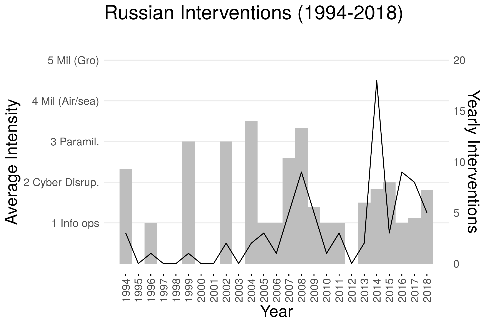
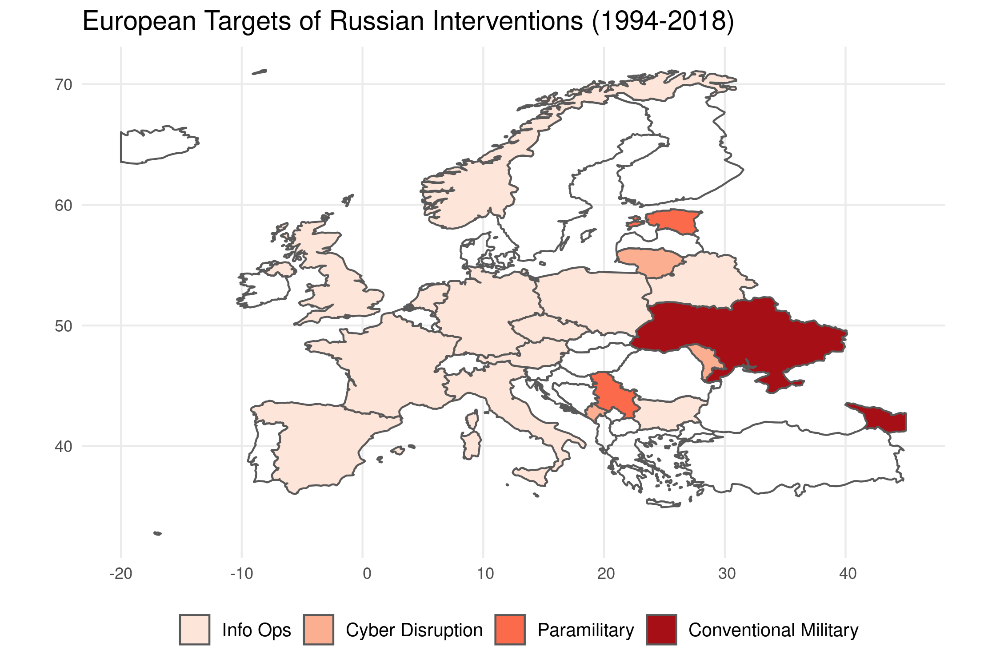

```{r knitr_options, echo = FALSE, warning = FALSE}
# added to indicate that the home holder is the repo folder
library(knitr)
library(magrittr)
library(ggplot2)
knitr::opts_chunk$set(echo = FALSE, warning = FALSE, error = FALSE, message = FALSE, fig.pos = "h!", out.extra = "")
```

```{r load data}
df_full <- readRDS(paste0(here::here(), '/data/grayzone_model.rds'))
```

```{r fixed polr function}
# Fix polr functions
# I use the polr function from the MASS package to compute an ordered probit. The base version of the function in the R package contains an error that does not take the log of differences in the reposed zetas which results in an optimization error where vmmin is infinite. A fixed version of the function was created and is loaded here. For this reason, the polr function is not loaded from the MASS package, but instead from the function below. All secondary functions from the MASS package are compatible with the output of the revised function.

# file MASS/R/polr.R
# copyright (C) 1994-2008 W. N. Venables and B. D. Ripley
# Use of transformed intercepts contributed by David Firth
#
#  This program is free software; you can redistribute it and/or modify
#  it under the terms of the GNU General Public License as published by
#  the Free Software Foundation; either version 2 or 3 of the License
#  (at your option).
#
#  This program is distributed in the hope that it will be useful,
#  but WITHOUT ANY WARRANTY; without even the implied warranty of
#  MERCHANTABILITY or FITNESS FOR A PARTICULAR PURPOSE.  See the
#  GNU General Public License for more details.
#
#  A copy of the GNU General Public License is available at
#  http://www.r-project.org/Licenses/
#
library(MASS)

polr <- function(formula, data, weights, start, ..., subset,
                 na.action, contrasts = NULL, Hess = FALSE,
                 model = TRUE,
                 method = c("logistic", "probit", "cloglog", "cauchit"))
{
    logit <- function(p) log(p/(1 - p))

    fmin <- function(beta) {
        theta <- beta[pc + 1L:q]
        gamm <- c(-Inf, cumsum(c(theta[1L], exp(theta[-1L]))), Inf)
        eta <- offset
        if (pc > 0)
            eta <- eta + drop(x %*% beta[1L:pc])
        pr <- pfun(gamm[y + 1] - eta) - pfun(gamm[y] - eta)
        if (all(pr > 0))
            -sum(wt * log(pr))
        else Inf
    }

    gmin <- function(beta)
    {
        jacobian <- function(theta) { ## dgamma by dtheta matrix
            k <- length(theta)
            etheta <- exp(theta)
            mat <- matrix(0 , k, k)
            mat[, 1] <- rep(1, k)
            for (i in 2:k) mat[i:k, i] <- etheta[i]
            mat
        }
        theta <- beta[pc + 1L:q]
        gamm <- c(-Inf, cumsum(c(theta[1L], exp(theta[-1L]))), Inf)
        eta <- offset
        if(pc > 0) eta <- eta + drop(x %*% beta[1L:pc])
        pr <- pfun(gamm[y+1] - eta) - pfun(gamm[y] - eta)
        p1 <- dfun(gamm[y+1] - eta)
        p2 <- dfun(gamm[y] - eta)
        g1 <- if(pc > 0) t(x) %*% (wt*(p1 - p2)/pr) else numeric(0)
        xx <- .polrY1*p1 - .polrY2*p2
        g2 <- - t(xx) %*% (wt/pr)
        g2 <- t(g2) %*% jacobian(theta)
        if(all(pr > 0)) c(g1, g2) else rep(NA, pc+q)
    }

    m <- match.call(expand.dots = FALSE)
    method <- match.arg(method)
    pfun <- switch(method, logistic = plogis, probit = pnorm,
                   cloglog = pgumbel, cauchit = pcauchy)
    dfun <- switch(method, logistic = dlogis, probit = dnorm,
                   cloglog = dgumbel, cauchit = dcauchy)
    if(is.matrix(eval.parent(m$data)))
        m$data <- as.data.frame(data)
    m$start <- m$Hess <- m$method <- m$model <- m$... <- NULL
    m[[1L]] <- as.name("model.frame")
    m <- eval.parent(m)
    Terms <- attr(m, "terms")
    x <- model.matrix(Terms, m, contrasts)
    xint <- match("(Intercept)", colnames(x), nomatch=0L)
    n <- nrow(x)
    pc <- ncol(x)
    cons <- attr(x, "contrasts") # will get dropped by subsetting
    if(xint > 0) {
        x <- x[, -xint, drop=FALSE]
        pc <- pc - 1
    } else warning("an intercept is needed and assumed")
    wt <- model.weights(m)
    if(!length(wt)) wt <- rep(1, n)
    offset <- model.offset(m)
    if(length(offset) <= 1) offset <- rep(0, n)
    y <- model.response(m)
    if(!is.factor(y)) stop("response must be a factor")
    lev <- levels(y)
    if(length(lev) <= 2) stop("response must have 3 or more levels")
    y <- unclass(y)
    q <- length(lev) - 1
    Y <- matrix(0, n, q)
    .polrY1 <- col(Y) == y
    .polrY2 <- col(Y) == y - 1
    if(missing(start)) {
      # try something that should always work -tjb
      u <- as.integer(table(y))
      u <- (cumsum(u)/sum(u))[1:q]
      zetas <-
         switch(method,
                "logistic"= qlogis(u),
                "probit"=   qnorm(u),
                "cauchit"=  qcauchy(u),
                "cloglog"=  -log(-log(u)) )
      s0 <- c(rep(0,pc),zetas[1],log(diff(zetas)))

##         # try logistic/probit regression on 'middle' cut
##         q1 <- length(lev) %/% 2
##         y1 <- (y > q1)
##         X <- cbind(Intercept = rep(1, n), x)
##         fit <-
##             switch(method,
##                    "logistic"= glm.fit(X, y1, wt, family = binomial(), offset = offset),
##                    "probit" = glm.fit(X, y1, wt, family = binomial("probit"), offset = offset),
##                    ## this is deliberate, a better starting point
##                    "cloglog" = glm.fit(X, y1, wt, family = binomial("probit"), offset = offset),
##                    "cauchit" = glm.fit(X, y1, wt, family = binomial("cauchit"), offset = offset))
##         if(!fit$converged)
##             stop("attempt to find suitable starting values failed")
##         coefs <- fit$coefficients
##         if(any(is.na(coefs))) {
##             warning("design appears to be rank-deficient, so dropping some coefs")
##             keep <- names(coefs)[!is.na(coefs)]
##             coefs <- coefs[keep]
##             x <- x[, keep[-1L], drop = FALSE]
##             pc <- ncol(x)
##           }
##         spacing <- logit((1L:q)/(q+1)) # just a guess
##         if(method != "logistic") spacing <- spacing/1.7
##         gammas <- -coefs[1L] + spacing - spacing[q1]
##         thetas <- c(gammas[1L], log(diff(gammas)))
##         s0 <- c(coefs[-1L], thetas)
    } else if(length(start) != pc + q)
	stop("'start' is not of the correct length")
    else {
        s0 <- if(pc > 0) c(start[seq_len(pc+1)], log(diff(start[-seq_len(pc)])))
        else c(start[1L], log(diff(start)))
      }
    res <- optim(s0, fmin, gmin, method="BFGS", hessian = Hess, ...)
    beta <- res$par[seq_len(pc)]
    theta <- res$par[pc + 1L:q]
    zeta <- cumsum(c(theta[1L],exp(theta[-1L])))
    deviance <- 2 * res$value
    niter <- c(f.evals=res$counts[1L], g.evals=res$counts[2L])
    names(zeta) <- paste(lev[-length(lev)], lev[-1L], sep="|")
    if(pc > 0) {
        names(beta) <- colnames(x)
        eta <- offset + drop(x %*% beta)
    } else eta <- offset + rep(0, n)

    cumpr <- matrix(pfun(matrix(zeta, n, q, byrow=TRUE) - eta), , q)
    fitted <- t(apply(cumpr, 1L, function(x) diff(c(0, x, 1))))
    dimnames(fitted) <- list(row.names(m), lev)
    fit <- list(coefficients = beta, zeta = zeta, deviance = deviance,
                fitted.values = fitted, lev = lev, terms = Terms,
                df.residual = sum(wt) - pc - q, edf = pc + q, n = sum(wt),
                nobs = sum(wt),
                call = match.call(), method = method,
		convergence = res$convergence, niter = niter, lp = eta)
    if(Hess) {
        dn <- c(names(beta), names(zeta))
        H <- res$hessian
        dimnames(H) <- list(dn, dn)
        fit$Hessian <- H
    }
    if(model) fit$model <- m
    fit$na.action <- attr(m, "na.action")
    fit$contrasts <- cons
    fit$xlevels <- .getXlevels(Terms, m)
    class(fit) <- "polr"
    fit
}
```

# Introduction
In the wake of the downfall of Ukrainian President Viktor Yanukovych in February 2014, the Crimean Peninsula was invaded by “little green men,” soldiers whose uniforms lacked insignia or other identifying information. The Kremlin formally annexed Crimea shortly thereafter. Protracted ground skirmishes, cyber campaigns, and "active measures" continue to plague Ukraine. Russia's intervention has emerged as a paradigmatic example of a technologically novel and politically efficient form of "hybrid warfare," designed to challenge the status quo without triggering broader conflict [@marten_putinchoicesexplaining_2015; @lanoszka_russianhybridwarfare_2016]. Similar tactics and imagery have emerged elsewhere, like Chinese "little blue men" eroding "red lines" in maritime East Asia [@green_counteringcoercionmaritime_2017]. According to former British Defense Secretary Michael @fallon_speechdeliveredsecretary_2017, "That is not a Cold War. It is a grey war. Permanently teetering on the edge of outright hostility. Persistently hovering around the threshold of what we would normally consider acts of war."

There is increasing concern that conventional conceptions of deterrence are inadequate to address burgeoning threats in the gray zone [@holmes_deterringchinagray_2017; @matisek_shadesgraydeterrence_2017; @hicks_othermeanspart_2019; @pettyjohn_competinggrayzone_2019]. Deterrence is typically believed to have failed if a challenger disrupts the status quo or resorts to military violence. Capable defenders, in turn, appear ill-equipped to respond to revisionism in the gray zone [@jackson_tacticsstrategiccompetition_2017]. As General @dunford_gendunfordremarks_2016, Chairman of the United States Joint Chiefs of Staff, commented, “Our traditional approach is either we’re at peace or at conflict. And I think that’s insufficient to deal with the actors that actually seek to advance their interests while avoiding our strengths.”

Rather than repudiating deterrence, however, gray zone challenges could actually reflect a certain respect for existing frameworks, both to avoid major war and preserve interests in common with status quo powers. The challenge of gray zone conflict may have more to do with how we think about deterrence, rather than how it is practiced. Deterrence not only shapes *whether* a challenge emerges but also *how*. Shaping other nations' behaviors could certainly prove valuable, even in the absence of peace and a full retention of the status quo. An enemy that engages "with one hand tied behind its back" to avoid triggering a larger contest is not fighting as effectively. Even if the challenger resorts to force and the defender does not intervene, fear of subsequent intervention by the defender could cause the challenger to adopt a more furtive (indecisive) military strategy.

The research on deterrence is vast and its theories heterogeneous [@huth_deterrenceinternationalconflict_1999; @freedman_deterrence_2004; @danilovic_deterrencecrisisbargaining_2010; @quackenbush_deterrencetheorywhere_2011]. Yet there is relatively little work on choices about the *means* of deterrence compared to the tremendous literature on political *ends* [@carcelli_diversificationdeterrencenew_2017]. We contribute to this emerging interest in the modality of deterrence across different "domains" by analyzing the drivers of different types of activity. We develop a formal model where a challenger and defender can select from variable intensities of limited conflict or choose to resolve the crisis with a decisive war. This model allows us to differentiate and assess two distinct causal logics for gray zone conflict, one driven by military innovation (i.e., reduced costs or more effective aggression) and the other by deterrence. We show that the challenger's choice varies with both the level of the deterrent threat posed by the defender (deterrence) and the challenger's ability to gray zone efforts at low cost (innovation).  We then test key results of the model, finding empirical evidence that the magnitude and risk of NATO intervention shapes recent Russian uses of force. We also find evidence that Russia moderates the intensity of its efforts in response to the implicit credibility of the West's deterrence posture along an East-West gradient. These outcomes suggest Russian gray zone activity is predicted by deterrence, rather than only the  logic of military innovation. 

In the sections that follow, we first locate gray zone conflict in the broader literature on limited war (Section 2). We then analyze limited conflict using a formal model to illustrate the trade-offs that states face in deciding to enter into gray zone conflict or to go to war (Sections 3-5). Next, we assess our argument empirically, using data on Russian aggression, with an emphasis on cyber-enabled operations (Section 6) typically highlighted as evidence for the efficiency logic of gray zone conflict. We then revisit the game theoretical results to discuss the implications of our findings for critical deterrence and defense trade-offs (Section 7). Section 8 concludes.

# Between Peace and War
Despite the analytical convenience offered by conceptualizing war and peace as discrete outcomes, there is nothing new about conflict that falls ambiguously between peace and war [@lebow_futurewar_2010]. There is a long history of, and a vast literature on, limited war [@kissinger_militarypolicydefense_1955; @osgood_reappraisallimitedwar_1969], salami slicing [@schelling_armsinfluence_1966], low-intensity conflict [@turbiville_prefacefuturetrends_2002], hybrid wars [@lanoszka_russianhybridwarfare_2016], frozen conflict [@driscoll_friendsthesebrinkmanship_2016], covert operations [@carson_secretwarscovert_2018; @orourke_covertregimechange_2018], and hassling [@schram_hasslinghowstates_2021].

Early Cold War writings on “weakening the enemy with pricks instead of blows” emphasized limited political objectives in the shadow of nuclear escalation [@hart_strategyindirectapproach_1954 186]. The Korean War seemed a then-underappreciated type of war fought to achieve political ends short of total victory with military means short of a total commitment [@osgood_reappraisallimitedwar_1969]. Contemporary treatments understood limited war as a conflict between actors that had the capacity to increase battlefield commitments but did not want to do so, creating a third option between major war and acquiescence [@brodie_morelimitedwar_1957; @kissinger_strategyorganization_1957]. Strategists introduced the "stability-instability paradox" to describe how disincentives for nuclear war, or even major conventional war, encourage conflict at lower levels of intensity, or in peripheral theaters [@jervis_illogicamericannuclear_1984; @sagan_spreadnuclearweapons_2003]. There is some threshold above which any given threat becomes too costly to be both credible and effective, and non-credibility invites challenges. As @snyder_balancepowerbalance_1965 [167] observes, nuclear weapons introduced a new uncertainty “concerning what types of military capability the opponent was likely to use and what degree of violence he was willing to risk or accept.” Similarly, @powell_nuclearbrinkmanshiplimited_2015 [598] notes that "how much power the challenger brings to bear limits how much risk the defender can generate." As @george_deterrenceforeignpolicy_1989 [173] explain, adversaries can "design around" deterrence by discovering new options that offer "an opportunity for gain while minimizing the risk of an unwanted response".

Yet, other wars are limited not by the risk of escalation, but rather by cost concerns. During the Cold War there were numerous decolonization struggles and proxy wars in the developing world. In these “low-intensity conflicts”, the immediate adversaries tended to be irregular guerrilla forces rather than peer competitors [@galula_counterinsurgencywarfaretheory_1964; @taber_warfleaclassic_1965]. An insurgent might give all, but still not be able to give much. Guerrillas with rudimentary arsenals simply could not directly engage powerful security forces, and thus opted for indirect ambush and subversion as a matter of necessity. After the Cold War, as great power competition waned and the United States became embroiled in occupations abroad, there was a revival of interest in questions of counterterrorism and counterinsurgency [@nagl_learningeatsoup_2005; @kilcullen_counterinsurgency_2010]. Yet a common theme involves the limited military capacity of at least one of the combatants. Asymmetric contests thus contrast starkly with a superpower opting to forego military effectiveness to control escalation. 

The renewal of interest in low-intensity conflict between more capable competitors represents a return to the earlier theme. A common thread in definitions of gray zone conflict is that it involves “a carefully planned campaign operating in the space between traditional diplomacy and overt military aggression” employed by challengers with grand geopolitical ambitions and potent capabilities [@mazarr_strugglegrayzone_2015].^[There is much ambiguity concerning how practitioners define and interpret gray zone conflict. See @bragg_integrationreportgray_2017 and @janicatova_ambiguityhybridwarfare_2021.] A number of practitioners and journalists highlight the worrying expansion of technologies by which low-intensity conflict can be practiced [@olson_americanotready_2015].

Scholars similarly note the technological novelty of this phenomenon as a form of aggression against which the US is unprepared [@hoffman_conflict21stcentury_2007; @thornton_changingnaturemodern_2015; @brands_paradoxesgrayzone_2016; @jackson_informationnotweapons_2016; @wirtz_lifegrayzone_2017; @hughes_wargreyzone_2020]. This pessimism concerning adversaries' ability to overthrow the existing military balance with "innovative doctrines or cunning strategies" [@goldstein_uschinanaval_2017, 906] has even led some to advocate revamping deterrence to focus on threats from the gray zone [@tor_cumulativedeterrencenew_2015; @matisek_shadesgraydeterrence_2017; @hicks_othermeanspart_2019].

Even sceptics of cyber warfare highlight the expanded repertoire of means available for low-intensity conflict, especially online espionage and disinformation [@rid_cyberwarpeace_2013; @jensen_fancybearsdigital_2019]. Russia, and its intervention in Ukraine in particular, is paradigmatic. Russia uses novel forms of “hybrid warfare” to facilitate increased aggression against NATO and the West [@marten_putinchoicesexplaining_2015; @lanoszka_russianhybridwarfare_2016]. If technological advances drive gray zone conflict, then we might expect to see Russia engaging in it as often as possible. Covert cyber campaigns are argued prevalent because "deterrence capabilities would be rendered useless" [@farmanfarmaian_strategiesethicshybrid_2021, 43]. The common refrain is that aggressors are working around defenders’ red lines to achieve coercive success without triggering escalation [@altman_advancingattackingstrategic_2018]. The policy prescription emerging from this conventional wisdom is that the United States---and other targets of gray zone aggression---must use more of the tools available at its disposable to re-assert deterrence and counter innovations in this unconventional battle space [@hicks_othermeanspart_2019; @mccarthy_deterringrussiagray_2019].

We wish to push back on this growing consensus that an expanded repertoire of potent tools for engaging in conflict short of war means that gray zone conflict represents the new modal form of conflict. Indeed, militaries have been innovating novel technologies in *all* domains of warfare, at *all* levels of intensity. Many of the sharpest arrows remain in the quiver in most conflicts. Thus the choice to use only some of these innovations, but not others, really represents a restriction, rather than an expansion, of the total means available. This shift in perspective, viewing gray zone conflict as a relative reduction rather than an absolute expansion of options, calls into question claims about its effectiveness, and even its novelty, below the threshold of war. On the contrary, the familiar logic of the stability-instability paradox may be playing out today at different, and usually lower, thresholds [@lindsay_coercioncyberspacestabilityinstability_2018]. In its classic formulation, nuclear deterrence paradoxically encourages limited conventional war in peripheral regions where nuclear escalation is not credible. Today, the prospect of costly conventional war encourages provocation in cyberspace. The bad news about persistent conflict may thus be good news about restraint. 

In the last decade of the Cold War, US Secretary of State George @shultz_lowintensitywarfarechallenge_1986, 204 offered a note of cautious optimism in this regard:
    
> The ironic fact is, these new and elusive challenges have proliferated, in part, because of our success in deterring nuclear and conventional war. Our adversaries know they cannot prevail against us in either type of war. So they have done the logical thing: they have turned to other methods. Low-intensity warfare is their answer to our conventional and nuclear strength a flanking maneuver, in military terms.
    
Below we develop Shultz's insight to explore whether modern gray zone conflict should be viewed as similarly reassuring or newly alarming. 

# Theoretical Intuition
The Euromaidan Revolution presented Russia with a new political reality: Kiev was abruptly realigning with the West. Almost as quickly, Russia set about altering this new "status quo."^[The notion of "status quo" is inherently contextual, and thus subject to perspective and interpretation. Here, we treat the status quo as whatever political conditions prevail at a given point in time, regardless of past changes.] Russia's actions in Ukraine were limited and, because Russia stands to benefit from continued access to Crimea and from instability in Ukraine, politically advantageous. We refer to this behavior as conducting "limited challenges," implicitly to the status quo. In response to Russian activity, NATO increased its presence in the Black Sea, reinforced its support for capacity-building in Ukraine, and has stepped up its presence and cooperation in other countries in Eastern Europe. This has helped Ukraine in countering the Russian-sponsored separatist movement in the East of the country.

The model captures these strategic dynamics. In the model, a challenger and a defender, experience a crisis. First, the challenger decides whether to accept the status quo and do nothing, conduct limited challenges, or escalate to war. If the challenger conducts a limited challenge, then the defender has an opportunity to respond with acceptance, escalation to war, or countering the challenge with the defender's own limited conflict. When the challenger engages in limited activity and the defender responds with a limited response (rather than accepting or going to war), we will say that the states are engaged in a gray zone conflict. Thus, gray zone conflict occurs when militarily capable challengers intentionally limit the intensity and capacity with which they conduct military operations, and the defender engages but chooses not to escalate to a decisive war. Narrowing the scope of gray zone conflict to militarily capable actors distinguishes the phenomenon from wars limited by means.^[Many gray zone challenges involve a capable foreign patron and a limited capability proxy force [@plana_proxywarleast_2020]. Admittedly, reliance on proxies can complicate the deterrence calculus by obscuring attribution [@danilovic_sourcesthreatcredibility_2001]. For analytical parsimony, we consider a target's allies as part of the targets capabilities, discounted by the level of commitment (or disunity) in an alliance [@quackenbush_notonlywhether_2006; @sobek_memyselfallies_2013].] Our definition means that gray zone conflict must be preferred by both sides in a contest. Both actors have the capacity to escalate to a larger war but prefer not to, meaning that gray zone conflict is an equilibrium [@carson_facingsavingface_2016; @carson_secretwarscovert_2018]. This treatment allows us to formally examine the phenomena and take hypotheses to data. 
 
Our model highlights the trade-offs confronting actors when choosing varying degrees of force. An actor may forgo the most effective or decisive means when they are too costly, they are insufficiently committed, or some other more appealing alternative exists. While war can accomplish an aggressor’s goals, it could also be unnecessary and inefficient if partial victories or *faits accomplis* can be achieved at lower cost [@altman_advancingattackingstrategic_2018]. By considering these trade-offs, our model offers insight into two central questions. First, why do states engage in gray zone conflict and, once they do, what explains variation in the intensity with which they pursue it? Second, when a defender faces the prospect of limited challenges, when does restraint benefit the defender?

Why do states engage in gray zone conflict? Challengers that attempt to alter the status quo through limited challenges must decide how aggressive to be. A more intensive challenge can yield greater political gains. But the challenger faces two possible constraints into selecting limited challenges: an *external deterrent constraint*, and an *internal efficiency constraint*. If the *external deterrent constraint* binds, the challenger is resolved, but will limit the level of force to attempt to avoid a greater war. Thus, when the deterrent constraint binds, the challenger is most reactive to the defender's willingness to go to war. Alternatively, if the *internal efficiency constraint* binds, the challenger selects relatively low levels of force based on its own internal cost-benefit calculations. With the internal constraint, the challenger is most sensitive to its own valuation of the stakes versus the costs of challenging the status quo.

The theoretical distinction here is empirically consequential. Contrary to conventional wisdom,^[See @tor_cumulativedeterrencenew_2015, @brands_paradoxesgrayzone_2016, @goldstein_uschinanaval_2017 and many others cited earlier.] we show that gray zone conflict is not the product of a newly expansive and potent military repertoire. Rather, it results from one of two distinct constraints on the military force a state can employ. When the challenger's internal efficiency constraint binds, the challenger freely chooses the scope and intensity of conflict that it believes is most efficient for accomplishing its objective. Here the challenger can pursue the optimal challenge without concern of provoking an escalation. When the challenger's external deterrent constraint binds, by contrast, the challenger must scale back from its optimal low-level challenge in order to avoid triggering a larger contest with the defender. In the latter case, the defender's willingness to go to war constrains the challenger to select from a set of less effective gray zone options. A key empirical implication is that the intensity of gray zone conflict limited by deterrence should vary inversely with the credibility of the defender's deterrent posture, where the defender is more willing to absorb the costs of war. We label this moderating effect the defender's "deterrence gradient," encouraging greater provocations in areas where the defender is less resolved but more limited efforts where it is more so. 

When is a restrained ability to counter gray zone conflict opportunistic? Within the game, we will assume that the defender incurs "gray zone costs" to countering limited challenges. A defender with low gray zone costs is very effective at engaging threats in the gray zone; thus, the defender having lower gray zone costs makes gray zone conflict less efficient for the challenger, which can encourage the challenger to pursue options outside of gray zone conflict. This can produce mixed results for the defender state. On one hand, lower gray zone costs for the defender could be productive for the defender if, upon the challenger's low-level activity becoming ineffective, the challenger abandons the use of force altogether and accepts the status quo. On the other hand, lower gray zone costs for the defender could be counterproductive for the defender if, upon the challenger's low-level activity becoming ineffective, the challenger instead escalates to war. Ultimately, the challenger's response to changes in the defender's costs and ability to conduct gray zone conflict will be arbitrated by whether the challenger prefers war to the status quo (or vice-versa), which is a function of the resolve of the challenger.

The model integrates some features from the formal literature on endogenous power shifts and deterrence [@fearon_signalingforeignpolicy_1997; @schultz_enforcementproblemcoercive_2010; @debs_knownunknownspower_2014; @gurantz_fearappeasementeffectiveness_2017; @baliga_deterrenceimperfectattribution_2020], specifically, a back-and-forth set of decisions between a challenger and a defender who select some form of conflict and then escalate (or not). While this paper makes simplifying assumptions regarding private information and hidden actions, it extends existing research by considering two competing actors, each with a continuum of policy options outside of declaring war or accepting peace. Far from just a technical flourish, this is critical for our results concerning the efficacy of a restrained ability to counter gray zone conflict. The model is thus most similar to those where politicians have flexible responses rather than just war or peace [@zagare_deterrencetheoryspiral_1998; @schultz_enforcementproblemcoercive_2010; @slantchev_militarythreatscosts_2011; @powell_nuclearbrinkmanshiplimited_2015; @mccormack_sanctionspreventivewar_2017; @coe_containingroguestheory_2018; @spaniel_bargainingbombsuccesses_2019; @joseph_littlebitcheaptalk_2021; @schram_hasslinghowstates_2021], but is still unique in that it allows both states to select from a continuum of low-level options. Essentially, we push the decision-theoretic strands of classical deterrence theory towards embracing a broader repertoire of possible actions [@zagare_classicaldeterrencetheory_1996; @huth_deterrenceinternationalconflict_1999].

# Model and Equilibrium
## Game Form
Two states, a challenger C and defender D, are in a crisis over a divisible asset with a normalized value of $1$. At the onset, the states are presented with a ``status quo'' policy, and then they decide whether and how to escalate. As an intuition, the Euromaidan protests and overthrow of Yanukovych presented Russia with a new political reality, which can be thought of as the status quo policy in this model. Alternatively, the status quo policy could be viewed as an offered policy that arose through a bargaining process where a bargaining failure may have occurred.^[We do not wish to discount how bargaining theory has revolutionized scholarship on conflict [@fearon_rationalistexplanationswar_1995; @wagner_bargainingwar_2000; @filson_bargainingmodelwar_2002; @smith_bargainingnaturewar_2004; @powell_warcommitmentproblem_2006; @fey_uncertaintyincentivescrisis_2011; @ramsay_informationuncertaintywar_2017; @spaniel_bargainingbombsuccesses_2019]. While bargaining is relevant to the conflict process, we make our main point using a simpler model. In the appendix we offer a microfoundation for a (potential) bargaining failure by analyzing a model with information asymmetry and an endogenous ultimatum offer. The results and comparative statics are similar.]

C moves first.^[An alternate game structure---where C and D simultaneously select a level of gray zone force and either actor can unilaterally initiate a war--- yields an identical equilibrium. By virtue of the selected gray zone cost structures, there is no crowding-out like one could expect in a von Stackelberg duopoly game. If we assumed decreasing marginal costs to gray zone conflict over some set of possible gray zone challenges, the sequence of moves could matter and crowding out could occur.] C either goes to war by setting $w_{C}=1$, or sets $w_{C}=0$. If C goes to war, the game terminates. If C sets $w_{C}=0$, C also selects $g_{C}\in\mathcal{G}_{C}=\mathbb{R}_{\geq0}$, where $g_{C}=0$ is walking away from the crisis and accepting the status quo, and $g_{C}>0$ is conducting some limited, costly military action that shifts the political status quo in favor of the challenger. Second, as long as C did not previously go to war, D can either escalate to war by setting $w_{D}=1$, or not by setting $w_{D}=0$ and selecting some gray zone response $g_{D}\in\mathcal{G}_{D}=\mathbb{R}_{\geq0}$, with $g_{D}=0$ implying that D does not respond to the limited challenge. When D selects a gray zone response $g_{D}>0$, D is using its own costly military means to weaken the impact of C's limited challenge. After the challenger acts and the defender responds, the game terminates, and payoffs are realized. For convenience, payoffs are summarized in Table \ref{table:payoffs}.

If C goes to war at the outset (setting $w_{C}=1$), C and D receive expected payoffs of $U_{C}=\theta\rho_{W}-\kappa_{C}$ and $U_{D}=1-\rho_{W}-\kappa_{D}$, respectively. These payoffs are largely consistent with the treatment of war as a costly lottery [@fearon_rationalistexplanationswar_1995; @fearon_signalingforeignpolicy_1997]. $\kappa_{C}>0$ and $\kappa_{D}>0$ are C's and D's costs from war. $\rho_{W}\in[0,1]$ is C's likelihood of winning in a war. The $\theta>0$ term represents C's ``resolve,'' or how much C cares about the asset in dispute.

If C sets $w_{C}=0$ and $g_{C}=0$, and D sets $w_{D}=0$ and $g_{D}=0$, this is equivalent to both states accepting the status quo $\rho_{0}\in[0,1]$, and C and D receive payoffs $U_{C}=\theta\rho_{0}$ and $U_{D}=1-\rho_{0}$. We assume that $\rho_{0}<\rho_{W}$, which implies that C is potentially dissatisfied with the status quo, and for a great enough resolve ($\theta$), or low enough costs of war ($\kappa_{C}$), C will choose to go to war.  

Now consider all outcomes where war does not occur (including the status quo), which is when C sets $w_{C}=0$ and $g_{C}\geq0$, and D sets $w_{D}=0$ and $g_{D}\geq0$. Here C and D receive payoffs $U_{C}=\theta P(g_{C},g_{D})-\beta_{C}g_{C}^{2}$ and $U_{D}=1-P(g_{C},g_{D})-\beta_{D}g_{D}^{2}$. The function $P$ represents the political outcome of gray zone conflict, and we assume functional form $P(g_{C},g_{D})=max\{min\left\{ \rho_W,\rho_{0}+g_{C}-g_{D}\right\} ,\rho_{0}\}$. This functional form implies that $P$ is weakly increasing in $g_{C}$ and $-g_{D}$, and that $P$ falls between $\rho_{0}$ and $\rho_W$ inclusive. When $g_{C}=0$ and $g_{D}=0$, actors receive their status quo payoffs. By challenging the status quo ($g_{C}>0$), C is shifting the status quo in its favor, but this can be dampened by D's selection of a gray zone response (when $g_{D}>0$). That the final political settlement $P(g_{C},g_{D})$ must be weakly greater than the status quo $\rho_{0}$ and weakly less than $\rho_W$ captures that gray zone challenges are limited; we are assuming that gray zone conflict cannot push C's final share of the asset to a level below what C is expected to attain from the status quo or above what C is expected to attain from war.^[Challengers often do worse in wars than the status quo, but adverse outcomes are much less likely with a limited disputes. In part, this is a rationale for our assumption that gray zone contests are less costly than major war.] How C internalizes the final political outcome will depend on C's resolve, hence C's utility function having the $\theta P(g_{C},g_{D})$ term. Gray zone conflict is also costly to both actors. C pays costs $-\beta_{C}g_{C}^{2}$ for challenging and D pays $-\beta_{D}g_{D}^{2}$ for its gray zone conflict response, with $\beta_{C}>0$ and $\beta_{D}>0$.^[We assume a simple quadratic loss function rather than an unspecified loss function to allow for explicit solutions throughout.] When $\beta_{D}$ ($\beta_{C}$) is high, then D's (C's) costs of gray zone conflict are greater. That each actor has their own gray zone conflict cost functions distinct from their costs of war is consistent with C's gray zone challenge being a limited action that relies on its own set of technologies rather than just a kind of lesser-war.^[We do not model gray zone conflict and war as part of one continuous form of conflict. The continuous-conflict-choice approach would be appropriate if gray zone conflict looked just like war, only a lesser degree of war. Yet gray zone conflict and war generally rely on different technologies. For example, gray zone operations often emphasize supporting third-party militants or conducting limited cyberattacks; war, on the other hand, utilizes conventional forces [@mazarr_masteringgrayzone_2015; @matisek_shadesgraydeterrence_2017; @wirtz_lifegrayzone_2017].]
 
Finally, when D initiates war after C engages in limited challenges (formally when $w_{C}=0$, $g_{C}\geq0$, and $w_{D}=1$), C and D receive payoffs $U_{C}=\theta\rho_{W}-\kappa_{C}-\beta_{C}g_{C}^{2}$ and $U_{D}=1-\rho_{W}-\kappa_{D}$. Note that here C pays the costs of war as well as the costs of the limited challenge. Practically speaking, what is conducted for the purposes of gray zone conflict is different than what is conducted in a war, which makes the effort undertaken during gray zone conflict produce additional costs. Formally, these results would not change so long that a nonzero proportion of the costs of C's limited challenge carry through.^[If C does not pay for gray zone investments when a war occurs, then a challenger that prefers war to their tolerated-by-D gray zone challenges may select a gray zone challenge that deliberately provokes D to initiate a war. This does not change the substance of the results, but it does introduce a new equilibrium.]

  \begin{singlespace}
  \begin{table}[H]
  \begin{tabular}{|c|c|c|}
  \hline 
  \textbf{Scenario} & \textbf{C's utility} & \textbf{D's utility}\tabularnewline
  \hline 
  \hline 
  \textit{C initially initiates war }  &  & \tabularnewline {($w_{C}=0$)}  & $\theta\rho_{W}-\kappa_{C}$  & $1-\rho_{W}-\kappa_{D}$ \tabularnewline
  \hline 
  \hline 
  \textit{C and D select gray zone/accept status} \textit{quo} &  & \tabularnewline ($w_{C}=0,\,g_{C}\geq0,\,w_{D}=0,\,g_{D}\geq0$)\textit{ } & $\theta P(g_{C},g_{D})-\beta_{C}g_{C}^{2}$ & $1-P(g_{C},g_{D})-\beta_{D}g_{D}^{2}$\tabularnewline
  \hline 
  \hline 
  \textit{D escalates to war after C acts} &  & \tabularnewline {($w_{C}=0,\,g_{C}\geq0,\,w_{D}=1$)}  & $\theta\rho_{W}-\kappa_{C}-\beta_{C}g_{C}^{2}$ & $1-\rho_{W}-\kappa_{D}$\tabularnewline
  \hline 
  \end{tabular}\\
  \caption{Summarized payoffs for actors}
  \label{table:payoffs}
  \end{table}
  \end{singlespace}

The model above is designed to simply illustrate how gray zone conflict plays out, conditional on intuitive cost and benefit parameters. In the Appendix, we consider three extensions. First, we examine an extension where $\beta_{D}$ is endogenous. The new model offers little insight beyond what is discussed in Section 7. Second, we include a model where limited challenges can probabilistically escalate. While this modification makes gray zone conflict less desirable to the challenger and generates new equilibrium conditions, the results are substantively identical. Third, we also include a model where the defender select the ``status quo'' policy as a bargained offer, and the defender has a private type. This third extension demonstrates that under a fairly standard micro-foundation, a rational D could make an offer to C where C responds to the offer as a potentially dissatisfied state. The key relationships identified in the primary model--- internal efficiency and external deterrent constraints as key drivers of gray zone conflict outcomes---also exists in the third extension.

## Equilibrium Concepts and Assumptions
We limit our attention to pure strategy subgame perfect Nash equilibria.^[The focus on pure strategies eliminates edge cases where one player is indifferent over two actions and mixes.] We use asterisks to denote equilibrium behavior, for example: $g_{C}^{*}$ and $g_{D}^{*}$.

We make one technical simplifying assumption, which we discuss formally in the Appendix. We limit analysis below to scenarios where, conditional on gray zone conflict occurring ($g_{C}^{*}\geq 0$ and $g_{D}^{*}\geq 0$, with at least one inequality holding strictly), the optimal limited challenge and response are such that the constraints on $P$ do not bind (i.e. the final realized $P$ is strictly less than $\rho_W$ and strictly greater than $\rho_{0}$). This assumption eliminates the possibility that kinks in the $P$ function drive our results and it prevents excessive casework.

## Equilibria
The challenger decides whether the game ends with peace, war, or gray zone conflict. C's decision can be expressed in terms of C's resolve, or $\theta$. When C has low resolve, C will accept the status quo. When C has high resolve, C will select into war. When C's resolve falls between the two, assuming gray zone conflict is cost-effective enough, C will conduct limited challenges.

There is nuance in how C conducts gray zone conflict. To illustrate this, consider a hypothetical setting where C can select any intensity of limited challenge, and D will respond with gray zone conflict. In this hypothetical, C faces an internal optimization, selecting a limited challenge based on its resolve over the issue and its costs for conducting limited challenges---essentially where marginal returns are equal to marginal costs. This limited challenge level based on C's internal cost-benefit analysis is determined by the challenger's *internal efficiency* constraints. Of course, in order not to select a limited challenge that would cause the defender to escalate to war, C's limited challenge is also bound by the defender's *external deterrent threat* constraint. When C's optimal limited challenge is less aggressive than a challenge that would provoke D to escalate, we say that C's internal efficiency binds. Otherwise, C will select a limited challenge tailored to make D refrain from war, and the deterrent threat binds. Which constraint binds is arbitrated by a technical condition---if \textit{$\frac{\theta}{2\beta_{C}}\geq\rho_{W}-\rho_{0}+\kappa_{D}+\frac{1}{4\beta_{D}}$}, or not.
    
\textbf{\textit{Proposition 1:}}\textit{ In equilibrium, the game will play out in the following manner.}
    
\textit{Case 1, D's Deterrent Threat Binds, $\frac{\theta}{2\beta_{C}}\geq\rho_{W}-\rho_{0}+\kappa_{D}+\frac{1}{4\beta_{D}}$:} 
  \begin{itemize}
  \item \textit{1.A. C accepts the status quo ( $w_{C}^{*}=0$ and $g_{C}^{*}=0$)
    if $\theta\leq\frac{\beta_{C}\left(\rho_{W}-\rho_{0}+\kappa_{D}+\frac{1}{4\beta_{D}}\right)^{2}}{\left(\rho_{W}-\rho_{0}+\kappa_{D}-\frac{1}{4\beta_{D}}\right)}$ and $\theta\leq\frac{\kappa_{C}}{\rho_{W}-\rho_{0}}$.} 
  \item \textit{1.B. C initially initiates war ($w_{C}^{*}=1$) if $\theta>\frac{\kappa_{C}-\beta_{C}\left(\rho_{W}-\rho_{0}+\kappa_{D}+\frac{1}{4\beta_{D}}\right)^{2}}{\frac{1}{4\beta_{D}}-\kappa_{D}}$ and $\theta>\frac{\kappa_{C}}{\rho_{W}-\rho_{0}}$.} 
  \item \textit{1.C. C selects into gray zone conflict and is constrained by D's deterrent threat ($w_{C}^{*}=0$ and $g_{C}^{*}=\rho_{W}-\rho_{0}+\kappa_{D}+\frac{1}{4\beta_{D}}$) otherwise.} 
  \end{itemize}
\textit{Case 2, C's Internal Efficiency Binds, $\frac{\theta}{2\beta_{C}}<\rho_{W}-\rho_{0}+\kappa_{D}+\frac{1}{4\beta_{D}}$:} 
  \begin{itemize}
  \item \textit{2.A. C accepts the status quo ($w_{C}^{*}=0$ and $g_{C}^{*}=0$) if $\theta\leq\frac{2\beta_{C}}{\beta_{D}}$ and $\theta\leq\frac{\kappa_{C}}{\rho_{W}-\rho_{0}}$}. 
    \item \textit{2.B. C initially initiates war ($w_{C}^{*}=1$) if $\theta>\frac{\kappa_{C}}{\rho_{W}-\rho_{0}-\frac{\theta}{4\beta_{C}}+\frac{1}{2\beta_{D}}}$ and $\theta>\frac{\kappa_{C}}{\rho_{W}-\rho_{0}}$.} 
    \item \textit{2.C. C selects into gray zone conflict and is not constrained
    by D's deterrent threat ($w_{C}^{*}=0$ and $g_{C}^{*}=\frac{\theta}{2\beta_{C}}$)
    otherwise.} 
  \end{itemize}
\textit{Proof: See Appendix.}
    
We discuss Proposition 1 in two parts. In Section 5, we discuss what drives variation in gray zone activity. Then, in Section 7, we discuss why defenders may not always want to be effective at countering a challenger's gray zone activity.

# What Drives Variation in Gray Zone Activity?
## On the Defender's Deterrent Threat and Conflict Intensity
As the defender becomes more willing to go to war ($\kappa_{D}$ decrease), the challenger selects a weakly less aggressive limited challenges ($g_{C}^{*}$) or avoids gray zone conflict altogether. For example, if NATO leaders are more willing to escalate to war over NATO's core states relative to its periphery states or non-members, then the model expects less aggressive gray zone action on Russia's part against core states. The defender's willingness to go to war thus creates an upper bound on the tolerated level of limited challenges. If the defender becomes more willing to go to war, the challenger must either scale back the intensity of their limited challenge in order to avoid war, or the challenger must forgo limited challenges and instead either accept the status quo or go to war. If the defender's deterrent threat becomes less credible, the challenger has more freedom to choose whatever amount of force is needed to get the job done as the challenger sees fit.

\textbf{\textit{Observation 1}}\textit{: If the defender becomes more willing to go to war (lower $\kappa_{D}$'s), then the challenger selects weakly less intense limited challenges, or the challenger may no longer engage in limited challenges and instead accepts the status quo or goes to war.}

We provide a formal discussion of Observation 1 in the context of Proposition 1 in the Appendix. Figure \ref{fig:optimaldetdecrease} illustrates Observation 1. On the x-axis, moving left-to-right, D's deterrent threat from war is decreasing, as operationalized in D's costs of war $\kappa_{D}$ increasing. On the y-axis, moving low-to-high, C's equilibrium challenge $g_{C}^{*}$ is increasing. For the lowest costs of war---the region where the equilibrium is described in Case 1.A in Proposition 1---D is very willing to go to war, C is tightly constrained by D's external deterrent threat, and therefore gray zone conflict is not particularly productive for C. Under these parameters, C will select into the status quo.^[If $\kappa_{C} \leq 0.41$, C prefers going to war in this region rather than selecting the status quo.]

 \begin{figure}[h]
    \centering
        {\includegraphics{./figures/obs_1_figure.jpg}}
        \caption{Optimal Limited Challenge as D's Deterrent Threat Decreases. C's selected limited challenge intensity under a range of $\kappa_D$'s are plotted. We define $\underline{\kappa_{D}}$ implicitly as the value of D's war costs that satisfies $\theta=\frac{\beta_{C}\left(\rho_{W}-\rho_{0}+\underline{\kappa_{D}}+\frac{1}{4\beta_{D}}\right)^{2}}{\left(\rho_{W}-\rho_{0}+\underline{\kappa_{D}}-\frac{1}{4\beta_{D}}\right)}$. All equilibrium cases are described in Proposition 1. 
        %The x-axis endpoints are $\kappa_D=0.01$ and $\kappa_D=0.22$. 
        The parameters are $\rho_0=0.1$, $\rho_W=0.7$, $\beta_C=0.34$, $\kappa_{C}=0.5$, $\beta_D=1$, and $\theta=0.69$. Values of $\kappa_D$ fall between $0.01$ and $0.24$. Y-axis not drawn to scale.}
    \label{fig:optimaldetdecrease}
    \end{figure}

Moving to the right---to Case 1.C.---because D is less willing to go to war, C can engage in enough limited challenges to make gray zone conflict worthwhile. Here the intensity of C's limited challenge is constrained by D's deterrent threat, so C can select more aggressive limited challenges as D's deterrent threat decreases.

In Case 2.C, because D's deterrent threat has sufficiently declined, D is willing to tolerate aggressive limited challenges without escalating to war. Here, D's deterrent threat no longer binds, and instead C's limited challenge is constrained only by C's internal efficiency constraint.

Altogether, Figure \ref{fig:optimaldetdecrease} illustrates a natural intuition. As D's deterrent threat from war decreases, C can select more aggressive limited challenges without provoking D to war. This expands the possible set of limited challenges that will not trigger an escalation, thus resulting in a greater intensity of gray zone conflict, until C no longer finds more gray zone conflict worthwhile.

## On the Challenger's Resolve and Conflict Intensity
As the challenger becomes more resolved ($\theta$ increases), the challenger's chosen level of limited challenge ($g_{C}^{*}$) weakly increases, unless its resolve is so high that it forgoes gray zone conflict and resorts to war. For example, during the Syrian Civil War, while both Moscow and the Syrian Ba'athist party clearly preferred retaining Bashar al-Assad's power, the Ba'athist party was presumably more resolved and fought harder than Russia.

Consider a setting where the challenger selects a limited challenge based on their internal efficiency constraint. As the challenger's resolve increases, the challenger benefits more from shifting the status quo and is willing to select more aggressive limited challenges. However, a highly resolved challenger could be willing to select a limited challenge intensity that exceeds the defender's tolerance within gray zone conflict. For these high levels of resolve, the challenger must either choose a non-internally-optimal intensity of its limited challenges to keep the defender from going to war---reflecting the external constraint of the defender's deterrent threat---or accept escalation to war.

\textbf{\textit{Observation 2:}}\textit{ As the challenger's resolve increases, the challenger selects weakly more intense limited challenges, or may forgo gray zone conflict for war.}

Observation 2 follows naturally from Proposition 1 and is illustrated in Figure \ref{fig:optimalresolveincrease}. Moving from left-to-right, C's resolve $\theta$ is increasing. For the lowest resolve considered---equilibrium Case 2.A.---C does not benefit sufficiently from altering the status quo and prefers to make due with the status quo.

  \begin{figure}[h]
      \centering
        {\includegraphics{./figures/obs_2_figure.jpg}}
        \caption{Optimal limited challenge as C's Resolve Increases. C's selected limited challenge intensity under a range of $\theta$'s are plotted. We define $\underline{\theta}=\frac{2\beta_{C}}{\beta_{D}}$. ``DTB'' is an abbreviation for ``Deterrent Threat Binds.'' All equilibrium cases are described in Proposition 1. The parameters are $\rho_0=0.1$, $\rho_W=0.8$, $\beta_C=0.495$, $\kappa_{C}=0.75$, $\beta_D=1$, and $\kappa_D=0.15$. Values of $\theta$ fall between $0.8$ and $1.8$ To simplify labeling, axes are not drawn to scale. We illustrate C selecting $w_{A}^{*}=1$ as C selecting $g_{C}^{*}=0.$}
    \label{fig:optimalresolveincrease}
    \end{figure}

Moving to the right, in Case 2.C, because C is more resolved to alter the status quo, C does best by engaging in limited challenges. Here C's internal efficiency constraint binds, meaning C's selected limited challenge is increasing in C's resolve. In Case 1.C, C's resolve is even higher, but D's deterrent threat binds. C is resolved enough to engage in aggressive limited challenges beyond what D would tolerate (a level that would provoke D to escalate to war),^[C's willingness to challenge grows along the trend line from the Case 2.C.] but C is not resolved enough to go to war. As a result, C selects a level of limited challenge bound by D's indifference threshold between war and gray zone conflict, which is unchanging in C's resolve. Finally, in Case 1.B, C's resolve has increased to the point where the level of limited challenges within gray zone conflict tolerated by D is not productive enough for C, and C optimally goes to war.

## On the Challenger's Gray Zone Costs and Conflict Intensity
As the challenger's costs from gray zone conflict decrease ($\beta_{C}$ decreases), the challenger will select weakly more aggressive limited challenges ($g_{C}^{*}$). When the internal efficiency constraint binds, the challenger's selection of their limited challenges will increase as their costs decrease. When the external deterrent threat binds, the challenger's selection of their limited challenge does not vary with their costs, but rather is dictated by the defender's willingness to go to war, which is static.

\textbf{\textit{Observation 3:}}\textit{ As C's gray zone costs decrease, C selects weakly more intense limited challenges, and may forgo accepting the status quo or war for gray zone conflict.}
 
Figure \ref{fig:optimalcostvary} illustrates one example of Observation 3. Given the self-evident nature of this finding, we do not discuss these conditions at length.

   \begin{figure}[h]
        \centering
        {\includegraphics[width=6.5in]{./figures/obs_3_figure.jpg}}
        \caption{Optimal limited challenge as C's costs of limited challenges vary. C's selected limited challenge intensity under a range of $\beta_C$'s are plotted. We define $\underline{\beta_C}$ as $\frac{\theta}{2\underline{\beta_{C}}}=\rho_{W}-\rho_{0}+\kappa_{D}+\frac{1}{4\beta_{D}}$. All equilibrium cases are described in Proposition 1. The parameters are are $\rho_0=0.1$, $\rho_W=0.8$, $\kappa_D=0.15$, $\kappa_{C}=0.2$, $\beta_D=0.8$, and $\theta=0.2$. Values of $\beta_C$ fall between $0.091$ and $0.13$. To simplify labeling, y-axis not drawn to scale.}
    \label{fig:optimalcostvary}
    \end{figure}

# Empirical Application: Russian Efforts in the Gray Zone
We empirically assess our argument by analyzing data on the scope and intensity of Russian foreign interventions over the past two decades. Quantitative analysis supports the hypothesis discussed in Observation 1: that Russia chooses its level of provocation in response to NATO's implicit deterrent threat. Analysis also supports Observations 2 and 3: that Russian activity is inversely associated with decreased resolve and increased costs, as approximated by a  geographical ``loss of strength gradient'' [@posen_commandcommonsmilitary_2003].

We focus on Russia because its interventions are extensively referenced as paradigmatic examples of gray zone conflict [@marten_putinchoicesexplaining_2015; @driscoll_friendsthesebrinkmanship_2016; @jasper_russiancyberoperations_2020]. From 1994 to 2018, Russia has been involved in election interference in the United Kingdom and Moldova, cyberattacks in Estonia and Georgia, and special operations in Ukraine and Yugoslavia. Russia's military adventures are the "most likely" cases for the argument that gray zone conflict is an effective and low-cost innovation for revising the status quo. The diversity of Russian targets and means employed provides an opportunity to conduct a controlled comparison of Russian choices under different deterrent circumstances. We present a simple statistical analysis to test the implications of the model on Russian decision making while controlling for a number of relevant factors. By no means is this analysis causal, as our key independent variables---NATO membership, for example---are not exogenous treatments. Our results should be viewed as suggestive and taken with the necessary caveats. We then undertake a brief qualitative analysis of three cases: Estonia, Ukraine, and Georgia. We find that the possibility of a NATO intervention is associated with more limited gray zone operations, suggesting that Russian gray zone behavior occurs not despite NATO's deterrent threat, but because of it.

## Data
Admittedly, data on any gray zone interventions are themselves ambiguous. Most quantitative studies of gray zone operations focus on a particular type, like cyber in the case of the Dyadic Cyber Incident and Dispute (DCID) data or electoral interference in the case of the Russian Electoral Interventions (REI) data [@valeriano_dynamicscyberconflict_2014; @casey_russianelectoralinterventions_2017]. Consequently, they cover almost entirely distinct samples with significant differences concerning the severity of Russian attacks.^[Indeed, the only country-year that appears in both datasets is Ukraine 2014.]

To address these discrepancies, we construct a new, expanded dataset of 82 cases of Russian intervention from 1994 to 2018. DCID and REI together describe 71 unique cases of Russian aggression that have either included some degree of cyber intervention or were cases of electoral interference. We identify 10 additional instances of Russian cyberattacks in the coding period that are not listed in previous datasets. Most of these new cases involve cyber conflict after 2011 (the latest year in DCID) that were non-electoral (the universe of cases in REI). We also include the 3 cases of non-cyber Russian action from the International Crisis Behavior (ICB) dataset [@brecher_studycrisis_1997]. For each incident, we create a new coding of the intensity of Russian attacks by coding whether Russia used five different types of military force in ascending order of intensity: (1) information operations (social media and disinformation), (2) cyber operations that result in disruption of infrastructure (service denial or industrial control system attacks), (3) overt use of special operations or unattributed military forces, (4) conventional air or sea forces, and (5) conventional ground forces. This data is then aggregated to the country-year level with a coding for the highest level of intensity of Russian intervention against each country in each year. Our dependent variable is thus an ordinal variable coded 5 for the highest level of intensity down to 0 for country-years experiencing no Russian attack.

Figure \ref{fig:intensity} plots the count and average intensity of Russian gray zone operations since 1994. Contrary to descriptions of gray zone conflict as the product of an expansive technological portfolio, there does not appear to be a clear temporal pattern in the intensity or frequency of activity. Instead, 2004 represents the most intense overall Russian interventions and 2014 experienced the highest number of interventions (most of which were associated with Ukraine).

```{r intensity, fig.cap = "Intensity of Russian intervention across time. The line represents annual average intensity. Bars denote the number of interventions annually.", out.width = '100%'}

```

Figure \ref{fig:map} depicts a pattern of the geographical coverage of Russian conflict events in Europe. Russia appears to be willing to use more force in countries in its ``near abroad,'' relative to countries further away. Interpreting this geographic pattern on its own is difficult, as distance from Russia is plausibly related to Russian interest or resolve, ease of conducting operations, or the impact, or even the determinants of NATO membership. This pattern thus highlights the need for more sophisticated analysis.

```{r map, fig.cap = "Geographic representation of Russia intervention. Shading represents the highest intensity of Russian intervention in each European state.", out.width = '100%'}

```

Now we discuss our independent variables. Consistent with the discussion on the external deterrent threat (Observation 1), we propose that the external deterrent threat from war is a key driver of Russian gray zone behavior. We operationalize this concept through a dummy variable for NATO membership. NATO members plausibly possess lower costs for fighting---since they can rely on collective security. They may thus have a reduced willingness to tolerate aggressive low-level behavior from Russia. If Russia is responding to NATO's deterrent threat, we expect NATO states to experience less intense Russian activity. 

Consistent with the discussion of the internal-efficiency constraint (Observations 2 and 3), insofar as military power is affected by a loss of strength gradient [@posen_commandcommonsmilitary_2003], we propose the intensity of Russian gray zone operations could decrease as Russia has less resolve over the issue, or faces greater costs for conducting operations.^[We only analyze this variable in models that also include a NATO membership covariate.] We operationalize Russian resolve and gray zone efficacy jointly through a variable of the logged minimum distance between Russia and each potential-target state, as we expect Russia to care more about states on its periphery and to more easily conduct operations in its proximity [@weidmann_geographyinternationalsystem_2010].

We also include a series of control variables motivated by existing theories of relationships between the control variables and our dependent and independent variables of interest. We include a democracy dummy for states with a Polity V score greater or equal to 6 to control for potential Russian eagerness to target democracies [@early_nuclearweaponsexistential_2018]. A state's possession of nuclear weapons may also alter Russia's calculus about how to pursue aggressive actions, so we include a dummy variable for nuclear states [@gartzke_strategicapproachnuclear_2009]. We include GDP per capita and the log of population as larger, richer states could afford more opportunities for Russian interventions, especially cyber interventions [@beckley_economicdevelopmentmilitary_2010]. Finally, we include military expenditure since it influences both alliance decisions and the cost of undertaking aggression against an adversary [@omitoogun_militaryexpendituredata_2006]. Summary statistics are included in the Appendix.

## Model and Results
Because our outcome is an ordinal value, we estimate a series of ordered probit models with year fixed-effects and standard errors clustered by country. Our unit of analysis is the country-year. We run three empirical models on two samples. On the models, first we estimate the relationship between the intensity of Russian intervention and NATO membership and minimum distance from Russia without any control variables. Second, we re-run the first model  while also controlling for the range of variables indicated above. We exclude military spending from the second model because it is missing across the entire panel for countries like Yugoslavia and Bosnia & Herzegovina. In model 3, we include the military spending variable, thus operationalizing military power using population and military spending. On the samples, our first sample (models (1)-(3)) includes all European states. We define state membership using the Gleditsch and Ward state list and continent location using the World Bank Development Indicator [@gleditsch_revisedlistindependent_1999]. This excludes micro-states with less than 250,000 people like Liechtenstein and San Marino. The downside is this sample may include states that are not of interest to Russia and may fall outside the scope of our model (for example, Luxembourg). To address this, our second sample (models (4)-(6)) represents "relevant European states," includes only European states that meet any of the following three criteria: a) targets of a Russian attack from 1945-1993 as identified in the Militarized Interstate Dispute (MID) or International Crisis Behavior (ICB) datasets, b) Former Soviet Union or Warsaw Pact states, or c) states that are contiguous with Russia.

\input{./figures/model.tex}

Table \ref{table:model} presents the coefficient estimates from the ordered probit regressions run on both samples. The results show that both NATO membership and distance from Russia decrease the intensity of Russian intervention against European states. Every models that utilizes control variables (models (2), (3), (5), and (6)) suggests the relationship is statistically significant at least at the 0.05 level. Similarly, the coefficient for distance from Russia is in the expected direction in all models and statistically significant at the 0.05 level in every model except the relevant state sample with no control (model (4)).

These results provide evidence of Observation 1: as the defender's deterrent threat increases, the challenger scales back the intensity of its limited challenges. For example, model (6) reports a proportional odds ratio coefficient of 0.44 on the NATO dummy.^[A complete table of all odds ratios is provided in the Online Appendix.] This value means that for relevant NATO states, the odds of a non-cyber, non-information attack (categories 3, 4, or 5) are 49% lower than the odds of experiencing a cyber attack, an information attack, or no attack. Our findings are also consistent with Observations 2 and 3, insofar as Russian valuation for the stakes and ease of operation arguably increases in regions deeper within its ``Near Abroad'' than for areas well beyond it. Together, this suggests that Russian behavior is shaped by the external deterrent threat in some cases and its own internal efficiency constraint in other cases, though the latter relationship is statistically weaker. Importantly, it is not just that NATO membership deters Russian aggression, but that NATO membership alters the intensity of Russian aggression in a way that explains its type. NATO members are not increasingly the victims of gray zone conflict because Russia is using a novel form of effective conflict they could not before. Rather, our results suggest that Russia is using gray zone forms of conflict because Western deterrence has taken its best options off the table.

Our findings are consistent across a range of alternate samples and modeling specifications detailed in the Online Appendix. As NATO membership is a somewhat coarse operationalization of external deterrent threat, we run additional models distinguishing between non-NATO members in the NATO accession membership process and those who are not.^[The pre-NATO stages includes membership in Partnership for Peace (PfP), Intensified Dialogue, and Membership Action Plan (MAP). For details on what these entail, see @amara_unfulfilledpromisesimpact_2010.] The results from these models are consistent with the original model specifications. We also find consistent results when sampling on only country-years that experience an attack and also with OLS and ordered logit regression models. We also use multiple imputation with additive regression, bootstrapping, and predictive mean matching to replace missing values for control variables [@buuren_flexibleimputationmissing_2012]. These results provide consistent statistical evidence in support of our argument, thus mitigating concern that the initial results are an artifact of listwise deletion [@arel-bundock_whencanmultiple_2018]. Additionally, we re-run the analysis including CINC ratios in place of population and the SIPRI military expenditure data [@singer_capabilitydistributionuncertainty_1972].^[Population and military expenditure are two of the six components that comprise the CINC index.] To addressing missingness---CINC ratios are not published for years 2012-2018---we similarly use multiple imputation and find similar support for our argument.

## Case Studies
The quantitative analysis can be thought of as a coarse technique for considering empirical trends. Some concerns about endogeneity and causal inference can be partially addressed by examining the logic of Russian interventions in detailed qualitative case studies. For a more fine-grained test of our hypotheses, we consider three major cyber campaigns attributed to Russia that feature prominently in the cybersecurity literature: Estonia, Georgia, and Ukraine. These cases are typically highlighted as examples of the increasing potential of gray zone conflict, making them a most likely case for the conventional efficiency logic. We follow a most similar case study design in selecting cases that feature cyber attacks by the same contiguous challenger (Russia) but differ in other military instruments employed [@bennett_casestudymethods_2007].^[We include a fourth case study of Russian intervention in the 2016 US election in the appendix.] Additionally, to the extent that Russia wants to influence its immediate neighbors, Russia has an interest in all states and could intervene with relative ease. There are many potential explanations for why Russia wanted what it wanted in each instance, but here we set aside Russia's foreign policy formulation [@mcfaul_putinputinismdomestic_2020]. Instead, we highlight geo-strategic context and military effectiveness. A summary of the extent of Russian conflict behavior is provided in Table \ref{table:russia}.

\begin{table}[h]
	\centering
	\begin{tabular}{|c||c|c|c|c|}
  \hline
  \textbf{Russian Response} & Estonia (2007) & Ukraine (2014) & Georgia (2008) \\
  \hline
  Conventional Forces  &  &  &  X  \\
	\hline
  Special Operations  &  & X & X \\
	\hline
	Cyber Operations & X & X & X \\
	\hline
	\end{tabular}
  \caption{Case comparison of Russian gray zone conflicts}
	\label{table:russia}
\end{table}

### Estonia (2007)
Of the three states, Estonia experienced the most limited operations. Moscow coordinated a wave of DDoS attacks against Estonia following the relocation of a Soviet statue [@schmidt_estoniancyberattacks_2013]. The gap in time between Estonia’s 2004 ascension to NATO and the 2007 Russian cyber campaign is telling. In Georgia and Ukraine, the prospect of NATO ascension (announced in the April 2008 Bucharest Summit Declaration) provoked a Russian response. The Estonian attacks, by contrast, were muted and opportunistic, not a determined bid to change conditions on the ground. No one issued any clear demands or claimed responsibility, and Estonia did not replace the statue. The DDoS attacks were an ambiguous symbolic gesture calibrated to fall well below the threshold that might trigger a NATO response. The ambiguous legal status of a cyberattack in 2007 both enabled and constrained Russia in this respect [@joubert_fiveyearsestonia_2012]. NATO was highly unlikely to escalate so long as Russia did not inflict serious harm. Estonia’s defense minister considered but ultimately rejected invoking Article V, the collective defense clause of the NATO treaty, instead treating the episode as a domestic law enforcement matter [@traynor_russiaaccusedunleashing_2007]. Overall, Russian moves seemed aimed at avoiding a greater escalation.^[In the context of our model, the decision to move the statue represented a "status quo," where Estonia could engage in independent, nationalist, possibly anti-Russian policy choices. The Russian cyberattack undermined the Estonian government's ability to proceed behaving in this manner.]

### Ukraine (2014)
Consistent with the logic of NATO's deterrent threat, Russian actions in Ukraine have been more extensive than those in Estonia, but less than what occurred in Georgia. Despite six years of protracted war there has occurred neither large-scale combined arms warfare, as in Georgia, nor unrestrained ethnic cleansing [@driscoll_socialmediarussian_2020]. The fact that Russia could have exerted more effort, together with the actions made to allow both sides to save face, suggest Russian restraint.^[Mixed messages of resolve and restraint are common in covert action [@carnegie_spotlightharshglare_2018; @carson_secretwarscovert_2018].] Even though NATO has no formal commitment to Ukraine, conflict in a country that borders NATO allies like Poland and Hungary is implicitly shaped by the possibility of Western intervention, risking nuclear escalation in the process. As a result, we conjecture that Russia acts circumspectly. Endemic Russian cyberattacks and information operations have had little impact on battlefield events [@kostyuk_invisibledigitalfront_2019]. Even as social media manipulation is supposedly a Russian specialty, pro-Kremlin narratives have not taken hold in Western Ukraine [@driscoll_socialmediarussian_2020].

### Georgia (2008)
While Georgia was hit by DDoS service attacks (similar to Estonia) [@deibert_cyclonescyberspaceinformation_2012], Russia also intervened militarily in South Ossetia and Abkhazia, an early example of cross-domain operations leveraging cyberspace. Russia’s intervention choices in this conflict, situated at the far end of the Western deterrence gradient and deep in Russia's traditional sphere of influence, were relatively unconstrained. The same month that NATO announced a pathway to membership for Georgia, Russia announced that it would unilaterally increase peacekeepers in Abkhazia. Russia then used whatever mix of tools it needed to accomplish its objectives and did not pull its punches given that Western counteraction was unlikely [@binnendijk_understandingrussianblack_2020]. As @driscoll_friendsthesebrinkmanship_2016 [590] point out, Georgia's location makes it a security liability in the eyes of many Western leaders. The Russian intervention served to clarify the stakes of Western interference in its near abroad. While Russia’s tactical performance left much to be desired, the mission was a strategic success that reinforced the status quo ante and ended the conversation about Georgia joining NATO. The forceful nature of the Russian intervention is notable, with long columns of conventional armor, something not considered elsewhere, despite the military imperatives of mass and firepower.

### Discussion of Cases
The overall pattern of recent Russian intervention is consistent with our hypothesis that deterrence encourages capable actors to engage in calculated restraint. Moving from Estonia to Ukraine and finally to Georgia, as the deterrent threat from NATO becomes less salient, Russia pursues its international objectives with greater intensity. One might argue that Russia has different levels of resolve across these cases. For example, one might argue that Russia places a very different value on the outcome in Ukraine than Estonia. Indeed, Russia let Estonia join NATO without a fight in 2004. By contrast, Russia had supported Georgian separatists since the early 1990s and was highly resolved to ward off Western encroachment. The Ukraine case, however, finds this alternative account wanting. The seat of the medieval Kievan Rus empire is arguably more salient in Russian nationalist mythology than Georgia, a peripheral outpost in the Caucuses far from Moscow, and the Black Sea port of Sevastopol also makes Crimea strategically important. If Russian moves were motivated by resolve rather than external deterrence, then we would expect more robust, and more overt, Russian military efforts in Ukraine. Yet, despite Russia’s undoubted higher valuation for the stakes in Ukraine, one observes considerable restraint.

# Implications Concerning Escalation Dynamics
How can a defender best react to the prospect of gray zone conflict? It might seem intuitive that improvements in a defender capacity to counter gray zone aggression should reinforce the strength of deterrence, but this is not necessarily the case. If a defender has low costs for conducting gray zone conflict, then the defender can operate effectively and aggressively within gray zone competition; being faced with such an opponent, a challenger may forgo gray zone operations in favor either of the status quo or going to war. In other words, developing the tools to effectively thwart gray zone conflict could lead to peace or to greater escalation and more war. 

  \begin{figure}[h]
      \centering
        {\includegraphics{./figures/obs_4_figure.jpg}} 
        \caption{Equilibrium behavior as C's resolve and D's gray zone efficiency varies. C's resolve $\theta$ and the inverse D's gray zone efficiency $\frac{1}{\beta_D}$ are plotted. The dashed line is on the $\theta$ value where $\theta=\frac{\kappa_{C}}{\rho_W-\rho_0}$, or where C is indifferent between initially accepting the status quo and going to war. The parameters are $\rho_0=0$, $\rho_W=0.5$, $\beta_C=1$, $\kappa_{C}=0.53$, and $\kappa_D=0.1$.}
    \label{fig:equilibrium}
    \end{figure}

Figure \ref{fig:equilibrium} details this logic. On the x-axis, we plot C's resolve. On the y-axis, we plot D's costs of gray zone conflict. Each region of the graph is an equilibrium type. For example, "C Selects Gray Zone, No Deterrent Threat" is described in Case 2.C. in Proposition 1. The dotted line represents the cut-point where, to the left, C prefers the status quo to war, and to the right, C prefers war to the status quo. As can be seen, D does not always benefit by increasing its ability to resist gray zone conflict. Consider a point in the "C Selects Gray Zone, Internal Efficiency Binds" region that is to the left of the dotted line. Here if D's gray zone efficiency increases, then after some point, C will forgo gray zone conflict and accept the status quo. In this circumstance, C has a low-enough resolve that, with sufficient pressure, C can be deterred from all forms of conflict. However, now consider a point in the same equilibrium region, but to the right of the dotted line. If $\beta_{D}$ increases above some point, C will choose war. In this circumstance, C is resolved enough that as D increases their gray zone efficiency, C will opt into war. 

\textbf{\textit{Observation 4:}}\textit{ Decreases in D's gray zone costs ($\beta_{D}$) can lead to less or more conflict depending on C's level of resolve.}

There is an alternate interpretation; $\beta_{D}$ could be influenced by the defender's prior, un-modeled moves in the game that set up current gray zone operations. For example, if the defender aggressively pursued counterinsurgency operations against foreign-backed rebels before this game began, the defender could be in a position to pursue aggressive gray zone conflict within the game. This interpretation illustrates how it is not just latent, exogenous costs that influence the challenger's activity, but rather war can result from the defender behaving too aggressively in prior actions against a highly resolved challenger. 

This final interpretation has important policy consequences. Even if most actors are assumed to harbor challenger ambitions [@schweller_neorealismstatusquo_1996], would-be defenders still face a security-like dilemma in shaping how aggression is expressed. In the security dilemma, the outcome of a "threat" from the target is a function of whether or not a challenger is resolved. Conflict short of war complicates this picture because gray zone behavior by a highly resolved challenger and by a marginally-resolved challenger may be observationally indistinguishable. And yet, the consequence of the defender threatening to escalate within gray zone conflict vastly differs. The new U.S. Cyber Command doctrine of "persistent engagement" aims to establish dominance in strategic competition short of war through proactively "defending forward," but its very success could become the trigger for inadvertent escalation [@healey_escalationinversionother_2020].

Of course, this is not to say that any improvement in the defender's gray zone efficiency will always result in war. One could reasonably believe that improved U.S. election security could counter Russian election interference without leading to war, and our model captures this. However, this model also suggests that other issues might occupy a more precarious space. A defender's failure to understand a challenger's resolve might lead that defender to over-invest in gray zone capabilities thus leading to war, or to under-invest in gray zone capabilities thus allowing low-level conflict to simmer. What issues occupy what spaces is beyond the scope of this (already extensive) paper, and is left as a topic for future research.

# Every Silver Lining's Got a Touch of Gray
Gray zone conflict occurs when capable actors intentionally limit the intensity or capacity of aggression and refrain from escalation. Deterrence shapes the way that conflict emerges, but it may not suppress conflict altogether. The good news is that gray zone conflict is symptomatic of deterrence success. Adversaries are “designing around” deterrence in an effort to avoid the anticipated retaliation of the defender [@lieberman_reconceptualizingdeterrencenudging_2012]. The bad news is that gray zone conflict probes the threshold of deterrence effectiveness. We expect conflict severity to be greater wherever there are questions about the willingness or ability of defenders to respond forcefully. An adversary is seldom passive. There will always be attempts at end-runs or push-back, even when deterrence is credible. It is thus important to think carefully before overextending commitments where credibility is in doubt. 

Just as there is a gray zone between war and peace, the distinction between effective and ineffective deterrence is also fuzzy. We have introduced the notion of a deterrence gradient, a straightforward extrapolation from the military loss of strength gradient, to describe credible deterrence as a continuous variable. Wherever deterrence is credible, or the challenger's resolve is low, challengers can be expected to exercise restraint as they probe to see what they can get away with. Wherever deterrence is not credible or challengers are highly resolved, however, a challenger must be more emboldened to use whatever means they have at their disposal to meet their objectives, limited only by internal efficiency constraints. The challenge lies between these extremes, where the variable threshold of credibility creates a policy arena for limited conflict, and where it can be difficult to distinguish efficiency motivations from risk sensitivity. Doubling down on deterrence can mitigate conflict in the latter case but provoke escalation in the former.

We have used the same cases that have raised alarms about the dangers of gray zone conflict to suggest the validity of an alternative explanation. The evidence suggests that Russia systematically reduces the intensity of its interventions along the deterrence gradient, employing a greater variety of means with more lethal intensity where deterrence is weakest but conducting only ambiguous information operations where deterrence is most robust. The conventional wisdom is right that Russian interventions are paradigmatic exemplars of gray zone conflict, but it is wrong about Russian motivations and the effectiveness of these operations. Revisionist powers have not discovered a secret formula or novel tools destined to destabilize Western democracies or undermine NATO's deterrence posture. Rather it acts opportunistically as circumstances enable it to hassle adversaries and their clients without, however, risking a costly military confrontation. The flip side of this logic, however, is that Russia is willing to call NATO’s bluffs in cases where it can reasonably expect that NATO is unwilling to intervene. In Georgia, and even more so in Chechnya, Russian willingness to prioritize effectiveness at the price of efficiency is clear.

This argument has implications for the debate over NATO expansion after the Cold War [@shifrinson_dealnodeal_2016; @lanoszka_thankgoodnessnato_2020]. When expansion is posed in starkly binary terms, it can be seen as either a stabilizing force for Europe or an irresponsible provocation of legitimate Russian security interests fueled by liberal expansionism [@mcfaul_faultypowers_2014; @mearsheimer_whyukrainecrisis_2014]. If deterrence and conflict are continuous variables, however, then the real question is not simply whether NATO should or should not have expanded its security guarantees, but how far. One might thus argue that the first round of expansion to include the Eastern-Central countries (Poland, Hungary, Czech Republic) under the NATO umbrella helped to stabilize an historically conflict-prone portion of Europe. After the fall of the Soviet Union and during a period of military and economic weakness, moreover, Russia was grudgingly willing to accept a reduction in its European influence. One might also debate whether later rounds which brought in Baltic and Balkan countries made sense in whole or part. This is not the place to debate this history. We merely wish to point out that the alternative perspectives of NATO provocation and Russian aggression are better conceived of as context specific variables rather than absolute qualities of either actor. The right question is not whether NATO should have expanded, but how far.

Just as deterrence varies along the gradient, the contours of the gradient can shift over time. When NATO’s relative power was increasing, expansion was defensible. If NATO’s relative power decreases for whatever reason, then retrenchment makes more sense. Conversely, declining Russian relative power may enable NATO to bolster the line, rendering today’s gray zone provocations more prohibitive tomorrow. Gray zone conflict allows keen observers to map the contours of the deterrence gradient, especially in areas where the ``defender'' has overreached its ability or will to respond. As information about the gradient is revealed, actors can take steps to shore up defenses and reassess priorities. Russia has advertised its willingness to interfere in elections, distort public debate, mobilize nationalist movements, and engage in other provocations. This in turn has led Western governments and publics to heighten awareness, increased vigilance, renewed defenses, and deterrence postures. Much as the shooting down of the Malaysian Airlines flight over Donetsk led both to renewed debate within NATO about intervention and to greater restraint in Moscow, so too the lowering of credible escalation thresholds can help to contain risk-averse opportunists. Just as gray zone conflict is symptomatic of deterrence success, the increasing incidence of Russian provocation may be symptomatic of a closing window for its effectiveness, such as it is.

The very fact that an adversary opts to engage in limited conflict suggests both vulnerabilities and opportunities. Instead of worrying about Western paralysis in response to Russian cunning, we can acknowledge that NATO has already blocked Russia from wielding even greater influence. NATO's implicit general deterrence posture has arguably succeeded in keeping more extreme forms of Russian aggression in check. The unfortunate fact remains, however, that a simple remedy for gray zone conflict does not exist, if only because there is always some uncertainty about the precise contours of the deterrence gradient. We may be able to choose *how* our adversary confronts us, but not *whether*. Deterrence is not an on/off switch, but a rheostat, providing a range of causes and variable effects. Gray zone conflict is, then, not simply deterrence failure but also a modest kind of success.

\newpage

# References
